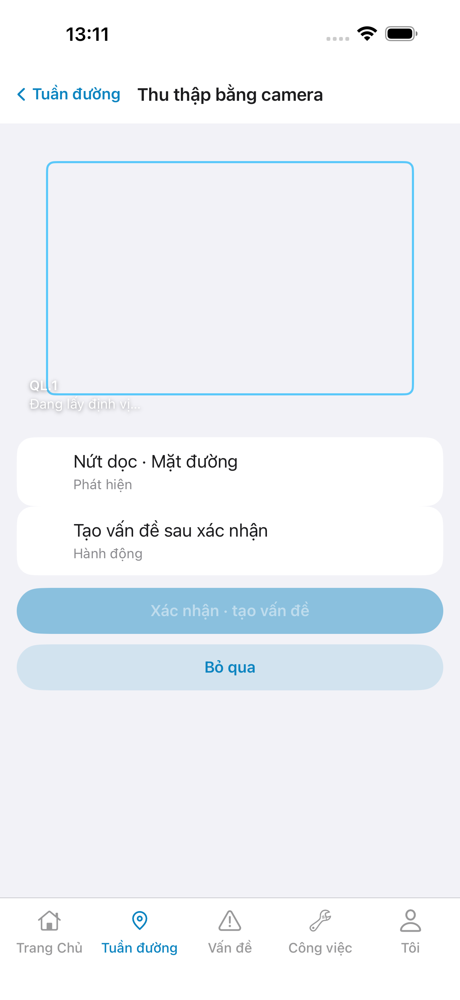
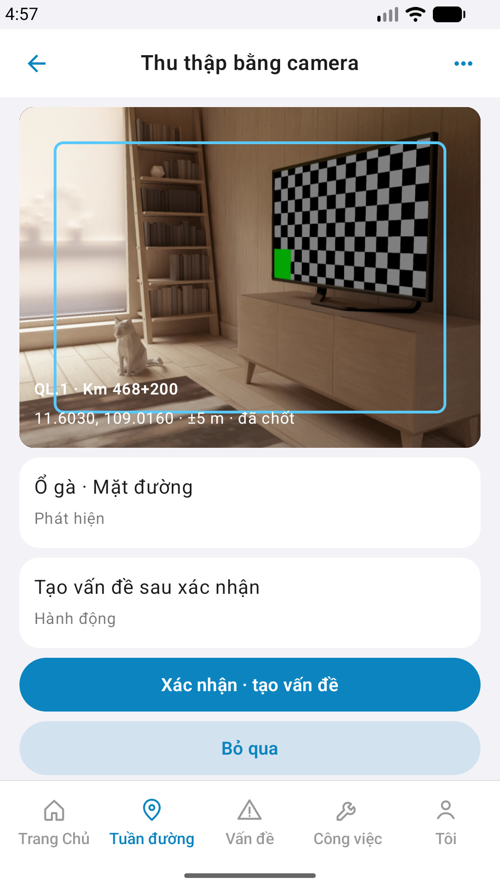
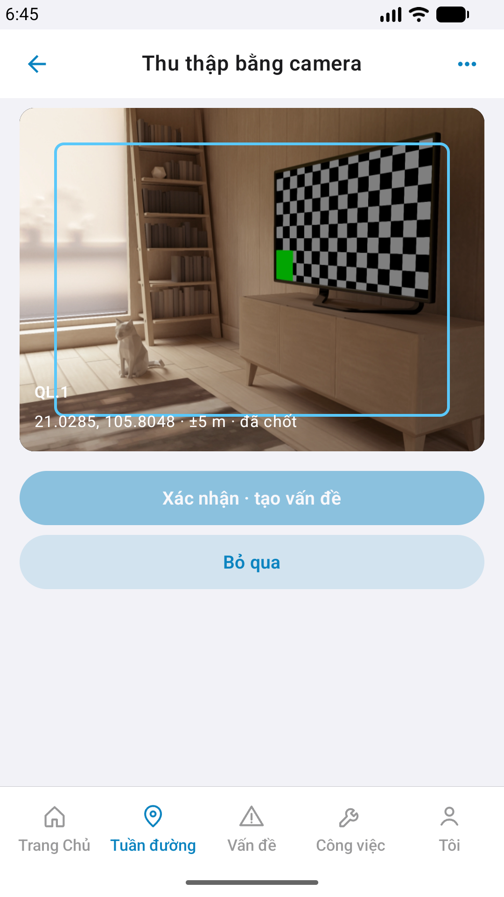

# QA — Scenarios — cam-patrol

| Field | Value |
|-------|-------|
| feature | `cam-patrol` |
| title | [Mobile] [Tuần đường] -> Thu thập camera |
| this role | `qa` · `/agent-qa-mobile` |
| status | **confirmed** |
| changeScope | `edit_page` (cleanup_mock) |
| packKind | **`screen`** |
| taskId | `task_fb828936` |
| autoApprove | ON |
| e2eQa | ON · `yarn e2e-qa-mobile` · Maestro ON · **ok:true** |
| ios_test_phase | `phase1_iphone` · dest **iPhone 17 Pro Max** · **A4-IPAD DEFER** |
| method | e2e runtime · yarn e2e-qa-mobile |
| visual | `/review-align-ux-ios-android` · **Aligned** · Must **0** |
| updatedAt | `2026-09-01T06:13:32.000Z` |

## Device AC

| # | Scenario | Expected | Result | Evidence |
|---|----------|----------|--------|----------|
| 1 | Cold start guest home | `#sc-home` · CTA Đăng nhập | **PASS** | A11-LAUNCH |
| 2 | Login Auth seed | `linm-soft` / `Linm@2026` → `#sc-home` | **PASS** | A9-LOGIN |
| 3 | BFF reachable | Mobile.Bff `:5202` healthy | **PASS** | A10-BFF |
| 4 | Entry hub → cam-patrol | tab field · `row-quick-cam-patrol` → `#sc-cam-patrol` | **PASS** | A3 / P6 |
| 5 | Finder + stamps | FOV · route live · GPS stamp | **PASS** | A3 / P6 |
| 6 | Detect card | live detect · Hành động · **score ẩn** · no-icon | **PASS** | A3 / P6 |
| 7 | CTA Confirm / Skip | Primary + Secondary · no UIAlert | **PASS** | A3 / P6 |
| 8 | Dual OS | iOS 6.9" + Android Pixel | **PASS** | A3 + P6 + P6-2 |
| 9 | Watermark / placeholder | none «Gói N» / «gen realapp» / demoRouteStamp | **PASS** | CORE Read |
| 10 | Sibling AC | only `cam-patrol` | **PASS** | flows |

## Store × feature

| AC | Apple | Play | Result | Evidence |
|----|-------|------|--------|----------|
| Core UX | A3 · A11 | P6 · P11 | **PASS** | A3-CORE · P6-CORE |
| Login + BFF | A9 · A10 | P10 · P11 | **PASS** | A9-LOGIN · A10-BFF |
| ≥2 phone core | — | P6 | **PASS** | P6-CORE · P6-CORE-2 |
| READY_TO_SUBMIT | — | — | **không** (Review) | — |

## E2E screenshots

Viewer: `/api/qldb/artifact?id=&rel=qa/scenarios.md` rewrite `screens/{caseId}.png`.

CLI **PASS** = Maestro + PNG + store px only — **not** visual vs demo. QA **Read** A3-CORE + P6-CORE vs prototype (`/review-align-ux-ios-android`).

| Case | Store | Result | Evidence |
|------|-------|--------|----------|
| A10-BFF | A10 · P11 | **PASS** | — |
| A11-LAUNCH | A11 | **PASS** |  |
| A9-LOGIN | A9 · P10 | **PASS** |  |
| A3-CORE | A3 · A11 | **PASS** |  |
| P6-CORE | P6 · P11 | **PASS** |  |
| P6-CORE-2 | P6 | **PASS** |  |

## Align UX

| Field | Value |
|-------|-------|
| verdict | **Aligned** |
| Must open | **0** |
| notes | TopBar + finder FOV + detect/action rows + Confirm/Skip dual · live route stamp · score ẩn · no demoRouteStamp |
| Should | GAP-QA-CAM-GPS-TIMING-01 · iOS GPS wait / Confirm dim — non-block |
| bugs | `qa/bugs/cam-patrol.md` |

## Version meta

| Field | Value |
|-------|-------|
| skillId | agent-qa-mobile |
| skillVersion | 2026.08.20.03 |
| schemaVersion | 1 |
| workflowVersion | 2026.08.25.01 |
| rulesVersion | 2026.08.29.4 |
| generatedAt | `2026-09-01T06:13:32.000Z` |
| versionGate | rechecked |

---
<!-- Version meta: skillId=agent-qa-mobile skillVersion=2026.08.20.03 schemaVersion=1 workflowVersion=2026.08.25.01 rulesVersion=2026.08.29.4 versionGate=rechecked -->
