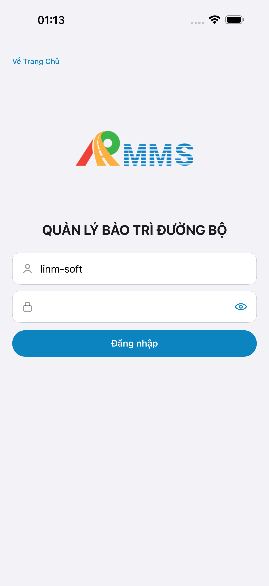
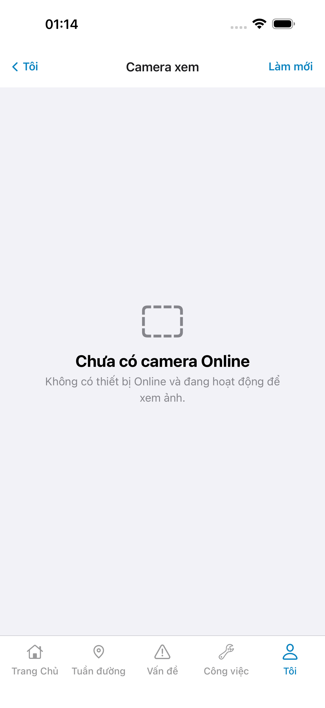
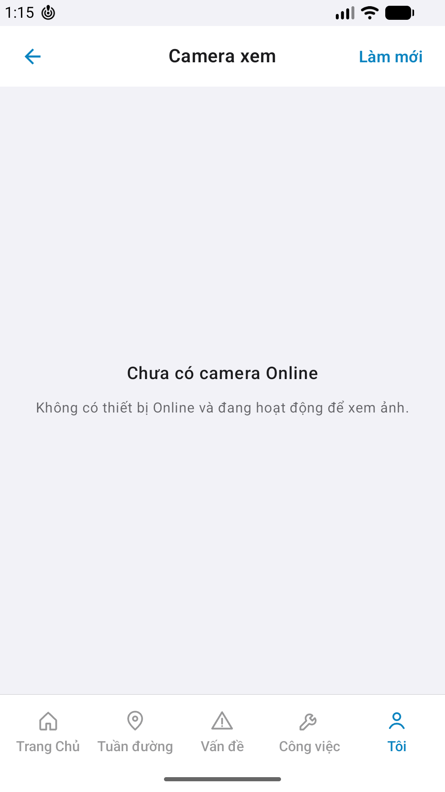

# QA — Scenarios — cam-view

| Field | Value |
|-------|-------|
| feature | `cam-view` |
| title | [Mobile] Camera xem |
| this role | `qa` · `/agent-qa-mobile` |
| status | **confirmed** |
| changeScope | `new_page` |
| packKind | **`screen`** |
| taskId | `task_94be0538` |
| autoApprove | ON |
| e2eQa | ON · `yarn e2e-qa-mobile` · Maestro ON |
| ios_test_phase | `phase1_iphone` · dest **iPhone 17 Pro Max** · **A4-IPAD DEFER** |
| method | e2e runtime · yarn e2e-qa-mobile |
| visual | `/review-align-ux-ios-android` · **Aligned** · Must **0** |
| updatedAt | `2026-08-29T18:20:00.000Z` |

## Device AC

| # | Scenario | Expected | Result | Evidence |
|---|----------|----------|--------|----------|
| 1 | Cold start guest home | `#sc-home` · CTA Đăng nhập | **PASS** | A11-LAUNCH |
| 2 | Login Auth seed | `linm-soft` / `Linm@2026` → home | **PASS** | A9-LOGIN |
| 3 | BFF reachable | Mobile.Bff `:5202` healthy | **PASS** | A10-BFF |
| 4 | Entry me → cam-view | tab Tôi · `#row-cam` → `#sc-cam-view` | **PASS** | A3 / P6 |
| 5 | Empty Online | EmptyState «Chưa có camera Online» · **cấm** fake JPEG | **PASS** | A3 / P6 · API items=0 |
| 6 | TopBar | back Tôi · title **Camera xem** · **Làm mới** | **PASS** | A3 / P6 |
| 7 | Tab shell | Tab 5 · tab **me** active | **PASS** | A3 / P6 |
| 8 | Dual OS | iOS 6.9" 1320×2868 + Android Pixel 1080×1920 | **PASS** | A3 + P6 + P6-2 |
| 9 | Watermark / placeholder | none «Gói N» / «gen realapp» / device label | **PASS** | CORE Read |
| 10 | Sibling AC | only `cam-view` · no cam-patrol / camera-connect | **PASS** | flows |
| 11 | JPEG + events (Online) | N/A env — `GET cameras` totalCount=0 | **DEFER env** | seed cam Online → re-shot |

## Store × feature

| AC | Apple | Play | Result | Evidence |
|----|-------|------|--------|----------|
| Core UX | A3 · A11 | P6 · P11 | **PASS** | A3-CORE · P6-CORE |
| Login + BFF | A9 · A10 | P10 · P11 | **PASS** | A9-LOGIN · A10-BFF |
| ≥2 phone core | — | P6 | **PASS** | P6-CORE · P6-CORE-2 |
| Camera privacy | A5/A7 | P8 | **PASS** (no device cam · JPEG domain) | — |
| READY_TO_SUBMIT | — | — | **không** (Review) | — |

## E2E screenshots

Viewer: `/api/qldb/artifact?id=&rel=qa/scenarios.md` rewrite `screens/{caseId}.png`.

CLI **PASS** = Maestro + PNG + store px only — **not** visual vs demo. QA **Read** A3-CORE + P6-CORE vs prototype (`/review-align-ux-ios-android`). Demo `.row-icon`/`#i-*` missing on live → Must **GAP-MOB-UX-COMP-03** · log `qa/bugs/`. Skip vision → **GAP-MOB-E2E-VIS-01**.

| Case | Store | Result | Evidence |
|------|-------|--------|----------|
| A10-BFF | A10 · P11 | **PASS** | — |
| A11-LAUNCH | A11 | **PASS** |  |
| A9-LOGIN | A9 · P10 | **PASS** |  |
| A3-CORE | A3 · A11 | **PASS** |  |
| P6-CORE | P6 · P11 | **PASS** |  |
| P6-CORE-2 | P6 | **PASS** |  |

## Align UX

| Field | Value |
|-------|-------|
| verdict | **Aligned** |
| Must open | **0** |
| Should | Android empty glyph `#i-video` optional polish · JPEG path DEFER env |
| file | `ui/review/align-ux.md` |
| bugs | `qa/bugs/cam-view.md` · CLOSED (Must 0) |
| align_confirm | **approve** (autoApprove ON) |

## Version meta

| Field | Value |
|-------|-------|
| skillId | agent-qa-mobile |
| skillVersion | 2026.08.29.1 |
| schemaVersion | 1 |
| workflowVersion | 2026.08.29.1 |
| rulesVersion | 2026.08.29.5 |
| generatedAt | `2026-08-29T18:20:00.000Z` |
| versionGate | rechecked |
| contentHash | sha256:cam-view-control-hint-20260829 |
| realDataHash | sha256:cam-view-real-data-20260829 |

---
<!-- Version meta: skillId=agent-qa-mobile skillVersion=2026.08.29.1 schemaVersion=1 workflowVersion=2026.08.29.1 rulesVersion=2026.08.29.5 versionGate=rechecked -->
