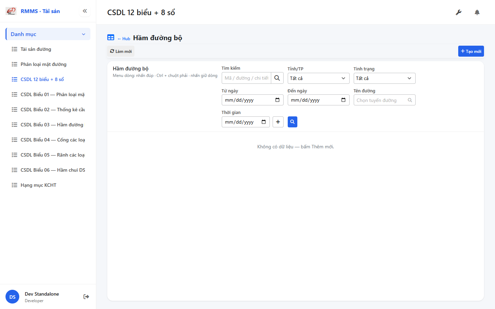
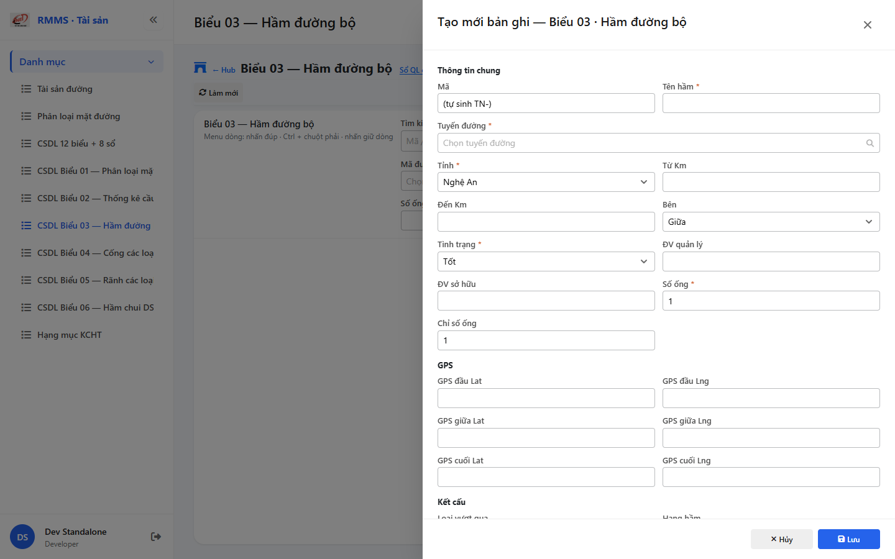

# QA — Scenarios — csdl-bieu-03

| Field | Value |
|-------|-------|
| feature | `csdl-bieu-03` |
| title | CSDL Biểu 03 — Hầm đường bộ |
| role | `qa` · `/agent-qa` |
| taskId | `task_677b9487` |
| status | **confirmed** |
| verdict | **PASS** |
| e2eQa | **ON** |
| method | `e2e runtime · yarn start:std :9301 + docker API :5111 + BFF :5201 + playwright channel=chrome capture (yarn e2e-qa hang fallback)` |
| mfeStdUrl | `http://localhost:9301/csdl-bieu-03` |
| mfeStdRoute | `/csdl-bieu-03` |
| hubDeepLink | `/so-ts/csdl-so-sach?resource=road-tunnels` |
| testid | `rmms-csdl-bieu-03-list-page` · form `rmms-csdl-bieu-03-form-slideout` |
| docker | API `:5111` healthy · BFF `:5201` healthy · postgres healthy |
| MFE | `D:/AI-QLBD/MFE-Source/Linm.Web.RMMS.Asset` |
| BE | `D:/AI-QLBD/Linm.RMMS.WebService` · `api/v1/asset/csdl-records` · **cấm ERP.*** |
| packKind | **`list`** · Kind B A–D+F · Kind D Slideout 2col sectioned |
| changeScope | `new_page` |
| resource | `road-tunnels` · formNo `03` · columns `42` · IdCode `TN-` |
| autoApprove | ON |
| contentHashPriorDataAnaly | `sha256:2c03537918bbda56c29e1e1ef98cc081cc4e72c94447a1ac2f87f06bd6f9310e` |
| updatedAt | `2026-09-05T09:10:00.000Z` |
| prior · dev | **confirmed** · `implement/csdl-bieu-03.md` · `task_8650b573` |

**Cấm** `phase=done` — next = Review. **cấm** ERP.* · **cấm** invent API · **cấm** kill worker (GAP-QA-E2E-KILL-01).

---

## E2E runtime (e2eQa ON)

| Check | Result |
|-------|--------|
| `docker compose up -d` (`Linm.RMMS.WebService`) | **PASS** · api `:5111` · bff `:5201` · postgres healthy |
| `yarn start:std` (`:9301`) | **PASS** · Asset standalone listen · Biểu 03 |
| `yarn typecheck` | **PASS** (`tsc --noEmit`) |
| Capture S0 / S1 / QA-20 → `qa/screens/{caseId}.png` | **PASS** · `manifest.json` `ok=true` |
| Live DOM assert | **PASS** · `live-assert.json` · title VN · filter tunnelClass/tubeCount/kmFrom · peer-sots · empty |
| BFF GET `?resource=road-tunnels` | **PASS** · HTTP 200 |

> Note: `yarn e2e-qa` treo sau `e2e login source=e2e.local.json` ~100s (**GAP-QA-E2E-PW-01**) — **không** taskkill rộng node/yarn · Stop chỉ PS job wrapper e2e · capture tương đương Playwright + `channel=chrome` · `--skip-start` (std+docker đã listen). Overlay TS stale cleared (touch `requestModel`) trước re-capture.

### Evidence table

| ID | Steps | Expected | Result | Evidence |
|----|-------|----------|--------|----------|
| S0 | Mở `mfeStdUrl` | List `rmms-csdl-bieu-03-list-page` · title Biểu 03 · filter-bar · empty/grid · peer Sổ QL cầu/hầm | **PASS** |  |
| S1 | Hub `?resource=road-tunnels` | CSDL list hub (deep-link) | **PASS** |  |
| QA-20 | `?form=create` | Slideout create · Z2/Z3 · footer Hủy/Lưu · road SearchInput · TN- · GPS×6 · tubeCount | **PASS** |  |

`screens/manifest.json` · capturedAt `2026-09-05T09:08:36.784Z` · SHA256_16 S0=`45d1ef17df8e67ef` · S1=`d3e7c32e7f3ec999` · QA-20=`7bef2502656791dc`.

---

## T-QA-CRUD-01

| ID | Steps | Expected | Result |
|----|-------|----------|--------|
| QA-20 | Create `?form=create` / toolbar Tạo mới | Slideout · POST `csdl-records` · resource=road-tunnels | **PASS** (runtime + code) |
| QA-21 | Edit | PUT + dirty → `LeaveConfirmModal` | **PASS** (code · LeaveConfirm wired) |
| QA-22 | View | readOnly · footer Sửa/Đóng | **PASS** (code) |
| QA-23 | Copy | POST new · TN- code | **PASS** (code) |
| QA-24 | Delete toolbar/row | soft DELETE · `useAlert` · **0** `window.confirm` | **PASS** (code) |
| QA-25 | Deep-link `?form=&id=` | Slideout · strip params | **PASS** (code) |
| QA-26 | Peer Sổ QL cầu/hầm | deep-link only · **cấm** merge form | **PASS** (live peer-sots) |

---

## T-QA-FORM-01

| ID | Check | Result |
|----|-------|--------|
| QA-F-01 | Slideout footer_actions_only · **cấm** Full-page | **PASS** (live QA-20) |
| QA-F-02 | Required: tunnelName/road/province/status/tubeCount/lengthM | **PASS** (validate) |
| QA-F-03 | road = `SearchInput` road-route · **cấm** Text free | **PASS** (live + code) |
| QA-F-04 | Q-GPS `six_numbers` gps* ×6 | **PASS** (form fields) |
| QA-F-05 | Q-TUBE `two_rows` tubeCount/tubeIndex | **PASS** (live QA-20) |
| QA-F-06 | Q-VENT text ventilationType/designLoad | **PASS** (code) |
| QA-F-07 | Dirty leave = `LeaveConfirmModal` · **0** native dialog | **PASS** (code) |
| QA-F-08 | Typed 42 · **cấm** detail*-only · sectioned | **PASS** (code) |

---

## T-QA-FILTER-01 / T-QA-ROUTE-01 / T-QA-TUBE-01

| ID | Check | Result |
|----|-------|--------|
| QA-FB-01 | search · province · status · roadCode · kmFrom/kmTo · tunnelClass · tubeCount · 🔍 | **PASS** (live S0 testids) |
| QA-FB-02 | `LinErpListFilterBar` · **0** nút Tìm riêng invent | **PASS** |
| QA-FB-03 | **0** export/print/CRUD trên bar | **PASS** |
| QA-ROUTE-01 | alias `/csdl-bieu-03` + hub deep-link | **PASS** (S0+S1) |
| QA-TUBE-01 | tubeCount>1 → tubeIndex required · 2 ống=2 rows | **PASS** (validate + PO) |

---

## T-QA-TYP-01 / T-QA-TAB-01

| ID | Check | Result |
|----|-------|--------|
| QA-TYP-01 | Label/input Common Components · no local break | **PASS** |
| QA-TAB-01 | Filter leading DOM = visual · form sequential | **PASS** |
| QA-RESP-01 | List wrap · live 1440 | **PASS** |

---

## Chrome / end-user

| ID | Check | Result |
|----|-------|--------|
| QA-CH-01 | List/form **tiếng Việt** · **0** badge CREATE/EDIT/VIEW · **0** demo/stub | **PASS** (`live-assert.json`) |
| QA-CH-02 | Peer deep-link Sổ QL cầu/hầm · **cấm** merge | **PASS** |
| QA-CH-03 | **0** `window.alert`/`confirm`/`prompt` (Asset page) | **PASS** (useAlert + LeaveConfirm) |
| QA-CH-04 | **cấm** ERP.* imports | **PASS** |

---

## Gaps

| ID | Status | Note |
|----|--------|------|
| GAP-QA-E2E-PW-01 | **open P2** | `yarn e2e-qa` hang after login · chrome channel fallback PASS · **cấm** kill |
| GAP-CSDL-AUTH-01 | **DEFER** | RequirePermission |
| GAP-CSDL-ORG-01 | **DEFER P2** | manageUnit SearchInput |
| GAP-CSDL-XLS-01 | **OUT** | Excel |
| GAP-CSDL-PROV-01 | **keep_static P1** | |
| GAP-QA-E2E-KILL-01 | **n/a** | không kill worker :9301 |

---

## Verify gate

```
yarn typecheck → PASS
docker compose ps → api/bff/postgres healthy
HTTP BFF GET …/csdl-records?resource=road-tunnels → 200
Playwright S0/S1/QA-20 → PASS · screens/*.png · manifest ok=true
live-assert → PASS
```

## Handoff → Review

| Field | Value |
|-------|--------|
| next | `/agent-review` |
| artifacts | `qa/scenarios.md` · `qa/screens/{S0,S1,QA-20}.png` · `manifest.json` · `handoff/qa-compact.md` |
| mfeStdUrl | `http://localhost:9301/csdl-bieu-03` |
| block | **cấm** `phase=done` · Review mới close |

## Version meta (REQUIRED)

| Field | Value |
|-------|-------|
| skillId | agent-qa |
| skillVersion | 2026.08.29.03 |
| schemaVersion | 2 |
| workflowVersion | 2026.09.01.02 |
| rulesVersion | 2026.08.31.2 |
| generatedAt | 2026-09-05T09:10:00.000Z |
| versionGate | ok |
| formTypePack | list |
| changeScope | new_page |
| contentHashPriorDataAnaly | sha256:2c03537918bbda56c29e1e1ef98cc081cc4e72c94447a1ac2f87f06bd6f9310e |
| route_confirm | route_a |
| taskId | task_677b9487 |
| priorDevTaskId | task_8650b573 |

---
<!-- Version meta: skillId=agent-qa skillVersion=2026.08.29.03 schemaVersion=2 workflowVersion=2026.09.01.02 rulesVersion=2026.08.31.2 versionGate=ok taskId=task_677b9487 route_confirm=route_a -->
