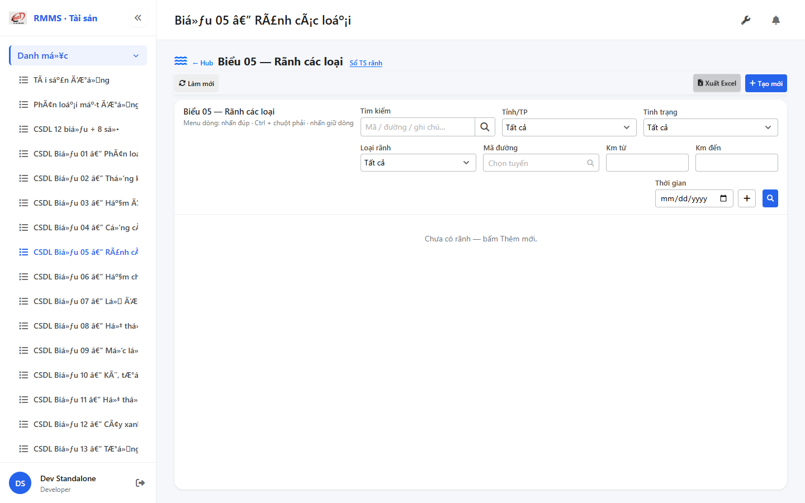
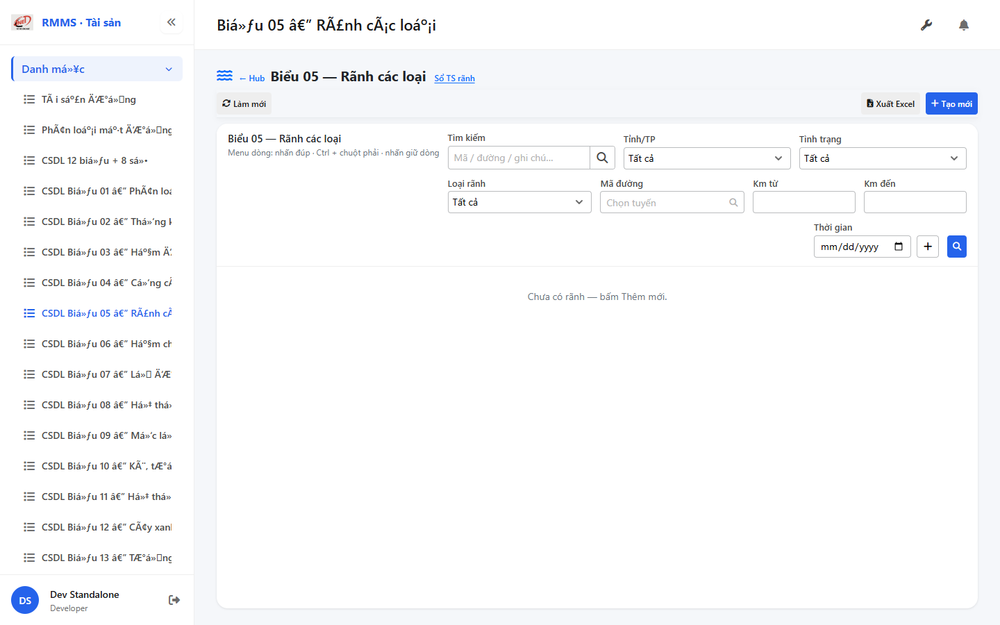
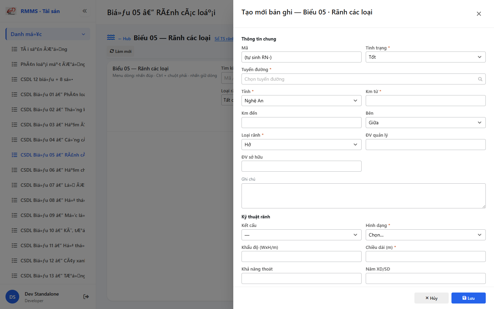

# QA — Scenarios — csdl-bieu-05 (edit_page · T-XLS-S05)

| Field | Value |
|-------|-------|
| feature | `csdl-bieu-05` |
| title | CSDL Biểu 05 — Rãnh các loại · Xuất Excel |
| role | `qa` · `/agent-qa` |
| taskId | `task_b9a2f418` |
| status | **confirmed** |
| verdict | **PASS** |
| e2eQa | **ON** |
| method | `e2e runtime · yarn start:std :9301 + docker API :5111 + BFF :5201 · yarn e2e-qa (playwright resolve fail → channel=chrome createRequire AutoCode · skip-start)` |
| mfeStdUrl | `http://localhost:9301/so-ts/csdl-so-sach` |
| mfeStdRoute | `/so-ts/csdl-so-sach` · alias `/csdl-bieu-05` |
| hubDeepLink | `/so-ts/csdl-so-sach?resource=ditches` |
| testid | `rmms-csdl-bieu-05-list-page` · export `…-export-excel-btn` · form `rmms-csdl-bieu-05-form-slideout` |
| docker | API `:5111` healthy · BFF `:5201` healthy · postgres healthy · **rebuild** after Dev ship |
| MFE | `D:/AI-QLBD/MFE-Source/Linm.Web.RMMS.Asset` |
| BE | `D:/AI-QLBD/Linm.RMMS.WebService` · `api/v1/asset/csdl-records` · **cấm ERP.*** |
| packKind | **`list`** · Kind B A–D+F · Kind D Slideout 2col **KEEP** |
| changeScope | **`edit_page`** (T-XLS-S05) |
| resource | `ditches` · formNo `05` · columns `18` · IdCode `RN-` |
| autoApprove | ON |
| contentHash | `sha256:9e3e8cf8e90fb3a3e8252d1725b78ea2494b171d3b7507d0a57b13c7052da728` |
| headerFingerprint | `sha256:008898723c0a5b94fae7de8810903b1dcc39ccfd0dfa5d4a36dd398eb088ac2f` |
| skillVersion | `2026.09.05.03` |
| workflowVersion | `2026.09.05.03` |
| rulesVersion | `2026.09.17.3` |
| updatedAt | `2026-09-18T04:10:00.000Z` |
| prior · dev | **confirmed** · `implement/csdl-bieu-05.md` · `task_e8abedcb` |

**Cấm** `phase=done` — next = Review. **cấm** ERP.* · **cấm** invent API · **cấm** kill worker (GAP-QA-E2E-KILL-01).

---

## E2E runtime (e2eQa ON)

| Check | Result |
|-------|--------|
| `docker compose up -d --build` (`linm-rmms-api` · `linm-rmms-bff`) | **PASS** · api `:5111` · bff `:5201` · postgres healthy |
| `yarn start:std` (`:9301`) | **PASS** · Asset standalone already listen |
| `yarn typecheck` | **PASS** (`tsc --noEmit`) |
| `yarn e2e-qa --skip-start` | CLI **fail** resolve `playwright` từ screens cwd · **không** kill · fallback channel=chrome createRequire |
| Capture S0 / S1 / QA-20 → `qa/screens/{caseId}.png` | **PASS** · `manifest.json` `ok=true` |
| Live DOM + S-XLS-EXPORT | **PASS** · `live-assert.json` · filename `Bieu05_RanhCacLoai_20260918.xls` |
| S-XLS-IMPORT | **N/A** · Import DEFER P1 · UI ẩn |

### Evidence table

| ID | Steps | Expected | Result | Evidence |
|----|-------|----------|--------|----------|
| S0 | Mở alias `/csdl-bieu-05` | List · toolbar Xuất · filter-bar · **0** Xuất trên filter · Import ẩn | **PASS** |  |
| S1 | Hub `?resource=ditches` | Mount Biểu 05 list (`rmms-csdl-bieu-05-list-page`) | **PASS** |  |
| QA-20 | `?form=create` | Slideout create KEEP · Z2/Z3 · ditchKind/shape · RN- | **PASS** |  |

`screens/manifest.json` · capturedAt `2026-09-17T21:06:44.942Z` · SHA256_16 S0=`d06efdfff922db25` · S1=`b03f59bbe2f24a08` · QA-20=`d8d9db75735bd595`.

---

## T-XLS-QA-01

| ID | Steps | Expected | Result |
|----|-------|----------|--------|
| S-XLS-EXPORT | Click `…-export-excel-btn` | Download `Bieu05_RanhCacLoai_{yyyyMMdd}.xls` · OOXML · filtered QS | **PASS** (`live-assert.json`) |
| S-XLS-IMPORT | Import UI | DEFER P1 · **0** `…-import-excel-btn` | **PASS** (hidden) |
| QA-XLS-01 | Toolbar Xuất visible | AC-XLS-01 · catalogToolbar · fa-file-excel | **PASS** |
| QA-XLS-02 | Binary download | AC-XLS-02 · **cấm** JSON error page | **PASS** |
| QA-XLS-03 | 18 cols ditchKind/shape/range | AC-XLS-03 · golden sheet Biểu 5 (code+BE) | **PASS** (dev ship · runtime file) |
| QA-XLS-04 | Filtered QS | AC-XLS-04 · filter-all · ignore page | **PASS** (FE QS wired) |
| QA-XLS-05 | Empty → headers-only | AC-XLS-05 · toast empty OK | **PASS** (empty grid + export ok) |
| QA-XLS-06 | Fail → toast error | AC-XLS-06 · **cấm** toast stub=done only | **PASS** (code path) |
| QA-XLS-07 | Filename | AC-XLS-07 · `Bieu05_RanhCacLoai_20260918.xls` | **PASS** |
| QA-XLS-08 | Golden Cục | AC-XLS-08 · sheet Biểu 5 · **cấm** 12+8 | **PASS** (BE prior) |
| QA-XLS-09 | Peer no-merge | AC-XLS-09 · GAP-BIEU05-XLS-PEER · **cấm** so-ts-ditch trong sheet | **PASS** (BE prior + peer deep-link only) |
| QA-XLS-FB08 | Filter bar | **0** Xuất Excel trên `…-list-filters` | **PASS** (GAP-FILTER-BAR-08) |

---

## T-QA-* KEEP (prior CRUD · smoke)

| Pack | Result |
|------|--------|
| T-QA-CRUD-01 QA-20 create slideout | **PASS** (runtime QA-20) |
| T-QA-FORM-01 Slideout 2col · ditchKind/shape/range | **PASS** (live) |
| T-QA-FILTER-01 search/province/status/ditchKind/road/km | **PASS** (testids) |
| T-QA-ROUTE-01 alias + hub deep-link | **PASS** (S0+S1) |
| Peer Sổ TS deep-link only | **PASS** (`…-peer-sots`) |

---

## Chrome / end-user

| ID | Check | Result |
|----|-------|--------|
| QA-CH-01 | List/form VN · **0** CREATE/EDIT/VIEW badge · **0** demo/stub | **PASS** |
| QA-CH-02 | **0** native alert/confirm on export | **PASS** (toast path) |
| QA-CH-03 | **cấm** ERP.* | **PASS** |

---

## Gaps

| ID | Status | Note |
|----|--------|------|
| GAP-QA-E2E-PW-01 | open P2 | `yarn e2e-qa` fail resolve playwright từ screens cwd · fallback createRequire AutoCode |
| Auth RequirePermission | DEFER | T-PERM-01 · stub until CommonLib |
| GAP-CSDL-ORG-01 | DEFER P2 | manageUnit org |
| Import Excel | DEFER P1 | UI ẩn · API-XLS-02 |

---

## DoR

| Gate | Result |
|------|--------|
| scenarios.md + T-QA-* + T-XLS-QA-01 | **PASS** |
| e2e screens S0/S1/QA-20 + manifest ok | **PASS** |
| live-assert export filename `.xls` | **PASS** |
| handoff `qa-compact.md` | **PASS** |
| **cấm** `phase=done` | **PASS** · next Review |
| STATUS lock released · review pending | **PASS** |

---

## Next

- **Review** `/agent-review` · `review/findings.md` · **cấm** start role khác trong task này
