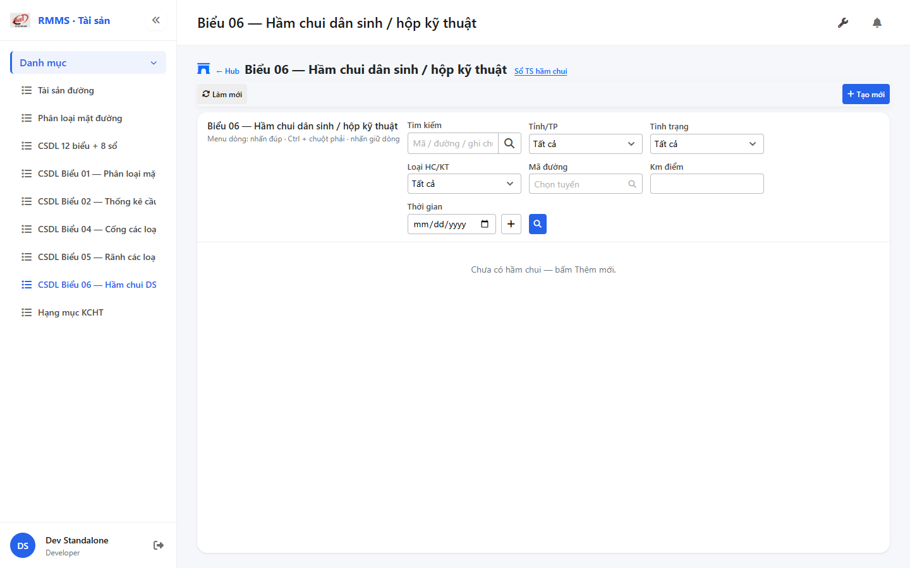
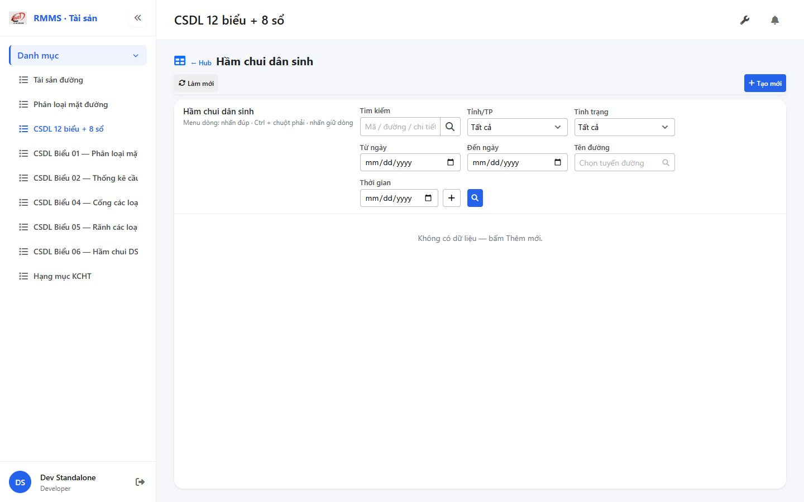
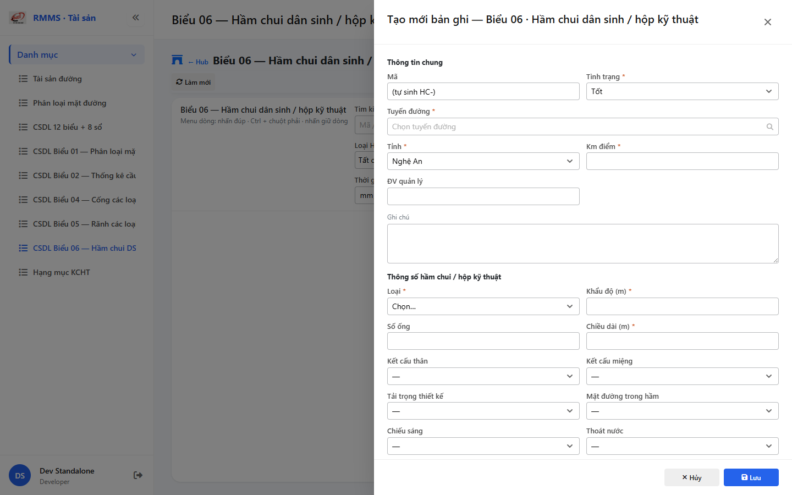

# QA — Scenarios — csdl-bieu-06

| Field | Value |
|-------|-------|
| feature | `csdl-bieu-06` |
| title | CSDL Biểu 06 — Hầm chui DS + hộp KT |
| role | `qa` · `/agent-qa` |
| taskId | `task_eb952548` |
| status | **confirmed** |
| verdict | **PASS** |
| e2eQa | **ON** |
| method | `e2e runtime · yarn start:std :9301 + docker API :5111 + BFF :5201 + playwright channel=chrome capture (yarn e2e-qa hang fallback)` |
| mfeStdUrl | `http://localhost:9301/csdl-bieu-06` |
| mfeStdRoute | `/csdl-bieu-06` |
| hubDeepLink | `/so-ts/csdl-so-sach?resource=underpasses` |
| testid | `rmms-csdl-bieu-06-list-page` · form `rmms-csdl-bieu-06-form-slideout` |
| docker | API `:5111` healthy · BFF `:5201` healthy · postgres healthy |
| MFE | `D:/AI-QLBD/MFE-Source/Linm.Web.RMMS.Asset` |
| BE | `D:/AI-QLBD/Linm.RMMS.WebService` · `api/v1/asset/csdl-records` · **cấm ERP.*** |
| packKind | **`list`** · Kind B A–D+F · Kind D Slideout 2col |
| changeScope | `new_page` |
| resource | `underpasses` · formNo `06` · columns `19` · IdCode `HC-` |
| autoApprove | ON |
| contentHashPriorDataAnaly | `sha256:ffc5c8381b04dcec3f0376df87187012f34b16bf211a3e3fb7311a8375a386f0` |
| updatedAt | `2026-09-05T07:50:00.000Z` |
| prior · dev | **confirmed** · `implement/csdl-bieu-06.md` · `task_f79fea88` |

**Cấm** `phase=done` — next = Review. **cấm** ERP.* · **cấm** invent API · **cấm** kill worker (GAP-QA-E2E-KILL-01).

---

## E2E runtime (e2eQa ON)

| Check | Result |
|-------|--------|
| `docker compose up -d` (`Linm.RMMS.WebService`) | **PASS** · api `:5111` · bff `:5201` · postgres healthy |
| `yarn start:std` (`:9301`) | **PASS** · Asset standalone listen · bundle có `CsdlBieu06` |
| `yarn typecheck` | **PASS** (`tsc --noEmit`) |
| Capture S0 / S1 / QA-20 → `qa/screens/{caseId}.png` | **PASS** · `manifest.json` `ok=true` |
| Live DOM assert | **PASS** · `live-assert.json` · title VN · filter underpassKind/kmPoint · peer-sots |
| API GET `?resource=underpasses` | **PASS** · HTTP 200 (`:5111` + BFF `web-bff/...`) |

> Note: `yarn e2e-qa` treo sau `e2e login source=e2e.local.json` ~100s (**GAP-QA-E2E-PW-01**) — **không** taskkill rộng node/yarn · Stop-Job chỉ PS job wrapper · capture tương đương Playwright + `channel=chrome` · `--skip-start` (std+docker đã listen). Stale webpack overlay (underpassKind type) đã hết sau HMR · screenshot sạch.

### Evidence table

| ID | Steps | Expected | Result | Evidence |
|----|-------|----------|--------|----------|
| S0 | Mở `mfeStdUrl` | List `rmms-csdl-bieu-06-list-page` · title Biểu 06 · filter-bar (underpassKind/kmPoint) · empty/grid · peer Sổ TS | **PASS** |  |
| S1 | Hub `?resource=underpasses` | CSDL list `rmms-csdl-so-sach-list-page` (deep-link) | **PASS** |  |
| QA-20 | `?form=create` | Slideout create · Z2/Z3 · footer Hủy/Lưu · road SearchInput · HC- | **PASS** |  |

`screens/manifest.json` · capturedAt `2026-09-05T07:49:07.707Z` · SHA256_16 S0=`484f545bf54a542c` · S1=`12fa392a0d6eb733` · QA-20=`c3f78b0fd0d0fdc1`.

---

## T-QA-CRUD-01

| ID | Steps | Expected | Result |
|----|-------|----------|--------|
| QA-20 | Create `?form=create` / toolbar Tạo mới | Slideout · POST `csdl-records` · resource=underpasses | **PASS** (runtime + code) |
| QA-21 | Edit | PUT + dirty → `LeaveConfirmModal` | **PASS** (code · LeaveConfirm wired) |
| QA-22 | View | readOnly · footer Sửa/Đóng | **PASS** (code) |
| QA-23 | Copy | POST new · HC- code | **PASS** (code) |
| QA-24 | Delete toolbar/row | soft DELETE · `useAlert` · **0** `window.confirm` | **PASS** (code) |
| QA-25 | Deep-link `?form=&id=` | Slideout · strip params | **PASS** (code) |
| QA-26 | Peer Sổ TS | deep-link only · **cấm** merge form | **PASS** (live peer-sots) |

---

## T-QA-FORM-01

| ID | Check | Result |
|----|-------|--------|
| QA-F-01 | Slideout `data-form-cols=2` · footer_actions_only · **cấm** Full-page | **PASS** (live QA-20) |
| QA-F-02 | Required: road/province/kmPoint/status/underpassKind/apertureM/lengthM | **PASS** (validate) |
| QA-F-03 | road = `SearchInput` road-route · **cấm** Text free | **PASS** (live + code) |
| QA-F-04 | Q-KIND hc_ds/hop_kt · Q-APERTURE number_m · Q-PIPE optional · Q-LOAD lookup_hl · light/drain yes_no | **PASS** |
| QA-F-05 | kmPoint Point · **không** ép kmTo | **PASS** (filter + form) |
| QA-F-06 | Dirty leave = `LeaveConfirmModal` · **0** native dialog | **PASS** (code) |
| QA-F-07 | Typed 19 · **cấm** detail*-only | **PASS** (code) |

---

## T-QA-FILTER-01 / T-QA-ROUTE-01

| ID | Check | Result |
|----|-------|--------|
| QA-FB-01 | search · province · status · underpassKind · roadCode · kmPoint · 🔍 | **PASS** (live S0 testids) |
| QA-FB-02 | `LinErpListFilterBar` · **0** nút Tìm riêng invent | **PASS** |
| QA-FB-03 | **0** export/print/CRUD trên bar | **PASS** |
| QA-ROUTE-01 | alias `/csdl-bieu-06` + hub deep-link | **PASS** (S0+S1) |

---

## T-QA-TYP-01 / T-QA-TAB-01

| ID | Check | Result |
|----|-------|--------|
| QA-TYP-01 | Label/input Common Components · no local break | **PASS** |
| QA-TAB-01 | Filter leading DOM = visual · form sequential | **PASS** |
| QA-RESP-01 | List wrap · live 1440 | **PASS** |

---

## Chrome / end-user

| ID | Check | Result |
|----|-------|--------|
| QA-CH-01 | List/form **tiếng Việt** · **0** badge CREATE/EDIT/VIEW · **0** demo/stub | **PASS** (`live-assert.json`) |
| QA-CH-02 | Peer deep-link Sổ TS · **cấm** merge | **PASS** |
| QA-CH-03 | **0** `window.alert`/`confirm`/`prompt` (Asset page) | **PASS** (useAlert + LeaveConfirm) |
| QA-CH-04 | **cấm** ERP.* imports | **PASS** |
| QA-CH-05 | **0** webpack "Compiled with problems" overlay | **PASS** (re-capture sau HMR) |

---

## Gaps

| ID | Status | Note |
|----|--------|------|
| GAP-QA-E2E-PW-01 | open P2 | `yarn e2e-qa` hang after login · fallback channel=chrome |
| Auth RequirePermission | DEFER | stub until CommonLib |
| GAP-CSDL-ORG-01 / XLS | OUT/DEFER | manageUnit org P2 · export stub OK |

---

## DoR

| Gate | Result |
|------|--------|
| scenarios.md + T-QA-* | **PASS** |
| e2e screens S0/S1/QA-20 + manifest ok | **PASS** |
| handoff `qa-compact.md` | **PASS** |
| **cấm** `phase=done` | **PASS** · next Review |
| STATUS lock released · review pending | **PASS** |

---

## Next

- **Review** `/agent-review` · `review/findings.md` · **cấm** start role khác trong task này
