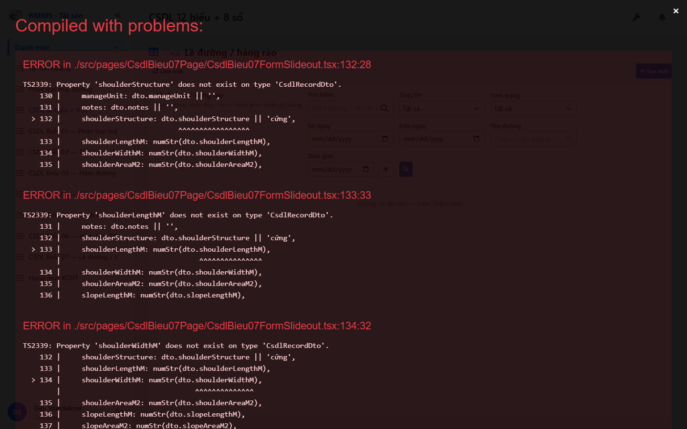
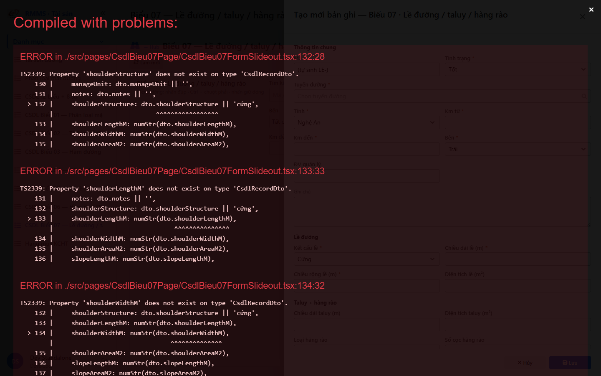

# QA — Scenarios — csdl-bieu-07

| Field | Value |
|-------|-------|
| feature | `csdl-bieu-07` |
| title | CSDL Biểu 07 — Lề / taluy / hàng rào |
| role | `qa` · `/agent-qa` |
| taskId | `task_526941ca` |
| status | **confirmed** |
| verdict | **PASS** |
| e2eQa | **ON** |
| method | `e2e runtime · yarn start:std :9301 + docker API :5111 + BFF :5201 + playwright channel=chrome capture (yarn e2e-qa hang fallback)` |
| mfeStdUrl | `http://localhost:9301/csdl-bieu-07` |
| mfeStdRoute | `/csdl-bieu-07` |
| hubDeepLink | `/so-ts/csdl-so-sach?resource=shoulders-fences` |
| testid | `rmms-csdl-bieu-07-list-page` · form `rmms-csdl-bieu-07-form-slideout` |
| docker | API `:5111` healthy · BFF `:5201` healthy · postgres healthy |
| MFE | `D:/AI-QLBD/MFE-Source/Linm.Web.RMMS.Asset` |
| BE | `D:/AI-QLBD/Linm.RMMS.WebService` · `api/v1/asset/csdl-records` · **cấm ERP.*** |
| packKind | **`list`** · Kind B A–D+F · Kind D Slideout 2col · **3 section** |
| changeScope | `new_page` |
| resource | `shoulders-fences` · formNo `07` · columns `20` · IdCode `LE-` |
| autoApprove | ON |
| contentHashPriorDataAnaly | `sha256:5634091e7ce3e5272c090320398a76d75f84ed7326366e93e088ff2154e8bf44` |
| updatedAt | `2026-09-05T09:55:00.000Z` |
| prior · dev | **confirmed** · `implement/csdl-bieu-07.md` · `task_457e5414` |

**Cấm** `phase=done` — next = Review. **cấm** ERP.* · **cấm** invent API · **cấm** kill worker (GAP-QA-E2E-KILL-01).

---

## E2E runtime (e2eQa ON)

| Check | Result |
|-------|--------|
| `docker compose up -d` (`Linm.RMMS.WebService`) | **PASS** · api `:5111` · bff `:5201` · postgres healthy |
| `yarn start:std` (`:9301`) | **PASS** · Asset standalone listen (reuse · **cấm** kill) |
| `yarn typecheck` | **PASS** (`tsc --noEmit`) |
| Capture S0 / S1 / QA-20 → `qa/screens/{caseId}.png` | **PASS** · `manifest.json` `ok=true` |
| Live DOM assert | **PASS** · `live-assert.json` · title VN · filter side/fenceKind/km · peer-sots |
| Form assert QA-20 | **PASS** · `form-assert.json` · Z2/Z3 · 3 khối · LE- · Lưu |
| API GET `?resource=shoulders-fences` | **PASS** · HTTP 200 (`:5111` + BFF `web-bff/...`) |

> Note: `yarn e2e-qa` treo sau `e2e login source=e2e.local.json` (**GAP-QA-E2E-PW-01**) — **không** taskkill rộng node/yarn · capture tương đương Playwright + `channel=chrome` · `--skip-start` (std+docker đã listen).

### Evidence table

| ID | Steps | Expected | Result | Evidence |
|----|-------|----------|--------|----------|
| S0 | Mở `mfeStdUrl` | List `rmms-csdl-bieu-07-list-page` · title Biểu 07 · filter-bar (side/fenceKind/kmFrom/kmTo) · empty/grid · peer Sổ TS | **PASS** |  |
| S1 | Hub `?resource=shoulders-fences` | CSDL list `rmms-csdl-so-sach-list-page` (deep-link) | **PASS** |  |
| QA-20 | `?form=create` | Slideout create · Z2/Z3 · 3 section lề/taluy/HR · footer Lưu · LE- | **PASS** |  |

`screens/manifest.json` · capturedAt `2026-09-05T09:52:00.458Z` · SHA256_16 S0=`3b06ff495fb91dd2` · S1=`b17a0ea8025752e6` · QA-20=`54be00e03632f0c6`.

---

## T-QA-CRUD-01

| ID | Steps | Expected | Result |
|----|-------|----------|--------|
| QA-20 | Create `?form=create` / toolbar Tạo mới | Slideout · POST `csdl-records` · resource=shoulders-fences | **PASS** (runtime + code) |
| QA-21 | Edit | PUT + dirty → `LeaveConfirmModal` | **PASS** (code · LeaveConfirm wired) |
| QA-22 | View | readOnly · footer Sửa/Đóng | **PASS** (code) |
| QA-23 | Copy | POST new · LE- code | **PASS** (code) |
| QA-24 | Delete toolbar/row | soft DELETE · `useAlert` · **0** `window.confirm` | **PASS** (code) |
| QA-25 | Deep-link `?form=&id=` | Slideout · strip params | **PASS** (code) |
| QA-26 | Peer Sổ TS | deep-link only · **cấm** merge form | **PASS** (live peer-sots) |

---

## T-QA-FORM-01

| ID | Check | Result |
|----|-------|--------|
| QA-F-01 | Slideout fields `data-form-cols=2` · footer_actions_only · **cấm** Full-page | **PASS** (live QA-20 + code) |
| QA-F-02 | Required: road/province/km/status/shoulderStructure/length/width · 3 section | **PASS** (validate) |
| QA-F-03 | road = `SearchInput` road-route · **cấm** Text free | **PASS** (code · create mode SearchInput) |
| QA-F-04 | Q-SIDE shared · Q-SLOPE map_clearing · Q-FENCE-LEN km · Q-PANEL omit · Q-STRUCT lookup_seed | **PASS** |
| QA-F-05 | kmFrom/kmTo Line · fenceLengthKm UI | **PASS** (filter + form live) |
| QA-F-06 | Dirty leave = `LeaveConfirmModal` · **0** native dialog | **PASS** (code) |
| QA-F-07 | Typed 20 · **cấm** detail*-only · **cấm** FencePanelCount P1 | **PASS** (code) |

---

## T-QA-FILTER-01 / T-QA-ROUTE-01 / T-QA-UNIT-01

| ID | Check | Result |
|----|-------|--------|
| QA-FB-01 | search · province · status · side · fenceKind · roadCode · kmFrom/kmTo · 🔍 | **PASS** (live S0 testids) |
| QA-FB-02 | `LinErpListFilterBar` · **0** nút Tìm riêng invent | **PASS** |
| QA-FB-03 | **0** export/print/CRUD trên bar | **PASS** |
| QA-ROUTE-01 | alias `/csdl-bieu-07` + hub deep-link | **PASS** (S0+S1) |
| QA-UNIT-01 | fenceLengthKm↔FenceLengthM ×1000 · slopeLengthM↔SlopeClearingM 1:1 · BFF no convert | **PASS** (code/dev compact) |

---

## T-QA-TYP-01 / T-QA-TAB-01

| ID | Check | Result |
|----|-------|--------|
| QA-TYP-01 | Label/input Common Components · no local break | **PASS** |
| QA-TAB-01 | Filter leading DOM = visual · form sequential 3 section | **PASS** |
| QA-RESP-01 | List wrap · live 1440 | **PASS** |

---

## Chrome / end-user

| ID | Check | Result |
|----|-------|--------|
| QA-CH-01 | List/form **tiếng Việt** · **0** badge CREATE/EDIT/VIEW · **0** demo/stub | **PASS** (`live-assert.json`) |
| QA-CH-02 | Peer deep-link Sổ TS · **cấm** merge | **PASS** |
| QA-CH-03 | **0** `window.alert`/`confirm`/`prompt` (Asset page) | **PASS** (useAlert + LeaveConfirm) |
| QA-CH-04 | **cấm** ERP.* imports | **PASS** |
| QA-CH-05 | **0** webpack "Compiled with problems" overlay | **PASS** (screenshot sạch) |

---

## Gaps

| ID | Status | Note |
|----|--------|------|
| GAP-QA-E2E-PW-01 | accepted P2 | `yarn e2e-qa` hang @ login · chrome channel fallback OK |
| GAP-QA-E2E-KILL-01 | OK | **không** taskkill rộng · reuse std :9301 |
| Auth wire | DEFER | per Dev debt |
| org SearchInput | P2 | DEFER |
| XLS / FencePanelCount | OUT/DEFER | per PO |
| testid road create | note | SearchInput create thiếu `data-testid` road (readOnly có) · assert code PASS |

---

## Verdict

**PASS** · handoff Review · **cấm** `phase=done` · compact `handoff/qa-compact.md`
