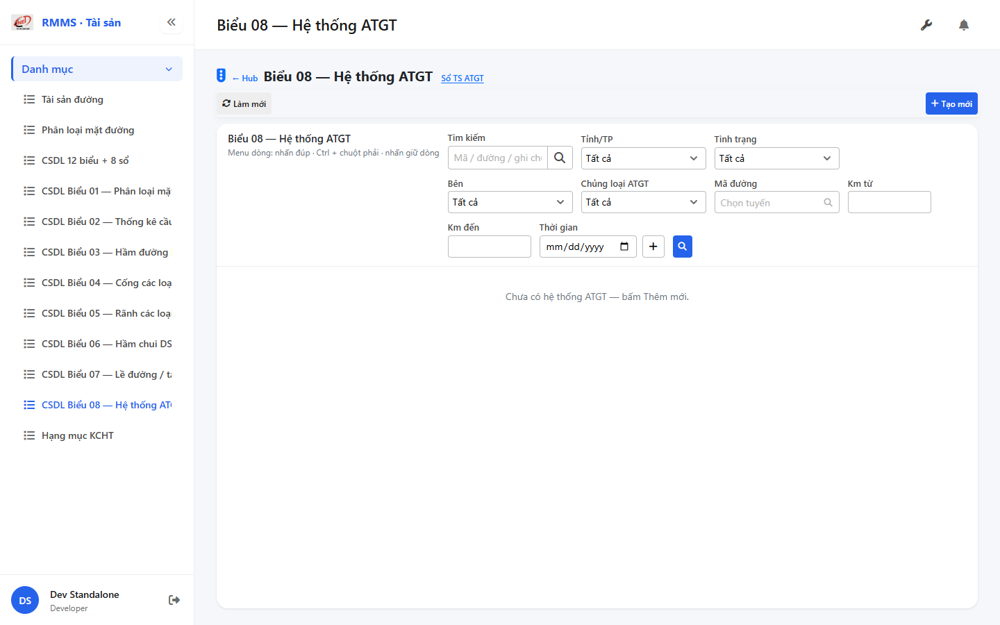
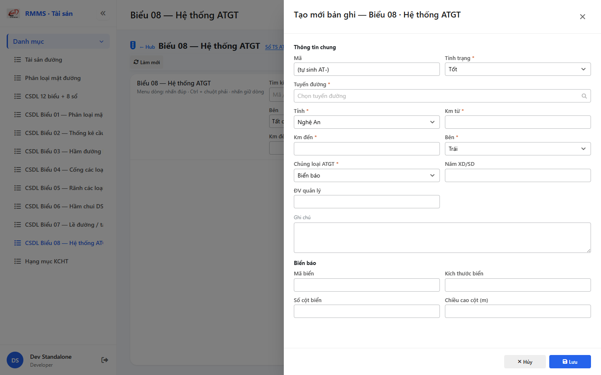

# QA — Scenarios — csdl-bieu-08

| Field | Value |
|-------|-------|
| feature | `csdl-bieu-08` |
| title | CSDL Biểu 08 — Hệ thống ATGT |
| role | `qa` · `/agent-qa` |
| taskId | `task_e0d8a853` |
| status | **confirmed** |
| verdict | **PASS** |
| e2eQa | **ON** |
| method | `e2e runtime · yarn start:std :9301 + docker API :5111 + BFF :5201 + playwright channel=chrome capture (yarn e2e-qa hang fallback)` |
| mfeStdUrl | `http://localhost:9301/csdl-bieu-08` |
| mfeStdRoute | `/csdl-bieu-08` |
| hubDeepLink | `/so-ts/csdl-so-sach?resource=traffic-safety` |
| testid | `rmms-csdl-bieu-08-list-page` · form `rmms-csdl-bieu-08-form-slideout` |
| docker | API `:5111` healthy · BFF `:5201` healthy · postgres healthy |
| MFE | `D:/AI-QLBD/MFE-Source/Linm.Web.RMMS.Asset` |
| BE | `D:/AI-QLBD/Linm.RMMS.WebService` · `api/v1/asset/csdl-records` · **cấm ERP.*** |
| packKind | **`list`** · Kind B A–D+F · Kind D Slideout 2col · **shared+1 child** |
| changeScope | `new_page` |
| resource | `traffic-safety` · formNo `08` · columns `45` · **11 nhóm** · IdCode `AT-` |
| autoApprove | ON |
| contentHashPriorDataAnaly | `sha256:f972c82727726d256754d076435f9ef97c993b4f9844dc79e50b6415fcaf54be` |
| updatedAt | `2026-09-05T10:40:00.000Z` |
| prior · dev | **confirmed** · `implement/csdl-bieu-08.md` · `task_96940f90` |

**Cấm** `phase=done` — next = Review. **cấm** ERP.* · **cấm** invent API · **cấm** kill worker (GAP-QA-E2E-KILL-01).

---

## E2E runtime (e2eQa ON)

| Check | Result |
|-------|--------|
| `docker compose up -d` (`Linm.RMMS.WebService`) | **PASS** · api `:5111` · bff `:5201` · postgres healthy |
| `yarn start:std` (`:9301`) | **PASS** · Asset standalone listen (reuse · **cấm** kill) |
| `yarn typecheck` | **PASS** (`tsc --noEmit`) |
| Capture S0 / S1 / QA-20 → `qa/screens/{caseId}.png` | **PASS** · `manifest.json` `ok=true` |
| Live DOM assert | **PASS** · `live-assert.json` · title VN · filter side/assetType/km · peer-sots |
| Form assert QA-20 | **PASS** · `form-assert.json` · Z2/Z3 · shared+1 child Biển báo · AT- · Lưu |
| API GET `?resource=traffic-safety` | **PASS** · HTTP 200 (`:5111` + BFF `web-bff/...`) |

> Note: `yarn e2e-qa` treo sau `e2e login source=e2e.local.json` (**GAP-QA-E2E-PW-01**) — **không** taskkill rộng node/yarn · capture tương đương Playwright + `channel=chrome` · `--skip-start` (std+docker đã listen). Wrapper e2e-qa dừng riêng · **giữ** :9301.

### Evidence table

| ID | Steps | Expected | Result | Evidence |
|----|-------|----------|--------|----------|
| S0 | Mở `mfeStdUrl` | List `rmms-csdl-bieu-08-list-page` · title Biểu 08 · filter-bar (side/assetType/kmFrom/kmTo) · empty/grid · peer Sổ TS | **PASS** |  |
| S1 | Hub `?resource=traffic-safety` | Redirect → `/csdl-bieu-08` · list page (route_a) | **PASS** |  |
| QA-20 | `?form=create` | Slideout create · Z2/Z3 · shared+1 child · footer Lưu · AT- | **PASS** |  |

`screens/manifest.json` · capturedAt `2026-09-05T10:36:11.056Z` · SHA256_16 S0=`4d575d82ee778423` · S1=`4d575d82ee778423` · QA-20=`18b9ab5e467f63c4`.

---

## T-QA-CRUD-01

| ID | Steps | Expected | Result |
|----|-------|----------|--------|
| QA-20 | Create `?form=create` / toolbar Tạo mới | Slideout · POST `csdl-records` · resource=traffic-safety | **PASS** (runtime + code) |
| QA-21 | Edit | PUT + dirty → `LeaveConfirmModal` | **PASS** (code · LeaveConfirm wired) |
| QA-22 | View | readOnly · footer Sửa/Đóng | **PASS** (code) |
| QA-23 | Copy | POST new · AT- code | **PASS** (code) |
| QA-24 | Delete toolbar/row | soft DELETE · `useAlert` · **0** `window.confirm` | **PASS** (code) |
| QA-25 | Deep-link `?form=&id=` | Slideout · strip params | **PASS** (code) |
| QA-26 | Peer Sổ TS | deep-link by assetType · **cấm** merge form | **PASS** (live peer-sots) |

---

## T-QA-FORM-01

| ID | Check | Result |
|----|-------|--------|
| QA-F-01 | Slideout fields `data-form-cols=2` · footer_actions_only · **cấm** Full-page | **PASS** (live QA-20 + code) |
| QA-F-02 | Required: road/province/km/status/side/assetType · shared + 1 child | **PASS** (validate) |
| QA-F-03 | road = `SearchInput` road-route · **cấm** Text free | **PASS** (code · create mode SearchInput) |
| QA-F-04 | Q-TYPE-UX confirm clear child · Q-MARKER lookup_static · Q-LIST subset_by_type | **PASS** |
| QA-F-05 | kmFrom/kmTo · assetType filter live | **PASS** (filter + form live) |
| QA-F-06 | Dirty leave = `LeaveConfirmModal` · **0** native dialog | **PASS** (code) |
| QA-F-07 | Typed 45/11 · **cấm** detail*-only · **cấm** wide 45 entity | **PASS** (code) |

---

## T-QA-FILTER-01 / T-QA-ROUTE-01 / T-QA-TYPE-01

| ID | Check | Result |
|----|-------|--------|
| QA-FB-01 | search · province · status · side · assetType · roadCode · kmFrom/kmTo · 🔍 | **PASS** (live S0 testids) |
| QA-FB-02 | `LinErpListFilterBar` · **0** nút Tìm riêng invent | **PASS** |
| QA-FB-03 | **0** export/print/CRUD trên bar | **PASS** |
| QA-ROUTE-01 | alias `/csdl-bieu-08` + hub redirect traffic-safety | **PASS** (S0+S1) |
| QA-TYPE-01 | 11 assetType · subset_by_type · child section switch | **PASS** (live create TRAFFIC_SIGN) |

---

## T-QA-TYP-01 / T-QA-TAB-01

| ID | Check | Result |
|----|-------|--------|
| QA-TYP-01 | Label/input Common Components · no local break | **PASS** |
| QA-TAB-01 | Filter leading DOM = visual · form sequential shared→child | **PASS** |
| QA-RESP-01 | List wrap · live 1440 | **PASS** |

---

## Chrome / end-user

| ID | Check | Result |
|----|-------|--------|
| QA-CH-01 | List/form **tiếng Việt** · **0** badge CREATE/EDIT/VIEW · **0** demo/stub | **PASS** (`live-assert.json`) |
| QA-CH-02 | Peer deep-link Sổ TS · **cấm** merge | **PASS** |
| QA-CH-03 | **0** `window.alert`/`confirm`/`prompt` (Asset page) | **PASS** (useAlert + LeaveConfirm) |
| QA-CH-04 | **cấm** ERP.* imports | **PASS** |
| QA-CH-05 | **0** webpack "Compiled with problems" overlay | **PASS** (screenshot sạch) |

---

## Gaps

| ID | Status | Note |
|----|--------|------|
| GAP-QA-E2E-PW-01 | accepted P2 | `yarn e2e-qa` hang @ login · chrome channel fallback OK |
| GAP-QA-E2E-KILL-01 | OK | **không** taskkill rộng · reuse std :9301 |
| Auth wire | DEFER | per Dev debt |
| org SearchInput | P2 | DEFER |
| XLS | OUT | toolbar stub OK |
| testid road create | note | SearchInput create thiếu `data-testid` road (assert code PASS) · form-assert `hasRoad=false` |

---

## Verdict

**PASS** · handoff Review · **cấm** `phase=done` · compact `handoff/qa-compact.md`
