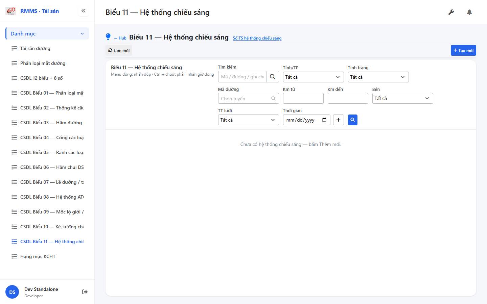
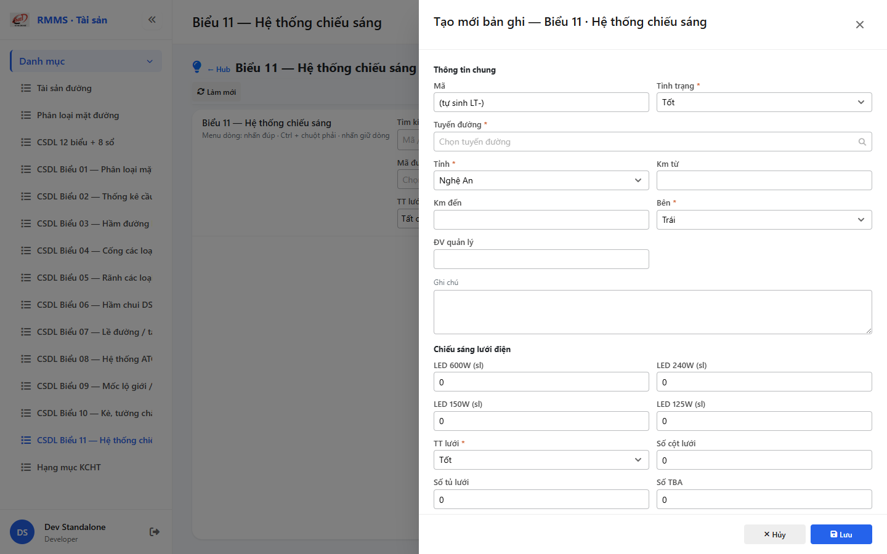

# QA — Scenarios — csdl-bieu-11

| Field | Value |
|-------|-------|
| feature | `csdl-bieu-11` |
| title | CSDL Biểu 11 — Hệ thống chiếu sáng |
| role | `qa` · `/agent-qa` |
| taskId | `task_77e7482f` |
| status | **confirmed** |
| verdict | **PASS** |
| e2eQa | **ON** |
| method | `e2e runtime · yarn start:std :9301 + docker API :5111 + BFF :5201 + playwright channel=chrome capture (yarn e2e-qa hang fallback)` |
| mfeStdUrl | `http://localhost:9301/csdl-bieu-11` |
| mfeStdRoute | `/csdl-bieu-11` |
| hubDeepLink | `/so-ts/csdl-so-sach?resource=lighting-systems` |
| testid | `rmms-csdl-bieu-11-list-page` · form `rmms-csdl-bieu-11-form-slideout` |
| docker | API `:5111` healthy · BFF `:5201` healthy · postgres healthy |
| MFE | `D:/AI-QLBD/MFE-Source/Linm.Web.RMMS.Asset` |
| BE | `D:/AI-QLBD/Linm.RMMS.WebService` · `api/v1/asset/csdl-records` · **cấm ERP.*** |
| packKind | **`list`** · Kind B A–D+F · Kind D Slideout 2col · **2 section** lưới + NLMT |
| changeScope | `new_page` |
| resource | `lighting-systems` · formNo `11` · columns `24` · IdCode `LT-` |
| peerSoTs | `so-ts-lighting` (toolbar · ≠ merge) |
| autoApprove | ON |
| contentHashPriorDataAnaly | `sha256:7980db07b4712336ab0b675fa89feaab75c67fdaef3b54fe94647ab9ec1863d8` |
| headerFingerprintPrior | `sha256:b37759a9224c09c7c63bc81583b4a9bcbca02e74cba8b63579819e90d57f1d1a` |
| updatedAt | `2026-09-05T12:51:00.000Z` |
| prior · dev | **confirmed** · `implement/csdl-bieu-11.md` · `task_049ab5a3` |

**Cấm** `phase=done` — next = Review. **cấm** ERP.* · **cấm** invent API · **cấm** kill worker (GAP-QA-E2E-KILL-01).

---

## E2E runtime (e2eQa ON)

| Check | Result |
|-------|--------|
| `docker compose up -d` (`Linm.RMMS.WebService`) | **PASS** · api `:5111` · bff `:5201` · postgres healthy |
| `yarn start:std` (`:9301`) | **PASS** · Asset standalone listen (reuse · **cấm** kill) |
| `yarn typecheck` | **PASS** (`tsc --noEmit`) |
| Capture S0 / S1 / QA-20 → `qa/screens/{caseId}.png` | **PASS** · `manifest.json` `ok=true` |
| Live DOM assert | **PASS** · `live-assert.json` · title VN · filter gridStatus/side/km · peer toolbar |
| Form assert QA-20 | **PASS** · `form-assert.json` · Z2/Z2b/Z3 · LED · solar · LT- · Lưu · `data-form-cols=2` |
| API GET `?resource=lighting-systems` | **PASS** · HTTP 200 (`:5111`) |

> Note: `yarn e2e-qa` treo sau `e2e login source=e2e.local.json` (**GAP-QA-E2E-PW-01**) — **không** taskkill rộng node/yarn · capture tương đương Playwright + `channel=chrome` · `--skip-start` (std+docker đã listen). Wrapper e2e-qa dừng riêng · **giữ** :9301.

### Evidence table

| ID | Steps | Expected | Result | Evidence |
|----|-------|----------|--------|----------|
| S0 | Mở `mfeStdUrl` | List `rmms-csdl-bieu-11-list-page` · title Biểu 11 · filter-bar (side/gridStatus/km) · empty/grid · peer `so-ts-lighting` | **PASS** |  |
| S1 | Hub `?resource=lighting-systems` | Redirect → `/csdl-bieu-11` · list page (route_a) | **PASS** |  |
| QA-20 | `?form=create` | Slideout create · Z2/Z2b NLMT · 2 section lưới+NLMT · footer Lưu · LT- | **PASS** |  |

`screens/manifest.json` · capturedAt `2026-09-05T12:50:30.964Z` · SHA256_16 S0=`4c7adb31b6e963ca` · S1=`4c7adb31b6e963ca` · QA-20=`65da20993bf4b641`.

---

## T-QA-CRUD-01

| ID | Steps | Expected | Result |
|----|-------|----------|--------|
| QA-20 | Create `?form=create` / toolbar Tạo mới | Slideout · POST `csdl-records` · resource=lighting-systems | **PASS** (runtime + code) |
| QA-21 | Edit | PUT + dirty → `LeaveConfirmModal` | **PASS** (code · LeaveConfirm wired) |
| QA-22 | View | readOnly · footer Sửa/Đóng | **PASS** (code) |
| QA-23 | Copy | POST new · LT- code | **PASS** (code) |
| QA-24 | Delete toolbar/row | soft DELETE · `useAlert` · **0** `window.confirm` | **PASS** (code) |
| QA-25 | Deep-link `?form=&id=` | Slideout · strip params | **PASS** (code) |
| QA-26 | Peer Sổ TS | toolbar `so-ts-lighting` · **cấm** merge form | **PASS** (live peerToolbarOk) |

---

## T-QA-FORM-01

| ID | Check | Result |
|----|-------|--------|
| QA-F-01 | Slideout fields `data-form-cols=2` · footer_actions_only · **cấm** Full-page | **PASS** (live QA-20 + code) |
| QA-F-02 | Required: road/province/km/status/side · LED allow_zero · solar optional | **PASS** (validate) |
| QA-F-03 | road = `SearchInput` road-route · **cấm** Text free | **PASS** (code · create SearchInput; testid on readOnly Input only) |
| QA-F-04 | Q-LED allow_zero · Q-GRID-STATUS align_status · Q-CABINET split · Q-SOLAR optional_flat 6 | **PASS** |
| QA-F-05 | kmFrom/kmTo · gridStatus filter live | **PASS** (filter + form live) |
| QA-F-06 | Dirty leave = `LeaveConfirmModal` · **0** native dialog | **PASS** (code) |
| QA-F-07 | Typed 24 · 2 section lưới+NLMT · **cấm** detail*-only · **cấm** Solar child | **PASS** (code + live Z2b solar) |

---

## T-QA-FILTER-01 / T-QA-ROUTE-01 / T-QA-LED-01 / T-QA-SOLAR-01

| ID | Check | Result |
|----|-------|--------|
| QA-FB-01 | search · province · status · side · gridStatus · roadCode · kmFrom/kmTo · 🔍 | **PASS** (live S0 testids) |
| QA-FB-02 | `LinErpListFilterBar` · **0** nút Tìm riêng invent | **PASS** |
| QA-FB-03 | **0** export/print/CRUD trên bar | **PASS** |
| QA-ROUTE-01 | alias `/csdl-bieu-11` + hub redirect lighting-systems | **PASS** (S0+S1) |
| QA-LED-01 | gridLed600/240/150/125 · allow_zero | **PASS** (live form LED) |
| QA-SOLAR-01 | solar flat optional 6 fields · **cấm** Solar child | **PASS** (live Z2b) |

---

## T-QA-TYP-01 / T-QA-TAB-01

| ID | Check | Result |
|----|-------|--------|
| QA-TYP-01 | Label/input Common Components · no local break | **PASS** |
| QA-TAB-01 | Filter leading DOM = visual · form sequential shared→lưới→NLMT | **PASS** |
| QA-RESP-01 | List wrap · live 1440 | **PASS** |

---

## Chrome / end-user

| ID | Check | Result |
|----|-------|--------|
| QA-CH-01 | List/form **tiếng Việt** · **0** badge CREATE/EDIT/VIEW · **0** demo/stub | **PASS** (`live-assert.json`) |
| QA-CH-02 | Peer toolbar `so-ts-lighting` · **cấm** merge Sổ TS | **PASS** |
| QA-CH-03 | **0** `window.alert`/`confirm`/`prompt` (Asset page) | **PASS** (useAlert + LeaveConfirm) |
| QA-CH-04 | **cấm** ERP.* imports | **PASS** |
| QA-CH-05 | **0** webpack "Compiled with problems" overlay | **PASS** (screenshot sạch · size OK) |

---

## Gaps

| ID | Severity | Note |
|----|----------|------|
| GAP-QA-E2E-PW-01 | accepted P2 | `yarn e2e-qa` hang @ login · chrome channel fallback OK |
| GAP-QA-ROAD-TESTID | P3 | SearchInput create · testid chỉ trên readOnly Input (`hasRoad=false`) |
| Debt | P2 | DB migrate apply · Auth DEFER · org/XLS OUT |

## Next

| Role | Need |
|------|------|
| **Review** | `/agent-review` · findings · **cấm** phase=done từ QA |
