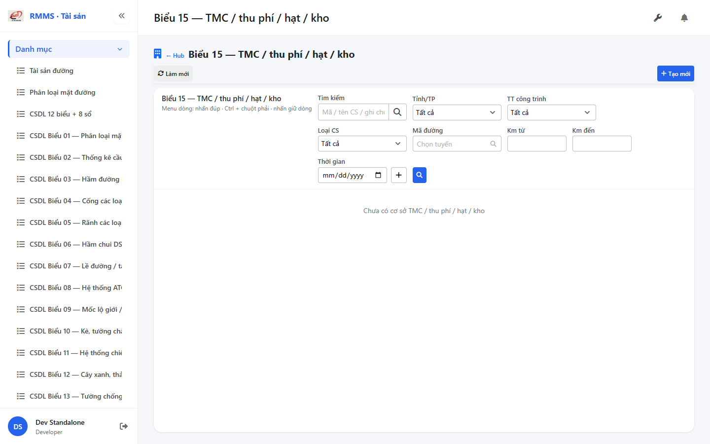
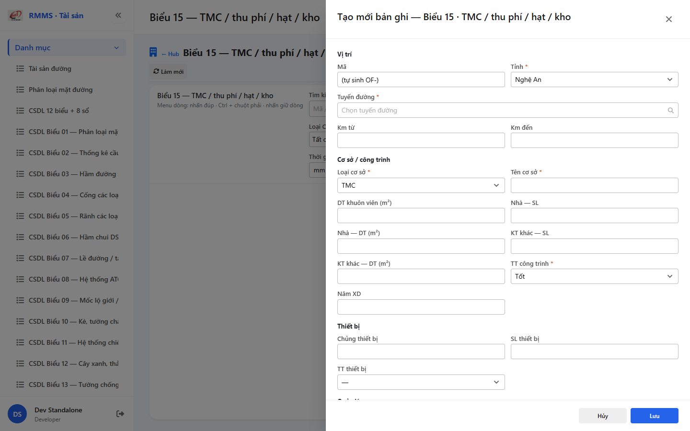

# QA — Scenarios — csdl-bieu-15

| Field | Value |
|-------|-------|
| feature | `csdl-bieu-15` |
| title | CSDL Biểu 15 — TMC / thu phí / hạt / kho |
| role | `qa` · `/agent-qa` |
| taskId | `task_cb969365` |
| status | **confirmed** |
| verdict | **PASS** |
| e2eQa | **ON** |
| method | `e2e runtime · yarn start:std :9301 + docker API :5111 + BFF :5201 + playwright channel=chrome capture (yarn e2e-qa hang fallback)` |
| mfeStdUrl | `http://localhost:9301/csdl-bieu-15` |
| mfeStdRoute | `/csdl-bieu-15` |
| hubDeepLink | `/so-ts/csdl-so-sach?resource=ops-facilities` |
| testid | `rmms-csdl-bieu-15-list-page` · form `rmms-csdl-bieu-15-form-slideout` |
| docker | API `:5111` healthy · BFF `:5201` healthy · postgres healthy · **rebuild** API (ops-facilities) |
| MFE | `D:/AI-QLBD/MFE-Source/Linm.Web.RMMS.Asset` |
| BE | `D:/AI-QLBD/Linm.RMMS.WebService` · `api/v1/asset/csdl-records` · **cấm ERP.*** |
| packKind | **`list`** · Kind B A–D+F · Kind D Slideout 2col · Z2 công trình · Z3 TB+QL |
| changeScope | `new_page` |
| resource | `ops-facilities` · formNo `15` · columns `20` · IdCode `OF-` |
| peerSoTs | `so-ts-toll` · `so-ts-rest-area` · `so-ts-station-house` · **cấm** merge · none_p1 |
| autoApprove | ON |
| contentHashPriorDataAnaly | `sha256:3bf356f00182dd6c0864bf5b88ae4d460ef8da73e5521f1b14756b7168dc20a7` |
| headerFingerprintPrior | `sha256:0064a4903777f7ea8d51c7423d8451a20daf77a5934929001905edaa380f4fe4` |
| updatedAt | `2026-09-05T15:56:00.000Z` |
| prior · dev | **confirmed** · `implement/csdl-bieu-15.md` · `task_e6ad9bf7` |

**Cấm** `phase=done` — next = Review. **cấm** ERP.* · **cấm** invent API · **cấm** kill worker (GAP-QA-E2E-KILL-01).

---

## E2E runtime (e2eQa ON)

| Check | Result |
|-------|--------|
| `docker compose up -d` (+ `--build` API) | **PASS** · api `:5111` · bff `:5201` · postgres healthy · `ops-facilities` HTTP 200 |
| `yarn start:std` (`:9301`) | **PASS** · Asset standalone listen (reuse · **cấm** kill) |
| `yarn typecheck` | **PASS** (`tsc --noEmit`) |
| Capture S0 / S1 / QA-20 → `qa/screens/{caseId}.png` | **PASS** · `manifest.json` `ok=true` |
| Live DOM assert | **PASS** · `live-assert.json` · title VN · filter facilityKind/km · peer none |
| Form assert QA-20 | **PASS** · `form-assert.json` · Z2/Z2-facility/Z3/Z3-equipment/Z3-manage · OF- · Lưu · `data-form-cols=2` |
| API GET `?resource=ops-facilities` | **PASS** · HTTP 200 (`:5111` + BFF `:5201/web-bff`) |

> Note: `yarn e2e-qa` treo sau `e2e login source=e2e.local.json` (**GAP-QA-E2E-PW-01**) — **không** taskkill rộng node/yarn · dừng riêng tree e2e-qa · capture tương đương Playwright + `channel=chrome` · `--skip-start` (std+docker đã listen) · **giữ** :9301. Pre-rebuild: API image cũ 422 `Resource không hợp lệ: ops-facilities` → `docker compose up -d --build linm-rmms-api` rồi PASS.

### Evidence table

| ID | Steps | Expected | Result | Evidence |
|----|-------|----------|--------|----------|
| S0 | Mở `mfeStdUrl` | List `rmms-csdl-bieu-15-list-page` · title Biểu 15 · filter-bar (facilityKind/km) · empty/grid · **0** peer | **PASS** |  |
| S1 | Hub `?resource=ops-facilities` | Redirect → `/csdl-bieu-15` · list page (route_a) | **PASS** |  |
| QA-20 | `?form=create` | Slideout create · Z2 công trình · Z3 TB+QL · 2col · footer Lưu · OF- | **PASS** |  |

`screens/manifest.json` · capturedAt `2026-09-05T15:55:02.189Z` · SHA256_16 S0=`bb3b71a3587cc57e` · S1=`bb3b71a3587cc57e` · QA-20=`1dd3e77a73d1388f`.

---

## T-QA-CRUD-01

| ID | Steps | Expected | Result |
|----|-------|----------|--------|
| QA-20 | Create `?form=create` / toolbar Tạo mới | Slideout · POST `csdl-records` · resource=ops-facilities | **PASS** (runtime + code) |
| QA-21 | Edit | PUT + dirty → `LeaveConfirmModal` | **PASS** (code · LeaveConfirm wired) |
| QA-22 | View | readOnly · footer Sửa/Đóng | **PASS** (code) |
| QA-23 | Copy | POST new · OF- code | **PASS** (code) |
| QA-24 | Delete toolbar/row | soft DELETE · `useAlert` · **0** `window.confirm` | **PASS** (code) |
| QA-25 | Deep-link `?form=&id=` | Slideout · strip params | **PASS** (code) |
| QA-26 | Peer Sổ TS | **none_p1** · **cấm** merge so-ts-toll/rest/station | **PASS** (live peerNoneOk) |

---

## T-QA-FORM-01

| ID | Check | Result |
|----|-------|--------|
| QA-F-01 | Slideout fields `data-form-cols=2` · footer_actions_only · **cấm** Full-page | **PASS** (live QA-20 + code) |
| QA-F-02 | Required shared + facilityKind keep_5 · area/qty ≥0 · status | **PASS** (validate) |
| QA-F-03 | road = `SearchInput` road-route · **cấm** Text free | **PASS** (code · SearchInput; testid may not surface — GAP-QA-ROAD-TESTID) |
| QA-F-04 | Q-KIND-SET keep_5 · Q-EQ-SET free_text · Q-PREFIX OF · Q-AREA-UNIT number_m2 | **PASS** |
| QA-F-05 | kmFrom/kmTo · facilityKind filter live | **PASS** (filter + form live) |
| QA-F-06 | Dirty leave = `LeaveConfirmModal` · **0** native dialog | **PASS** (code) |
| QA-F-07 | Typed 20 · Z2 công trình · Z3 TB+QL · **cấm** detail*-only | **PASS** (code + live Z2/Z3) |

---

## T-QA-FILTER-01 / T-QA-ROUTE-01 / T-QA-FAC-01 / T-QA-AREA-01 / T-QA-EQ-01

| ID | Check | Result |
|----|-------|--------|
| QA-FB-01 | search · province · status · facilityKind · roadCode · kmFrom/kmTo · 🔍 | **PASS** (live S0 testids) |
| QA-FB-02 | `LinErpListFilterBar` · **0** nút Tìm riêng invent | **PASS** |
| QA-FB-03 | **0** export/print/CRUD trên bar | **PASS** |
| QA-ROUTE-01 | alias `/csdl-bieu-15` + hub redirect ops-facilities | **PASS** (S0+S1) |
| QA-FAC-01 | facilityKind keep_5 · facilityName · status · yearBuilt | **PASS** (live form + code) |
| QA-AREA-01 | courtyard/building/other · number_m2 · qty ≥0 | **PASS** (live Z2) |
| QA-EQ-01 | equipmentKind free_text · qty · equipmentStatus · manageUnit | **PASS** (live Z3) |

---

## T-QA-TYP-01 / T-QA-TAB-01

| ID | Check | Result |
|----|-------|--------|
| QA-TYP-01 | Label/input Common Components · no local break | **PASS** |
| QA-TAB-01 | Filter leading DOM = visual · form sequential shared→facility→TB→QL | **PASS** |
| QA-RESP-01 | List wrap · live 1440 | **PASS** |

---

## Chrome / end-user

| ID | Check | Result |
|----|-------|--------|
| QA-CH-01 | List/form **tiếng Việt** · **0** badge CREATE/EDIT/VIEW · **0** demo/stub | **PASS** (`live-assert.json`) |
| QA-CH-02 | **0** peer toolbar · none_p1 · **cấm** merge so-ts-* | **PASS** |
| QA-CH-03 | **0** `window.alert`/`confirm`/`prompt` (Asset page) | **PASS** (useAlert + LeaveConfirm) |
| QA-CH-04 | **cấm** ERP.* imports | **PASS** |
| QA-CH-05 | **0** webpack "Compiled with problems" overlay | **PASS** (screenshot size OK · PNG magic) |

---

## Debt / GAP

| ID | Pri | Note |
|----|-----|------|
| GAP-QA-E2E-PW-01 | P2 | `yarn e2e-qa` hang @ login · chrome channel fallback |
| GAP-QA-ROAD-TESTID | P3 | SearchInput road testid may not surface in DOM (`hasRoad=false` form-assert) |
| Auth wire | DEFER | per Dev debt |
| org / XLS | OUT/DEFER | per PO |

---

## Handoff

| Field | Value |
|-------|-------|
| next | **Review** · `/agent-review` · `review/findings.md` |
| compact | `handoff/qa-compact.md` |
| **cấm** | `phase=done` từ QA · start role khác cùng task |
