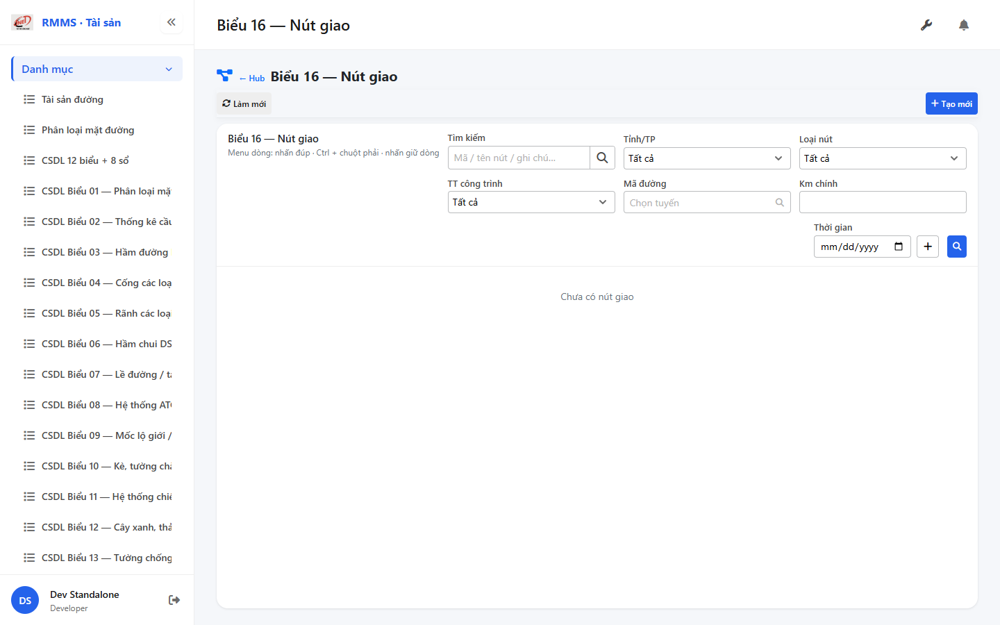
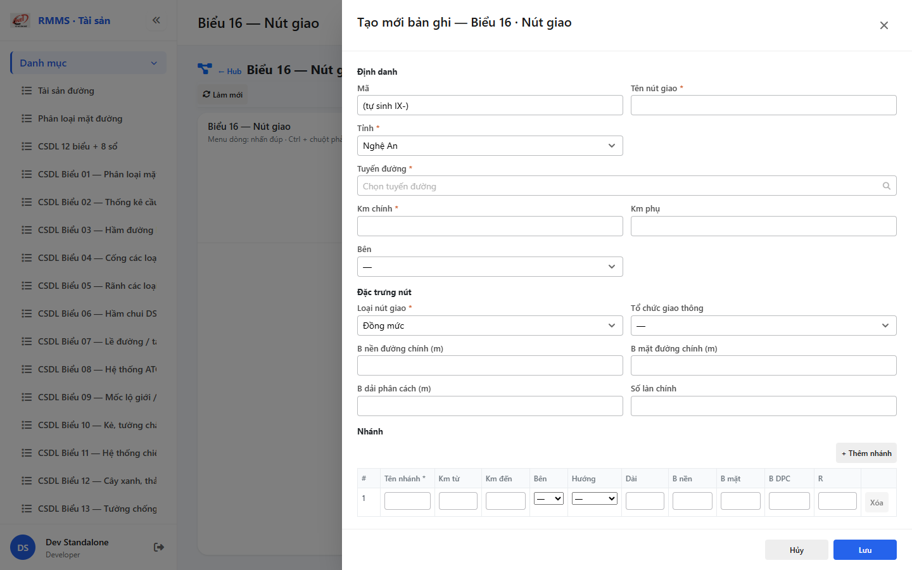

# QA — Scenarios — csdl-bieu-16

| Field | Value |
|-------|-------|
| feature | `csdl-bieu-16` |
| title | CSDL Biểu 16 — Nút giao |
| role | `qa` · `/agent-qa` |
| taskId | `task_944da438` |
| status | **confirmed** |
| verdict | **PASS** |
| e2eQa | **ON** |
| method | `e2e runtime · yarn start:std :9301 + docker API :5111 + BFF :5201 + playwright channel=chrome capture (yarn e2e-qa hang fallback)` |
| mfeStdUrl | `http://localhost:9301/csdl-bieu-16` |
| mfeStdRoute | `/csdl-bieu-16` |
| hubDeepLink | `/so-ts/csdl-so-sach?resource=interchanges` |
| testid | `rmms-csdl-bieu-16-list-page` · form `rmms-csdl-bieu-16-form-slideout` |
| docker | API `:5111` healthy · BFF `:5201` healthy · postgres healthy · **rebuild** API (interchanges) |
| MFE | `D:/AI-QLBD/MFE-Source/Linm.Web.RMMS.Asset` |
| BE | `D:/AI-QLBD/Linm.RMMS.WebService` · `api/v1/asset/csdl-records` · **cấm ERP.*** |
| packKind | **`list`** · Kind B A–D+F · Kind D Slideout 2col · BRANCH + ATGT |
| changeScope | `new_page` |
| resource | `interchanges` · formNo `16` · columns `39` · IdCode `IX-` |
| peerSoTs | `so-ts-interchange` · **cấm** merge · none_p1 |
| autoApprove | ON |
| contentHashPriorDataAnaly | `sha256:56e2fb16e9bcde21f17d7e9639b72660666778f5393b1270cecc49d123beba4b` |
| headerFingerprintPrior | `sha256:ec787bf2008ae89f1b6c085fe238f1b0d50b048f5c672b90b68d9ea102cf8fcc` |
| updatedAt | `2026-09-05T16:58:00.000Z` |
| prior · dev | **confirmed** · `implement/csdl-bieu-16.md` · `task_71eac21e` |

**Cấm** `phase=done` — next = Review. **cấm** ERP.* · **cấm** invent API · **cấm** kill worker (GAP-QA-E2E-KILL-01).

---

## E2E runtime (e2eQa ON)

| Check | Result |
|-------|--------|
| `docker compose up -d` (+ `--build` API) | **PASS** · api `:5111` · bff `:5201` · postgres healthy · `interchanges` HTTP 200 |
| `yarn start:std` (`:9301`) | **PASS** · Asset standalone listen (reuse · **cấm** kill) |
| `yarn typecheck` | **PASS** (`tsc --noEmit`) |
| Capture S0 / S1 / QA-20 → `qa/screens/{caseId}.png` | **PASS** · `manifest.json` `ok=true` |
| Live DOM assert | **PASS** · `live-assert.json` · title VN · filter interchangeType/kmMain · peer none |
| Form assert QA-20 | **PASS** · `form-assert.json` · Z2/feature/BRANCH · Z3 ATGT+QL · IX- · Lưu · `data-form-cols=2` |
| API GET `?resource=interchanges` | **PASS** · HTTP 200 (`:5111` + BFF `:5201/web-bff`) |

> Note: `yarn e2e-qa` treo sau `e2e login source=e2e.local.json` / chromium install (**GAP-QA-E2E-PW-01**) — **không** taskkill rộng node/yarn · dừng riêng tree e2e-qa · capture tương đương Playwright + `channel=chrome` · `--skip-start` (std+docker đã listen) · **giữ** :9301. Pre-rebuild: API image cũ 422 `Resource không hợp lệ: interchanges` → `docker compose up -d --build linm-rmms-api` rồi PASS.

### Evidence table

| ID | Steps | Expected | Result | Evidence |
|----|-------|----------|--------|----------|
| S0 | Mở `mfeStdUrl` | List `rmms-csdl-bieu-16-list-page` · title Biểu 16 · filter-bar (interchangeType/kmMain) · empty/grid · **0** peer | **PASS** |  |
| S1 | Hub `?resource=interchanges` | Redirect → `/csdl-bieu-16` · list page (route_a) | **PASS** |  |
| QA-20 | `?form=create` | Slideout create · Z2 feature + BRANCH · Z3 ATGT+QL · 2col · footer Lưu · IX- | **PASS** |  |

`screens/manifest.json` · capturedAt `2026-09-05T16:56:58.501Z` · SHA256_16 S0=`df8d6375dd104010` · S1=`df8d6375dd104010` · QA-20=`750db6e448c043ba`.

---

## T-QA-CRUD-01

| ID | Steps | Expected | Result |
|----|-------|----------|--------|
| QA-20 | Create `?form=create` / toolbar Tạo mới | Slideout · POST `csdl-records` · resource=interchanges · branches[] | **PASS** (runtime + code) |
| QA-21 | Edit | PUT + dirty → `LeaveConfirmModal` | **PASS** (code · LeaveConfirm wired) |
| QA-22 | View | readOnly · footer Sửa/Đóng | **PASS** (code) |
| QA-23 | Copy | POST new · IX- code | **PASS** (code) |
| QA-24 | Delete toolbar/row | soft DELETE · `useAlert` · **0** `window.confirm` | **PASS** (code) |
| QA-25 | Deep-link `?form=&id=` | Slideout · strip params | **PASS** (code) |
| QA-26 | Peer Sổ TS | **none_p1** · **cấm** merge so-ts-interchange | **PASS** (live peerNoneOk) |

---

## T-QA-FORM-01

| ID | Check | Result |
|----|-------|--------|
| QA-F-01 | Slideout fields `data-form-cols=2` · footer_actions_only · **cấm** Full-page | **PASS** (live QA-20 + code) |
| QA-F-02 | Required shared + interchangeType cite_excel · branches min_1 · status | **PASS** (validate) |
| QA-F-03 | road = `SearchInput` road-route · **cấm** Text free | **PASS** (code · SearchInput; testid may not surface — GAP-QA-ROAD-TESTID) |
| QA-F-04 | Q-TYPE-SET cite_excel · Q-TRAFFIC-ORG lookup · Q-ATGT qty · Q-PREFIX IX · Q-BRANCH-MIN min_1 | **PASS** |
| QA-F-05 | kmMain filter live · interchangeType filter live | **PASS** (filter + form live) |
| QA-F-06 | Dirty leave = `LeaveConfirmModal` · **0** native dialog | **PASS** (code) |
| QA-F-07 | Typed 39 · BRANCH grid · ATGT qty · **cấm** detail*-only · **cấm** flatten-only | **PASS** (code + live Z2/BRANCH/Z3) |

---

## T-QA-FILTER-01 / T-QA-ROUTE-01 / T-QA-BRANCH-01 / T-QA-MAIN-01 / T-QA-ATGT-01

| ID | Check | Result |
|----|-------|--------|
| QA-FB-01 | search · province · status · interchangeType · roadCode · kmMain · 🔍 | **PASS** (live S0 testids) |
| QA-FB-02 | `LinErpListFilterBar` · **0** nút Tìm riêng invent | **PASS** |
| QA-FB-03 | **0** export/print/CRUD trên bar | **PASS** |
| QA-ROUTE-01 | alias `/csdl-bieu-16` + hub redirect interchanges | **PASS** (S0+S1) |
| QA-BRANCH-01 | branches[] embed · min_1 · grid · add/remove · **cấm** flatten-only | **PASS** (live BRANCH + code) |
| QA-MAIN-01 | kmMain point_main · mainBed/Surface/Median/Lane | **PASS** (live Z2 feature) |
| QA-ATGT-01 | atgtSign/Marking/Island/Light qty | **PASS** (live Z3 ATGT) |

---

## T-QA-TYP-01 / T-QA-TAB-01

| ID | Check | Result |
|----|-------|--------|
| QA-TYP-01 | Label/input Common Components · no local break | **PASS** |
| QA-TAB-01 | Filter leading DOM = visual · form sequential định danh→feature→BRANCH→ATGT→QL | **PASS** |
| QA-RESP-01 | List wrap · live 1440 | **PASS** |

---

## Chrome / end-user

| ID | Check | Result |
|----|-------|--------|
| QA-CH-01 | List/form **tiếng Việt** · **0** badge CREATE/EDIT/VIEW · **0** demo/stub | **PASS** (`live-assert.json`) |
| QA-CH-02 | **0** peer toolbar · none_p1 · **cấm** merge so-ts-interchange | **PASS** |
| QA-CH-03 | **0** `window.alert`/`confirm`/`prompt` (Asset page) | **PASS** (useAlert + LeaveConfirm) |
| QA-CH-04 | **cấm** ERP.* imports | **PASS** |
| QA-CH-05 | **0** webpack "Compiled with problems" overlay | **PASS** (screenshot size OK · PNG magic) |

---

## Debt / GAP

| ID | Severity | Note |
|----|----------|------|
| GAP-QA-E2E-PW-01 | P2 | `yarn e2e-qa` hang @ login/chromium install → chrome channel capture fallback |
| GAP-QA-ROAD-TESTID | P3 | SearchInput road testid may not surface in create DOM assert |
| Auth wire | DEFER | per Dev debt |
| org / XLS | OUT/DEFER | per PO |

## Next

| Role | Need |
|------|------|
| **Review** | `/agent-review` · findings · **cấm** phase=done từ QA |

## UNCLEAR

- none
