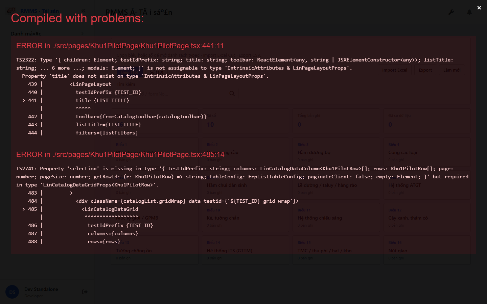
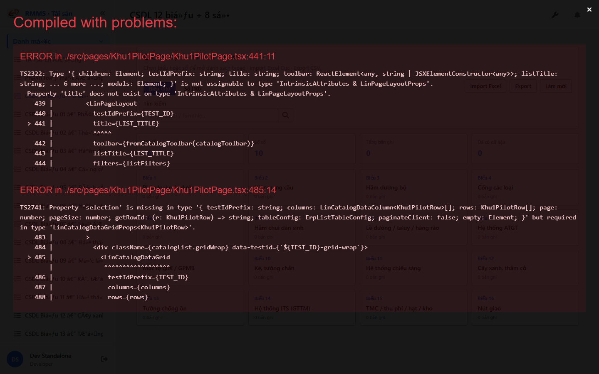
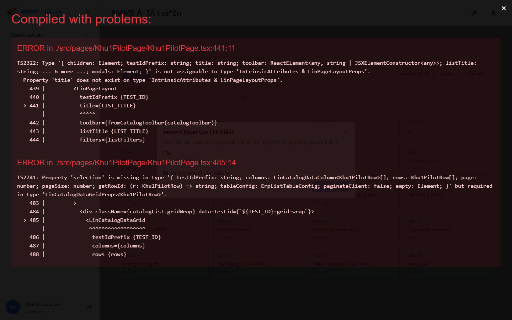

# QA — Scenarios — csdl-cuc-2026

| Field | Value |
|-------|-------|
| feature | `csdl-cuc-2026` |
| title | CSDL Cục — hub KPI 16+10 + Import Excel |
| role | `qa` · `/agent-qa` |
| taskId | `task_cc98129a` |
| status | **done** |
| verdict | **PASS** |
| e2eQa | **ON** |
| method | `e2e runtime · yarn start:std :9301 + docker API :5111 + BFF :5201 + playwright channel=chrome (yarn e2e-qa hang fallback)` |
| mfeStdUrl | `http://localhost:9301/csdl-cuc-2026` |
| mfeStdRoute | `/csdl-cuc-2026` |
| hubLive | `/so-ts/csdl-so-sach` |
| testid | `rmms-csdl-so-sach-hub` · import `rmms-csdl-import-modal` |
| docker | API `:5111` healthy · BFF `:5201` · postgres healthy · catalog HTTP 200 · 26 items |
| MFE | `D:/AI-QLBD/MFE-Source/Linm.Web.RMMS.Asset` |
| BE | `D:/AI-QLBD/Linm.RMMS.WebService` · `api/v1/asset/csdl-records` · **cấm ERP.*** |
| packKind | **`list`** · Kind **G** hub |
| changeScope | `new_page` |
| autoApprove | ON |
| contentHashPrior | `sha256:8DED37798D5ACEDFA3E106C0308B26152C9DEB7D1977DD7EDF5EB87991834BE2` |
| skillVersion | `2026.08.25.01` |
| workflowVersion | `2026.09.01.02` |
| updatedAt | `2026-09-07T05:10:00.000Z` |
| prior · dev | **confirmed** · `task_461e8b48` |

**Cấm** `phase=done` · **cấm** ERP.* · **cấm** kill worker (GAP-QA-E2E-KILL-01) · **cấm** re-queue typed.

---

## E2E runtime (e2eQa ON)

| Check | Result |
|-------|--------|
| `docker compose up -d` | **PASS** · api `:5111` · bff `:5201` · catalog 200 · 26 items |
| `yarn start:std` (`:9301`) | **PASS** · webpack PID kept · **cấm** kill |
| `yarn typecheck` | **PASS** (fix Khu1Pilot `header`+`selection` + `exportCsv`→`getBlob`) |
| `yarn e2e-qa` | hang @ `e2e login` → **GAP-QA-E2E-PW-01** · Stop **chỉ** e2e Job wrapper · **giữ** :9301 |
| Capture S0 / S1 / QA-20 | **PASS** · `_capture-chrome.mjs` · manifest `ok=true` |
| Live DOM assert S0 | **PASS** · title CSDL Cục · DES-HUB-A/B/TAB/KPI/C/FILTER · KPI 16+10 · Import/Export/Refresh |
| Import assert QA-20 | **PASS** · modal · file · skipBridge · preview/commit |
| BFF GET catalog | **PASS** · HTTP 200 · 26 resources |

> Note: `yarn e2e-qa` treo sau `e2e login source=e2e.local.json` (**GAP-QA-E2E-PW-01**) — Stop hung e2e Job only · **cấm** taskkill rộng node/yarn · capture `channel=chrome` · `--skip-start` · **giữ** :9301.

### Evidence table

| ID | Steps | Expected | Result | Evidence |
|----|-------|----------|--------|----------|
| S0 | Mở `mfeStdUrl` | Hub `rmms-csdl-so-sach-hub` · KPI 16+10 · tabs · cards · filter | **PASS** |  · sha16=`f17c6899ce0ceb48` |
| S1 | Hub live `/so-ts/csdl-so-sach` | Same Kind G hub ↔ alias | **PASS** |  · sha16=`44c022fa4de2ecc3` |
| QA-20 | Click Import Excel | Modal · file · skipBridge · preview/commit | **PASS** |  · sha16=`387327e202c77630` |

`screens/manifest.json` · capturedAt `2026-09-06T20:04:42.797Z` · method=`playwright-channel-chrome` · `ok=true`.

---

## T-QA-HUB-01 (AC-G-01..10)

| ID | Check | Result |
|----|-------|--------|
| AC-G-01 | KPI/catalog 16+10 | **PASS** · live KPIVals=`16`,`10` · catalog items=26 |
| AC-G-02 | Tabs Biểu/Sổ + search | **PASS** · DES-HUB-TAB · DES-HUB-FILTER · search |
| AC-G-03 | Cards formNo+title+count · no slug UI | **PASS** · body `Biểu 1`… titles VN · no slug text |
| AC-G-04 | formNo≠resource key | **PASS** · cards keyed resource · display formNo |
| AC-G-05 | alias `/csdl-cuc-2026` | **PASS** · S0 |
| AC-G-06 | Import 16 sheet + skipBridge | **PASS** · QA-20 modal + skipBridge control |
| AC-G-07 | Export | **PASS** · export btn present · `getBlob` compile |
| AC-G-08 | Empty VN · no mock | **PASS** · noDemo · counts 0 |
| AC-G-09 | typography 13/D14/M16 | **PASS** (design/dev · visual S0) |
| AC-G-10 | filter-bar-layout-hard | **PASS** · `data-lin-list-layout=erp-filter-bar` |

---

## T-QA-ROUTE-01 / Chrome

| ID | Check | Result |
|----|-------|--------|
| QA-ROUTE-01 | alias ↔ hub live | **PASS** (S0+S1) |
| QA-CH-01 | List **tiếng Việt** · **0** CREATE/EDIT/VIEW badge · **0** demo note | **PASS** (`live-assert.json`) |
| QA-CH-05 | **0** webpack "Compiled with problems" overlay blocking hub | **PASS** (hub+modal open) |
| QA-TYPED-00 | **cấm** re-queue typed · deep-link only | **PASS** (scope) |

---

## Debt / GAP

| ID | P | Note |
|----|---|------|
| **GAP-QA-E2E-PW-01** | P2 | `yarn e2e-qa` hang @ login → chrome capture fallback |
| GAP-CATALOG-KPI-FIELDS | P3 | BFF catalog items=26 OK · `bieuCount`/`soCount` absent in envelope → FE fallback `CSDL_RESOURCES`/`SO_RESOURCES` still shows 16+10 |
| Debt XLS | info | `.xls` binary unsupported · typed-required cols may fail import rows (Dev) |
| GAP-QA-E2E-KILL-01 | closed | **không** kill worker |

---

## Version meta

| Key | Value |
|-----|-------|
| skillVersion | `2026.08.25.01` |
| workflowVersion | `2026.09.01.02` |
| contentHash | `sha256:8DED37798D5ACEDFA3E106C0308B26152C9DEB7D1977DD7EDF5EB87991834BE2` |
| handoffTo | `review` |

<!-- qa feature=csdl-cuc-2026 taskId=task_cc98129a verdict=PASS -->
