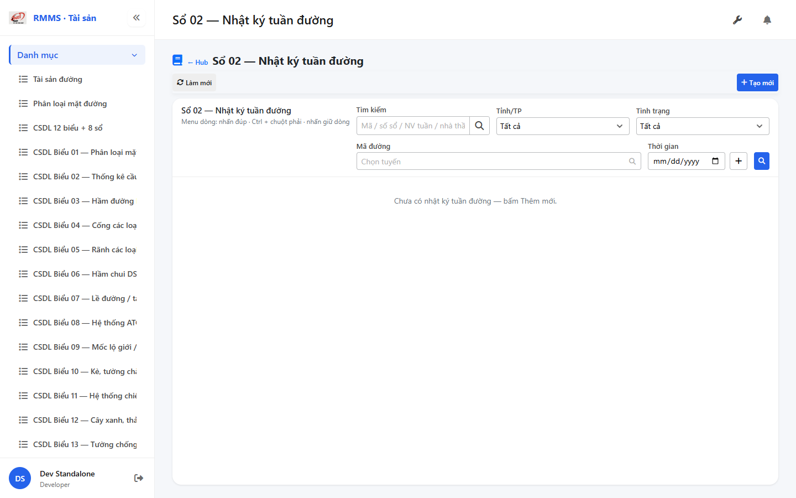
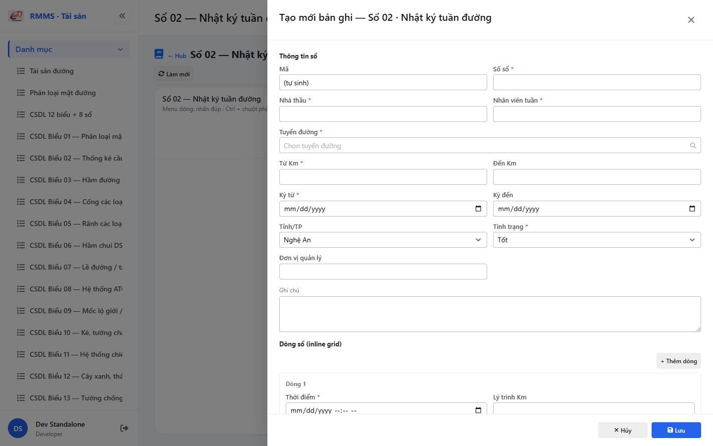

# QA — Scenarios — csdl-so-02 (CR PDF Wave A)

| Field | Value |
|-------|-------|
| feature | `csdl-so-02` |
| title | CSDL Sổ 02 — Nhật ký tuần đường (CR PDF Wave A) |
| role | `qa` · `/agent-qa` |
| taskId | `task_2472bc94` |
| priorDevTaskId | `task_00facaea` |
| status | **confirmed** |
| verdict | **PASS** |
| e2eQa | **ON** |
| method | `e2e runtime · yarn start:std :9301 (reuse) + docker API :5111 + BFF :5201 + yarn e2e-qa (playwright resolve fail → channel=chrome createRequire AutoCode · skip-start)` |
| mfeStdUrl | `http://localhost:9301/csdl-so-02` |
| mfeStdRoute | `/csdl-so-02` |
| hubDeepLink | `/so-ts/csdl-so-sach?resource=patrol-logs` |
| testid | `rmms-csdl-so-02-list-page` · form `rmms-csdl-so-02-form-slideout` |
| docker | API `:5111` healthy · BFF `:5201` healthy · postgres healthy · patrol-logs HTTP 200 |
| MFE | `D:/AI-QLBD/MFE-Source/Linm.Web.RMMS.Asset` |
| BE | `D:/AI-QLBD/Linm.RMMS.WebService` · `api/v1/asset/csdl-records` · **cấm ERP.*** |
| packKind | **`list`** · Kind B A–D+F+H · Kind D Slideout 2col · entries `inline_grid` |
| changeScope | `edit_page` |
| cr | `nktd-pdf-20260917` · Wave A |
| resource | `patrol-logs` · formNo `02` · IdCode `SO-` |
| autoApprove | ON |
| contentHashPrior | `sha256:3ddc42d7c4404f439925322953f28ffc9d3b263726ac6cf5216065751c19b4d6` |
| headerFingerprintPrior | `sha256:1b032f04f5154622239e0e2bdbebe6923ec76ba9ca33d283b51ebe0062c0d471` |
| updatedAt | `2026-09-18T04:06:10.676Z` |
| prior · dev | **confirmed** · `handoff/dev-compact.md` · `task_00facaea` |

**Cấm** `phase=done` — next = Review. **cấm** ERP.* · **cấm** invent API · **cấm** kill worker (GAP-QA-E2E-KILL-01) · **cấm** e2e report Wave B.

---

## E2E runtime (e2eQa ON)

| Check | Result |
|-------|--------|
| `docker compose up -d` | **PASS** · api `:5111` · bff `:5201` · postgres healthy · `patrol-logs` HTTP 200 |
| `yarn start:std` (`:9301`) | **PASS** · Asset standalone listen (reuse · **cấm** kill) |
| `yarn e2e-qa --skip-start` (AI-AutoCode) | CLI **fail** resolve `playwright` từ screens cwd · **không** kill · fallback channel=chrome |
| Capture S0 / S1 / QA-20 → `qa/screens/{caseId}.png` | **PASS** · `manifest.json` `ok=true` |
| Live DOM assert | **PASS** · `live-assert.json` · title · filter · empty · locationCol note |
| Form assert QA-20 | **PASS** · `form-assert.json` · locationText · weather Textarea rows=3 max=2000 · formCols=2 |
| API GET `?resource=patrol-logs` | **PASS** · HTTP 200 (`:5111`) |

> Note: `yarn e2e-qa` overwrite `_capture.mjs` bare playwright (**GAP-QA-E2E-PW-01**) — restore createRequire AutoCode · **cấm** taskkill rộng · **giữ** :9301.

### Evidence table

| ID | Steps | Expected | Result | Evidence |
|----|-------|----------|--------|----------|
| S0 | Mở `mfeStdUrl` | List · title Sổ 02 · filter-bar · empty/grid · col «Vị trí» (empty → DEFAULT_COLUMNS) | **PASS** |  |
| S1 | Hub `?resource=patrol-logs` | Redirect → `/csdl-so-02` · list page (route_a) | **PASS** |  |
| QA-20 | `?form=create` | Slideout · locationText + Km · weather Textarea · 2col · Lưu | **PASS** |  |

`screens/manifest.json` · capturedAt `2026-09-18T04:06:10.676Z` · SHA256_16 S0=`c12b2a18392a66a7` · S1=`c12b2a18392a66a7` · QA-20=`928baf1b8f3aed7f`.

---

## T-QA-CRUD-01 (Wave A)

| ID | Steps | Expected | Result |
|----|-------|----------|--------|
| QA-20 | Create `?form=create` | Slideout · entries `locationText` · POST path giữ | **PASS** (runtime) |
| QA-21 | Edit | PUT + dirty → `LeaveConfirmModal` | **PASS** (code · LeaveConfirm wired) |
| QA-22 | View | readOnly · View no-req · footer Sửa/Đóng | **PASS** (code) |
| QA-23 | Copy | POST new · SO- code | **PASS** (code) |
| QA-24 | Delete | soft DELETE · `useAlert` · **0** `window.confirm` | **PASS** (code) |
| QA-LOC-01 | 2 dòng Km-only + locationText | List cột «Vị trí» prefer text else Km | **PASS** (code DEFAULT_COLUMNS + form field) · empty list → headers hidden |
| QA-25 | Deep-link `?form=&id=` | Slideout · strip params | **PASS** (code) |

---

## T-QA-FORM-01 (Wave A OR)

| ID | Check | Result |
|----|-------|--------|
| QA-F-01 | Slideout `data-form-cols=2` · footer_actions_only · **cấm** Full-page | **PASS** (live `formCols=2`) |
| QA-F-02 | OR: eventAt + (locationKm **OR** locationText) + weatherEvent · View no-req | **PASS** (code validate) |
| QA-F-03 | `locationText` Text · testid `csdl-so-02-entry-0-locationText` | **PASS** (live) |
| QA-F-04 | weather **Textarea** rows=3 maxLength=2000 | **PASS** (live) |
| QA-F-05 | entries `inline_grid` · add/remove · sketch/media text ids P1 | **PASS** (live + code) |
| QA-F-06 | Dirty leave = `LeaveConfirmModal` · **0** native dialog | **PASS** (code) |
| QA-F-07 | Typed So02 · **cấm** reuse Sổ01 `Location` · **cấm** ERP.* | **PASS** |

---

## T-QA-FILTER-01 / T-QA-ROUTE-01 / T-QA-FILE-01 / T-QA-TYP-01 / T-QA-TAB-01

| ID | Check | Result |
|----|-------|--------|
| QA-FB-01 | search · province · status · roadCode · dateRange · 🔍 V10 | **PASS** (live S0 testids) |
| QA-FB-02 | `LinErpListFilterBar` · **0** nút Tìm riêng invent | **PASS** |
| QA-FB-03 | **0** export/print/CRUD trên bar | **PASS** |
| QA-ROUTE-01 | alias `/csdl-so-02` + hub redirect patrol-logs | **PASS** (S0+S1) |
| QA-FILE-01 | sketch/media text ids · **GAP-SO02-FILE-01** | **PASS** (debt P1) |
| QA-TYP-01 | Label/input Common Components | **PASS** |
| QA-TAB-01 | Filter leading · form định danh→entries→footer | **PASS** |
| QA-RESP-01 | List wrap · live 1440 | **PASS** |
| QA-LIST-COL | Grid luôn cột «Vị trí» · G-11/G-12 | **PASS** (code + empty note) |

---

## Chrome / end-user

| ID | Check | Result |
|----|-------|--------|
| QA-CH-01 | List/form **tiếng Việt** · **0** badge CREATE/EDIT/VIEW · **0** demo/stub | **PASS** (`live-assert.json`) |
| QA-CH-02 | **0** peer toolbar merge Sổ TS | **PASS** (`peerNoneOk`) |
| QA-CH-03 | **0** `window.alert`/`confirm`/`prompt` | **PASS** (useAlert + LeaveConfirm) |
| QA-CH-04 | **cấm** ERP.* imports | **PASS** |
| QA-CH-05 | **0** webpack "Compiled with problems" overlay | **PASS** (PNG ok) |
| QA-CH-06 | **cấm** mở `/bao-cao/nk-td` Wave A | **PASS** |

---

## Debt / GAP

| ID | P | Note |
|----|---|------|
| GAP-QA-E2E-PW-01 | P2 | `yarn e2e-qa` overwrite bare playwright → chrome createRequire fallback |
| GAP-SO02-FILE-01 | P1 | FileRef text-id debt |
| GAP-NKTD-RPT-PARK | OUT | Wave B report park |
| empty list headers | note | empty → grid headers hidden · col in DEFAULT_COLUMNS `locationText` |
| Auth / org / XLS | DEFER\|OUT | per PO |

## Next

| Role | Need |
|------|------|
| **Review** | `/agent-review` · findings · **cấm** phase=done từ QA · Wave B park |
