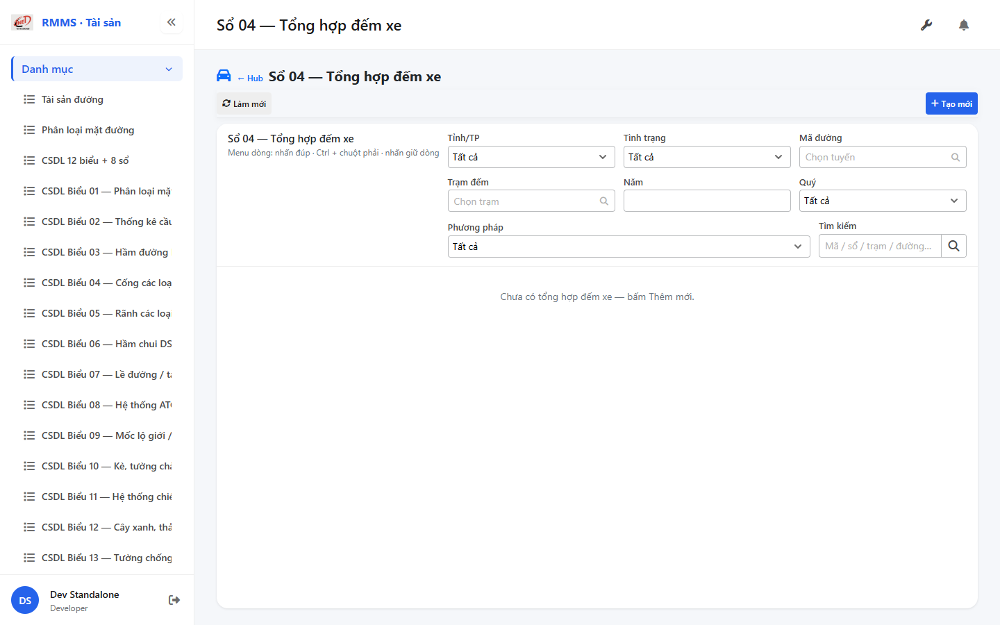
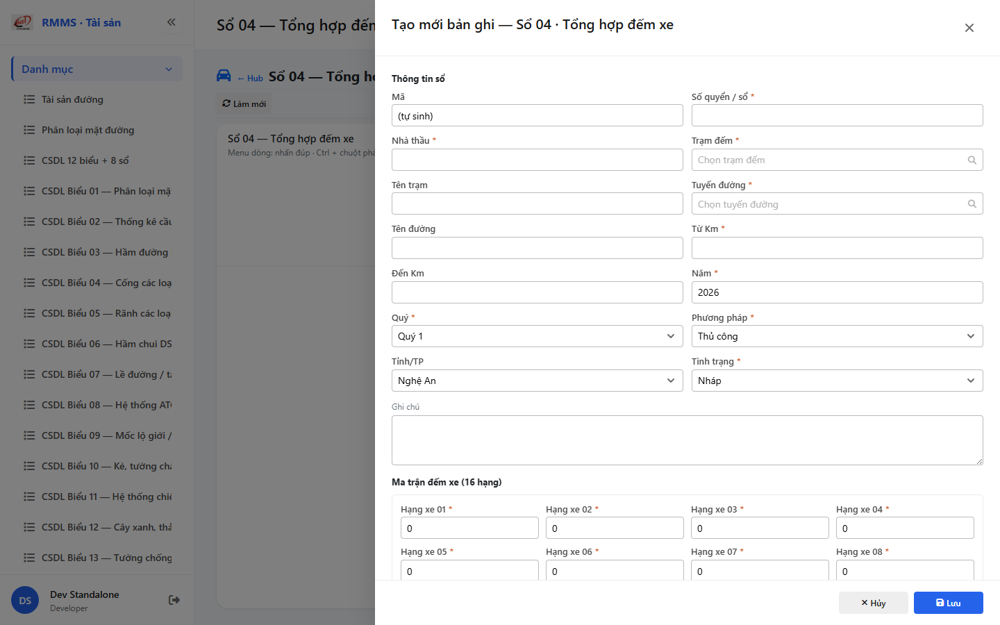

# QA — Scenarios — csdl-so-04

| Field | Value |
|-------|-------|
| feature | `csdl-so-04` |
| title | CSDL Sổ 04 — Tổng hợp đếm xe |
| role | `qa` · `/agent-qa` |
| taskId | `task_45c3d541` |
| status | **confirmed** |
| verdict | **PASS** |
| e2eQa | **ON** |
| method | `e2e runtime · yarn start:std :9301 + docker API :5111 + BFF :5201 + playwright channel=chrome capture (yarn e2e-qa hang fallback)` |
| mfeStdUrl | `http://localhost:9301/csdl-so-04` |
| mfeStdRoute | `/csdl-so-04` |
| hubDeepLink | `/so-ts/csdl-so-sach?resource=traffic-counts` |
| testid | `rmms-csdl-so-04-list-page` · form `rmms-csdl-so-04-form-slideout` |
| docker | API `:5111` healthy · BFF `:5201` healthy · postgres healthy · traffic-counts HTTP 200 |
| MFE | `D:/AI-QLBD/MFE-Source/Linm.Web.RMMS.Asset` |
| BE | `D:/AI-QLBD/Linm.RMMS.WebService` · `api/v1/asset/csdl-records` · **cấm ERP.*** |
| packKind | **`list`** · Kind B A–D+F+H · Kind D Slideout 2col · count matrix 16 · **cấm** journal |
| changeScope | `new_page` |
| resource | `traffic-counts` · formNo `04` · IdCode `SO-` |
| autoApprove | ON |
| contentHashPriorDataAnaly | `sha256:f4b9c168d339477350ba42a03f7ec00e774b38da0ecc6037de8950d9f25e944d` |
| headerFingerprintPrior | `sha256:202e875ac43d1dd97b8ac8f32d3528ac827776078cde980e7bb6ca9634aff7e2` |
| updatedAt | `2026-09-06T05:40:00.000Z` |
| prior · dev | **confirmed** · `implement/csdl-so-04.md` · `task_b4b31215` |

**Cấm** `phase=done` — next = Review. **cấm** ERP.* · **cấm** invent API · **cấm** kill worker (GAP-QA-E2E-KILL-01).

---

## E2E runtime (e2eQa ON)

| Check | Result |
|-------|--------|
| `docker compose up -d` | **PASS** · api `:5111` · bff `:5201` · postgres healthy · `traffic-counts` HTTP 200 |
| `yarn start:std` (`:9301`) | **PASS** · Asset standalone listen (reuse · **cấm** kill) |
| `yarn typecheck` | **PASS** (`tsc --noEmit`) |
| Capture S0 / S1 / QA-20 → `qa/screens/{caseId}.png` | **PASS** · `manifest.json` `ok=true` |
| Live DOM assert | **PASS** · `live-assert.json` · title VN không TNGT · filter province/status/road/station/year/quarter/countMethod · empty |
| Form assert QA-20 | **PASS** · `form-assert.json` · Z2 + matrix 16 class + totalCars + Z3 · 2col · Lưu |
| API GET `?resource=traffic-counts` | **PASS** · HTTP 200 (`:5111` + BFF `:5201/web-bff`) |

> Note: `yarn e2e-qa` treo sau `e2e login source=e2e.local.json` (**GAP-QA-E2E-PW-01**) — **không** taskkill rộng node/yarn · Stop-Job wrapper only · capture Playwright + `channel=chrome` · `--skip-start` (std+docker đã listen) · **giữ** :9301.

### Evidence table

| ID | Steps | Expected | Result | Evidence |
|----|-------|----------|--------|----------|
| S0 | Mở `mfeStdUrl` | List `rmms-csdl-so-04-list-page` · title Sổ 04 · filter-bar · empty/grid | **PASS** |  |
| S1 | Hub `?resource=traffic-counts` | Redirect → `/csdl-so-04` · list page (route_a) | **PASS** |  |
| QA-20 | `?form=create` | Slideout create · Z2 header · count matrix 16 · totalCars RO · 2col · footer Lưu | **PASS** |  |

`screens/manifest.json` · capturedAt `2026-09-05T22:37:29.954Z` · SHA256_16 S0=`9652cf7eb59d781b` · S1=`9652cf7eb59d781b` · QA-20=`68447c2ae0f26349`.

---

## T-QA-CRUD-01

| ID | Steps | Expected | Result |
|----|-------|----------|--------|
| QA-20 | Create `?form=create` / toolbar Tạo mới | Slideout · POST `csdl-records` · resource=traffic-counts · matrix class01…16 | **PASS** (runtime + code) |
| QA-21 | Edit | PUT + dirty → `LeaveConfirmModal` | **PASS** (code · LeaveConfirm wired) |
| QA-22 | View | readOnly · footer Sửa/Đóng | **PASS** (code · btn-to-edit) |
| QA-23 | Copy | POST new · SO- code · clear year/quarter tránh unique clash | **PASS** (code · mode=copy) |
| QA-24 | Delete toolbar/row | soft DELETE · `useAlert` · **0** `window.confirm` | **PASS** (code · useAlert) |
| QA-25 | Deep-link `?form=&id=` | Slideout · strip params | **PASS** (runtime QA-20 finalUrl stripped) |

---

## T-QA-FORM-01

| ID | Check | Result |
|----|-------|--------|
| QA-F-01 | Slideout fields `data-form-cols=2` · footer_actions_only · **cấm** Full-page | **PASS** (live QA-20 `formCols=2`) |
| QA-F-02 | Required bookNo/contractor/station/road/kmFrom/year/quarter + class01…16 | **PASS** (validate code) |
| QA-F-03 | road = `SearchInput` road-route · station = `SearchInput` COUNT_STATION · **cấm** Text free | **PASS** (code · SearchInput; testid may not surface — GAP-QA-STATION-ROAD-TESTID) |
| QA-F-04 | count matrix 16 · class01…16 · totalCars derived RO · **cấm** journal entries | **PASS** (live classCount=16 + matrix + totalCars) |
| QA-F-05 | Dirty leave = `LeaveConfirmModal` · **0** native dialog | **PASS** (code) |
| QA-F-06 | Typed So04 · **cấm** detail*-only · **cấm** TNGT · **cấm** flatten-only | **PASS** (live Z2/matrix/Z3 · noTngt) |

---

## T-QA-FILTER-01 / T-QA-ROUTE-01 / T-QA-TYP-01 / T-QA-TAB-01

| ID | Check | Result |
|----|-------|--------|
| QA-FB-01 | search · province · status · roadCode · stationCode · year · quarter · countMethod · 🔍 | **PASS** (live S0 testids) |
| QA-FB-02 | filter-bar 1 hàng · **0** nút Tìm riêng invent | **PASS** |
| QA-FB-03 | **0** export/print/CRUD trên bar | **PASS** |
| QA-ROUTE-01 | alias `/csdl-so-04` + hub redirect traffic-counts | **PASS** (S0+S1) |
| QA-UNIQUE-01 | hard 422 station+year+quarter (+tenant) · migration unique index | **PASS** (code/BE Schema_CsdlSo04 · copy clears year/quarter) |
| QA-TYP-01 | Label/input Common Components · no local break | **PASS** |
| QA-TAB-01 | Filter leading DOM = visual · form định danh→matrix→footer | **PASS** |
| QA-RESP-01 | List wrap · live 1440 | **PASS** |
| QA-FILE-01 | XLS OUT · **cấm** invent FileRef | **PASS** (N/A per PO) |

---

## Debt / GAP

| ID | Severity | Note |
|----|----------|------|
| GAP-QA-E2E-PW-01 | P2 | `yarn e2e-qa` hang @ login · chrome channel fallback |
| GAP-QA-STATION-ROAD-TESTID | P3 | SearchInput station/road không surface `data-testid` root (stationName/roadName + code SearchInput OK) |
| Class Excel overlay | P2 | pending cite · keys class01…16 ổn định |
| Auth / org P2 / XLS OUT | DEFER | per PO/SA |
| UiSchema seed | DEFER | |

---

## Verdict

**PASS** · handoff Review · **cấm** `phase=done`.
