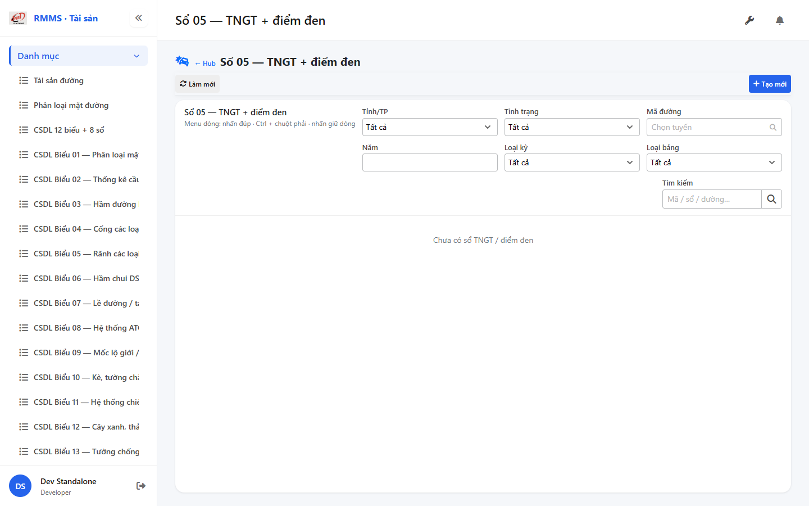
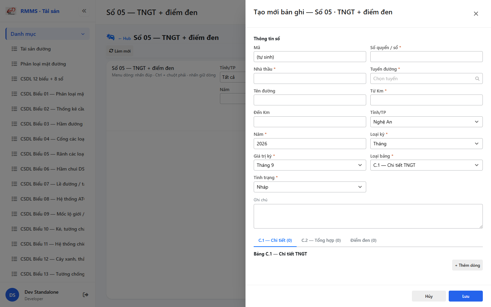

# QA — Scenarios — csdl-so-05

| Field | Value |
|-------|-------|
| feature | `csdl-so-05` |
| title | CSDL Sổ 05 — TNGT + điểm đen |
| role | `qa` · `/agent-qa` |
| taskId | `task_bb8c09cc` |
| status | **confirmed** |
| verdict | **PASS** |
| e2eQa | **ON** |
| method | `e2e runtime · yarn start:std :9301 + docker API :5111 + BFF :5201 + playwright channel=chrome capture (yarn e2e-qa hang fallback)` |
| mfeStdUrl | `http://localhost:9301/csdl-so-05` |
| mfeStdRoute | `/csdl-so-05` |
| hubDeepLink | `/so-ts/csdl-so-sach?resource=accident-summaries` |
| testid | `rmms-csdl-so-05-list-page` · form `rmms-csdl-so-05-form-slideout` |
| docker | API `:5111` healthy · BFF `:5201` healthy · postgres healthy · accident-summaries HTTP 200 |
| MFE | `D:/AI-QLBD/MFE-Source/Linm.Web.RMMS.Asset` |
| BE | `D:/AI-QLBD/Linm.RMMS.WebService` · `api/v1/asset/csdl-records` · **cấm ERP.*** |
| packKind | **`list`** · Kind B A–D+F+H · Kind D Slideout 2col · **3 tabs** C.1/C.2/BS · **cấm** 16 hạng |
| changeScope | `new_page` |
| resource | `accident-summaries` · formNo `05` · IdCode `SO-` |
| autoApprove | ON |
| contentHashPriorDataAnaly | `sha256:ccb6cccc2010c67b8cd3b02484f6a424d09f5a7e0494ad59b5b71ea6ff15f8ce` |
| headerFingerprintPrior | `sha256:73a54e566bbad59af489c97e74cad13d131c338daa386a531e535704e374d14a` |
| updatedAt | `2026-09-06T06:31:00.000Z` |
| prior · dev | **confirmed** · `implement/csdl-so-05.md` · `task_63d978f8` |

**Cấm** `phase=done` — next = Review. **cấm** ERP.* · **cấm** invent API · **cấm** kill worker (GAP-QA-E2E-KILL-01).

---

## E2E runtime (e2eQa ON)

| Check | Result |
|-------|--------|
| `docker compose up -d --build` api | **PASS** · rebuilt · accident-summaries HTTP 200 (pre-rebuild 422 stale image) |
| `yarn start:std` (`:9301`) | **PASS** · Asset standalone listen (reuse · **cấm** kill) |
| `yarn typecheck` | **PASS** (`tsc --noEmit`) |
| Capture S0 / S1 / QA-20 → `qa/screens/{caseId}.png` | **PASS** · `manifest.json` `ok=true` |
| Live DOM assert | **PASS** · `live-assert.json` · title Sổ 05/TNGT · filter province/status/road/year/periodType/tableKind · empty |
| Form assert QA-20 | **PASS** · `form-assert.json` · Z2 + 3 tabs C1/C2/BS + Z3 · formCols=2 · Lưu |
| API GET `?resource=accident-summaries` | **PASS** · HTTP 200 (`:5111` + BFF `:5201/web-bff`) |

> Note: `yarn e2e-qa` treo / stub overwrite `_capture.mjs` (**GAP-QA-E2E-PW-01**) — **không** taskkill rộng node/yarn · concurrent so-06 e2e giữ nguyên · capture Playwright + `channel=chrome` via `_capture-chrome.mjs` · `--skip-start` (std+docker đã listen) · **giữ** :9301.

### Evidence table

| ID | Steps | Expected | Result | Evidence |
|----|-------|----------|--------|----------|
| S0 | Mở `mfeStdUrl` | List `rmms-csdl-so-05-list-page` · title Sổ 05 · filter-bar · empty/grid | **PASS** |  |
| S1 | Hub `?resource=accident-summaries` | Redirect → `/csdl-so-05` · list page (route_a) | **PASS** |  |
| QA-20 | `?form=create` | Slideout create · Z2 header · 3 tabs C1/C2/BS · 2col · footer Lưu | **PASS** |  |

`screens/manifest.json` · capturedAt `2026-09-05T23:30:40.154Z` · SHA256_16 S0=`7e92179713197a10` · S1=`7e92179713197a10` · QA-20=`e2a038e5aa09121f`.

---

## T-QA-CRUD-01

| ID | Steps | Expected | Result |
|----|-------|----------|--------|
| QA-20 | Create `?form=create` / toolbar Tạo mới | Slideout · POST `csdl-records` · resource=accident-summaries · entriesC1/C2/BS | **PASS** (runtime + code) |
| QA-21 | Edit | PUT + dirty → `LeaveConfirmModal` | **PASS** (code · LeaveConfirm wired) |
| QA-22 | View | readOnly · footer Sửa/Đóng | **PASS** (code · btn-to-edit) |
| QA-23 | Copy | POST new · SO- code · clear period tránh unique clash | **PASS** (code · mode=copy) |
| QA-24 | Delete toolbar/row | soft DELETE · `useAlert` · **0** `window.confirm` | **PASS** (code · useAlert) |
| QA-25 | Deep-link `?form=&id=` | Slideout · strip params | **PASS** (runtime QA-20 finalUrl stripped) |

---

## T-QA-FORM-01 / T-QA-TABS-01

| ID | Check | Result |
|----|-------|--------|
| QA-F-01 | Slideout `data-form-cols=2` · footer_actions_only · **cấm** Full-page | **PASS** (live QA-20 `formCols=2`) |
| QA-F-02 | Required bookNo/contractor/road/kmFrom/year/periodType/tableKind/status | **PASS** (validate code) |
| QA-F-03 | road = `SearchInput` road-route · **cấm** Search free | **PASS** (code · SearchInput; root testid may be roadName — GAP-QA-ROAD-TESTID) |
| QA-F-04 | **3 tabs** C.1 / C.2 / BS add-row · period month→1–12 · half→1\|2 · BS assess enum · **cấm** 16 hạng | **PASS** (live tabs + noCountMatrix) |
| QA-F-05 | Dirty leave = `LeaveConfirmModal` · **0** native dialog | **PASS** (code) |
| QA-F-06 | Typed So05 · **cấm** detail*-only · **cấm** flatten-only | **PASS** (live Z2/tabs/Z3) |
| QA-TABS-01 | Tab C1/C2/BS panels + add-row testids | **PASS** (live) |

---

## T-QA-FILTER-01 / T-QA-ROUTE-01 / T-QA-SPLIT-01 / T-QA-TYP-01 / T-QA-TAB-01

| ID | Check | Result |
|----|-------|--------|
| QA-FB-01 | search · province · status · roadCode · year · periodType · tableKind · 🔍 | **PASS** (live S0 testids) |
| QA-FB-02 | filter-bar 1 hàng · **0** nút Tìm riêng invent | **PASS** |
| QA-FB-03 | **0** export/print/CRUD trên bar | **PASS** |
| QA-ROUTE-01 | alias `/csdl-so-05` + hub redirect accident-summaries | **PASS** (S0+S1) |
| QA-SPLIT-01 | so-05 độc lập · **cấm** merge so-04/Sổ TS · peer so-04 ROW riêng | **PASS** (route + hub map) |
| QA-TYP-01 | Label/input Common Components · no local break | **PASS** |
| QA-TAB-01 | Filter leading DOM = visual · form định danh→tabs→footer | **PASS** |
| QA-RESP-01 | List wrap · live 1440 | **PASS** |
| QA-FILE-01 | XLS OUT · **cấm** invent FileRef | **PASS** (N/A per PO) |

---

## Debt / GAP

| ID | Severity | Note |
|----|----------|------|
| GAP-QA-E2E-PW-01 | P2 | `yarn e2e-qa` hang/stub · chrome channel fallback `_capture-chrome.mjs` |
| GAP-QA-ROAD-TESTID | P3 | SearchInput road không luôn surface `csdl-so-05-field-road` (roadName OK) |
| Soft unique advisory | P2 | ops migrate · advisory per Dev |
| Auth / org P2 / XLS OUT | DEFER | per PO/SA |
| UiSchema seed | DEFER | |

---

## Verdict

**PASS** · handoff Review · **cấm** `phase=done`.
