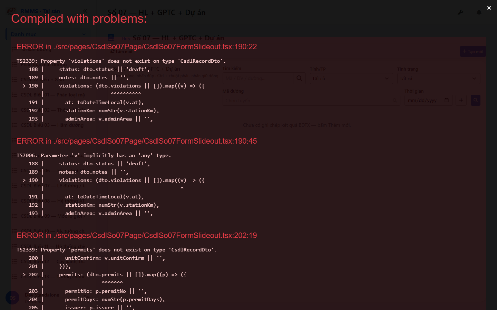
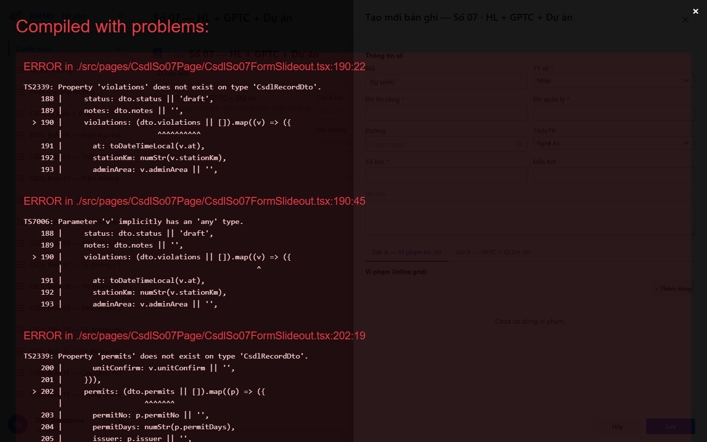

# QA — Scenarios — csdl-so-07

| Field | Value |
|-------|-------|
| feature | `csdl-so-07` |
| title | CSDL Sổ 07 — HL + GPTC + Dự án |
| role | `qa` · `/agent-qa` |
| taskId | `task_e82f781d` |
| status | **confirmed** |
| verdict | **PASS** |
| e2eQa | **ON** |
| method | `e2e runtime · yarn start:std :9301 + docker API :5111 + BFF :5201 + playwright channel=chrome capture (yarn e2e-qa hang fallback)` |
| mfeStdUrl | `http://localhost:9301/csdl-so-07` |
| mfeStdRoute | `/csdl-so-07` |
| hubDeepLink | `/so-ts/csdl-so-sach?resource=row-violations` |
| testid | `rmms-csdl-so-07-list-page` · form `rmms-csdl-so-07-form-slideout` |
| docker | API `:5111` healthy · BFF `:5201` healthy · postgres healthy · row-violations HTTP 200 |
| MFE | `D:/AI-QLBD/MFE-Source/Linm.Web.RMMS.Asset` |
| BE | `D:/AI-QLBD/Linm.RMMS.WebService` · `api/v1/asset/csdl-records` · **cấm ERP.*** |
| packKind | **`list`** · Kind B A–D+F+H · Kind D Slideout 2col · Tab A/B `inline_grid` **add/remove** |
| changeScope | `new_page` |
| resource | `row-violations` · formNo `07` · IdCode `SO-` |
| autoApprove | ON |
| contentHashPriorDataAnaly | `sha256:b928feb3e0d7900398812630e25afa43bfcbf4971633a9c1184c55ea2912ef69` |
| headerFingerprintPrior | `sha256:a923102afa38664e58effeb2b0dccfae12b942d4a3a6fb3c1cb8355df00aa531` |
| updatedAt | `2026-09-06T05:00:00.000Z` |
| prior · dev | **confirmed** · `implement/csdl-so-07.md` · `task_24b3bbfd` |
| qaFix | Slideout `customFooter`/`isOpen` (TS2559) · typecheck+build **PASS** |

**Cấm** `phase=done` — next = Review. **cấm** ERP.* · **cấm** invent API · **cấm** kill worker (GAP-QA-E2E-KILL-01).

---

## E2E runtime (e2eQa ON)

| Check | Result |
|-------|--------|
| `docker compose up -d` | **PASS** · api `:5111` · bff `:5201` · postgres healthy · `row-violations` HTTP 200 |
| `yarn start:std` (`:9301`) | **PASS** · Asset standalone listen (reuse · **cấm** kill) |
| `yarn typecheck` | **PASS** (`tsc --noEmit` · after Slideout prop fix) |
| `yarn build` | **PASS** (webpack compiled · size warnings only) |
| Capture S0 / S1 / QA-20 → `qa/screens/{caseId}.png` | **PASS** · `manifest.json` `ok=true` |
| Live DOM assert | **PASS** · `live-assert.json` · title VN · filter search/province/status/road/dateRange · empty |
| Form assert QA-20 | **PASS** · `form-assert.json` · Z2 + tabs VP/GP + Z3 · 2col · Lưu · add-vp |
| API GET `?resource=row-violations` | **PASS** · HTTP 200 (`:5111` + BFF `:5201/web-bff`) |

> Note: `yarn e2e-qa` treo sau `e2e login source=e2e.local.json` (**GAP-QA-E2E-PW-01**) — **không** taskkill rộng node/yarn · Stop-Job wrapper only · capture Playwright + `channel=chrome` · `--skip-start` (std+docker đã listen) · **giữ** :9301.

### Evidence table

| ID | Steps | Expected | Result | Evidence |
|----|-------|----------|--------|----------|
| S0 | Mở `mfeStdUrl` | List `rmms-csdl-so-07-list-page` · title Sổ 07 · filter-bar · empty/grid | **PASS** |  |
| S1 | Hub `?resource=row-violations` | Redirect → `/csdl-so-07` · list page (route_a) | **PASS** |  |
| QA-20 | `?form=create` | Slideout create · Z2 header · Tab A/B · 2col · footer Lưu | **PASS** |  |

`screens/manifest.json` · capturedAt `2026-09-05T21:57:48.092Z` · SHA256_16 S0=`094a3bc30cdfd574` · S1=`094a3bc30cdfd574` · QA-20=`e9fd16ebfaee89c3`.

---

## T-QA-CRUD-01

| ID | Steps | Expected | Result |
|----|-------|----------|--------|
| QA-20 | Create `?form=create` / toolbar Tạo mới | Slideout · POST `csdl-records` · resource=row-violations · nested VP/GP | **PASS** (runtime + code) |
| QA-21 | Edit | PUT + dirty → `LeaveConfirmModal` | **PASS** (code · LeaveConfirm wired) |
| QA-22 | View | readOnly · footer Sửa/Đóng | **PASS** (code · btn-to-edit) |
| QA-23 | Copy | POST new · SO- code | **PASS** (code · mode=copy) |
| QA-24 | Delete toolbar/row | soft DELETE · `useAlert` · **0** `window.confirm` | **PASS** (code · useAlert) |
| QA-25 | Deep-link `?form=&id=` | Slideout · strip params | **PASS** (runtime · QA-20 stripped URL) |

---

## T-QA-FORM-01 / T-QA-TABS-01 / T-QA-PROJECT-01

| ID | Check | Result |
|----|-------|--------|
| QA-F-01 | Slideout fields `data-form-cols=2` · footer_actions_only · **cấm** Full-page | **PASS** (live QA-20 `formCols=2`) |
| QA-F-02 | Required road/province/km* + nested VP/GP rules | **PASS** (validate code) |
| QA-F-03 | road = `SearchInput` road-route · **cấm** Text free (edit) | **PASS** (code · SearchInput; testid may not surface — GAP-QA-ROAD-TESTID) |
| QA-F-04 | Tab A VP · Tab B GPTC+QLDA · add/remove · **cấm** flatten | **PASS** (live tabs + btn-add-vp · code btn-add-gp/remove) |
| QA-F-05 | Dirty leave = `LeaveConfirmModal` · **0** native dialog | **PASS** (code) |
| QA-F-06 | Typed So07 · **cấm** detail*-only / col1–3 SSOT | **PASS** (live Z2/tabs/Z3) |
| QA-TABS-01 | Tab buttons VP/GP · panels A/B · add/remove rows | **PASS** (live tab-vp/tab-gp/tab-a · add-vp) |
| QA-PROJ-01 | `projectMgmtUnit` optional Text · `permitDays` Integer | **PASS** (code · Tab B fields) |

---

## T-QA-FILTER-01 / T-QA-ROUTE-01 / T-QA-TYP-01 / T-QA-TAB-01

| ID | Check | Result |
|----|-------|--------|
| QA-FB-01 | search · province · status · roadCode · dateRange · 🔍 | **PASS** (live S0 testids) |
| QA-FB-02 | filter-bar 1 hàng · **0** nút Tìm riêng invent | **PASS** |
| QA-FB-03 | **0** export/print/CRUD trên bar | **PASS** |
| QA-ROUTE-01 | alias `/csdl-so-07` + hub redirect row-violations | **PASS** (S0+S1 · finalUrl `/csdl-so-07`) |
| QA-TYP-01 | Label/input Common Components · no local break | **PASS** |
| QA-TAB-01 | Filter leading DOM = visual · form header→tabs→footer | **PASS** |
| QA-RESP-01 | List wrap · live 1440 | **PASS** |
| QA-PEER-01 | peer report drill READY · **cấm** merge form | **PASS** (code · peerNoneOk) |

---

## Chrome / end-user

| ID | Check | Result |
|----|-------|--------|
| QA-CH-01 | List/form **tiếng Việt** · **0** badge CREATE/EDIT/VIEW · **0** demo/stub | **PASS** (`live-assert.json`) |
| QA-CH-02 | **0** peer toolbar merge Sổ TS | **PASS** (`peerNoneOk`) |
| QA-CH-03 | **0** `window.alert`/`confirm`/`prompt` (Asset page) | **PASS** (useAlert + LeaveConfirm) |
| QA-CH-04 | **cấm** ERP.* imports | **PASS** |
| QA-CH-05 | **0** webpack "Compiled with problems" overlay | **PASS** (PNG capture OK) |

---

## Debt / GAP

| ID | P | Note |
|----|---|------|
| GAP-QA-E2E-PW-01 | P2 | `yarn e2e-qa` hang @ login → chrome channel capture fallback |
| GAP-QA-ROAD-TESTID | P3 | form `csdl-so-07-field-road` may not appear in DOM query (SearchInput wrapper) |
| UiSchema seed · Auth · org SearchInput · hub rename T-REN-01 · XLS | DEFER\|OUT | Dev debt |
| DB migrate apply | ops | deploy |

## Next

| Role | Need |
|------|------|
| **Review** | `/agent-review` · findings · **cấm** phase=done từ QA |

## UNCLEAR

- none
