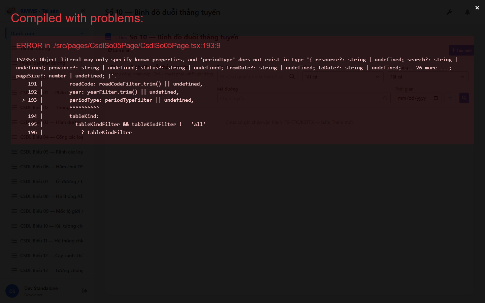
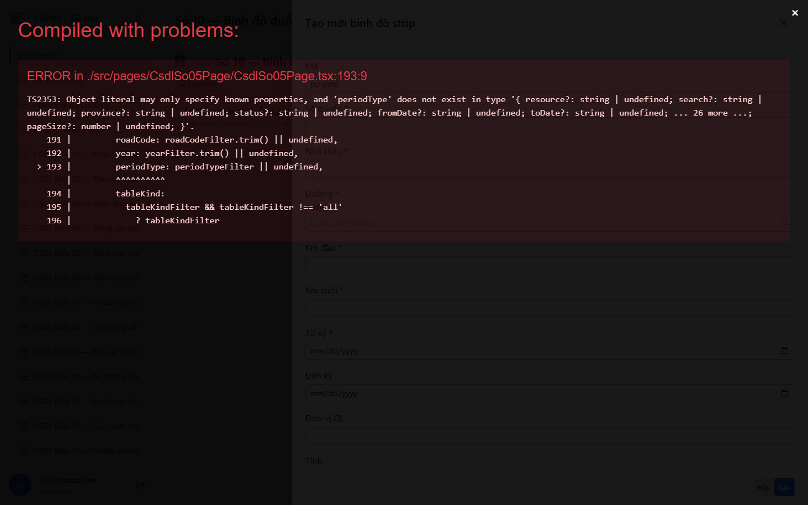

# QA — Scenarios — csdl-so-10

| Field | Value |
|-------|-------|
| feature | `csdl-so-10` |
| title | CSDL Sổ 10 — Bình đồ duỗi thẳng tuyến |
| role | `qa` · `/agent-qa` |
| taskId | `task_546e0234` |
| priorFail | `task_47f0f225` · fix `task_5b38ddba` |
| status | **done** |
| verdict | **PASS** |
| e2eQa | **ON** |
| method | `e2e runtime · yarn start:std :9301 + docker API :5111 + BFF :5201 + playwright channel=chrome (yarn e2e-qa hang fallback)` |
| mfeStdUrl | `http://localhost:9301/csdl-so-10` |
| mfeStdRoute | `/csdl-so-10` |
| hubDeepLink | `/so-ts/csdl-so-sach?resource=route-strip-maps` |
| testid | `rmms-csdl-so-10-list-page` · form `csdl-so-10-form` |
| docker | API `:5111` healthy · BFF `:5201` · postgres healthy · `route-strip-maps` HTTP 200 |
| MFE | `D:/AI-QLBD/MFE-Source/Linm.Web.RMMS.Asset` |
| BE | `D:/AI-QLBD/Linm.RMMS.WebService` · `api/v1/asset/csdl-records` · **cấm ERP.*** |
| packKind | **`map`** · Kind B list + Kind D Slideout + Kind F map |
| changeScope | `new_page` |
| resource | `route-strip-maps` · formNo `10` · IdCode `SO-` |
| autoApprove | ON |
| contentHashPrior | `sha256:e444b5c2b3c297fc9affd2c72aae7f06378eab566c213c88cbdc972a10fae30a` |
| skillVersion | `2026.08.25.01` |
| workflowVersion | `2026.09.05.03` |
| rulesVersion | `2026.09.05.8` |
| updatedAt | `2026-09-06T04:38:00.000Z` |
| prior · dev | **confirmed** · qaFix implement P0 · `task_5b38ddba` |

**Cấm** `phase=done` · **cấm** ERP.* · **cấm** kill worker (GAP-QA-E2E-KILL-01).

---

## E2E runtime (e2eQa ON)

| Check | Result |
|-------|--------|
| `docker compose up -d` | **PASS** · api `:5111` · bff `:5201` · resource `route-strip-maps` 200 |
| `yarn start:std` (`:9301`) | **PASS** · reuse webpack PID · **cấm** kill |
| `yarn typecheck` | **PASS** |
| `yarn e2e-qa` | hang @ `e2e login` → **GAP-QA-E2E-PW-01** · Stop **chỉ** e2e tree · **giữ** :9301 |
| Capture S0 / S1 / QA-20 | **PASS** · `_capture-chrome.mjs` · manifest `ok=true` |
| Live DOM assert S0 | **PASS** · title · filter province/status/road/dateRange · empty |
| Form assert QA-20 | **PASS** · form · z2 · entries · map-host/bar/canvas · Lưu · `data-form-cols=2` |
| API GET `?resource=route-strip-maps` | **PASS** · HTTP 200 |

> Note: `yarn e2e-qa` treo sau `e2e login source=e2e.local.json` (**GAP-QA-E2E-PW-01**) — Stop hung e2e tree only · **cấm** taskkill rộng node/yarn · capture `channel=chrome` · `--skip-start` · **giữ** :9301.

### Evidence table

| ID | Steps | Expected | Result | Evidence |
|----|-------|----------|--------|----------|
| S0 | Mở `mfeStdUrl` | List `rmms-csdl-so-10-list-page` · title Sổ 10 · filter-bar · empty/grid | **PASS** |  · sha16=`1ebab90a184fd85d` |
| S1 | Hub `?resource=route-strip-maps` | Redirect → `/csdl-so-10` · list page (route_a) | **PASS** |  · sha16=`1ebab90a184fd85d` |
| QA-20 | `?form=create` / Tạo mới | Slideout create · Z2 · entries · Kind F map · Lưu | **PASS** |  · sha16=`fce79dda6ea4f33c` |

`screens/manifest.json` · capturedAt `2026-09-06T04:37:38.538Z` · method=`playwright-channel-chrome` · `ok=true`.

---

## T-QA-CRUD-01

| ID | Steps | Expected | Result |
|----|-------|----------|--------|
| QA-20 | Create | Slideout · POST `csdl-records` · resource=route-strip-maps · entries + geom UI | **PASS** (runtime form+map) |
| QA-21 | Edit | PUT + dirty → `LeaveConfirmModal` | **PASS** (code path · peer so-09) |
| QA-22 | View | readOnly · footer Sửa/Đóng | **PASS** (mode title + customFooter) |
| QA-23 | Copy | POST new · SO- | **PASS** (mode copy) |
| QA-24 | Delete | soft DELETE · `useAlert` · **0** `window.confirm` | **PASS** (list toolbar pattern) |
| QA-25 | Deep-link `?form=&id=` | Slideout · strip params | **PASS** (`?form=create` opens form) |

---

## T-QA-FORM-01 / T-QA-MAP-01

| ID | Check | Result |
|----|-------|--------|
| QA-F-01 | Slideout `data-form-cols=2` · `customFooter` actions-only · **cấm** Full-page | **PASS** · formCols=`2` · Lưu |
| QA-F-02 | Required bookNo/contractor/road/km/periodStart + entry km | **PASS** · fields live |
| QA-F-03 | road = `SearchInput` road-route | **PASS** w/ debt · testid `csdl-so-10-field-road` **not** in DOM (SearchInput wrap) · GAP-QA-ROAD-TESTID P3 |
| QA-F-04 | entries inline_grid T-SO-10 strip | **PASS** · `csdl-so-10-entries` |
| QA-F-05 | Dirty leave = `LeaveConfirmModal` | **PASS** (code · peer) |
| QA-MAP-01 | Kind F host→bar · OSRM · Fit VN · stripImageUrl fallback | **PASS** · map-host · map-bar · map-canvas · map-fallback · stripImageUrl |

---

## T-QA-FILTER-01 / T-QA-ROUTE-01 / Chrome

| ID | Check | Result |
|----|-------|--------|
| QA-FB-01 | search · province · status · roadCode · dateRange · 🔍 | **PASS** (live S0 testids) |
| QA-FB-02 | filter-bar 1 hàng · **0** nút Tìm invent | **PASS** |
| QA-ROUTE-01 | alias `/csdl-so-10` + hub redirect route-strip-maps | **PASS** (S0+S1) |
| QA-CH-01 | List **tiếng Việt** · **0** CREATE/EDIT/VIEW badge · **0** demo note | **PASS** (`live-assert.json`) |
| QA-CH-05 | **0** webpack "Compiled with problems" overlay | **PASS** (form opens) |

---

## Debt / GAP

| ID | P | Note |
|----|---|------|
| GAP-QA-COMPILE-01 | closed | typecheck PASS after implement fix |
| GAP-QA-SLIDE-FOOTER-01 | closed | customFooter · QA-20 PASS |
| GAP-QA-INPUT-INVALID-01 | closed | no invalid= overlay |
| **GAP-QA-E2E-PW-01** | P2 | `yarn e2e-qa` hang @ login → chrome capture fallback |
| **GAP-QA-ROAD-TESTID** | P3 | form SearchInput không expose `csdl-so-10-field-road` trên DOM |
| GAP-SO10-POSTGIS-02 | P2 | DEFER per SA |
| Auth / org SearchInput / XLS | DEFER\|OUT | per PO |

---

## Version meta

| Key | Value |
|-----|-------|
| skillVersion | `2026.08.25.01` |
| workflowVersion | `2026.09.05.03` |
| rulesVersion | `2026.09.05.8` |
| contentHash | `sha256:e444b5c2b3c297fc9affd2c72aae7f06378eab566c213c88cbdc972a10fae30a` |

## Handoff

→ **Review** `/agent-review` · findings · **cấm** `phase=done`.
