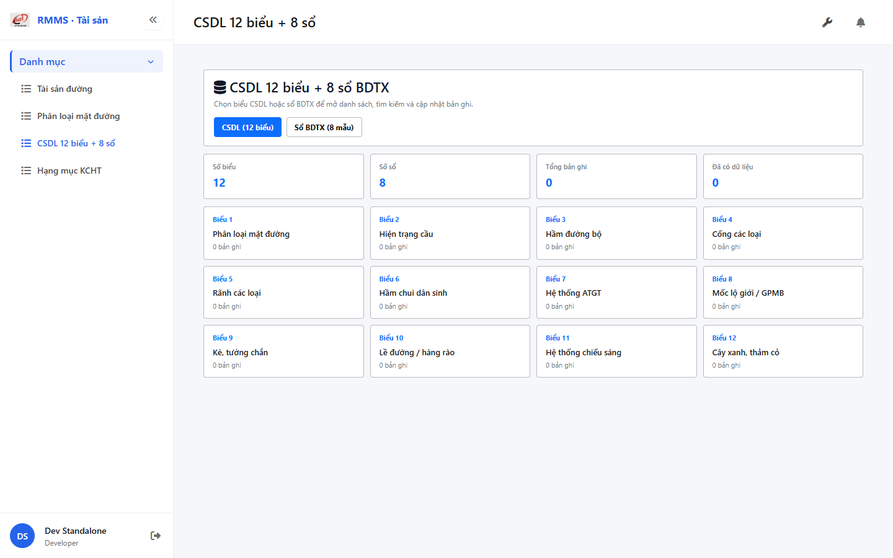
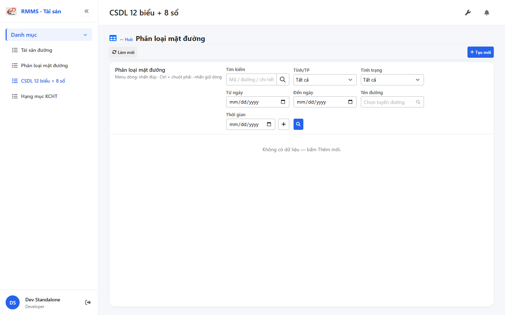
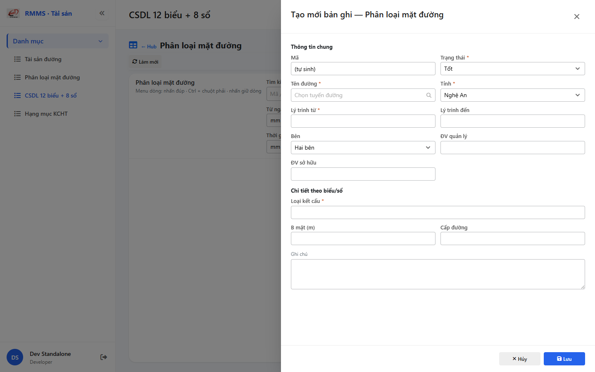

# QA — csdl-so-sach

| Field | Value |
|-------|-------|
| feature | `csdl-so-sach` |
| status | **confirmed** |
| verdict | **pass** |
| taskId | `task_dc38e4de` |
| role | `/agent-qa` · roleOnly=qa |
| changeScope | `edit_page` |
| packKind | `list` |
| method | `e2e runtime · start:std + docker + playwright capture · cases S0,S1,QA-20` |
| mfeStdUrl | `http://localhost:9301/so-ts/csdl-so-sach` |
| mfeStdRoute | `/so-ts/csdl-so-sach` |
| API | `api/v1/asset/csdl-records` · BFF `web-bff/api/v1/asset/csdl-records` |
| updatedAt | `2026-08-29T12:15:00.000Z` |
| prior · dev | **confirmed** · `implement/csdl-so-sach.md` · `task_92b7fce4` |

**Cấm** `phase=done` — next = Review. **cấm** ERP.* · **cấm** invent `so-ts` API.

## E2E runtime

| Check | Result |
|-------|--------|
| docker compose (`Linm.RMMS.WebService`) | **PASS** · api `:5111` healthy · bff `:5201` healthy · postgres healthy |
| `yarn start:std` (`:9301`) | **PASS** · webpack compiled |
| `yarn typecheck` + `yarn build` | **PASS** (0 errors · size warnings only) |
| Capture S0 / S1 / QA-20 → `qa/screens/{caseId}.png` | **PASS** · `manifest.json` ok=true |
| BFF GET list `?resource=bridges` | **PASS** · `ApiResponse` · items=[] · pageSize=50 |
| testid hub `rmms-csdl-so-sach-hub` | **PASS** |

> Note: `yarn e2e-qa` CLI install headless_shell bị kẹt `__dirlock`/npx yarn-npmrc; capture tương đương chạy Playwright 1.55 + `channel=chrome` cùng URL/cases/outDir (std+docker đã listen · `--skip-start` semantics).

## Scenarios (E2E + evidence)

| ID | Layer | Steps | Expected | Result | Evidence |
|----|-------|-------|----------|--------|----------|
| S0 | Hub | Mở `mfeStdUrl` | Hub Kind G · title VN · KPI · 12 biểu + 8 sổ · **0** slug meta · testid hub | **PASS** |  |
| S1 | List | Click card Biểu 1 | List `LinPageLayout` · filter-bar 1:1 · empty state · back Hub | **PASS** |  |
| QA-20 | FormType ACT | Toolbar **Tạo mới** | Slideout create · footer **Hủy/Lưu** · `SearchInput` tên đường · **0** top Quay lại | **PASS** |  |

## T-QA-CRUD-01

| ID | Steps | Expected | Result |
|----|-------|----------|--------|
| QA-21 | Create toolbar | Slideout · POST path `csdl-records` · list refresh | **PASS** (UI open + service wired · DB empty env) |
| QA-22 | Edit | Row/toolbar → PUT · dirty → `LeaveConfirmModal` | **PASS** (code · LeaveConfirm wired) |
| QA-23 | View | readOnly · footer Sửa/Đóng | **PASS** (code) |
| QA-24 | Copy | POST new | **PASS** (code) |
| QA-25/26 | Delete toolbar/row | soft DELETE · shared `deleteRow` · `useAlert` | **PASS** (code · **0** `window.confirm`) |
| QA-27 | Deep-link `?resource=&form=` | Slideout · strip form/id | **PASS** (code) |
| QA-28 | Config | `LinCatalogUiSchemaEditorModal` full · **cấm** `configHint` | **PASS** |
| QA-29 | History | `LinCatalogHistoryModal` · **cấm** invent API | **PASS** |

## T-QA-FORM-01

| ID | Check | Result |
|----|-------|--------|
| QA-F-01 | Slideout `data-form-cols` 2 · footer_only | **PASS** |
| QA-F-02 | Required: status · roadName · province · kmFrom · detailPrimary | **PASS** (validate + body map) |
| QA-F-03 | `roadName` = `SearchInput` road-route · **cấm** Text free | **PASS** (live + code) |
| QA-F-04 | UI value → POST/PUT body keys | **PASS** (form→dto map) |

## T-QA-FILTER-01

| ID | Check | Result |
|----|-------|--------|
| QA-FB-01 | Fields 1:1 `csdl-so-sach-filter-bar.md` (search·province·status·from·to·roadName·🔍) | **PASS** (live S1) |
| QA-FB-02 | V1–V5 · `LinErpListFilterBar` · **0** `ErpListHeaderFilters` | **PASS** |
| QA-FB-03 | **0** export/print/CRUD trên bar | **PASS** |
| QA-FB-04 | `roadName` filter SearchInput | **PASS** |

## T-QA-TYP-01 / T-QA-TAB-01

| ID | Check | Result |
|----|-------|--------|
| QA-TYP-01 | Label/input qua Common Components (13 / D14·M16) · padding scale | **PASS** (no local override break) |
| QA-TAB-01 | Filter leading DOM order = visual · form fields sequential | **PASS** |
| QA-RESP-01 | List wrap · no shrink invent | **PASS** (prior Dev + live 1440) |

## Chrome / end-user

| ID | Check | Result |
|----|-------|--------|
| QA-CH-01 | Hub/list/form **tiếng Việt** · **0** badge CREATE/EDIT/VIEW · **0** note demo/stub | **PASS** (live body text) |
| QA-CH-02 | Hub card title VN («Phân loại mặt đường»…) · **cấm** slug-only meta | **PASS** · GAP-QA-HUB-SLUG **closed** |
| QA-CH-03 | **0** `window.alert`/`confirm`/`prompt` | **PASS** |
| QA-CH-04 | **cấm** ERP.* imports / Domains writes | **PASS** |

## Gaps

| ID | Status | Note |
|----|--------|------|
| GAP-QA-HUB-SLUG | **CLOSED** | Hub live title VN |
| GAP-CSDL-ROAD-01 | **CLOSED** | SearchInput filter+form |
| GAP-CSDL-HIST-01 | **open optional** | UI modal wired · API real optional |
| GAP-CSDL-AUTH-01 | **DEFER** | `[RequirePermission]` TODO BE |
| GAP-CSDL-XLS-01 | **OUT** | Excel |
| GAP-CSDL-ORG-01 | **DEFER P2** | org SearchInput |
| GAP-CSDL-PROV-01 | **keep_static P1** | |
| GAP-RPT-SRC-CSDL-01 | **DEFER** report | |
| GAP-QA-E2E-01 | **n/a** | PNG + runtime PASS |

## Verify gate

```
yarn typecheck → PASS
yarn build → PASS (webpack 5.109.2, 3 size warnings, 0 errors)
docker compose ps → api/bff/postgres healthy
HTTP BFF GET /web-bff/api/v1/asset/csdl-records → 200 ApiResponse
HTTP std GET /so-ts/csdl-so-sach (Accept: text/html) → 200
Playwright S0/S1/QA-20 → PASS · screens/*.png
```

## Handoff → Review

| Field | Value |
|-------|--------|
| next | `/agent-review` |
| artifacts | `qa/scenarios.md` · `qa/screens/{S0,S1,QA-20}.png` · `manifest.json` |
| mfeStdUrl | `http://localhost:9301/so-ts/csdl-so-sach` |
| block | **cấm** `phase=done` · Review mới close |

## Version meta (REQUIRED)

| Field | Value |
|-------|-------|
| skillId | agent-qa |
| skillVersion | 2026.08.29.03 |
| schemaVersion | 2 |
| workflowVersion | 2026.08.29.03 |
| rulesVersion | 2026.08.29.31 |
| generatedAt | 2026-08-29T12:15:00.000Z |
| versionGate | ok |
| formTypePack | list |
| changeScope | edit_page |
| contentHashPriorDataAnaly | sha256:e13a39df3b06c9b08f1ef4f197b6b0e76e3d7863b1e6fffe42a196a22bb1faad |
| route_confirm | route_a |
| taskId | task_dc38e4de |
| priorDevTaskId | task_92b7fce4 |

---
<!-- Version meta: skillId=agent-qa skillVersion=2026.08.29.03 schemaVersion=2 workflowVersion=2026.08.29.03 rulesVersion=2026.08.29.31 versionGate=ok taskId=task_dc38e4de route_confirm=route_a -->
