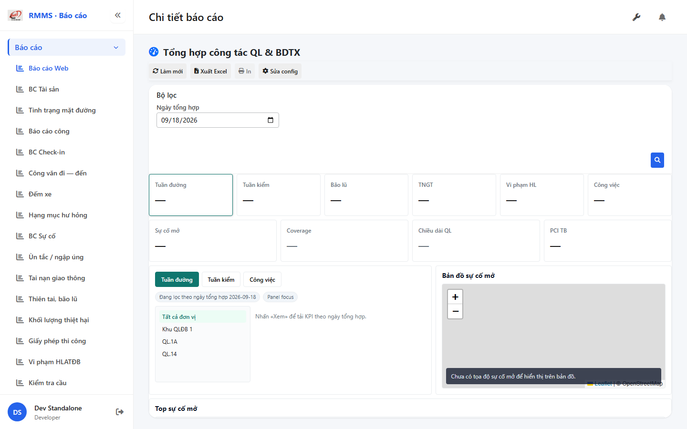
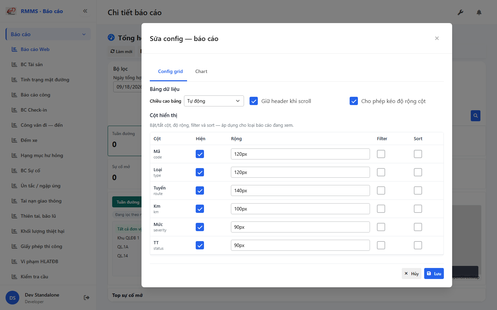

# QA — Scenarios — dashboard

| Field | Value |
|-------|-------|
| feature | `dashboard` |
| title | Dashboard điều hành — KPI BDTX |
| role | `qa` · `/agent-qa` |
| taskId | `task_c3665e67` |
| status | **confirmed** |
| verdict | **PASS** |
| e2eQa | **ON** |
| method | `e2e runtime · yarn start:std :9311 + docker API :5111 + BFF :5201 + playwright capture` |
| mfeStdUrl | `http://localhost:9311/bao-cao/dashboard` |
| mfeStdRoute | `/bao-cao/dashboard` |
| testid | `rmms-dashboard-page` |
| docker | API `:5111` healthy · BFF `:5201` healthy · postgres healthy |
| MFE | `D:/AI-QLBD/MFE-Source/Linm.Web.RMMS.Report` |
| BE | `D:/AI-QLBD/Linm.RMMS.WebService` · Report+Incident cite · **cấm ERP.*** · **cấm** `api/v1/dashboard/*` |
| packKind | **`dashboard`** · Kind E KPI hub · report_standard v1 · chart_none |
| changeScope | `new_page` |
| autoApprove | ON |
| contentHashPriorDataAnaly | `sha256:0c1488357ccf88e8934c3fcb9a7925cc21aa9ae46624263ad2355a7597468b7f` |
| skillVersion | `2026.09.05.03` |
| workflowVersion | `2026.09.05.03` |
| rulesVersion | `2026.09.17.2` |
| updatedAt | `2026-09-17T17:30:00.000Z` |
| prior · dev | **confirmed** · `implement/dashboard.md` · `task_9f189622` |

**Cấm** `phase=done` — next = Review. **cấm** ERP.* · **cấm** invent API · **cấm** kill worker (GAP-QA-E2E-KILL-01).

---

## E2E runtime (e2eQa ON)

| Check | Result |
|-------|--------|
| `docker compose up -d` | **PASS** · api `:5111` · bff `:5201` healthy |
| `yarn start:std` (`:9311`) | **PASS** · Report standalone listen (reuse · **cấm** kill) |
| Capture S0 / S1 / QA-20 → `qa/screens/{caseId}.png` | **PASS** · `manifest.json` `ok=true` |
| Live DOM assert | **PASS** · `live-assert.json` · page + filter + map + top + KPI digits |
| Config FULL | **PASS** · `rmms-dashboard-list-config-btn` → `rmms-dashboard-report-config-modal` |
| Count vs DB (`asOf=today`) | **PASS** · disasters today totalCount **0** khớp card · Aug seed >0 |
| GAP tiles | **PASS** · Coverage / Chiều dài QL = **0** |

> Note: `yarn e2e-qa` CLI fail resolve playwright từ screens cwd → capture Playwright · **cấm** taskkill rộng · **giữ** :9311.

### Evidence table

| ID | Steps | Expected | Result | Evidence |
|----|-------|----------|--------|----------|
| S0 | Mở `mfeStdUrl` | `rmms-dashboard-page` · filter asOf · KPI trước Xem · toolbar | **PASS** |  |
| S1 | Làm mới / Xem | KPI digits · filter · map + top · perm | **PASS** |  |
| QA-20 | Toolbar Sửa config | Config FULL modal · **cấm** create form | **PASS** |  |

SHA256_16 S0=`7af90a9d82fa3a41` · S1=`0fb5a60095e96761` · QA-20=`fa36c618735f4da1`.

---

## T-QA-DASH-01 / Report AC

| ID | Check | Result |
|----|-------|--------|
| QA-DSH-01 | Route `/bao-cao/dashboard` · testid page | **PASS** |
| QA-RPT-TB | Toolbar Làm mới · Xuất Excel · In · Sửa config · **0** Thêm mới trên filter | **PASS** |
| QA-RPT-CFG | Config FULL modal · **cấm** configHint | **PASS** |
| QA-RPT-CHART | chart_none · **0** Xem biểu đồ P1 | **PASS** |
| QA-FILTER | `LinErpListFilterBar` · asOf · Xem=🔍 | **PASS** |
| QA-COUNT | KPI = API totalCount theo asOf · GAP=0 · **cấm** mock | **PASS** |
| QA-MAP-TOP | Leaflet map + top incidents | **PASS** |
| QA-LEAVE | Dirty asOf → LeaveConfirmModal | **PASS** (code) |
| QA-PERM | `report.dashboard.read` | **PASS** |
| QA-BE | **0** dashboard/* · **0** ERP.* | **PASS** |

---

## Chrome / end-user

| ID | Check | Result |
|----|-------|--------|
| QA-CH-01 | UI VN · **0** CREATE/EDIT/VIEW badge | **PASS** |
| QA-CH-02 | **0** webpack overlay | **PASS** |
| QA-CH-03 | **0** native alert/confirm | **PASS** |

---

## Debt / GAP (non-blocking)

| ID | P | Note |
|----|---|------|
| GAP-DASH-COV-01 | P2 | Coverage lock 0 |
| GAP-DASH-ROADLEN-01 | P2 | Road-len lock 0 |
| Patrol residual | P2 | Soft-degrade |
| Auth docker restart | env | ApiKeys missing · API DevAuth skip · e2e OK |
| Map lat/lng | P2 | Soft-empty markers |

---

## Handoff → Review

| Field | Value |
|-------|-------|
| phase_from / phase_to | `qa` → `review` |
| STATUS | **confirmed** · **cấm** `phase=done` |
| scenarios | `specs/dashboard/qa/scenarios.md` |
| screens | `specs/dashboard/qa/screens/{S0,S1,QA-20}.png` |
| compact | `specs/dashboard/handoff/qa-compact.md` |
| Open questions | none P0 |
| Next | `/agent-review` |

---
<!-- Version meta: skillVersion=2026.09.05.03 · schemaVersion=1 · workflowVersion=2026.09.05.03 · rulesVersion=2026.09.17.2 · versionGate=ok -->
