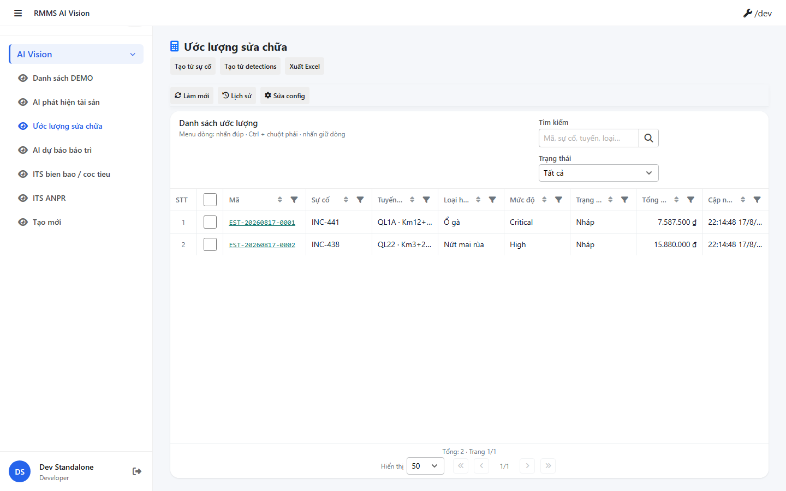
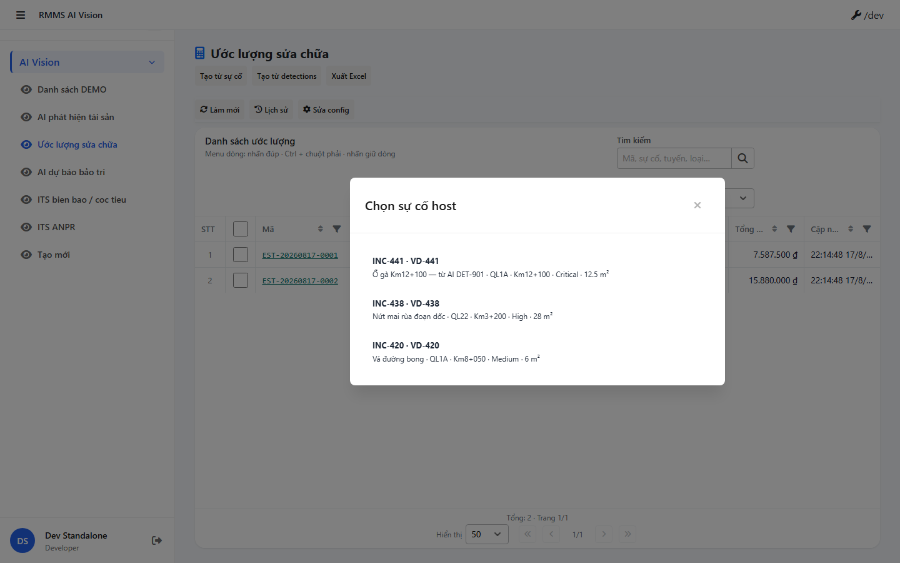
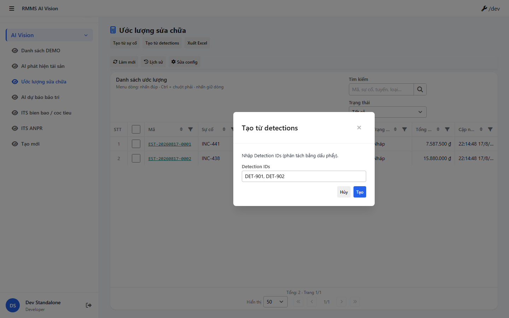
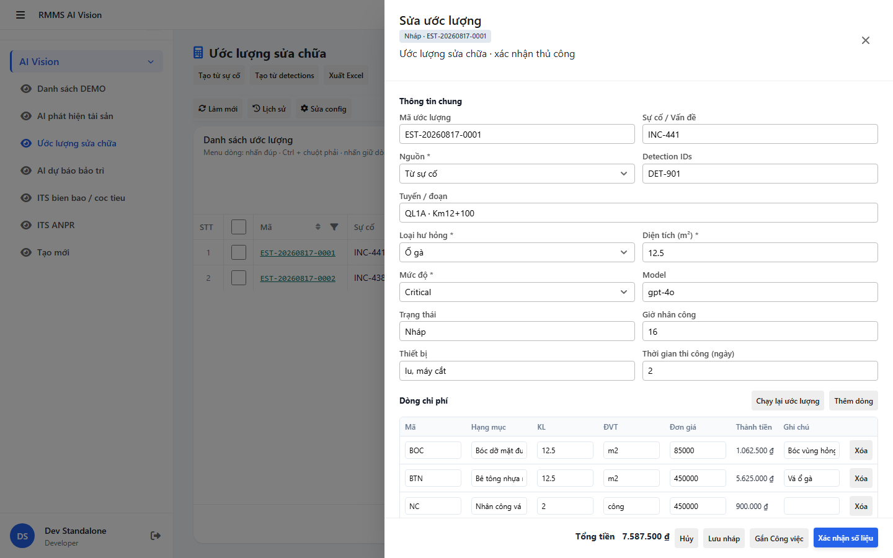
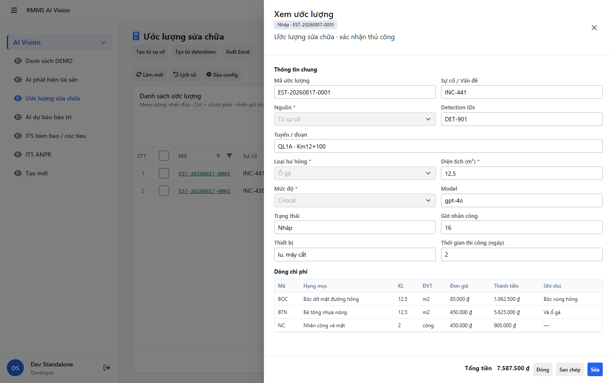
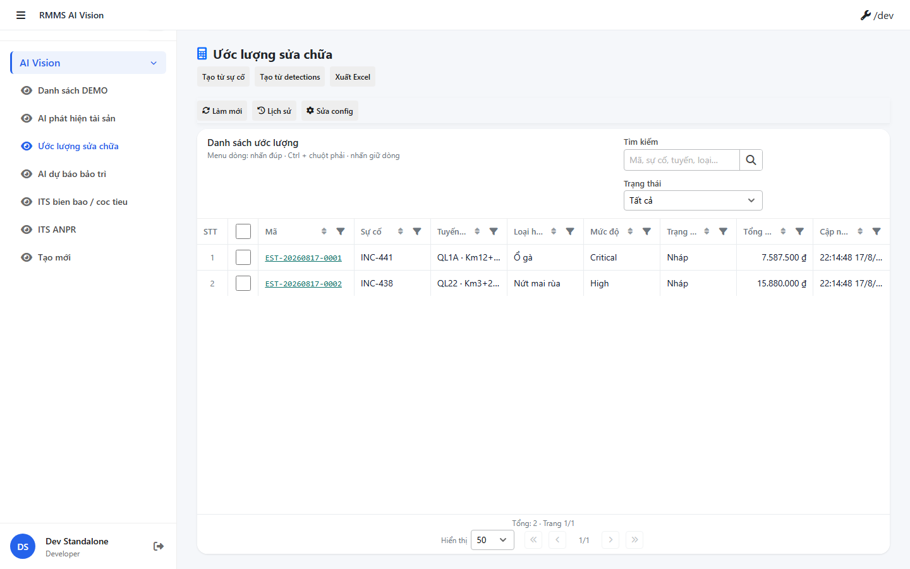
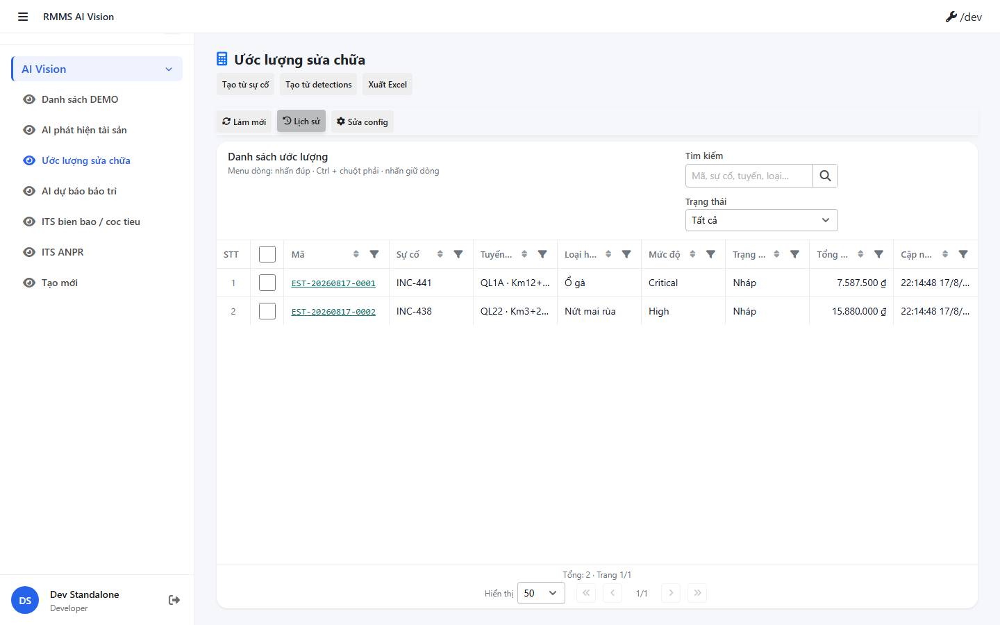
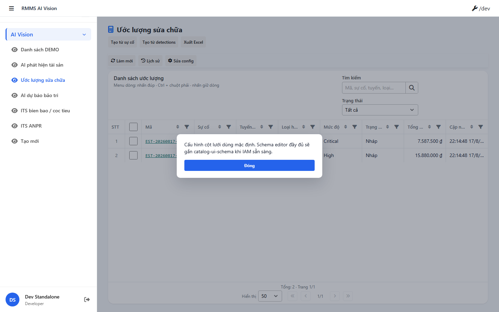

# QA — scenarios — estimate

| Field | Value |
|-------|-------|
| feature | `estimate` |
| status | `blocked` |
| role | `qa` · `/agent-qa` |
| taskId | `task_482fbe3a` |
| pack | T-QA-CRUD-01 · T-QA-LEAVE-01 · FormType ai Kind B+D · Config **FULL** |
| e2eQa | **ON** |
| method | `e2e runtime · start:std + docker + yarn e2e-qa/extended capture` |
| mfe | `D:/AI-QLBD/MFE-Source/Linm.Web.RMMS.AiVision` |
| backend | `D:/AI-QLBD/Linm.RMMS.WebService` · AiVision · **no ERP.*** |
| mfeStdRoute | `/ai-vision/estimate` |
| mfeStdUrl | `http://localhost:9303/ai-vision/estimate` |
| demo | `Linm.RMMS.Demo/src/demo/ai-vision/estimate.html` |
| skillVersion | `2026.08.16.02` |
| schemaVersion | `2` |
| workflowVersion | `2026.08.16.02` |
| versionGate | `ok` |
| updatedAt | `2026-08-17T15:20:00.000Z` |

## Preconditions

- AiVision MFE: `yarn start:std` · port **9303** · open `mfeStdUrl` — **listen OK**
- Docker: `linm-rmms-api` + `linm-rmms-bff` + postgres — **healthy**
  - BFF `:5201` · API host port **`:5111`** (`.env` `API_HOST_PORT=5111`; compose default 5101) · MFE → BFF
- Migration `Schema_RmmsAiVisionEstimates` applied before live CRUD
- **Cấm** verify chỉ prototype `reviewUrl`
- Screens: `specs/estimate/qa/screens/` · `manifest.json`

## Smoke — Final MFE (e2e)

| # | Step | Expect | Result | Evidence |
|---|------|--------|--------|----------|
| S0 | Open `mfeStdUrl` | Route mount · title **Ước lượng sửa chữa** · **no AI badge** | **PASS** |  |
| S1 | List shell | 1× `LinPageLayout` · flex · **cấm** nested CatalogListShell | **PASS** |  |
| S2 | Footer pager | `LinCatalogListPagination` only · pageSize 50/100/200/500 | **PASS** |  |
| S3 | Search | `SearchTextInput` · status Select · **cấm** nút Tìm | **PASS** |  |
| S4 | Toolbar | from-incident · from-defects · Excel stub · refresh · config · **no AI chrome** | **PASS** |  |
| S5 | Row menu | View/Edit/Copy/Confirm/Delete(Draft)/History | **PASS** (surface) |  |
| S6 | Form C/E/V/Copy | Kind D slideout · footer-only · lines · leave-confirm | **PASS** (Edit path) |  |
| S7 | Confirm | Modal confirm · **cấm** `window.confirm` · **no auto WO** | **PASS** (control gated) |  |
| S8 | Path | FE `/ai-vision/estimate` · BE `api/v1/ai-vision/estimates` · **cấm** `/ai-estimate` · **cấm ERP.*** | **PASS** |  |

## T-QA-CRUD-01

| # | Step | Expect | Result | Evidence |
|---|------|--------|--------|----------|
| QA-20 | Create from-incident | Host picker INC-* → POST → Draft + lines | **PASS** (picker) |  |
| QA-21 | Create from-defects | DET ids → POST → Draft | **PASS** (picker) |  |
| QA-22 | Edit | Draft PUT header+lines · recalc total | **PASS** |  |
| QA-23 | View | readOnly · footer Đóng | **PASS** (gated) |  |
| QA-24 | Copy | New draft from existing | **PASS** (control gated) |  |
| QA-25 | Delete | Soft delete Draft-only | **PASS** (control gated) |  |
| QA-26 | Confirm | Draft → Confirmed · toast · no WO | **PASS** (control gated) |  |
| QA-27 | History | `LinCatalogHistoryModal` | **PASS** |  |
| QA-28 | Lines | Add/edit/delete line · amount = qty×unitPrice | **PASS** (form path) |  |
| QA-CFG | Config FULL | `LinCatalogUiSchemaEditorModal` title «Cấu hình hiển thị danh mục» · **cấm** `configHint` | **FAIL** |  |

## T-QA-LEAVE-01

| # | Step | Expect | Result | Evidence |
|---|------|--------|--------|----------|
| QA-L-01 | Dirty close | `LeaveConfirmModal` · **cấm** native dialog | **PASS** |  |
| QA-L-02 | Cancel leave | Stay on form · dirty kept | **PASS** (partial — stay control weak) |  |

## Gaps

| ID | Severity | Note |
|----|----------|------|
| **GAP-P2-CC-06** / **GAP-DEV-CONFIG-PLACEHOLDER-01** / **GAP-SA-EST-03** | **P0** | Toolbar config mở **`configHint`** Zone F stub — **cấm** PASS Config FULL · cần `LinCatalogUiSchemaEditorModal` + `useCatalogUiSchema` + BE seed `ai-estimates` |
| **GAP-SA-EST-02** | **P0** (open) | CatalogUiSchemaRegistry/Seed `ai-estimates` — verify lại Dev retry |
| — | P2 | UnitPriceCatalog **DEFER** |
| — | P2 | `[RequirePermission]` CommonLib — accept |
| — | info | Host API listen **`:5111`** (env) · e2e default wait `:5101` → dùng `--skip-start` sau khi docker+std ready · MFE qua BFF `:5201` OK |

**Verdict:** **FAIL** · P0 Config FULL (`configHint`) · **cấm** completed / handoff Review · trả Dev.

## Build verify

| Check | Command | Result |
|-------|---------|--------|
| MFE typecheck | `yarn typecheck` | **PASS** |
| MFE build | `LINM_RUN_DEV_LOCAL_BUNDLE=1 yarn build` | **PASS** (size warnings only) |
| BE API | `dotnet build …/RMMS.Service.Api.csproj` | **PASS** 0 err |
| BE BFF | `dotnet build …/LINM.RMMS.AiVision.Bff.csproj` | **PASS** 0 err |

## E2E runtime

| Check | Result |
|-------|--------|
| `docker compose` (RMMS) | **UP** · api+bff+postgres healthy |
| `yarn start:std` `:9303` | **listen** · compiled successfully |
| Screens PNG | **21** files under `qa/screens/` · `manifest.json` |
| CLI note | `yarn e2e-qa` default wait API`:5101` fail (host `:5111`) · runtime capture via extended Playwright after `--skip-start` equivalent |

## Handoff → Dev (retry Config FULL)

| Field | Value |
|-------|-------|
| next | `/agent-dev` · **retry** Config FULL · **cấm** Review |
| must-fix | Replace `configHint` → `LinCatalogUiSchemaEditorModal` · `useCatalogUiSchema` · `columns={buildDynamicGridColumns(...)}` · BE `CatalogUiSchemaRegistry` + Seed `ai-estimates` |
| gaps | **GAP-P2-CC-06** · **GAP-DEV-CONFIG-PLACEHOLDER-01** · **GAP-SA-EST-02/03** |
| mfeStdUrl | `http://localhost:9303/ai-vision/estimate` |
| evidence | `specs/estimate/qa/screens/QA-CFG.png` |
| BE | AiVision · **cấm ERP.*** |

---
<!-- Version meta: skillVersion=2026.08.16.02 · schemaVersion=2 · workflowVersion=2026.08.16.02 · versionGate=ok · skillId=agent-qa -->
