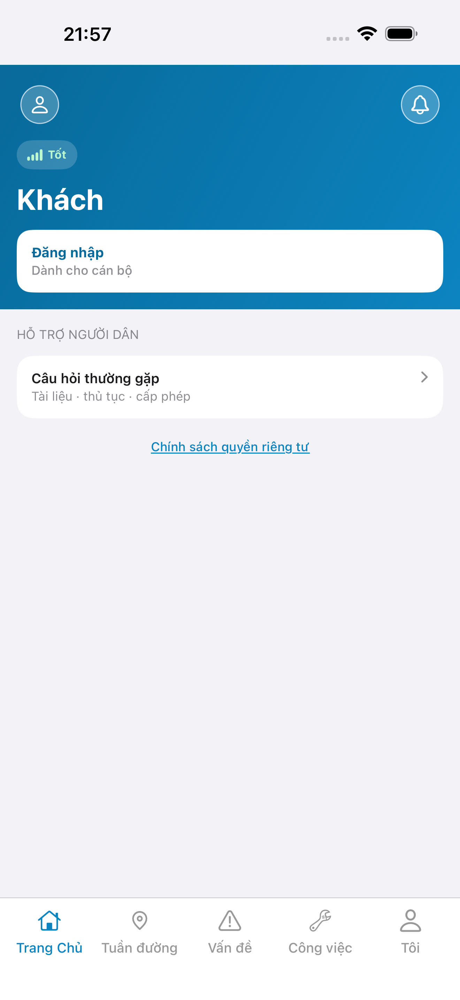
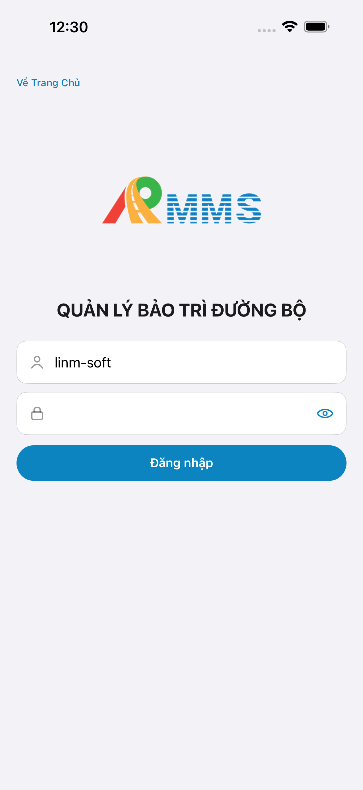
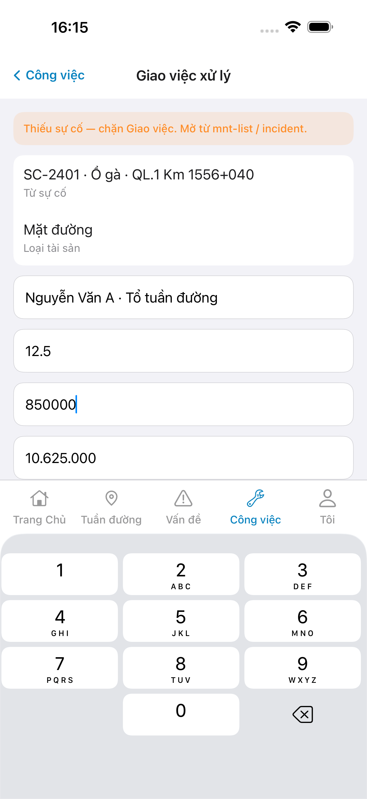
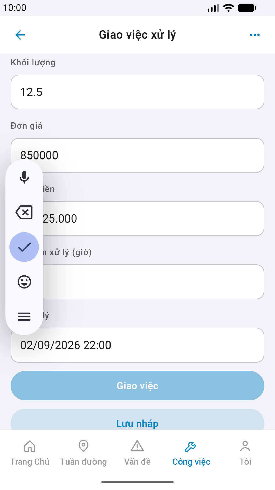
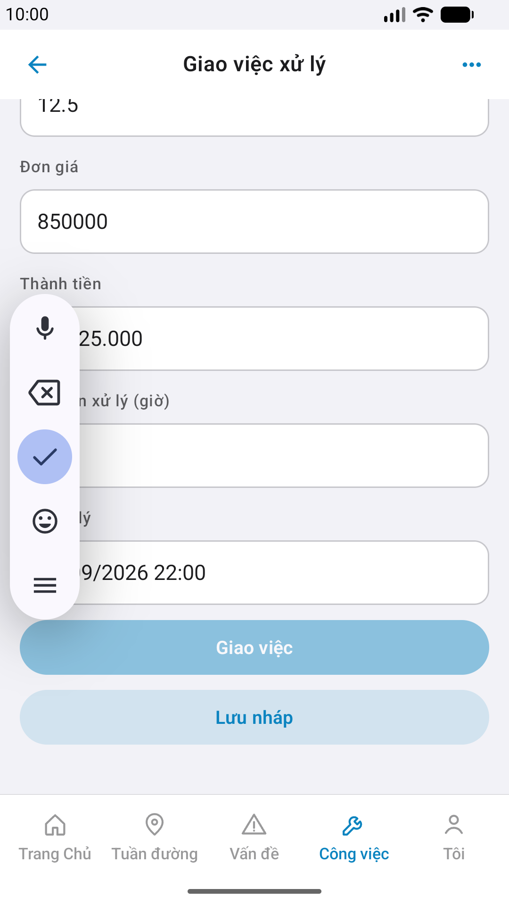

# QA — Scenarios — estimate

## E2E screenshots

Viewer: `/api/qldb/artifact?id=&rel=qa/scenarios.md` rewrite `screens/{caseId}.png`.

CLI **PASS** = Maestro + PNG + store px only — **not** visual vs demo. QA **Read** A3-CORE + P6-CORE vs prototype (`/review-align-ux-ios-android`). Demo `.row-icon`/`#i-*` missing on live → Must **GAP-MOB-UX-COMP-03** · log `qa/bugs/`. Skip vision → **GAP-MOB-E2E-VIS-01**.

| Case | Store | Result | Evidence |
|------|-------|--------|----------|
| A10-BFF | A10 · P11 | **PASS** | — |
| MAESTRO-AND | P6 | **PASS** | yaml scroll `btn-assign` · log `_maestro_android` |
| A11-LAUNCH | A11 | **PASS** |  |
| A9-LOGIN | A9 · P10 | **PASS** |  |
| A3-CORE | A3 · A11 | **PASS** |  |
| P6-CORE | P6 · P11 | **PASS** |  |
| P6-CORE-2 | P6 | **PASS** |  |

## Visual align (`/review-align-ux-ios-android`)

| Surface | Verdict | Notes |
|---------|---------|-------|
| A3-CORE (iOS) vs demo `#sc-estimate` | **Aligned** | TopBar · banner · rows · fields · tab work |
| P6-CORE / P6-CORE-2 (Android) vs demo | **Aligned** | CTA `btn-assign`/`btn-draft` · tab work · MD5 ≠ |
| Demo `.row-icon` / `#i-*` | **N/A Must** | proto dùng `row no-icon` · tab `#i-*` = SVG SSOT · live = native glyphs |
| GAP-MOB-UX-COMP-03 | **closed** | Must **0** · không mở `qa/bugs` Must |
| GAP-MOB-E2E-VIS-01 | **n/a** | vision Read done |

## Closed gaps (re-QA)

| ID | Result |
|----|--------|
| GAP-QA-E2E-AND-01 | **closed** · MAESTRO-AND PASS |
| GAP-QA-STORE-03 | **closed** · `manifest.ok=true` |
| GAP-QA-P6-DUP-01 | **closed** · P6-CORE MD5 ≠ P6-CORE-2 |
| R-QA-01 | **closed** · verdict PASS |

## Runtime

- `yarn e2e-qa-mobile` · feature=`estimate` · ok:**true** · capturedAt=`2026-09-01T09:17:05.352Z`
- iOS: iPhone 17 Pro Max · Android: Pixel_2 · Maestro ON
- API compose host `:5111` (gate `:5101` via forward when needed) · BFF `:5202`
- yaml fix: `qa/e2e/android.yaml` scrollUntilVisible `btn-assign` trước assert (Pixel_2 fold)
- **cấm** mfeStdUrl / yarn start:std

## Version meta

| Field | Value |
|-------|-------|
| skillId | agent-qa-mobile |
| skillVersion | 2026.08.25.01 |
| schemaVersion | 2 |
| workflowVersion | 2026.08.29.1 |
| rulesVersion | 2026.08.29.5 |
| generatedAt | 2026-09-01T09:22:00.000Z |
| versionGate | rechecked |
| taskId | task_992add79 |

---
<!-- Version meta: skillVersion=2026.08.25.01 · schemaVersion=2 · workflowVersion=2026.08.29.1 · versionGate=rechecked · taskId=task_992add79 -->
