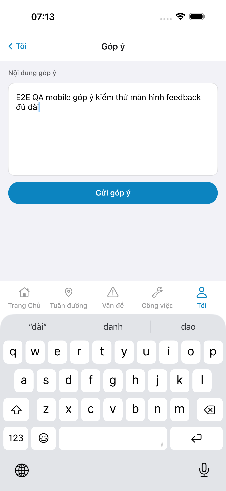
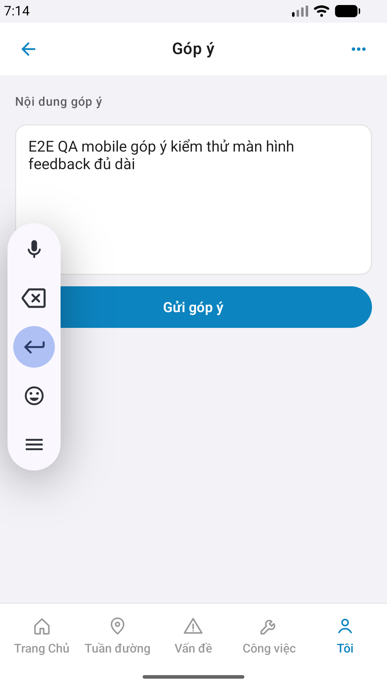

# QA — Scenarios — feedback (mobile)

| Field | Value |
|-------|-------|
| feature | `feedback` |
| title | [Mobile] Góp ý |
| this role | `qa` · `/agent-qa-mobile` |
| status | **confirmed** |
| changeScope | `edit_page` |
| packKind | **`sheet`** (surface full screen `#sc-feedback`) |
| taskId | `task_bee5e97e` |
| autoApprove | ON |
| e2eQa | ON · `yarn e2e-qa-mobile` · Maestro ON |
| ios_test_phase | `phase1_iphone` · dest **iPhone 17 Pro Max** · **A4-IPAD DEFER** |
| store_qa | **run_store** |
| method | e2e runtime · yarn e2e-qa-mobile · **cấm** GenerateImage · **cấm** yarn start:std / mfeStdUrl |
| visual | `/review-align-ux-ios-android` · **Aligned** · Must **0** |
| e2e result | **ok:true** · `2026-08-29T00:08:11.988Z`+rerun P6-on-form |
| updatedAt | `2026-08-29T00:20:00.000Z` |

**Scope:** slug `feedback` · Me → `#sc-feedback` · POST create. **Cấm** AC web Kind B list. Prior web QA `scenarios` Kind B **giữ lịch sử** · **không** dùng làm PASS mobile.

## VERIFY GATE

| Gate | Result |
|------|--------|
| iOS `xcodegen` + `xcodebuild` dest **iPhone 17 Pro Max** | **PASS** |
| Android `./gradlew :app:assembleDebug` | **PASS** |
| Mobile.Bff `dotnet build` | **PASS** (0 warning · 0 error) |
| API docker + Mobile.Bff `:5202` | **PASS** (host API `:5111` · proxy/`--skip-start` OK) |
| Maestro iOS + Android | **PASS** · `#sc-feedback` |

## Device AC

| # | Scenario | Expected | Result | Evidence |
|---|----------|----------|--------|----------|
| 1 | Cold start guest home | `#sc-home` · CTA Đăng nhập | **PASS** | A11-LAUNCH |
| 2 | Login Auth seed | `linm-soft` / `Linm@2026` → `#sc-home` | **PASS** | A9-LOGIN |
| 3 | BFF reachable | Mobile.Bff `:5202` healthy | **PASS** | A10-BFF |
| 4 | Entry Me → feedback | `#row-feedback` → `#sc-feedback` | **PASS** | Maestro · A3 / P6 |
| 5 | TopBar | title **Góp ý** · iOS back **Tôi** · Android icon-only | **PASS** | A3 / P6 |
| 6 | Body field | FieldLabel **Nội dung góp ý** · multiline ≥16 · filled | **PASS** | A3 / P6 |
| 7 | Primary send | **Gửi góp ý** · no UIAlert | **PASS** | A3 / P6 |
| 8 | No category pills P1 | default `de-xuat` · **cấm** invent pills | **PASS** | CORE Read |
| 9 | Dual OS | iOS 6.9" (1320×2868) + Android Pixel 1080×1920 | **PASS** | A3 + P6 + P6-2 |
| 10 | Watermark / placeholder | none «Gói N» / «gen realapp» | **PASS** | CORE Read |
| 11 | Sibling AC | only `feedback` · no Me hub as CORE | **PASS** | P6 = `#sc-feedback` |
| 12 | Form body | fill ≥16 before shot · send after P6 | **PASS** | flows |

## Store × feature

| AC | Apple | Play | Result | Evidence |
|----|-------|------|--------|----------|
| Core UX | A3 · A11 | P6 · P11 | **PASS** | A3-CORE · P6-CORE |
| Login + BFF | A9 · A10 | P10 · P11 | **PASS** | A9-LOGIN · A10-BFF |
| ≥2 phone core | — | P6 | **PASS** | P6-CORE · P6-CORE-2 |
| Privacy URL | A5 | P8 | ghi thiếu OK · **không** fake | — |
| READY_TO_SUBMIT | — | — | **không** (Review) | — |

## E2E screenshots

Viewer: `/api/qldb/artifact?id=&rel=qa/scenarios.md` rewrite `screens/{caseId}.png`.

CLI **PASS** = Maestro + PNG + store px only — **not** visual vs demo. QA **Read** A3-CORE + P6-CORE vs prototype (`/review-align-ux-ios-android`).

| Case | Store | Result | Evidence |
|------|-------|--------|----------|
| A10-BFF | A10 · P11 | **PASS** | — |
| A11-LAUNCH | A11 | **PASS** |  |
| A9-LOGIN | A9 · P10 | **PASS** |  |
| A3-CORE | A3 · A11 | **PASS** |  |
| P6-CORE | P6 · P11 | **PASS** |  |
| P6-CORE-2 | P6 | **PASS** |  |
| A4-IPAD | A4 | **DEFER** Phase 1 · family `1` | DEFER |

## Align UX

| Field | Value |
|-------|-------|
| verdict | **Aligned** |
| Must open | **0** |
| file | `ui/review/align-ux.md` |
| bugs | `qa/bugs/feedback.md` · CLOSED |

## Version meta

| Field | Value |
|-------|-------|
| skillId | agent-qa-mobile |
| skillVersion | 2026.08.20.03 |
| schemaVersion | 1 |
| workflowVersion | 2026.08.25.01 |
| rulesVersion | 2026.08.25.2 |
| generatedAt | `2026-08-29T00:20:00.000Z` |
| versionGate | rechecked |
| contentHash | sha256:feedback-mobile-qa-scenarios-20260829 |
| priorDevHash | sha256:feedback-mobile-ios-implement-20260829 |

---
<!-- Version meta: skillId=agent-qa-mobile skillVersion=2026.08.20.03 schemaVersion=1 workflowVersion=2026.08.25.01 rulesVersion=2026.08.25.2 versionGate=rechecked -->
