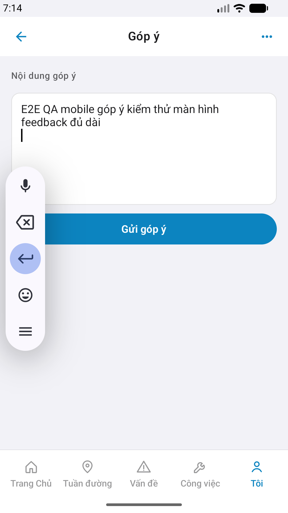

# Capture — feedback

| Case | Store | px | Result | Evidence |
|------|-------|-----|--------|----------|
| A10-BFF | A10 · P11 | — | **PASS** | Mobile.Bff `:5202` |
| A11-LAUNCH | A11 | 1320×2868 | **PASS** |  |
| A9-LOGIN | A9 · P10 | 1320×2868 | **PASS** |  |
| A3-CORE | A3 · A11 | 1320×2868 | **PASS** |  |
| P6-CORE | P6 · P11 | 1080×1920 | **PASS** |  |
| P6-CORE-2 | P6 | 1080×1920 | **PASS** |  |
| A4-IPAD | A4 | — | **DEFER** Phase 1 | — |

iOS device: **iPhone 17 Pro Max** (6.9")  
AVD: **Pixel_2** · wm `1080x1920`  
iPad device: DEFER Phase 1  
method: e2e runtime · yarn e2e-qa-mobile · Maestro ON  

CLI PASS = capture+px only. Visual = `/review-align-ux-ios-android` Read CORE vs demo HTML → **Aligned**.

Listing official → `/store-image-capture` confirm file live (cấm AI vẽ).
