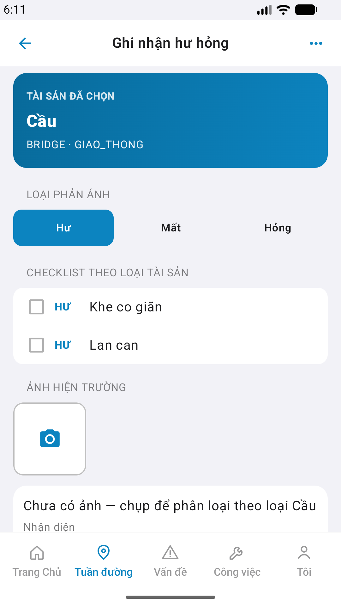

# QA — Scenarios — field-reflect

| Field | Value |
|-------|-------|
| feature | `field-reflect` |
| title | [Mobile] [Tuần đường] -> Ghi nhận hư hỏng |
| this role | `qa` · `/agent-qa-mobile` |
| status | **confirmed** |
| changeScope | `edit_page` · gap=`field_reflect_sessions_live_only` · **GAP-MOB-FIELD-SESS-01** **CLOSED** |
| packKind | **`screen`** |
| taskId | `task_003bfdc2` |
| autoApprove | ON |
| e2eQa | ON · `yarn e2e-qa-mobile` · Maestro ON |
| ios_test_phase | `phase1_iphone` · dest **iPhone 17 Pro Max** · **A4-IPAD DEFER** |
| method | e2e runtime · yarn e2e-qa-mobile |
| visual | `/review-align-ux-ios-android` · **Aligned** · Must **0** |
| updatedAt | `2026-09-12T11:12:00.000Z` |

## Device AC

| # | Scenario | Expected | Result | Evidence |
|---|----------|----------|--------|----------|
| 1 | Cold start guest home | `#sc-home` · CTA Đăng nhập | **PASS** | A11-LAUNCH |
| 2 | Login Auth seed | `linm-soft` / `Linm@2026` → `#sc-home` | **PASS** | A9-LOGIN |
| 3 | BFF reachable | Mobile.Bff `:5202` healthy | **PASS** | A10-BFF |
| 4 | Entry hub → pick | tab field · `row-quick-field-reflect` → `#sc-field-pick` | **PASS** | A3 / P6 |
| 5 | Pick KCHT-32 → form | `ak32-*` → `#sc-field-reflect` · asset card | **PASS** | A3 / P6 |
| 6 | Kind pills | Hư/Mất/Hỏng · default **Hư** | **PASS** | A3 / P6 |
| 7 | PhotoRow + camera glyph | camera slot · no continuous finder | **PASS** | A3 / P6 |
| 8 | Card Nhận diện / Vị trí | `ListRow` · no leading tile | **PASS** | A3 / P6 |
| 9 | **Sessions live-only** | GET `patrol/sessions` · **cấm** demoToday · empty/fail → empty loc + toast | **PASS** | A3 `— · chưa chốt` · P6-2 live GPS · code live-only |
| 10 | Checklist by asset code | BRIDGE · Hư filter | **PASS** | A3 / P6 |
| 11 | Severity + mô tả | Cao · placeholder | **PASS** | A3 / P6-2 |
| 12 | CTA Create / Draft | Primary + Secondary (scroll) | **PASS** | P6-CORE-2 |
| 13 | Dual OS | iOS 6.9" + Android Pixel 1080×1920 | **PASS** | A3 + P6 + P6-2 |
| 14 | Watermark / placeholder | none «Gói N» / «gen realapp» | **PASS** | CORE Read |
| 15 | Sibling AC | only `field-reflect` | **PASS** | flows |

## Store × feature

| AC | Apple | Play | Result | Evidence |
|----|-------|------|--------|----------|
| Core UX | A3 · A11 | P6 · P11 | **PASS** | A3-CORE · P6-CORE |
| Login + BFF | A9 · A10 | P10 · P11 | **PASS** | A9-LOGIN · A10-BFF |
| ≥2 phone core | — | P6 | **PASS** | P6-CORE · P6-CORE-2 |
| Camera/GPS privacy declared | A5/A7 | P8 | **PASS** (declared Dev) | STATUS |
| READY_TO_SUBMIT | — | — | **không** (Review) | — |

## E2E screenshots

Viewer: `/api/qldb/artifact?id=&rel=qa/scenarios.md` rewrite `screens/{caseId}.png`.

CLI **PASS** = Maestro + PNG + store px only — **not** visual vs demo. QA **Read** A3-CORE + P6-CORE vs prototype.

| Case | Store | Result | Evidence |
|------|-------|--------|----------|
| A10-BFF | A10 · P11 | **PASS** | — |
| A11-LAUNCH | A11 | **PASS** |  |
| A9-LOGIN | A9 · P10 | **PASS** |  |
| A3-CORE | A3 · A11 | **PASS** |  |
| P6-CORE | P6 · P11 | **PASS** |  |
| P6-CORE-2 | P6 | **PASS** |  |

manifest `ok=true` · capturedAt `2026-09-12T11:11:32.196Z` · iPhone 17 Pro Max · Android Pixel 1080×1920.

## Visual align (CORE Read)

| Zone | Demo | iOS A3 | Android P6 | Verdict |
|------|------|--------|------------|---------|
| Title · kind Hư | DES-MOB-FIELD-KIND | **PASS** | **PASS** | **Aligned** |
| Photo camera glyph | `#i-camera` | **PASS** | **PASS** | **Aligned** |
| Detect / loc rows | `.row` no-icon | **PASS** | **PASS** | **Aligned** |
| locationRow live-only | empty/fail `—` · live GPS OK | `— · chưa chốt` | live `QL.1…` on fold2 | **PASS** · GPS timing dual · **không** demoToday |
| Checklist asset | by code BRIDGE | HƯ rows | same | **PASS** |
| Severity · mô tả | Cao · placeholder | **PASS** | **PASS** | **Aligned** |
| CTA Create (fold) | Primary | below fold Accept | visible P6-2 | **PASS** |
| Watermark | none | none | none | **PASS** |
| Tab field active | DES-MOB-TABBAR | **PASS** | **PASS** | **Aligned** |

Must **0** · Should **0** (CTA below fold on A3 — Accept · Maestro ids).

## T-QA

| id | Result | notes |
|----|--------|-------|
| T-QA-FIELD-SESS-LIVE | **PASS** | live-only sessions · empty loc iOS · live GPS Android · no itemsOrDemo |
| T-QA-TAB-01 | **PASS** | tab `field` · Tuần đường on |

## Debt

- GAP-MOB-FIELD-MEDIA-01 — Signed deferred · **Accept**
- GAP-QA-FIELD-GPS-TIMING-01 — dual GPS lock timing · **Defer**

## Handoff → review

| Field | Value |
|-------|-------|
| Next | `/agent-review-mobile` |
| verdict | **PASS** · store pack ready for Review |
| compact | `handoff/qa-compact.md` |
| align | `ui/review/align-ux.md` · Must 0 |
