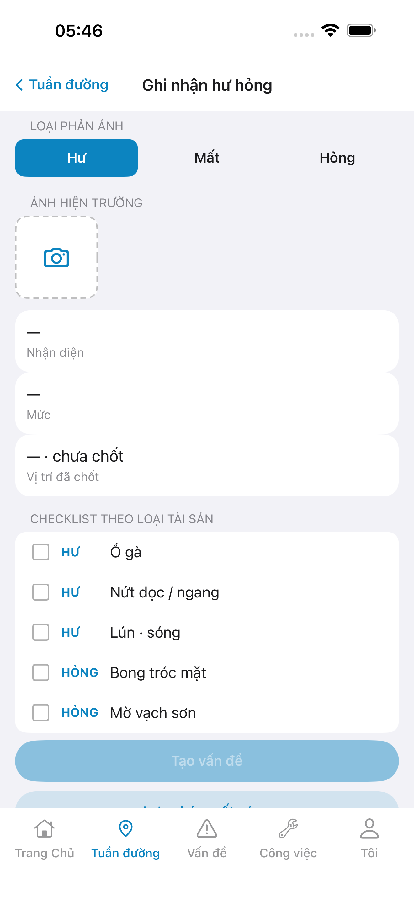
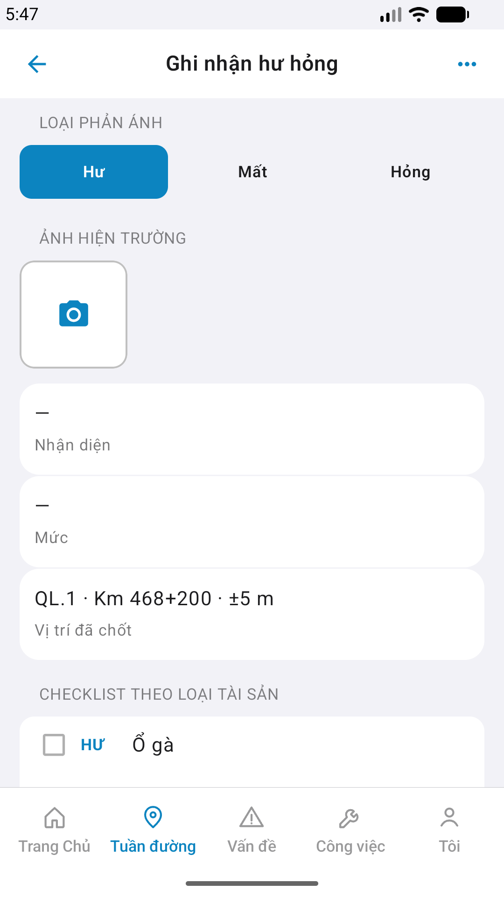
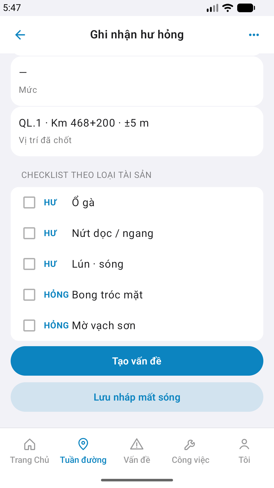

# Capture — field-reflect

| Field | Value |
|-------|-------|
| feature | `field-reflect` |
| method | e2e runtime · yarn e2e-qa-mobile · Maestro ON |
| ios | **iPhone 17 Pro Max** · 1320×2868 (6.9") |
| android | Pixel_2 wm **1080×1920** |
| ipad | **DEFER** Phase 1 |
| capturedAt | `2026-08-28T22:47:13.520Z` |
| CLI | **ok:true** |

| Case | Store | Result | Evidence |
|------|-------|--------|----------|
| A10-BFF | A10 · P11 | **PASS** | — |
| A11-LAUNCH | A11 | **PASS** |  |
| A9-LOGIN | A9 · P10 | **PASS** |  |
| A3-CORE | A3 · A11 | **PASS** |  |
| P6-CORE | P6 · P11 | **PASS** |  |
| P6-CORE-2 | P6 | **PASS** |  |

CLI PASS = capture+px only. Visual = `/review-align-ux-ios-android` Read CORE vs demo HTML · **Aligned** Must 0.

Listing official → `/store-image-capture` confirm file live (cấm AI vẽ).
