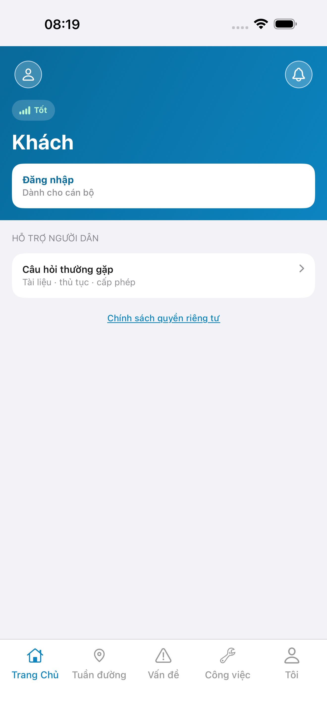
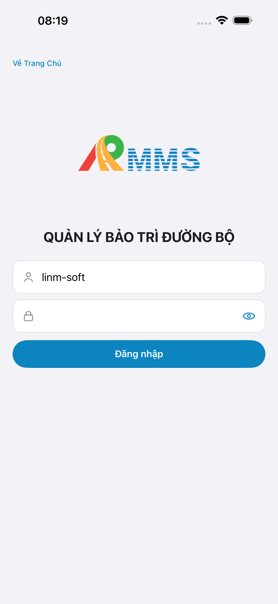
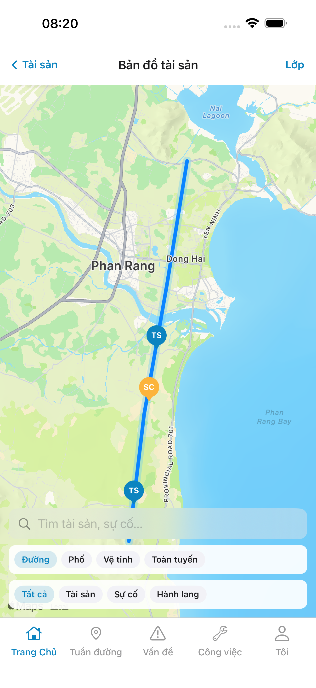
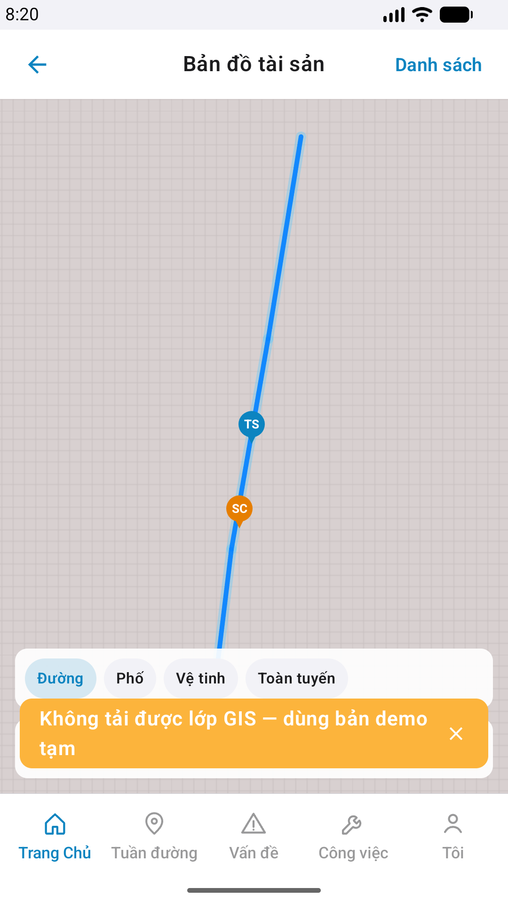
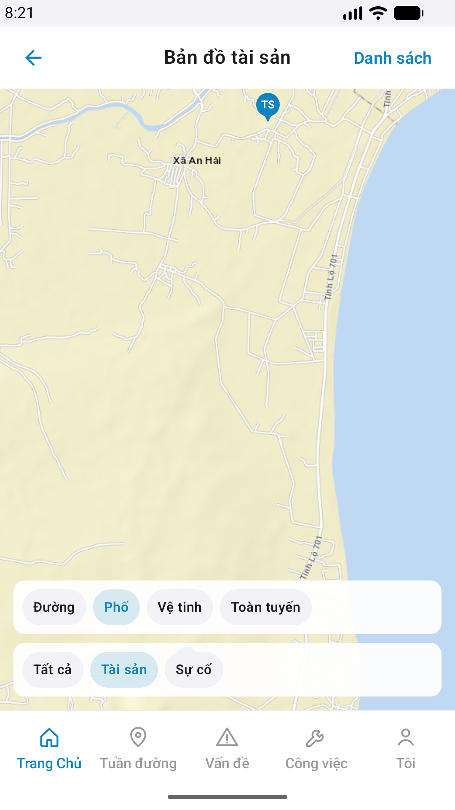

# QA — Scenarios — gis-map (mobile · Bản đồ tài sản)

| Field | Value |
|-------|-------|
| feature | `gis-map` |
| this role | `qa` · `/agent-qa-mobile` |
| status | **confirmed** |
| packKind | **`map`** |
| taskId | `task_9d4480e2` |
| e2eQa | **ON** · `yarn e2e-qa-mobile` · `ios_test_phase=phase1_iphone` (autoApprove) · **A4-IPAD DEFER** |
| store_qa | **run_store** (autoApprove=ON · e2eQa=ON) |
| e2e result | **ok:true** · dest **iPhone 17 Pro Max** 1320×2868 RGB · AVD **Pixel 2** 1080×1920 · visual **Aligned** |
| method | e2e runtime · yarn e2e-qa-mobile · Maestro · **cấm** GenerateImage · **cấm** yarn e2e-qa / start:std / mfeStdUrl |
| align | `/review-align-ux-ios-android` · Read A3-CORE + P6-CORE(+2) vs dual proto `#sc-gis-map` · **Must 0** |
| API / BFF | API docker host **:5111** · Mobile.Bff **:5202** · `--skip-start` (đã listen) |
| updatedAt | `2026-08-31T01:25:06.000Z` |

**Scope:** slug `gis-map` · `#sc-gis-map` only · entry hub `#tile-map`. **Cấm** AC sibling list/draw/heatmap/patrol-map / invent ERP.*.

## Verdict

pass

## VERIFY GATE

| Gate | Result |
|------|--------|
| iOS xcodegen + xcodebuild | **PASS** |
| Android assembleDebug | **PASS** |
| Mobile.Bff `dotnet build` | **PASS** |
| Mobile.Bff `:5202` healthy | **PASS** (A10-BFF) |
| API docker `:5111` | **PASS** (`--skip-start`) |
| Maestro iOS → `#sc-gis-map` | **PASS** |
| Maestro Android → `#sc-gis-map` | **PASS** |
| `yarn e2e-qa-mobile` CLI | **PASS** · `ok: true` |
| Visual Aligned (Read CORE) | **PASS** · Must 0 · dual chrome DEFER platform-OK |

## Device AC (slug `gis-map` only)

| ID | Expect | Result | Evidence |
|----|--------|--------|----------|
| QA-01 | Launch → guest home | **PASS** |  |
| QA-02 | Login demo Auth seed | **PASS** |  |
| QA-03 | Hub `#tile-map` → `#sc-gis-map` | **PASS** | Maestro dual |
| QA-04 | Title **Bản đồ tài sản** · basemap · legend · dual chrome | **PASS** | A3 / P6 |
| QA-05 | Overlay TS/SC + corridor (BFF empty → demo OMS + toast Android) | **PASS** PO fail-open | A3 live MapKit · P6 demo toast · P6-2 Esri+isolate |
| QA-06 | Watermark / «Phiên bản Gói» | **PASS** | A3 / P6 không watermark |
| QA-07 | Tab shell 5 giữ · **cấm** invent tab trên map | **PASS** | A3 / P6 |
| QA-08 | Back hub · iOS **Tài sản** · Android chevron / **Danh sách** | **PASS** | dual chrome |

## Store Must × feature

| Case | Store | Result | Evidence |
|------|-------|--------|----------|
| A10-BFF | A10 · P11 | **PASS** | — |
| A11-LAUNCH | A11 | **PASS** |  |
| A9-LOGIN | A9 · P10 | **PASS** |  |
| A3-CORE | A3 · A11 | **PASS** CLI · **visual Aligned** |  |
| P6-CORE | P6 · P11 | **PASS** CLI · **visual Aligned** |  |
| P6-CORE-2 | P6 | **PASS** CLI · isolate+basemap |  |
| A4-IPAD | A4 | **DEFER** Phase 1 | — |

## E2E screenshots

Viewer: `/api/qldb/artifact?id=&rel=qa/scenarios.md` rewrite `screens/{caseId}.png`.

CLI **PASS** = Maestro + PNG + store px only — **not** visual vs demo. QA **Read** A3-CORE + P6-CORE vs prototype (`/review-align-ux-ios-android`).

| Case | Store | Result | Evidence |
|------|-------|--------|----------|
| A10-BFF | A10 · P11 | **PASS** | — |
| A11-LAUNCH | A11 | **PASS** |  |
| A9-LOGIN | A9 · P10 | **PASS** |  |
| A3-CORE | A3 · A11 | **PASS** |  |
| P6-CORE | P6 · P11 | **PASS** |  |
| P6-CORE-2 | P6 | **PASS** |  |

## Align UX (Read CORE)

| Zone | Demo `#sc-gis-map` | Live iOS A3 | Live Android P6 | Gap |
|------|-------------------|-------------|-----------------|-----|
| Title | Bản đồ tài sản | **match** | **match** | — |
| Back | iOS text Tài sản · And icon | **match** | **match** | — |
| Trailing | iOS Lớp · And Danh sách | **match** | **match** | — |
| Search | iOS only `#i-search` | **match** placeholder | **N/A** dual | — |
| Basemap | Đường·Phố·Vệ tinh·Toàn tuyến | **match** | **match** | — |
| Legend | +Hành lang iOS · And không | **match** | **match** (no corridor chip) | — |
| Pins TS/SC | map markers (≠ `.row-icon`) | TS+SC+corridor | TS+SC → isolate TS | **GAP-MOB-UX-COMP-03 N/A** |
| Watermark | cấm | **none** | **none** | — |

## Gaps

| ID | Severity | Summary |
|----|----------|---------|
| GAP-QA-GIS-EMPTY | Should | BFF `gis/geojson/{assets,incidents,corridor}` **200** · `features:[]` → app demo OMS (PO fail-open) · seed GIS DB để pin live |
| GAP-QA-A11Y-CHIP | Should · DEFER kit | iOS `LinmChip` / TopBar id (`mb-*` · `btn-gis-*` · `gis-search`) không expose Maestro — assert text OK |

## Maestro

| Flow | Path | Result |
|------|------|--------|
| iOS | `qa/e2e/ios.yaml` | **PASS** · guest→login→hub→`#tile-map`→`#sc-gis-map` |
| Android | `qa/e2e/android.yaml` | **PASS** · + basemap/legend tap P6-2 |

## Notes

- `--skip-start`: API listen **:5111** (compose không bind :5101 · Win64 camera) · BFF :5202.
- `--skip-build` sau VERIFY GATE PASS.
- Demo `#sc-gis-map` **không** `.row-icon` trên map — pin annotation · **không** GAP-MOB-UX-COMP-03.
- **Cấm** READY_TO_SUBMIT · next Review mobile.
- QA **cấm** tự sửa native (roleOnly=`qa`).

## Handoff

| Field | Value |
|-------|-------|
| feature | `gis-map` |
| this role | `qa` · `/agent-qa-mobile` · **confirmed** |
| next | `review` · `/agent-review-mobile` |
| visual | **Aligned** · Must 0 |
| artifacts | `qa/scenarios.md` · `qa/store/gis-map/` · `ui/review/align-ux.md` |

## Version meta

| Field | Value |
|-------|-------|
| skillId | agent-qa-mobile |
| skillVersion | 2026.08.29.1 |
| schemaVersion | 1 |
| workflowVersion | 2026.08.31.2 |
| rulesVersion | 2026.08.31.2 |
| generatedAt | 2026-08-31T01:25:06.000Z |
| versionGate | rechecked |
| contentHash | sha256:gis-map-control-hint-20260831 |
| taskId | `task_9d4480e2` |

---
<!-- Version meta: skillId=agent-qa-mobile skillVersion=2026.08.29.1 schemaVersion=1 workflowVersion=2026.08.31.2 versionGate=rechecked -->
