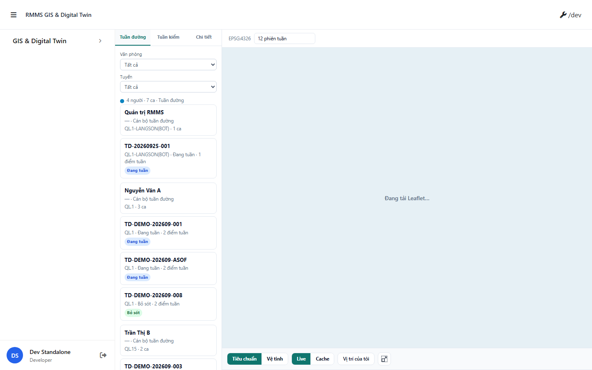
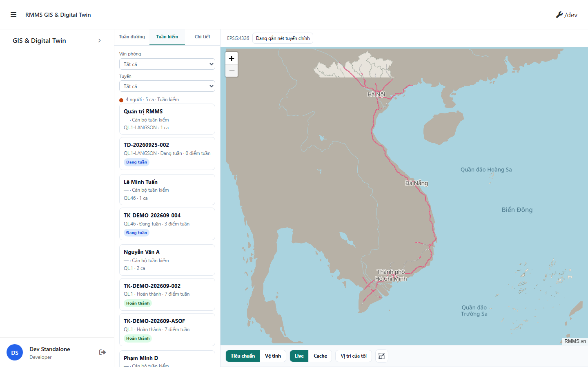
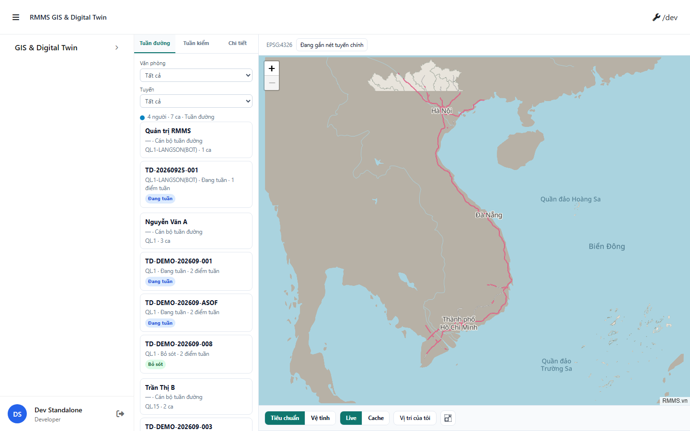

# QA — Scenarios — gis-patrol-map

> Status: **PASS** · e2eQa=ON · task `task_e337c304` · 2026-09-30T15:58:00.000Z  
> Role: `qa` · packKind=`map` · changeScope=`edit_page`  
> runtimeUrl=`http://localhost:9302/gis-patrol-map` · live=`/gis/tuan-duong` · packet mfeStdUrl=:9301 occupied by Mobile  
> Screens: `specs/gis-patrol-map/qa/screens/{S0,S1,QA-20}.png` · `manifest.json` ok=true

| | |
|--|--|
| Feature | `gis-patrol-map` |
| Title | Bản đồ tuần đường — Delta REAL…KM-EMPTY · keep PHOTO |
| Role | `qa` |
| Runtime | docker compose (WebService) + Gis `yarn start:std` :9302 · Playwright |

## Environment

| Item | Value |
|------|-------|
| Docker | `D:/AI-QLBD/Linm.RMMS.WebService` · `docker compose up -d` · api/bff healthy |
| MFE | `D:/AI-QLBD/MFE-Source/Linm.Web.RMMS.Gis` · `yarn start:std` → **:9302** |
| Port note | Packet `mfeStdUrl` :9301 đang bị `Linm.Web.RMMS.Mobile` chiếm · **cấm** taskkill worker · E2E chạy :9302 |
| Compile fix | `GisPatrolMapPage` KM_POST tooltip + track hit click · `declarations.d.ts` Layer.on/bindTooltip |
| E2E CLI | `yarn e2e-qa --url=http://localhost:9302/gis-patrol-map --feature=gis-patrol-map --product-root=D:/AI-QLBD/Linm.RMMS.Data --cases=S0,S1,QA-20 --docker-dir=D:/AI-QLBD/Linm.RMMS.WebService --mfe-root=D:/AI-QLBD/MFE-Source/Linm.Web.RMMS.Gis --skip-start --testid=rmms-gis-patrol-map-page` |
| AutoCode | playwright resolve via absolute file URL (Node 24) · map steps S1=tab click · QA-20=person click |

## Cases (T-QA-MAP-01)

| Id | Zone | Steps | Expect | Result | Shot |
|----|------|-------|--------|--------|------|
| S0 | SCR-MAP · NAV-GIS · MAP-HOST · FILTER-BAR | Goto runtimeUrl · wait `data-testid=rmms-gis-patrol-map-page` | Shell + tab Tuần đường + basemap · không overlay | **PASS** |  |
| S1 | TAB-* · LIST-PERSON | Click `gis-side-tab-tuan-kiem` | Tab Tuần kiểm active · list đổi · PNG ≠ S0 | **PASS** |  |
| QA-20 | LIST-PERSON · SCR-DETAIL · MAP-POPUP-INSPECT | Click `patrol-person-*` | Person selected · map/pins · inspect path · PNG ≠ S0/S1 | **PASS** |  |

## Observations

- Real API sessions: Quản trị RMMS · Nguyễn Văn A · ≥1 Đang tuần (REAL-01 — không seed khi API có data).
- S1 tab switch + QA-20 person select → distinct PNG hashes (no GAP-QA-E2E-DUP-01).
- FileService gallery resign 404 seed debt · Auth permission stub — không block P1 map/inspect.

## T-QA-* checklist

| Task | Status |
|------|--------|
| T-QA-MAP-01 | **PASS** · S0/S1/QA-20 + PNG · yarn build PASS |

## Gate

| Gate | Status |
|------|--------|
| e2eQa runtime (not static-only) | **PASS** |
| Screens per case | **PASS** |
| yarn build | **PASS** |
| phase≠done | kept until compact+STATUS · **cấm** phase=done |
| next | review pending (roleOnly HARD — không start review) |

## Notes

- Known debt: gallery resign / seed blob 404 · Auth permission stub.
- Port SSOT: package `start:std`=:9302 · cập nhật packet/mfeStdUrl khi Mobile nhả :9301.

## E2E screenshots

Viewer: `/api/qldb/artifact?id=&rel=qa/scenarios.md` rewrite `screens/{caseId}.png`.

CLI **PASS** = Playwright + PNG không đen + không overlay đỏ + ảnh không trùng case. **Không** = khớp design. QA **Read** PNG vs prototype · title · tính năng · việc cán bộ (`enduser-mismatch.md`). Overlay/crash → **GAP-QA-E2E-CRASH-01**. Ảnh đen → **GAP-QA-E2E-BLANK-01**. Ảnh trùng → **GAP-QA-E2E-DUP-01**. Bỏ vision → **GAP-QA-E2E-VIS-01**.

| Case | Scenario | Expect | Actual | Result | Evidence |
|------|----------|--------|--------|--------|----------|
| S0 | Cán bộ mở bản đồ tuần đường | Shell map + list · title đúng · không overlay | PNG có nội dung, không overlay — chưa = khớp design (QA Read) | **PASS** |  |
| S1 | Cán bộ đổi tab Tuần kiểm | Tab/list đổi · không crash | PNG có nội dung, không overlay — chưa = khớp design (QA Read) | **PASS** |  |
| QA-20 | Cán bộ chọn người tuần · xem pin/inspect | Person on · map/inspect · không crash | PNG có nội dung, không overlay — chưa = khớp design (QA Read) | **PASS** |  |
