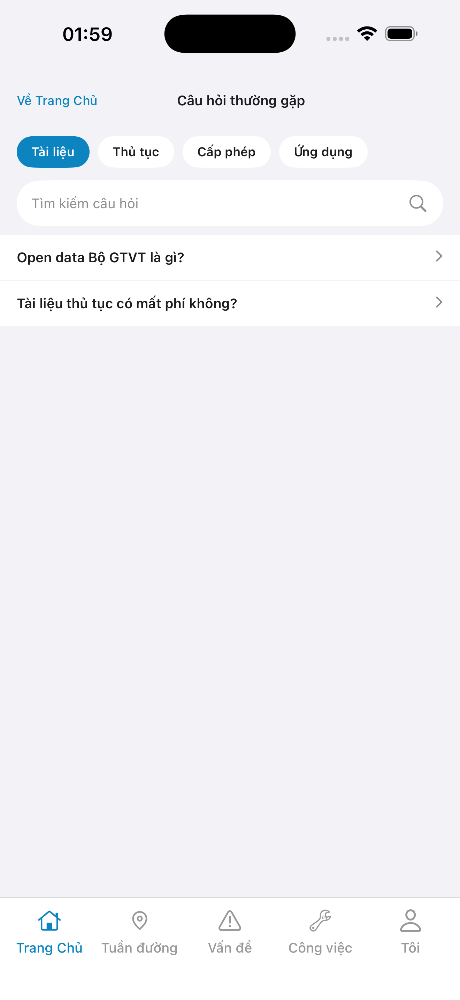
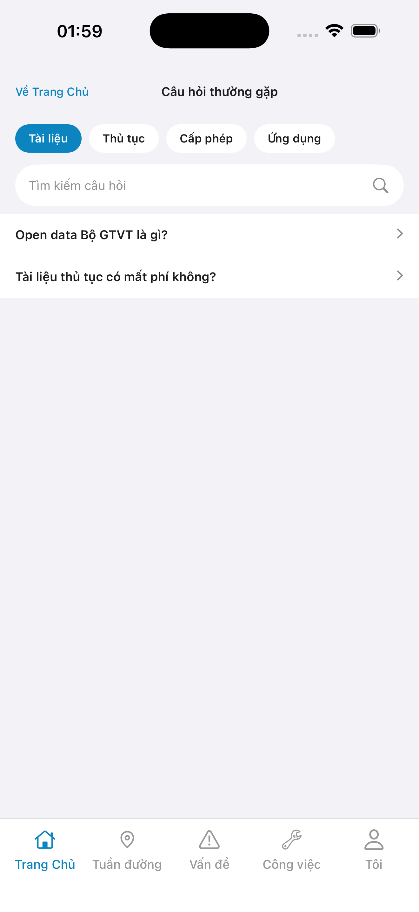
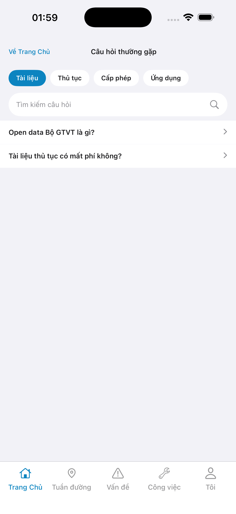
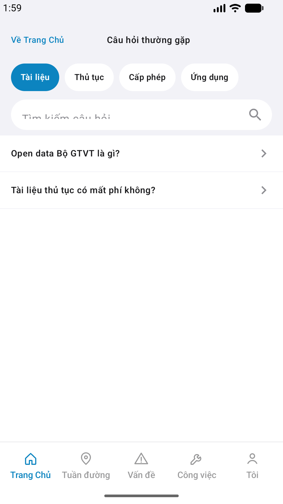

# QA — Scenarios — home

> Status: **done** · `/agent-qa-mobile` · e2eQa=ON · task `task_dfb8f4a1`  
> method: `e2e runtime · yarn e2e-qa-mobile` · Maestro · sim **iPhone 17 Pro Max** + emulator **Pixel 2** · **cấm** `yarn e2e-qa` / `start:std` / GenerateImage

| | |
|--|--|
| Feature | `home` |
| Title | [Mobile] Trang Chủ |
| Role | `qa` |
| packKind | `hub` |
| iosPhase | `phase1_iphone` · **A4-IPAD DEFER** |
| demo | `linm-soft` / Auth docker seed |
| API / BFF | `:5101` · Mobile.Bff `:5202` |

## Device AC (slug `home` only)

| AC | Expect | Result | Evidence |
|----|--------|--------|----------|
| Launch | App mở màn login (ngoài tab) · 0 crash | **PASS** |  |
| BFF | Mobile.Bff listen `:5202` | **PASS** | A10-BFF |
| Login demo | Fill `#f-user`/`#f-pass` · CTA Đăng nhập · seed Auth | **PASS** |  |
| Hub `#sc-home` iOS | Hero · `.who` live · quick 2 · grid 3×2 · wallet · tab Trang Chủ · **cấm** foot Gói / gallery / `btn-logout` | **PASS** |  |
| Hub `#sc-home` Android | Cùng zone · Pixel **1080×1920** | **PASS** |  |
| Hub zone 2 Android | Wallet + grid visible (scroll) | **PASS** |  |
| GAP-F-HOME-01 | Role ẩn live · wallet static demo | **PASS** | A3 / P6 |
| GAP-F-HOME-02 | Badge 0 ẩn · **cấm** GET inbox trên home | **PASS** | A3 / P6 (bell không badge) |
| GAP-F-HOME-03 | **Cấm** watermark «Phiên bản Gói» | **PASS** | A3 / P6 |
| Dual align | Chrome kit cùng zone iOS↔Android | **PASS** | A3 ↔ P6 · **không** GAP-MOB-ALIGN-01 |

## Store Must × feature

| Case | Store | Result | Evidence |
|------|-------|--------|----------|
| A10-BFF | A10 · P11 | **PASS** | — |
| A11-LAUNCH | A11 | **PASS** |  |
| A9-LOGIN | A9 · P10 | **PASS** |  |
| A3-CORE | A3 · A11 | **PASS** |  |
| P6-CORE | P6 · P11 | **PASS** |  |
| P6-CORE-2 | P6 | **PASS** |  |

## E2E screenshots

Viewer: `/api/qldb/artifact?id=&rel=qa/scenarios.md` rewrite `screens/{caseId}.png`.

CLI **PASS** = Maestro + PNG + store px only — **not** visual vs demo. QA **Read** A3-CORE + P6-CORE vs prototype (`/review-align-ux-ios-android`). Demo `.row-icon`/`#i-*` missing on live → Must **GAP-MOB-UX-COMP-03** · log `qa/bugs/`. Skip vision → **GAP-MOB-E2E-VIS-01**.

| Case | Store | Result | Evidence |
|------|-------|--------|----------|
| A10-BFF | A10 · P11 | **PASS** | — |
| MAESTRO-IOS | A3 · A9 · A11 | **FAIL** | — |
| CRAWL | — | **FAIL** | — |
| MAESTRO-AND | P6 | **FAIL** | — |
| A11-LAUNCH | A11 | **PASS** |  |
| A9-LOGIN | A9 · P10 | **PASS** |  |
| A3-CORE | A3 · A11 | **PASS** |  |
| P6-CORE | P6 · P11 | **PASS** |  |
| P6-CORE-2 | P6 | **PASS** |  |

Viewer: `/api/qldb/artifact?id=&rel=qa/scenarios.md` rewrite `screens/{caseId}.png`.

CLI **PASS** = Maestro + PNG + store px only — **not** visual vs demo. QA **Read** A3-CORE + P6-CORE vs prototype (`/review-align-ux-ios-android`). Demo `.row-icon`/`#i-*` missing on live → Must **GAP-MOB-UX-COMP-03** · log `qa/bugs/`. Skip vision → **GAP-MOB-E2E-VIS-01**.

| Case | Store | Result | Evidence |
|------|-------|--------|----------|
| A10-BFF | A10 · P11 | **PASS** | — |
| MAESTRO-AND | P6 | **FAIL** | — |
| A11-LAUNCH | A11 | **PASS** |  |
| A9-LOGIN | A9 · P10 | **PASS** |  |
| A3-CORE | A3 · A11 | **PASS** |  |
| P6-CORE | P6 · P11 | **PASS** |  |
| P6-CORE-2 | P6 | **PASS** |  |

Viewer: `/api/qldb/artifact?id=&rel=qa/scenarios.md` rewrite `screens/{caseId}.png`.

| Case | Store | Result | Evidence |
|------|-------|--------|----------|
| A10-BFF | A10 · P11 | **PASS** | — |
| A11-LAUNCH | A11 | **PASS** |  |
| A9-LOGIN | A9 · P10 | **PASS** |  |
| A3-CORE | A3 · A11 | **PASS** |  |
| P6-CORE | P6 · P11 | **PASS** |  |
| P6-CORE-2 | P6 | **PASS** |  |

## VERIFY GATE (recheck QA)

| Gate | Result |
|------|--------|
| iOS `xcodegen` + `xcodebuild` dest **iPhone 17 Pro** | **PASS** |
| Android `assembleDebug` | **PASS** |
| BFF `dotnet build` | **PASS** |
| `yarn e2e-qa-mobile` · cases A11,A10,A9,A3,P6,P6-2 | **PASS** · `ok: true` |

## Notes

- Maestro flows: `qa/e2e/ios.yaml` · `qa/e2e/android.yaml` — login seed → assert `#sc-home` trước shot A3/P6 (**cấm** login-only core).
- Android: `hideKeyboard` trước `#btn-login` (keyboard che CTA).
- px: iOS A3 **1320×2868** RGB · Play P6 **1080×1920** RGB.
- **Cấm** READY_TO_SUBMIT ở QA — next `/agent-review-mobile`.
- Sibling AC / form slug khác: **out of scope**.

## Handoff → Review

| Field | Value |
|-------|-------|
| phase_to | `review` |
| Next slash | `/agent-review-mobile` |
| store | `qa/store/home/` · CAPTURE.md |
| Chain this turn | **không** (roleOnly=`qa`) |
