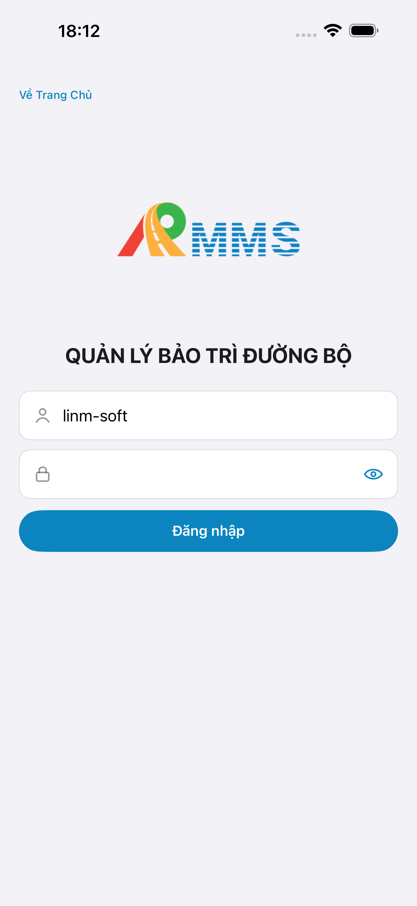
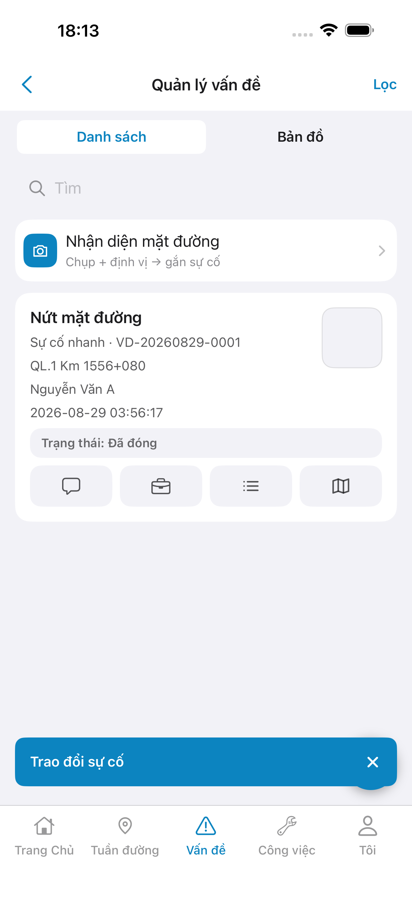
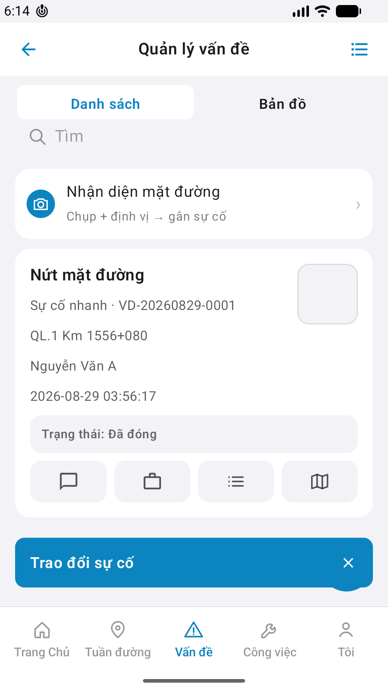

# QA — Scenarios — incident-chat (mobile · Trao đổi sự cố · P1 toast)

| Field | Value |
|-------|-------|
| feature | `incident-chat` |
| title | [Mobile] [Vấn đề] -> Trao đổi sự cố |
| this role | `qa` · `/agent-qa-mobile` |
| status | **confirmed** |
| packKind | **`sheet`** (meta) · **surface P1 = toast** · sheet/composer **DEFER P2** |
| stack | `native_dual` |
| changeScope | `new_page` |
| taskId | `task_52378a1c` |
| autoApprove | ON — `ios_test_phase=phase1_iphone` · `store_qa=run_store` · **A4-IPAD DEFER** |
| e2eQa | **ON** · `yarn e2e-qa-mobile` · sim 6.9" + Pixel 2 · Maestro · **cấm** yarn e2e-qa / start:std / mfeStdUrl / GenerateImage |
| e2e result | **ok:true** · dest **iPhone 17 Pro Max** 1320×2868 · AVD **Pixel_2** 1080×1920 |
| method | e2e runtime · yarn e2e-qa-mobile · Maestro |
| align | dual proto `#i-chat` → toast «Trao đổi sự cố» · live A3 ↔ P6 · **Aligned** · Must **0** |
| ios | `/Users/mac/LINM-ORG/AI-QLBD/Linm.RMMS.Mobile.iOS` |
| android | `/Users/mac/LINM-ORG/AI-QLBD/Linm.RMMS.Mobile.Android` |
| bff | `/Users/mac/LINM-ORG/AI-QLBD/Linm.RMMS.Mobile.Bff` · :5202 |
| BackendRoot | `/Users/mac/LINM-ORG/AI-QLBD/Linm.RMMS.WebService` · host API :5111 (proxy :5101 for CLI) · **cấm ERP.*** |
| updatedAt | `2026-08-29T11:14:51.000Z` |

**Scope:** slug `incident-chat` only — tap `#i-chat` / `btn-inc-chat-{id}` → `LinmToast` «Trao đổi sự cố» · **no HTTP** · **no** detail/sheet/composer. Parent list chrome **reuse**. **Cấm** AC sibling list/detail/create/comments as in-scope.

## VERIFY GATE

| Gate | Result |
|------|--------|
| iOS `xcodegen generate` | **PASS** |
| Android `assembleDebug` | **PASS** |
| Mobile.Bff `dotnet build` | **PASS** |
| API docker + BFF :5202 | **PASS** (healthy) |
| Maestro iOS + Android | **PASS** · guest → login → `#sc-incident-list` → chat → toast |
| `yarn e2e-qa-mobile` | **PASS** · `ok:true` · cases A11,A10,A9,A3,P6,P6-2 |

## Device AC (slug only)

| ID | Expect | Result | Evidence |
|----|--------|--------|----------|
| QA-01 | Login demo → Home → tile/tab **Vấn đề** → `#sc-incident-list` | **PASS** | Maestro dual |
| QA-02 | Tap `#i-chat` / `btn-inc-chat-*` → toast **«Trao đổi sự cố»** | **PASS** | A3-CORE · P6-CORE |
| QA-03 | Stay on list · **không** push detail · **không** sheet/composer | **PASS** | A3/P6 still `#sc-incident-list` |
| QA-04 | Icon `#i-chat` bubble glyph · a11y «Trao đổi» | **PASS** | Read CORE vs demo `#i-chat` |
| QA-05 | **Không** HTTP / fake thread / «Đã gửi» | **PASS** | toast-only · no network assert needed P1 |
| QA-06 | Shell Tab 5 **Vấn đề** · `tabs: none` on toast · **cấm** invent tab 6 | **PASS** | A3/P6 |
| QA-07 | Dual parity toast copy iOS ↔ Android | **PASS** | A3 ↔ P6 |
| AC-D-14 | **Cấm** watermark / process text | **PASS** | Read CORE |

## Store Must × feature

| Case | Store | Result | Evidence |
|------|-------|--------|----------|
| A10-BFF | A10 · P11 | **PASS** | BFF :5202 healthy |
| A11-LAUNCH | A11 | **PASS** |  |
| A9-LOGIN | A9 · P10 | **PASS** |  |
| A3-CORE | A3 · A11 | **PASS** |  |
| P6-CORE | P6 · P11 | **PASS** |  |
| P6-CORE-2 | P6 | **PASS** |  |
| A4-IPAD | A4 | **DEFER** Phase 1 | — |

## Maestro

| Flow | Path | Result |
|------|------|--------|
| iOS | `qa/e2e/ios.yaml` | **PASS** · seed `4b0d2722-…` chat → assert toast |
| Android | `qa/e2e/android.yaml` | **PASS** · P6 toast + P6-2 list fold |

## Align live vs demo (`/review-align-ux-ios-android`)

| Check | Demo | Live iOS A3 | Live Android P6 | Result |
|-------|------|-------------|-----------------|--------|
| `#i-chat` bubble glyph on card | dual proto | present | present | **Aligned** |
| Toast copy «Trao đổi sự cố» | `toastChat()` | blue toast bar | blue toast bar | **Aligned** |
| Stay on list (no detail) | stopPropagation | list visible | list visible | **Aligned** |
| No sheet/composer P1 | DEFER | none | none | **Aligned** |
| Watermark | none | none | none | **PASS** |

Must open: **0** · `ui/review/align-ux.md` · **cấm** GAP-MOB-E2E-VIS-01 (Read done).

## Gaps

| ID | Note | Block complete? |
|----|------|-----------------|
| — | none Must | — |

Comments API / sheet P2 cite only: GAP-MOB-INC-CHAT-API-01 **DEFER** (prior · không reopen QA).

## E2E screenshots

Viewer: `/api/qldb/artifact?id=&rel=qa/scenarios.md` rewrite `screens/{caseId}.png`.

CLI **PASS** = Maestro + PNG + store px only — **not** visual vs demo. QA **Read** A3-CORE + P6-CORE vs prototype (`/review-align-ux-ios-android`).

| Case | Store | Result | Evidence |
|------|-------|--------|----------|
| A10-BFF | A10 · P11 | **PASS** | — |
| A11-LAUNCH | A11 | **PASS** |  |
| A9-LOGIN | A9 · P10 | **PASS** |  |
| A3-CORE | A3 · A11 | **PASS** |  |
| P6-CORE | P6 · P11 | **PASS** |  |
| P6-CORE-2 | P6 | **PASS** |  |

## Handoff

| Field | Value |
|-------|-------|
| phase_from / phase_to | qa **confirmed** → **review** pending |
| Next slash | `/agent-review-mobile` (role sau · **cấm** start trong task này) |
| STATUS | `specs/incident-chat/STATUS.md` |
| Queue | `task_52378a1c` · **completed** |
| Store | `qa/store/incident-chat/` · CAPTURE + manifest · **cấm** READY_TO_SUBMIT ở QA |

## Version meta

| Field | Value |
|-------|-------|
| skillId | agent-qa-mobile |
| skillVersion | 2026.08.29.1 |
| schemaVersion | 1 |
| workflowVersion | 2026.08.29.1 |
| rulesVersion | 2026.08.29.5 |
| generatedAt | `2026-08-29T11:14:51.000Z` |
| versionGate | rechecked |
| contentHash | `sha256:incident-chat-mobile-control-hint-20260829` |
| dorGate | **PASS** |
| verdict | **PASS** |
