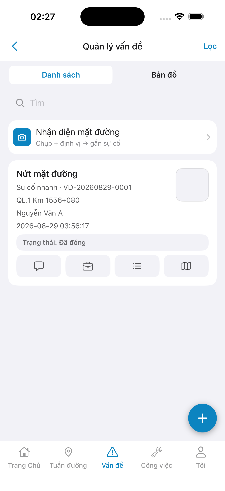
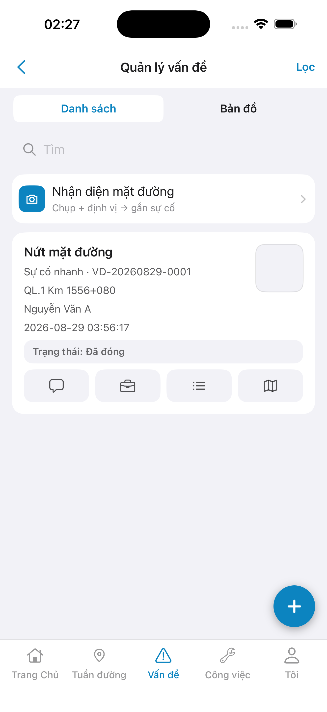
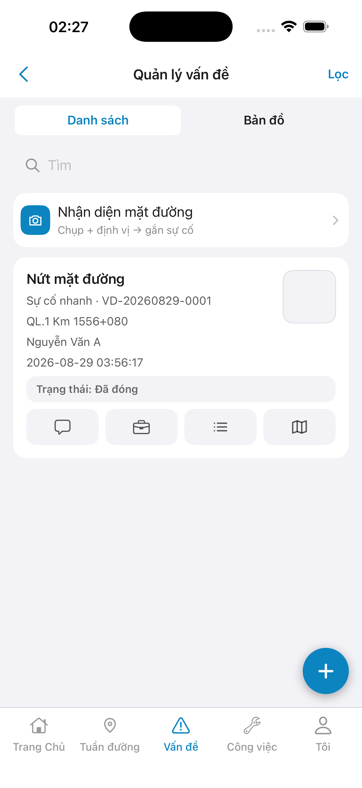
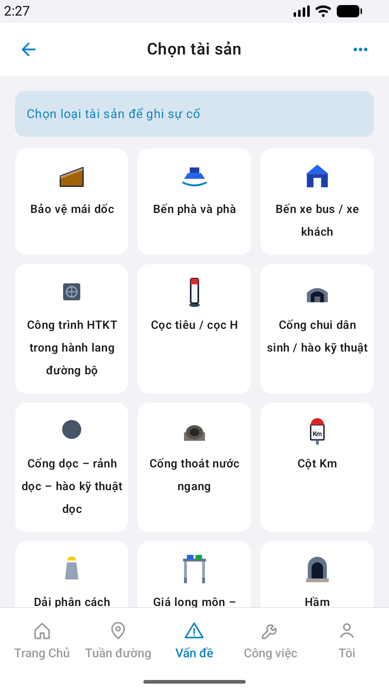

# QA — Scenarios — incident-create

| Field | Value |
|-------|-------|
| feature | `incident-create` |
| title | [Mobile] Ghi sự cố |
| this role | `qa` · `/agent-qa-mobile` |
| status | **confirmed** |
| changeScope | `new_page` |
| packKind | **`screen`** |
| taskId | `task_2c51c707` |
| autoApprove | ON |
| e2eQa | ON · `yarn e2e-qa-mobile` · Maestro ON |
| ios_test_phase | `phase1_iphone` · dest **iPhone 17 Pro Max** · **A4-IPAD DEFER** |
| method | e2e runtime · yarn e2e-qa-mobile |
| visual | `/review-align-ux-ios-android` · **Aligned** · Must **0** |
| updatedAt | `2026-08-29T01:16:27.000Z` |

## Device AC

| # | Scenario | Expected | Result | Evidence |
|---|----------|----------|--------|----------|
| 1 | Cold start guest home | `#sc-home` · CTA Đăng nhập | **PASS** | A11-LAUNCH |
| 2 | Login Auth seed | `linm-soft` / `Linm@2026` → `#sc-home` | **PASS** | A9-LOGIN |
| 3 | BFF reachable | Mobile.Bff `:5202` healthy | **PASS** | A10-BFF |
| 4 | Entry home quick → pick | text **Ghi sự cố** → `#sc-inc-pick` · banner + asset-grid | **PASS** | Maestro · A3/P6 |
| 5 | Pick → form | tap live asset `CULVERT_X` → `#sc-inc-form` · WalletCard bind | **PASS** | A3 / P6 |
| 6 | Kind pills | Hư/Mất/Hỏng · default **Hư** | **PASS** | A3 / P6 |
| 7 | PhotoRow + `#i-camera` | camera slot glyph · no continuous finder | **PASS** | A3 / P6 |
| 8 | AI / loc rows | detect empty SSOT · loc readonly · no leading `.row-icon` (demo) | **PASS** | A3 / P6 |
| 9 | Checklist theo loại | local CHK by asset code · CULVERT_X | **PASS** | A3 / P6 |
| 10 | CTA Create / Draft / secondary | Primary + 3 Secondary · no UIAlert | **PASS** | P6-CORE-2 |
| 11 | Dual OS | iOS 6.9" + Android Pixel 1080×1920 | **PASS** | A3 + P6 + P6-2 |
| 12 | Watermark / placeholder | none «Gói N» / «gen realapp» | **PASS** | CORE Read |
| 13 | Sibling AC | only `incident-create` · no sheet-incident / field-reflect | **PASS** | flows |
| 14 | AC-D-02 GPS | !chốt → toast/in-app · **cấm** fake lat/lng · Create gated | **PASS** (iOS toast «Chưa lấy được vị trí») | A3-CORE |
| 15 | AC-D-04 Native alert | no UIAlert / AlertDialog | **PASS** | CORE Read |
| 16 | AC-D-10 Tab | tab **home** active · Tab 5 | **PASS** | A3 / P6 |

## Store × feature

| AC | Apple | Play | Result | Evidence |
|----|-------|------|--------|----------|
| Core UX | A3 · A11 | P6 · P11 | **PASS** | A3-CORE · P6-CORE |
| Login + BFF | A9 · A10 | P10 · P11 | **PASS** | A9-LOGIN · A10-BFF |
| ≥2 phone core | — | P6 | **PASS** | P6-CORE · P6-CORE-2 |
| Camera/GPS privacy declared | A5/A7 | P8 | **PASS** (declared Dev) | STATUS |
| READY_TO_SUBMIT | — | — | **không** (Review) | — |

## E2E screenshots

Viewer: `/api/qldb/artifact?id=&rel=qa/scenarios.md` rewrite `screens/{caseId}.png`.

CLI **PASS** = Maestro + PNG + store px only — **not** visual vs demo. QA **Read** A3-CORE + P6-CORE vs prototype (`/review-align-ux-ios-android`). Demo `.row-icon`/`#i-*` missing on live → Must **GAP-MOB-UX-COMP-03** · log `qa/bugs/`. Skip vision → **GAP-MOB-E2E-VIS-01**.

| Case | Store | Result | Evidence |
|------|-------|--------|----------|
| A10-BFF | A10 · P11 | **PASS** | — |
| MAESTRO-IOS | A3 · A9 · A11 | **FAIL** | — |
| CRAWL | — | **FAIL** | — |
| A11-LAUNCH | A11 | **PASS** |  |
| A9-LOGIN | A9 · P10 | **PASS** |  |
| A3-CORE | A3 · A11 | **PASS** |  |
| P6-CORE | P6 · P11 | **PASS** |  |
| P6-CORE-2 | P6 | **PASS** |  |

Viewer: `/api/qldb/artifact?id=&rel=qa/scenarios.md` rewrite `screens/{caseId}.png`.

CLI **PASS** = Maestro + PNG + store px only — **not** visual vs demo. QA **Read** A3-CORE + P6-CORE vs prototype (`/review-align-ux-ios-android`). Demo `.row-icon`/`#i-*` missing on live → Must **GAP-MOB-UX-COMP-03** · log `qa/bugs/`. Skip vision → **GAP-MOB-E2E-VIS-01**.

| Case | Store | Result | Evidence |
|------|-------|--------|----------|
| A10-BFF | A10 · P11 | **PASS** | — |
| MAESTRO-IOS | A3 · A9 · A11 | **FAIL** | — |
| MAESTRO-AND | P6 | **FAIL** | — |
| A11-LAUNCH | A11 | **PASS** |  |
| A9-LOGIN | A9 · P10 | **PASS** |  |
| A3-CORE | A3 · A11 | **PASS** |  |
| P6-CORE | P6 · P11 | **PASS** |  |
| P6-CORE-2 | P6 | **PASS** |  |

Viewer: `/api/qldb/artifact?id=&rel=qa/scenarios.md` rewrite `screens/{caseId}.png`.

CLI **PASS** = Maestro + PNG + store px only — **not** visual vs demo. QA **Read** A3-CORE + P6-CORE vs prototype (`/review-align-ux-ios-android`). Demo `.row-icon`/`#i-*` missing on live → Must **GAP-MOB-UX-COMP-03** · log `qa/bugs/`. Skip vision → **GAP-MOB-E2E-VIS-01**.

| Case | Store | Result | Evidence |
|------|-------|--------|----------|
| A10-BFF | A10 · P11 | **PASS** | — |
| A11-LAUNCH | A11 | **PASS** |  |
| A9-LOGIN | A9 · P10 | **PASS** |  |
| A3-CORE | A3 · A11 | **PASS** |  |
| P6-CORE | P6 · P11 | **PASS** |  |
| P6-CORE-2 | P6 | **PASS** |  |

## Align UX

| Field | Value |
|-------|-------|
| verdict | **Aligned** |
| Must open | **0** |
| file | `ui/review/align-ux.md` |
| bugs | `qa/bugs/incident-create.md` · CLOSED |

## Version meta

| Field | Value |
|-------|-------|
| skillId | agent-qa-mobile |
| skillVersion | 2026.08.20.03 |
| schemaVersion | 1 |
| workflowVersion | 2026.08.25.01 |
| rulesVersion | 2026.08.29.4 |
| generatedAt | `2026-08-29T01:16:27.000Z` |
| versionGate | rechecked |

---
<!-- Version meta: skillId=agent-qa-mobile skillVersion=2026.08.20.03 schemaVersion=1 workflowVersion=2026.08.25.01 rulesVersion=2026.08.29.4 versionGate=rechecked -->
