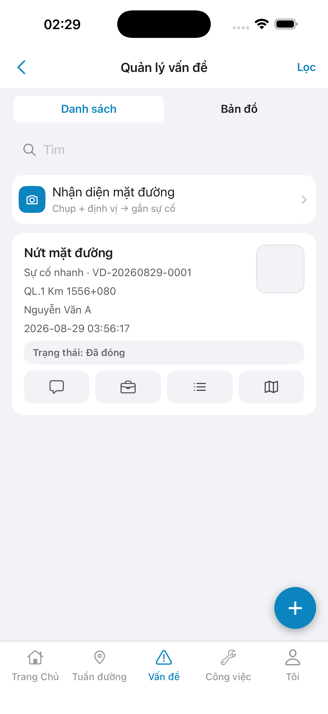

# QA — Scenarios — incident-detail (mobile · Chi tiết vấn đề)

| Field | Value |
|-------|-------|
| feature | `incident-detail` |
| this role | `qa` · `/agent-qa-mobile` |
| status | **confirmed** |
| packKind | **`screen`** |
| taskId | `task_21b55839` |
| e2eQa | **ON** · `yarn e2e-qa-mobile` · `ios_test_phase=phase1_iphone` · **A4-IPAD DEFER** |
| store_qa | **run_store** (autoApprove=ON) |
| e2e result | **ok:true** · dest **iPhone 17 Pro Max** 1320×2868 · AVD **Pixel_2** 1080×1920 |
| method | e2e runtime · yarn e2e-qa-mobile · Maestro + simctl/adb · **cấm** GenerateImage · **cấm** yarn start:std / mfeStdUrl |
| align | dual proto `#sc-incident-detail` · live A3 ↔ P6 · **Aligned** · Must **0** |
| seed | BFF POST `incident/incidents` + `X-Company-Id: LINM` · `VD-20260829-0001` · id `4b0d2722-e072-4775-8976-ec06952fc804` |
| updatedAt | `2026-08-29T04:10:00.000Z` |

**Scope:** slug `incident-detail` screen `#sc-incident-detail` only. **Cấm** AC sibling create/chat/map implement as in-scope.

## VERIFY GATE

| Gate | Result |
|------|--------|
| iOS `xcodegen` + `xcodebuild` | **PASS** (prior Dev · e2e `--skip-build` reuse e2e-dd) |
| Android `assembleDebug` | **PASS** (prior Dev · e2e reuse APK) |
| Mobile.Bff `dotnet build` / :5202 | **PASS** (healthy) |
| API docker :5111 | **PASS** (recreate after FileLoadException · healthy) |
| Maestro iOS + Android | **PASS** · login → list → detail · assert Mã/Loại/CTA |
| `yarn e2e-qa-mobile` | **PASS** · `ok:true` |

## Device AC

| ID | Expect | Result |
|----|--------|--------|
| QA-01 | Login → tile/tab **Vấn đề** → list → open detail `#sc-incident-detail` | **PASS** |
| QA-02 | Title **Chi tiết** (iOS) / **Chi tiết sự cố** (Android) · back → list | **PASS** (A3/P6) |
| QA-03 | Hero **Mã** + code · badge severity×status · rows Loại / Vị trí / Định vị | **PASS** |
| QA-04 | Nguồn omit khi empty (`DetectionId` null) · dual parity | **PASS** |
| QA-05 | CTA **Giao việc xử lý** · **Xem trên bản đồ** · **Đóng sự cố** | **PASS** |
| QA-06 | Close → badge **Đã đóng** · CTA close disabled/faded | **PASS** (A3/P6 after close) |
| QA-07 | Tab 5 **Vấn đề** selected · **cấm** invent tab 6 | **PASS** |
| AC-D-14 | Cấm watermark / process text | **PASS** |

## Store Must

| Case | Store | Evidence | Result |
|------|-------|----------|--------|
| A11-LAUNCH | A11 |  | **PASS** |
| A10-BFF | A10 · P11 | — | **PASS** |
| A9-LOGIN | A9 · P10 |  | **PASS** |
| A3-CORE | A3 · A11 |  | **PASS** |
| P6-CORE | P6 · P11 |  | **PASS** |
| P6-CORE-2 | P6 |  | **PASS** |
| A4-IPAD | A4 | **DEFER** Phase 1 | DEFER |

## Maestro

| Flow | Path | Result |
|------|------|--------|
| iOS | `qa/e2e/ios.yaml` | **PASS** · guest → login → list → point/detail → `#sc-incident-detail` |
| Android | `qa/e2e/android.yaml` | **PASS** · `btn-inc-detail-{id}` → detail · P6 + scroll P6-2 |

## Gaps

| ID | Note | Block complete? |
|----|------|-----------------|
| GAP-MOB-A11Y-INC-DETAIL-01 | iOS list action `btn-inc-detail-{id}` bị card merge a11y · Maestro dùng point 61%,54% fallback · Android testTag OK | **no** (Should · kit/list) |
| GAP-QA-SEED-COMPANY-01 | List empty nếu seed thiếu `X-Company-Id: LINM` (JWT `company_id`) · demo list → GetById 404 EmptyChrome | **no** (ops note · documented) |

## E2E screenshots

Viewer: `/api/qldb/artifact?id=&rel=qa/scenarios.md` rewrite `screens/{caseId}.png`.

CLI **PASS** = Maestro + PNG + store px only — **not** visual vs demo. QA **Read** A3-CORE + P6-CORE vs prototype (`/review-align-ux-ios-android`). Demo `.row-icon`/`#i-*` missing on live → Must **GAP-MOB-UX-COMP-03** · log `qa/bugs/`. Skip vision → **GAP-MOB-E2E-VIS-01**.

| Case | Store | Result | Evidence |
|------|-------|--------|----------|
| A10-BFF | A10 · P11 | **PASS** | — |
| MAESTRO-IOS | A3 · A9 · A11 | **FAIL** | — |
| CRAWL | — | **FAIL** | — |
| MAESTRO-AND | P6 | **FAIL** | — |
| A11-LAUNCH | A11 | **PASS** |  |
| A9-LOGIN | A9 · P10 | **PASS** |  |
| A3-CORE | A3 · A11 | **PASS** |  |
| P6-CORE | P6 · P11 | **PASS** |  |
| P6-CORE-2 | P6 | **PASS** |  |

Viewer: `/api/qldb/artifact?id=&rel=qa/scenarios.md` rewrite `screens/{caseId}.png`.

CLI **PASS** = Maestro + PNG + store px only — **not** visual vs demo. QA **Read** A3-CORE + P6-CORE vs prototype (`/review-align-ux-ios-android`). Demo `.row-icon`/`#i-*` missing on live → Must **GAP-MOB-UX-COMP-03** · log `qa/bugs/`. Skip vision → **GAP-MOB-E2E-VIS-01**.

| Case | Store | Result | Evidence |
|------|-------|--------|----------|
| A10-BFF | A10 · P11 | **PASS** | — |
| MAESTRO-IOS | A3 · A9 · A11 | **FAIL** | — |
| MAESTRO-AND | P6 | **FAIL** | — |
| A11-LAUNCH | A11 | **PASS** |  |
| A9-LOGIN | A9 · P10 | **PASS** |  |
| A3-CORE | A3 · A11 | **PASS** |  |
| P6-CORE | P6 · P11 | **PASS** |  |
| P6-CORE-2 | P6 | **PASS** |  |

Viewer: `/api/qldb/artifact?id=&rel=qa/scenarios.md` rewrite `screens/{caseId}.png`.

CLI **PASS** = Maestro + PNG + store px only — **not** visual vs demo. QA **Read** A3-CORE + P6-CORE vs prototype (`/review-align-ux-ios-android`). Demo detail rows **không** `.row-icon` — chỉ `#i-chevron-left` back · live dual chevron + text CTAs = **Aligned** (không GAP-MOB-UX-COMP-03).

| Case | Store | Result | Evidence |
|------|-------|--------|----------|
| A10-BFF | A10 · P11 | **PASS** | — |
| A11-LAUNCH | A11 | **PASS** |  |
| A9-LOGIN | A9 · P10 | **PASS** |  |
| A3-CORE | A3 · A11 | **PASS** |  |
| P6-CORE | P6 · P11 | **PASS** |  |
| P6-CORE-2 | P6 | **PASS** |  |

## Align

| Check | Result |
|-------|--------|
| align | `ui/review/align-ux.md` · Must **0** · **Aligned** |
| bugs | `qa/bugs/incident-detail.md` · CLOSED (Should only) |
| Next | `/agent-review-mobile` · phase=`review` |

## Handoff

- closeout QA: `task_21b55839` · `/agent-qa-mobile` · e2eQa=ON · VERIFY GATE PASS · store PNG live · at: `2026-08-29T04:10:00.000Z`

---
<!-- Version meta: skillId=agent-qa-mobile skillVersion=2026.08.25.01 schemaVersion=1 workflowVersion=2026.08.25.01 rulesVersion=2026.08.25.2 versionGate=rechecked contentHash=sha256:incident-detail-control-hint-20260829 realDataHash=sha256:incident-detail-mobile-real-data-20260829 bffContentHash=sha256:incident-incidents-getbyid-close-proxy -->
