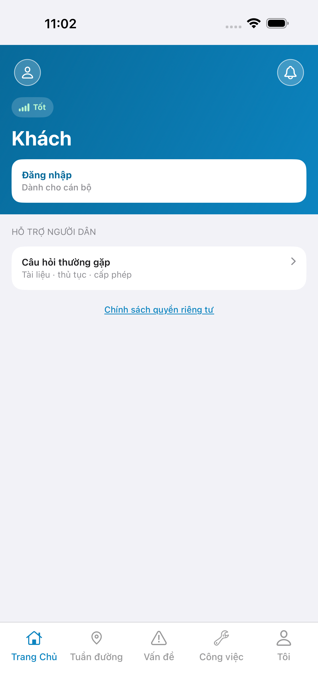
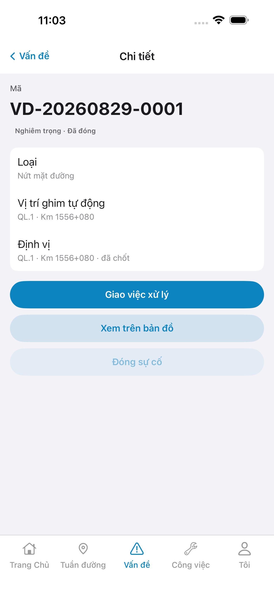
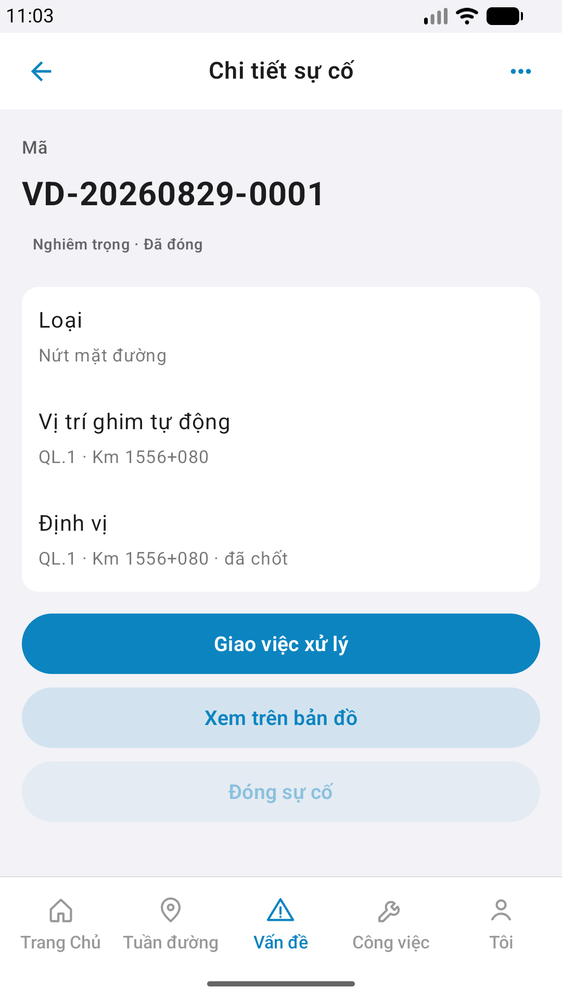

# Capture — incident-detail

| Case | Store | Result | Evidence |
|------|-------|--------|----------|
| A10-BFF | A10 · P11 | **PASS** | — |
| A11-LAUNCH | A11 | **PASS** |  |
| A9-LOGIN | A9 · P10 | **PASS** |  |
| A3-CORE | A3 · A11 | **PASS** |  |
| P6-CORE | P6 · P11 | **PASS** |  |
| P6-CORE-2 | P6 | **PASS** |  |

| Slot | Device | px | Note |
|------|--------|-----|------|
| A11 / A9 / A3 | iPhone 17 Pro Max | 1320×2868 | Phase 1 · A4-IPAD DEFER |
| P6 / P6-2 | Pixel_2 emulator | 1080×1920 | Play phone |

iOS device: iPhone 17 Pro Max  
iPad device: DEFER Phase 1  
method: e2e runtime · yarn e2e-qa-mobile · Maestro ON  

CLI PASS = capture+px only. Visual = `/review-align-ux-ios-android` Read CORE vs demo HTML · **Aligned**.

Listing official → `/store-image-capture` confirm file live (cấm AI vẽ).
