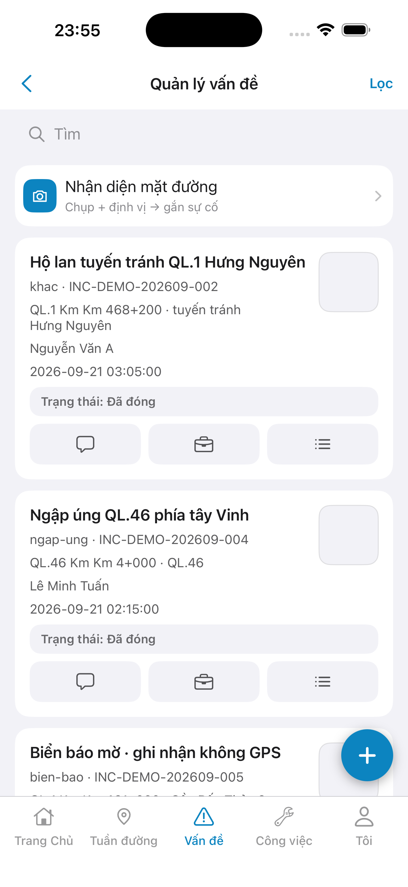
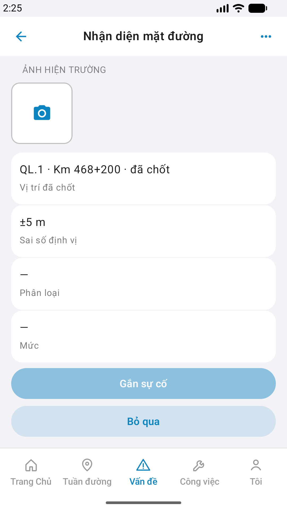
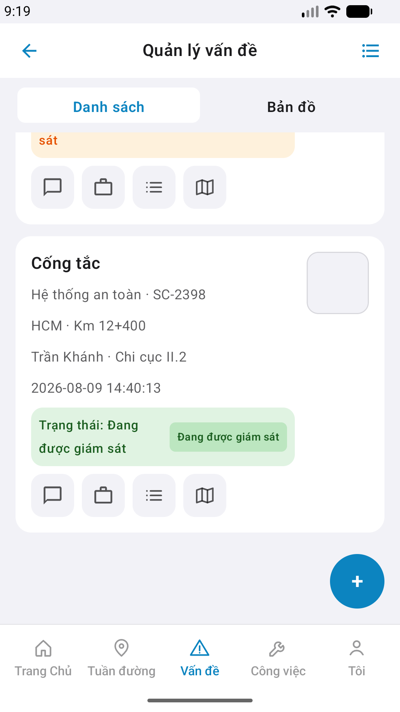

# QA — Scenarios — incident-list (mobile list · Vấn đề)

| Field | Value |
|-------|-------|
| feature | `incident-list` |
| this role | `qa` · `/agent-qa-mobile` |
| status | **confirmed** |
| packKind | **`list`** |
| taskId | `task_f70a425c` |
| e2eQa | **ON** · `yarn e2e-qa-mobile` · `ios_test_phase=phase1_iphone` · **A4-IPAD DEFER** |
| store_qa | **run_store** (autoApprove=ON) |
| e2e result | **ok:true** · dest **iPhone 17 Pro Max** 1320×2868 · AVD **Pixel_2** 1080×1920 |
| method | e2e runtime · yarn e2e-qa-mobile · Maestro + simctl/adb · **cấm** GenerateImage · **cấm** yarn start:std / mfeStdUrl |
| align | dual proto `#sc-incident-list` · live A3 ↔ P6 · **Aligned** · Must **0** |
| updatedAt | `2026-09-01T04:25:00.000Z` |

**Scope:** slug `incident-list` list `#sc-incident-list` only. **Cấm** AC sibling (`vis-capture` · `incident-detail` · `incident-chat` · `gis-map` implement).

## VERIFY GATE

| Gate | Result |
|------|--------|
| iOS `xcodegen` + `xcodebuild` | **PASS** |
| Android `assembleDebug` | **PASS** |
| Mobile.Bff `dotnet build` | **PASS** |
| API docker + BFF :5202 | **PASS** (API host :5111 macOS · `--skip-start`) |
| `yarn e2e-qa-mobile` | **PASS** · `ok:true` |

## Device AC

| ID | Expect | Result |
|----|--------|--------|
| QA-01 | Login → Home tile **Vấn đề** / tab `incident` → `#sc-incident-list` | **PASS** |
| QA-02 | Title **Quản lý vấn đề** · segment Danh sách/Bản đồ · search · banner | **PASS** |
| QA-03 | ≥2 cards · Nứt mặt đường · Cống tắc (BFF seed + scroll P6-2) | **PASS** |
| QA-04 | Banner **Nhận diện mặt đường** + camera glyph | **PASS** |
| QA-05 | Card actions chat · briefcase · list · mappin glyphs · status bar full width | **PASS** (post edit-mobile-feature) |
| QA-06 | FAB + create entry | **PASS** (visual · `fab-inc-create` optional kit) |
| QA-07 | Tab 5 **Vấn đề** selected | **PASS** |
| AC-D-14 | Cấm watermark / process text | **PASS** |

## Store Must

| Case | Store | Evidence | Result |
|------|-------|----------|--------|
| A11-LAUNCH | A11 |  | **PASS** |
| A10-BFF | A10 · P11 | — | **PASS** |
| A9-LOGIN | A9 · P10 |  | **PASS** |
| A3-CORE | A3 · A11 |  | **PASS** |
| P6-CORE | P6 · P11 |  | **PASS** |
| P6-CORE-2 | P6 |  | **PASS** |
| A4-IPAD | A4 | **DEFER** Phase 1 | DEFER |

## Maestro

| Flow | Path | Result |
|------|------|--------|
| iOS | `qa/e2e/ios.yaml` | **PASS** · scroll fold · optional `Cống tắc` / FAB a11y |
| Android | `qa/e2e/android.yaml` | **PASS** · P6 + scroll → P6-2 |

## Gaps

| ID | Note | Block complete? |
|----|------|-----------------|
| GAP-MOB-COPY-SEARCH-01 | Kit `LinmSearchField` **Tìm** · demo **Tìm kiếm vấn đề…** | **no** (Should) |
| GAP-MOB-A11Y-FAB-01 | `LinmFab` không inherit `fab-inc-create` id · visual OK | **no** (Should · kit) |

## E2E screenshots

CLI **PASS** = Maestro + PNG + store px only — **not** visual vs demo. QA **Read** A3-CORE + P6-CORE vs prototype (`/review-align-ux-ios-android`).

| Case | Store | Result | Evidence |
|------|-------|--------|----------|
| A10-BFF | A10 · P11 | **PASS** | — |
| A11-LAUNCH | A11 | **PASS** |  |
| A9-LOGIN | A9 · P10 | **PASS** |  |
| A3-CORE | A3 · A11 | **PASS** |  |
| P6-CORE | P6 · P11 | **PASS** |  |
| P6-CORE-2 | P6 | **PASS** |  |

## Align

| Check | Result |
|-------|--------|
| align | `ui/review/align-ux.md` · Must **0** · **Aligned** |
| bugs | `qa/bugs/incident-list.md` · CLOSED (Should only) |
| Next | `/agent-review-mobile` · phase=`review` |

## Handoff

- Re-QA sau `/edit-mobile-feature` task_3a718e5d · BFF seed row 2 · ios.yaml scroll parity android
- closeout: `task_f70a425c` · `/agent-qa-mobile` · at: `2026-09-01T04:25:00.000Z`

---
<!-- Version meta: skillId=agent-qa-mobile skillVersion=2026.08.25.01 schemaVersion=1 workflowVersion=2026.08.25.01 rulesVersion=2026.08.25.2 versionGate=rechecked contentHash=sha256:incident-list-mobile-list-20260829 -->
