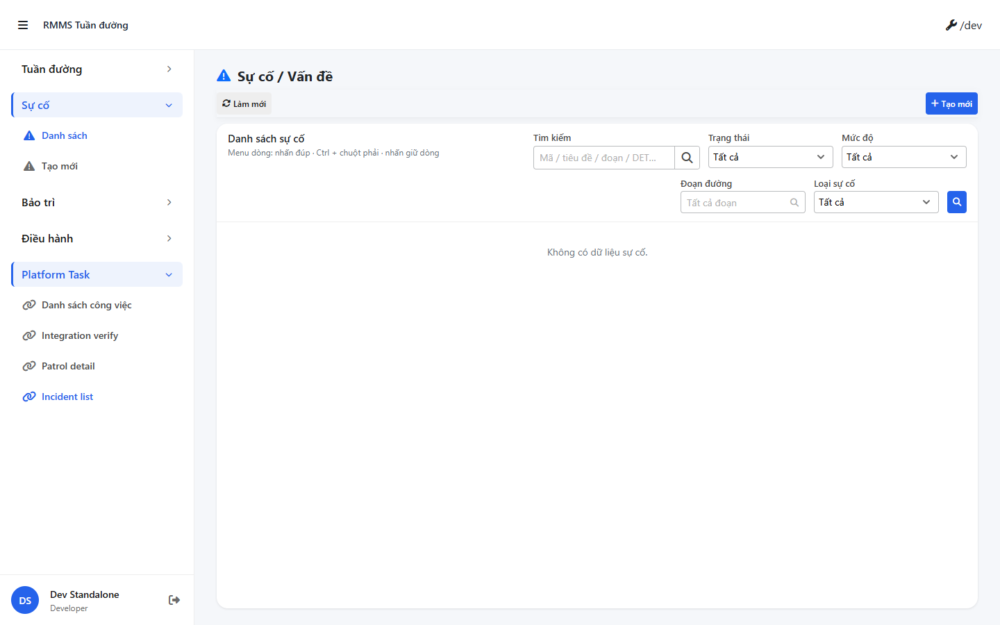
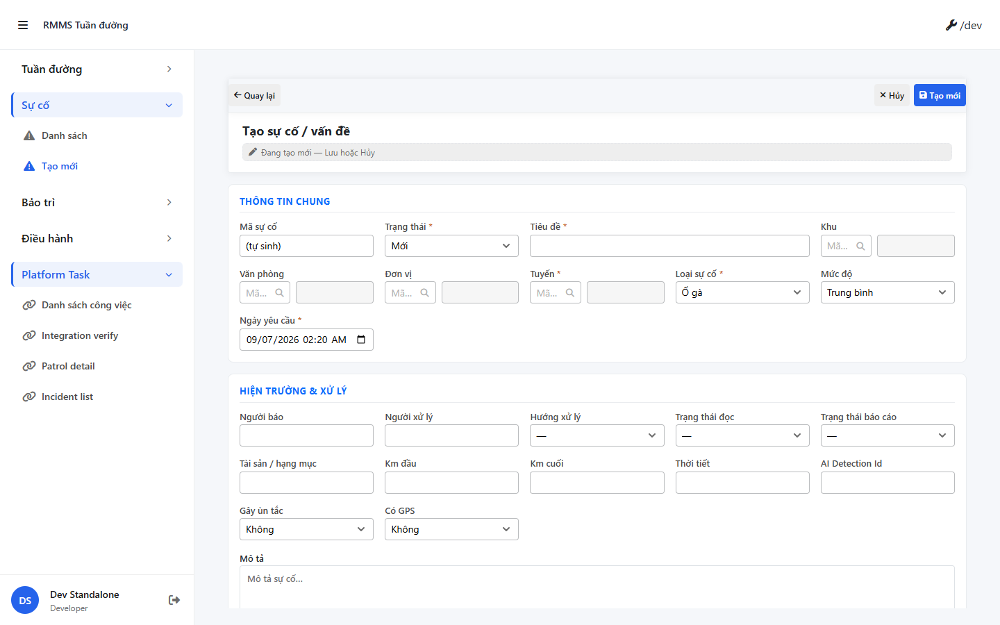

# QA — Scenarios — incident

| Field | Value |
|-------|-------|
| feature | `incident` |
| role | `qa` · `/agent-qa` |
| taskId | `task_715a9115` |
| status | **pass** |
| verdict | **PASS** |
| e2eQa | **ON** |
| method | `e2e runtime · Field :9304 + docker compose + Playwright` (chromium `executablePath` fallback — `yarn e2e-qa` hung on `playwright install`) |
| mfeStdUrl | `http://localhost:9304/su-co` (SSOT · STATUS `route_keep` · **cấm** packet `/incident`) |
| testid | `rmms-incident-list-page` |
| docker | API `:5111` · BFF `:5201` · up 2026-09-06 |
| MFE | `D:/AI-QLBD/MFE-Source/Linm.Web.RMMS.Field` · port **9304** already listening (reuse · **cấm** kill worker) |
| BE | `D:/AI-QLBD/Linm.RMMS.WebService` · `api/v1/incident/incidents` |
| packKind | **`list`** · Kind B A–D · fill_gaps P1 |
| autoApprove | ON |
| updatedAt | `2026-09-06T19:22:00.000Z` |
| skillVersion | `2026.08.25.02` |
| schemaVersion | `qldb-workflow-skill-v1` |
| workflowVersion | `2026.08.25.02` |
| contentHash | `sha256:927979e9a8dc3f1491792cc2a87a5e42e0af21842278e65aefcb359f45e021ad` |
| versionGate | `recheck_new` |

**Cấm** `phase=done` · Fail → `qa_fail_rollback` · **không** completed.

---

## Runtime evidence (e2eQa ON)

| # | Check | Result | Evidence |
|---|-------|--------|----------|
| S0 | Route `mfeStdUrl` + `[data-testid=rmms-incident-list-page]` | **PASS** |  |
| S1 | Filter bar apply status «Mới» · list refresh | **PASS** |  |
| QA-20 | Create slideout `?form=create` + form z2 / slideout | **PASS** |  |

`screens/manifest.json` · `ok: true` · capturedAt `2026-09-06T19:20:52.257Z` · PNG SHA256 **distinct** (S0≠S1≠QA-20).

Entry: standalone `:9304` · route **`/su-co`** · title «Danh sách sự cố».

---

## Static / DoD (source + runtime)

| Id | Check | Result |
|----|-------|--------|
| QA-STD-01 | Packet URL `/incident` vs STATUS/`route_keep` **`/su-co`** | **recorded** — E2E on **`/su-co`** |
| QA-E2E-01 | PNG `qa/screens/{caseId}.png` · embed scenarios · distinct hash | **PASS** |
| QA-E2E-02 | docker API+BFF + MFE listen `:9304` | **PASS** (reuse existing :9304 · no kill) |
| QA-LIST-01 | Kind B A–D · `LinPageLayout` + grid + pagination | **PASS** (runtime S0/S1) |
| QA-FILTER-01 | `LinErpListFilterBar` · status «Mới» apply | **PASS** (S1) |
| QA-FORM-01 | Slideout create · z2 | **PASS** (QA-20) |
| QA-LKP-01 | SearchInput road-route · Dropdown types · init-data live | **PASS** — BFF init **200** |
| QA-MEDIA-01 | `LinImageUpload` · `data-des-id=DES-FORM-Z2-MEDIA` · `data-zone=upload` · `mediaIds` | **PASS** (FE) |
| QA-MEDIA-02 | BFF `POST web-bff/api/v1/files/init` | **PASS** HTTP **401** (route wired · auth required · **not** 404) |
| QA-API-01 | FE BASE `/incident/incidents` via BFF · list **200** | **PASS** |
| QA-BE-01 | API `GET …/incidents/init-data` | **PASS** HTTP **200** |
| QA-BFF-01 | BFF `GET web-bff/…/incidents/init-data` | **PASS** HTTP **200** · **GAP-QA-BFF-INIT-01 CLOSED** |
| QA-DEMO-01 | **0** demo-json SSOT chrome | **PASS** (runtime) |
| QA-BUILD-01 | MFE/BE build (Dev prior `task_f7a94b25`) | **PASS** (cite implement) |

---

## T-QA-* scenarios

### T-QA-FILTER-01

| ID | Scenario | Expect | Result |
|----|----------|--------|--------|
| QA-F-01 | Zone B `LinErpListFilterBar` | search · status · severity · routeName · incidentType | **PASS** (S0/S1) |
| QA-F-03 | Apply filter → refresh | status «Mới» | **PASS** (S1) |

### T-QA-FORM-01

| ID | Scenario | Expect | Result |
|----|----------|--------|--------|
| QA-FM-01 | `?form=create` | Slideout · z2 | **PASS** (QA-20) |

### T-QA-CRUD-01 (re-smoke)

| ID | Scenario | Expect | Result |
|----|----------|--------|--------|
| QA-20 | FormType create slideout | wired | **PASS** (QA-20 shot) |
| QA-21…28 | Create/Edit/View/Delete/Assign/Close | FormType CLOSED · **cấm** re-open | **PASS** (code re-smoke) |

### T-QA-MEDIA-01

| ID | Scenario | Expect | Result |
|----|----------|--------|--------|
| QA-M-01 | Form media zone | `LinImageUpload` · DES-FORM-Z2-MEDIA · purpose `incident-media` | **PASS** (FE) |
| QA-M-02 | Persist | `mediaIds` List≤10 · DB CSV | **PASS** (Dev wire + DTO) |
| QA-M-03 | files/* | BFF FileService.Bff routes | **PASS** · `/files/init` **401** (not 404) |
| QA-M-04 | Upload 2xx | File.Api `:5018` | **NOTE** — may be down locally · auth/route OK |

---

## Gaps

| ID | Severity | Note | Block complete? |
|----|----------|------|-----------------|
| **GAP-QA-BFF-INIT-01** | — | **CLOSED** · BFF init-data **200** | No |
| **GAP-INC-MEDIA-01** | — | **CLOSED** · FE upload + BFF files/* + MediaIds | No |
| GAP-INC-MEDIA-HARD | lock | cấm invent FilesController · persist presigned · ERP.* | kept |
| GAP-QA-PKT-URL-01 | info | Packet `--url=…/incident` rejected · use `/su-co` | No |
| GAP-QA-E2E-PW-01 | info | `yarn e2e-qa` hung `playwright install` + `__dirlock` · capture used chromium-1187 `executablePath` · same S0/S1/QA-20 contract | No |
| GAP-INC-ORG-01 | defer | org-unit filter P2 | No |
| GAP-INC-MAP-01 | defer | Kind F map P2 | No |

---

## Build / VERIFY GATE

| Layer | Command | Result |
|-------|---------|--------|
| Docker | `docker compose up -d` | **PASS** · api/bff Running |
| BFF init | `GET …/incidents/init-data` | **PASS** **200** |
| Files | `POST …/files/init` | **PASS** **401** (wired) |
| `yarn start:std` | port **9304** | **PASS** (reuse · EADDRINUSE on re-start · no kill) |
| E2E PNG | S0 · S1 · QA-20 distinct | **PASS** · manifest `ok:true` |

---

## Verdict

**PASS** · T-QA-MEDIA-01 · T-QA-CRUD-01 · e2e S0/S1/QA-20 · GAP-QA-BFF-INIT-01 + GAP-INC-MEDIA-01 **CLOSED**.

Next: **review** · `review/findings.md` · **cấm** `phase=done`.

<!-- qa taskId=task_715a9115 verdict=PASS contentHash=sha256:927979e9a8dc3f1491792cc2a87a5e42e0af21842278e65aefcb359f45e021ad -->
