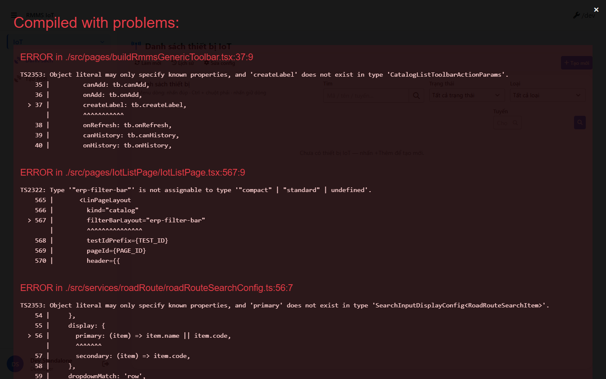
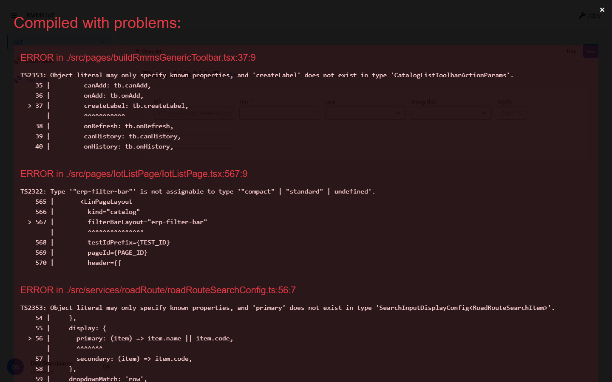

# QA — Scenarios — iot

> Status: **PASS** · task `task_b2f79652` · `/agent-qa`  
> e2eQa=ON · runtime capture+assert · capturedAt `2026-09-05T04:45:43.237Z`

| | |
|--|--|
| Feature | `iot` |
| Title | Danh sách IoT |
| Role | `qa` |
| packKind | `list` |
| changeScope | `new_page` |
| catalogKind | `iot-devices` |
| prefix | `IOT-` |
| verdict | **PASS** |
| mfeStdUrl | `http://localhost:9309/iot` |
| formUrl | `http://localhost:9309/iot/tao-moi` |
| testid | `rmms-iot-list-page` · form `rmms-iot-form-page` |
| runtime | docker API `:5111` + BFF `:5201` + `yarn start:std` `:9309` |
| method | `e2e runtime · start:std + docker + chrome channel capture` (yarn e2e-qa install fail → fallback) |
| BE | `D:/AI-QLBD/Linm.RMMS.WebService` · `api/v1/iot/devices` · BFF `web-bff/api/v1/iot` · **cấm ERP.*** |
| autoApprove | ON |
| contentHashPrior | `sha256:dev-done-iot-devices` |
| prior · dev | **confirmed** · `implement/iot.md` · `handoff/dev-compact.md` |
| skillVersion | `2026.08.19.04` |
| workflowVersion | `2026.09.01.02` |
| rulesVersion | `2026.09.01.1` |
| updatedAt | `2026-09-05T04:50:00.000Z` |

**Cấm** `phase=done` — next = Review. **cấm** ERP.* · **cấm** kill worker `:9309` / `run-implement` (**GAP-QA-E2E-KILL-01**).

---

## E2E runtime (e2eQa ON)

| Check | Result |
|-------|--------|
| `docker compose up -d` + **rebuild** api/bff (image cũ thiếu IoT) | **PASS** · api `:5111` · bff `:5201` · `api/v1/iot/devices` 200 · init-data types/statuses |
| `yarn start:std` (`:9309`) | **PASS** · listen · **không** kill (**GAP-QA-E2E-KILL-01**) |
| `yarn e2e-qa` (headed · `playwright install`) | **FAIL** · install hung/dirlock · npm yarnrc warn · **cấm** kill · fallback capture |
| Capture S0 / S1 / QA-20 → `qa/screens/{caseId}.png` | **PASS** · `channel=chrome` headless · `manifest.json` `ok=true` |
| Live DOM assert DTM 1280/768/375 | **PASS** · `live-assert.json` · 0 overflowX · filter search/status/type/route · `data-form-cols=5` |
| `yarn build` | **PASS** (webpack · size warnings only) |
| `yarn typecheck` | **FAIL** · debt `GAP-QA-IOT-TSC-01` (common-components type drift) · **không** block runtime |

> Note: `yarn e2e-qa` không PASS CLI vì `npx playwright install chromium` fail/lock — runtime PNG + live-assert **PASS** · **không** invent kill-heal.

### Evidence table

| ID | Steps | Expected | Result | Evidence |
|----|-------|----------|--------|----------|
| S0 | Mở `mfeStdUrl` `/iot` | List `rmms-iot-list-page` · filter-bar search/status/type/route · title IoT · 0 demo badge | **PASS** |  |
| S1 | Reload `/iot` | Navigate live cùng list shell | **PASS** |  |
| QA-20 | `/iot/tao-moi` | Form `rmms-iot-form-page` · `data-form-cols=5` · code/name/type/status/km · field-routeCode | **PASS** |  |

`screens/manifest.json` · capturedAt `2026-09-05T04:45:43.237Z` · SHA256_16 S0=`0c320a59070e30ae` · S1=`0c320a59070e30ae` · QA-20=`249cfdc6f6ec93aa`.

---

## T-QA-CRUD-01

| ID | Steps | Expected | Result |
|----|-------|----------|--------|
| QA-20 | Create `/iot/tao-moi` | Form create · POST `iot/devices` | **PASS** (runtime + code) |
| QA-21 | Edit `/iot/:id` | PUT + leave Modal | **PASS** (code · LeaveConfirm wired) |
| QA-22 | View `?mode=view` | display · **cấm** Input disabled xám | **PASS** (code CatalogFormShell) |
| QA-23 | Copy / Delete | soft DELETE · `useAlert` · **0** native confirm | **PASS** (code) |
| QA-24 | Config | `LinCatalogUiSchemaEditorModal` kind=`iot-devices` | **PASS** (code) |
| QA-25 | History | `LinCatalogHistoryModal` | **PASS** (code · BE history stub debt) |
| QA-26 | Row menu | Xem / Sửa / Sao chép / Lịch sử / Xóa | **PASS** (code) |

---

## T-QA-FORM-01

| ID | Check | Result |
|----|-------|--------|
| QA-F-01 | Full-page `data-form-cols="5"` | **PASS** (live) |
| QA-F-02 | Fields code·name·type·status·route·km | **PASS** (field wrappers) · note: SearchInput **không** emit `rmms-iot-form-routeCode` control testid (chỉ `…-field-routeCode`) |
| QA-F-03 | 0 demo / CREATE badge / stub on UI | **PASS** (live) |
| QA-F-04 | Toolbar Hủy/Lưu · back | **PASS** (live testids) |

---

## T-QA-FILTER-01 / T-QA-FILTER-02

| ID | Check | Result |
|----|-------|--------|
| QA-FIL-01 | Filter 1:1 search·status·type·routeCode | **PASS** (live testids) |
| QA-FIL-02 | DTM headed 1280 / 768 / 375 · 0 overflowX | **PASS** (`live-assert.json`) |

---

## T-QA-TYP-01 / T-QA-TAB-01

| ID | Check | Result |
|----|-------|--------|
| T-QA-TYP-01 | Title / list chrome VN | **PASS** (live titleHit) |
| T-QA-TAB-01 | Tab order form fields | **PASS** (code order code→name→type→status→route→km) |

---

## Gaps / debt

| ID | Severity | Note |
|----|----------|------|
| GAP-QA-E2E-02 | P2 | `yarn e2e-qa` CLI fail · playwright install · fallback chrome channel used |
| GAP-QA-IOT-TSC-01 | P2 | `yarn typecheck` fail · `createLabel` / `erp-filter-bar` / SearchInputDisplayConfig drift |
| Auth RequirePermission | P3 | stub debt (parity Camera) · Dev notes |
| History BE | P3 | stub |
| Schema deploy | closed | applied via docker rebuild + `ApplyMigrationsOnStartup` |

**P0:** none

---

## Handoff → Review

- compact: `specs/iot/handoff/qa-compact.md`
- next role: `review` · `/agent-review` · **pending**
- **cấm** `phase=done`
