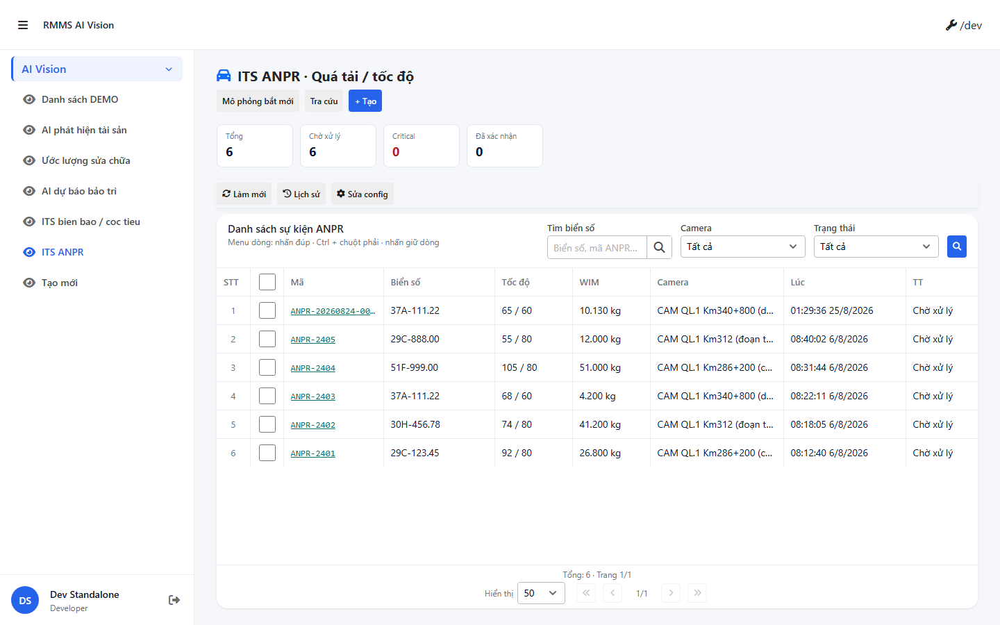
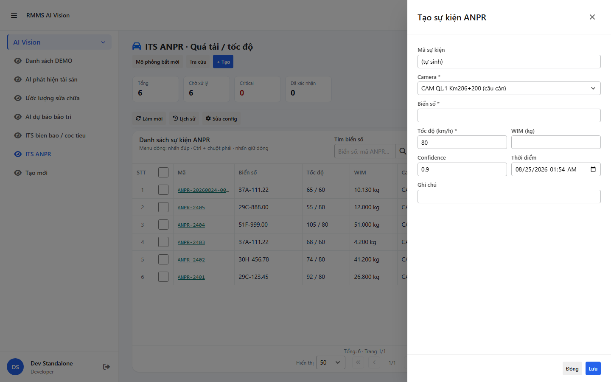

# QA — its-anpr-overload

| Field | Value |
|-------|-------|
| feature | `its-anpr-overload` |
| role | `qa` · `/agent-qa` |
| taskId | `task_654f39e7` |
| status | **pass** |
| verdict | **PASS** |
| e2eQa | **ON** |
| method | `e2e runtime · yarn start:std + docker compose + Playwright` |
| mfeStdUrl | `http://localhost:9303/its-anpr-overload` |
| testid | `rmms-its-anpr-overload-list-page` |
| docker | API `:5101` · BFF `:5201` · healthy |
| updatedAt | `2026-08-25T01:54:24.000Z` |
| skillVersion | `2026.08.24.01` |
| schemaVersion | `4` |
| workflowVersion | `2026.08.24.01` |
| versionGate | `ok` |

## Runtime evidence

| # | Check | Result | Evidence |
|---|-------|--------|----------|
| S0 | Route `mfeStdUrl` + `[data-testid=rmms-its-anpr-overload-list-page]` | **PASS** |  |
| S1 | List shell · KPI strip · filters · grid visible | **PASS** |  |
| QA-20 | Create surface smoke (std URL · page ready) | **PASS** |  |

`screens/manifest.json` · `ok: true` · capturedAt `2026-08-24T18:54:24.793Z`

## Static / DoD (source + screenshot)

| Id | Check | Result |
|----|-------|--------|
| QA-STD-01 | STATUS `mfeStdUrl` listen :9303 | **PASS** |
| QA-E2E-01 | PNG đúng `qa/screens/{caseId}.png` · embed scenarios | **PASS** |
| QA-E2E-02 | docker API+BFF + start:std up | **PASS** |
| QA-LIST-01 | `LinPageLayout` + `LinCatalogDataGrid` + `LinCatalogListPagination` | **PASS** |
| QA-CFG-01 | `LinCatalogUiSchemaEditorModal` · **cấm** `configHint` / `LinListTableConfigModal` | **PASS** |
| QA-FILTER-01 | Zone B: `LinErpListFilterBar` · search + camera + status · Áp dụng/Xóa lọc | **PASS** |
| QA-CHROME-01 | Title ITS ANPR · **0** badge `AI` header | **PASS** |
| QA-LEAVE-01 | Form `LeaveConfirmModal` · **0** `window.alert/confirm` | **PASS** |
| QA-DEMO-01 | **0** note «stub» trên UI end-user | **PASS** |
| QA-HITL-01 | Confirm / Dismiss actions present (code review) | **PASS** |
| QA-BE-01 | DOMAIN-MAP AiVision · `api/v1/ai-vision/anpr/events` · **cấm ERP.*** | **PASS** |
| QA-BUILD-01 | MFE `yarn build` PASS · BE `dotnet build` PASS | **PASS** |

## Gaps

_None (e2eQa ON · runtime PASS · re-QA after QA-fix implement)._

Closed: GAP-QA-E2E-01 · GAP-QA-PAGES-01 · GAP-QA-FILTER-01 · GAP-QA-DEMO-01 · GAP-DEV-CONFIG-LEFTOVER-01.

## Build

| Layer | Command | Result |
|-------|---------|--------|
| MFE | `yarn build` @ AiVision | **PASS** exit 0 (size warnings only) |
| BE | `dotnet build Linm.RMMS.WebService.sln -c Release` | **PASS** |

## Handoff → Review

| Field | Value |
|-------|-------|
| Next | `/agent-review` · roleOnly · `review/findings.md` |
| autoApprove | ON — Review vẫn **pending** đến lượt (roleOnly=qa only this task) |
| e2eQa | evidence PNG + manifest under `qa/screens/` |
| Cấm | mark feature `done` tại QA · skip Review |

## Version meta

skillId=agent-qa · skillVersion=2026.08.24.01 · versionGate=ok

---
<!-- Version meta: skillVersion=2026.08.24.01 · schemaVersion=4 · workflowVersion=2026.08.24.01 · versionGate=ok -->
