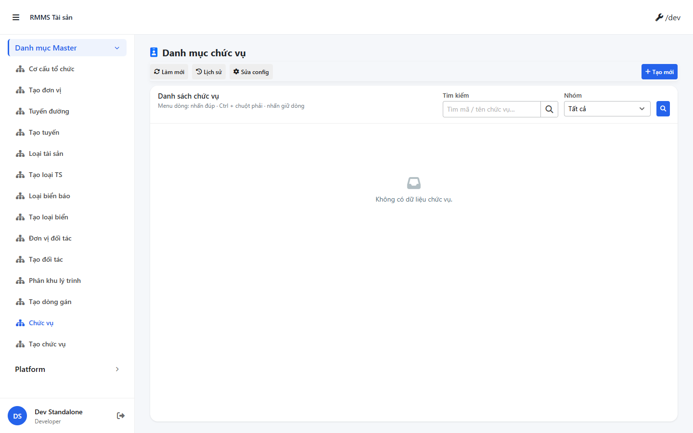
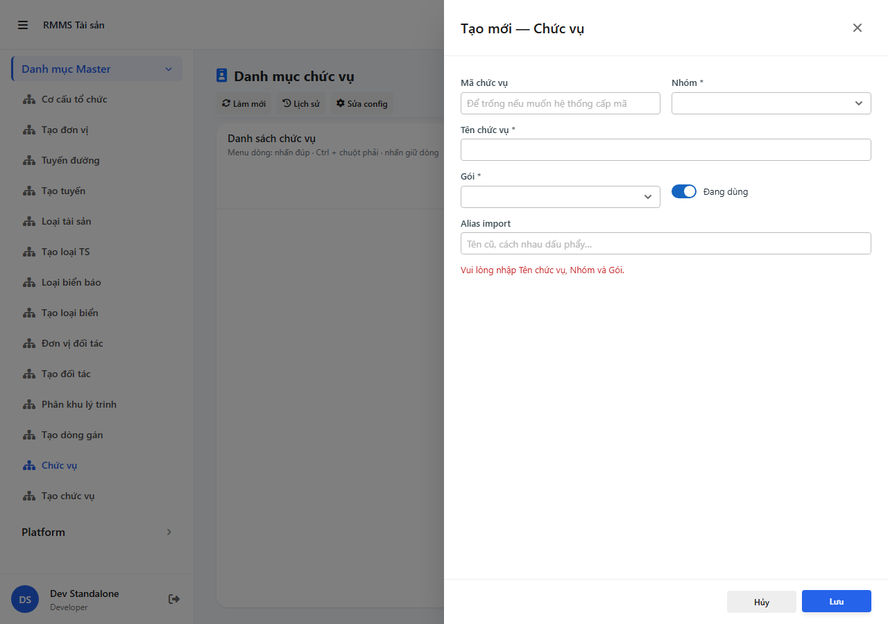
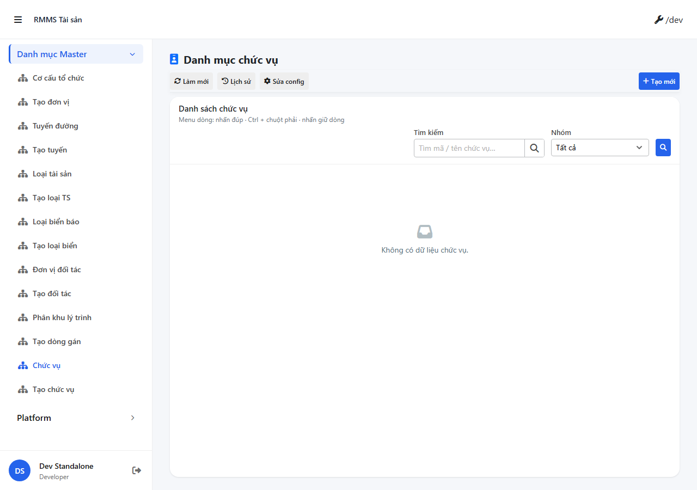
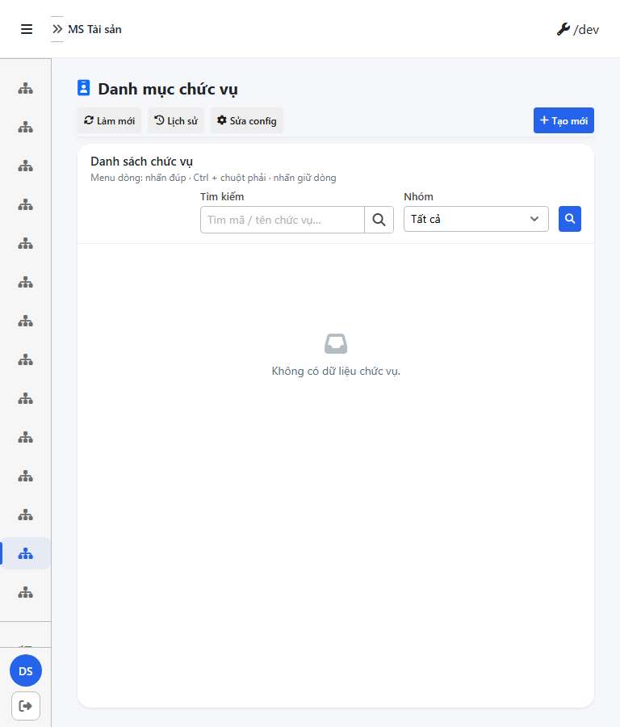
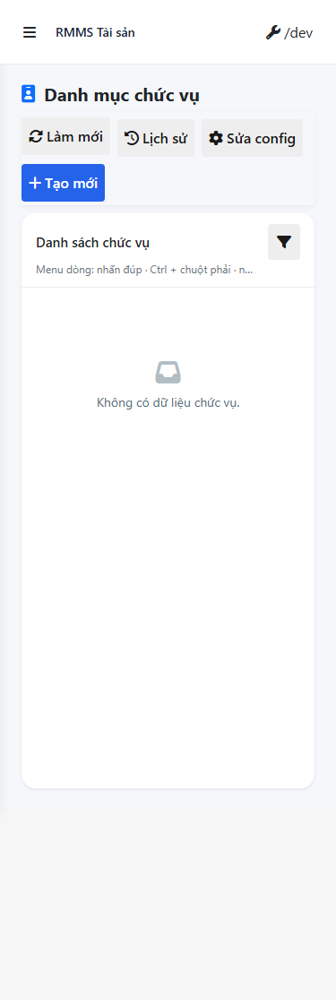

# QA scenarios — job-title

**Verdict:** **FAIL** · **cấm** `phase=done` · queue `failed` → `qa_fail_rollback`  
**method:** `e2e runtime · start:std + docker + yarn e2e-qa` (`--skip-start` vì :9318 và compose đã listen)  
**mfeStdUrl:** `http://localhost:9318/mas/chuc-vu` · testid `rmms-job-title-list`  
**CLI manifest:** `qa/screens/manifest.json` · S0/S1/QA-20 = goto HTTP 200 (không phải Create)

## Runtime

| Check | Result |
|-------|--------|
| docker | `linm-rmms-api` healthy `:5111` (compose `API_HOST_PORT`, không bind `:5101`) · BFF `:5201` |
| std | `yarn start:std` listen `:9318` |
| login | `e2e.local.json` user_set=true pass_len=9 · không dán secret |
| `GET :5111/api/v1/integration/job-titles` | **404** |
| BFF `…/job-titles` · `…/init-data` · `…/catalogs/job-title/ui-schema` | **404** |

Image API/BFF đang chạy không có route `job-titles` (container up trước code mới). Không rebuild trong role QA.

## Scenarios

| # | Case | Result | Evidence |
|---|------|--------|----------|
| S0 | Route + testid `rmms-job-title-list` · UTF-8 «Danh mục chức vụ» · không `á»`/`Ã` | **PASS** |  |
| S1 | List shell · toolbar Làm mới / Lịch sử / Sửa config / Tạo mới · không nhãn CREATE/EDIT/VIEW | **PASS** |  |
| QA-20 | Create + dòng mới trên lưới | **FAIL** |  |
| T-QA-CRUD-01 | Lưu xong grid có dòng · cấm empty | **FAIL** | lưới «Không có dữ liệu chức vụ» · API/BFF 404 |
| T-QA-FORM-01 | Required chặn request · body = UI | **FAIL** |  |
| T-QA-FILTER-01 | 🔍 mép phải card @1280 | **FAIL** |  |
| T-QA-FILTER-02 | Filter D+T+M | **FAIL** |  ·  |
| T-QA-TYP-01 | Title 22px · input D14 | **FAIL** | title computed **20px** · input **14px** |
| T-QA-TAB-01 | Tab order form | **BLOCKED** | không đo · P0 API/filter đã fail |

## T-QA-FORM-01

| uiField | rule | live | requestKey |
|---------|------|------|------------|
| name | required | Để trống + Lưu → «Vui lòng nhập Tên chức vụ, Nhóm và Gói.» · POST count **0** | `name` |
| titleGroup | required | init-data **404** · không có option BE để tách rule | `titleGroup` |
| packageHint | required | cùng lỗi · không submit được | `packageHint` |
| code | optional · uppercase nếu có | không happy-submit | `code` |
| legacyAliases | split `,` | không assert body | `legacyAliases` |
| isActive | switch | không assert body | `isActive` |

Slideout mở · `data-form-cols="2"` · nút Lưu width 100px. Không có POST thành công → **GAP-QA-FORM-BODY-01**.

## T-QA-FILTER-01 (1280)

| El | right px |
|----|----------|
| `rmms-job-title-list-filters` | 1232 |
| `rmms-job-title-list-search-search-btn` | 1002 |
| `rmms-job-title-list-field-titleGroup` | 1195 (nằm **phải** nút Tìm) |

Gap 🔍 → mép card filter = **230px**. **GAP-FILTER-BAR-16**. Desktop fail → **GAP-QA-FILTER-DTM-01** (T-QA-FILTER-02).

## Gaps

| ID | Evidence |
|----|----------|
| **GAP-QA-CRUD-EMPTY-01** | Lưới empty · không tạo được dòng · list/init-data/ui-schema 404 |
| **GAP-QA-FORM-BODY-01** | Không có request body khớp UI |
| **GAP-FILTER-BAR-16** | 🔍 không mép phải card · Nhóm đứng sau nút Tìm |
| **GAP-QA-FILTER-DTM-01** | Desktop filter fail |
| **GAP-TYP-02** | Title list **20px** ≠ 22px |

## Handoff → Review

**Không handoff Review.** Verdict fail · STATUS `blocked` · queue `failed` · board `qa_fail_rollback`. Cấm tự sửa prod · cấm enqueue Dev.

## Version meta

| Field | Value |
|-------|-------|
| skillId | `agent-qa` |
| skillVersion | `2026.09.05.03` |
| workflowVersion | `2026.09.19.01` |
| rulesVersion | `2026.09.19.2` |
| schemaVersion | `1` |
| versionGate | `ok` |
| generatedAt | `2026-09-18T20:20:00.000Z` |
