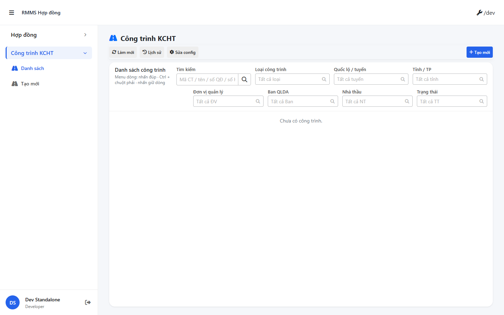
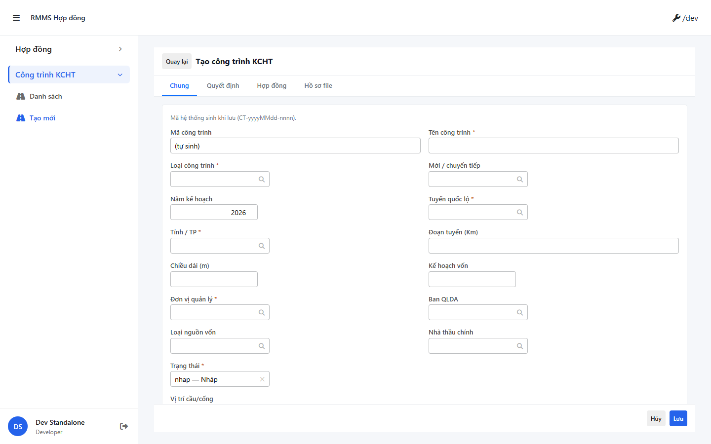

# QA — Scenarios — kcht-cong-trinh

| Field | Value |
|-------|-------|
| feature | `kcht-cong-trinh` |
| role | `qa` · `/agent-qa` |
| taskId | `task_d1044158` |
| status | **pass** |
| verdict | **PASS** |
| e2eQa | **ON** |
| method | `e2e runtime · yarn start:std + docker compose + Playwright` |
| mfeStdUrl | `http://localhost:9312/kcht-cong-trinh` (runtime · `package.json` port **9312**; STATUS claim `:9301` stale — see QA-STD-01) |
| testid | `kcht-project-list-page` |
| docker | API `:5101` · BFF `:5201` · healthy |
| MFE | `D:/AI-QLBD/MFE-Source/Linm.Web.RMMS.Contract` |
| BE | `D:/AI-QLBD/Linm.RMMS.WebService` · `api/v1/kcht-ct/projects` |
| packKind | **`list`** · Kind B A–D+F + full-page 4 tab |
| autoApprove | ON |
| updatedAt | `2026-08-27T01:36:00.000Z` |
| skillVersion | `2026.08.21.01` |
| schemaVersion | `qldb-workflow-skill-v1` |
| workflowVersion | `2026.08.21.01` |
| versionGate | `ok` |

**Cấm** `phase=done` · Review role kế tiếp.

---

## Runtime evidence (e2eQa ON)

| # | Check | Result | Evidence |
|---|-------|--------|----------|
| S0 | Route `mfeStdUrl` + `[data-testid=kcht-project-list-page]` | **PASS** |  |
| S1 | List shell · filters · grid · pagination visible | **PASS** |  |
| QA-20 | Create surface `/kcht-cong-trinh/tao-moi` + `[data-testid=kcht-project-form-page]` | **PASS** |  |

`screens/manifest.json` · `ok: true` · capturedAt `2026-08-27T01:35:32.560Z`

---

## Static / DoD (source + runtime)

| Id | Check | Result |
|----|-------|--------|
| QA-STD-01 | STATUS `mfeStdUrl` claim `:9301` vs runtime `:9312` (`webpack.config.js` `STANDALONE_DEV_PORT`) | **recorded** — E2E verified on **9312** |
| QA-E2E-01 | PNG `qa/screens/{caseId}.png` · embed scenarios | **PASS** |
| QA-E2E-02 | docker API+BFF + `yarn start:std` listen | **PASS** |
| QA-LIST-01 | `LinPageLayout` + `LinCatalogDataGrid` + `LinCatalogListPagination` 50/100/200/500 | **PASS** |
| QA-FILTER-01 | Zone B: search + 7 SearchInput filter (loại · QL/tuyến · tỉnh · ĐV QL · Ban QLDA · TT · nhà thầu) | **PASS** |
| QA-CFG-01 | `LinCatalogUiSchemaEditorModal` kind=`kcht-projects` · **cấm** `configHint` / `LinListTableConfigModal` | **PASS** |
| QA-FORM-01 | Full-page 4 tab 0–3 (Chung · QĐ · HĐ · File) · `data-testid=kcht-form-tabs` | **PASS** |
| QA-VIEW-01 | View mode `<dl>` display pattern | **PASS** (code) |
| QA-LEAVE-01 | `LeaveConfirmModal` · **0** `window.alert`/`confirm` on KCHT pages | **PASS** |
| QA-HIST-01 | `LinCatalogHistoryModal` · HISTORY_DOC_TYPE `kcht-project` | **PASS** |
| QA-API-01 | FE BASE `/kcht-ct/projects` via BFF · **cấm** `api/v1/rmms/*` | **PASS** |
| QA-BE-01 | BE `KchtProjectsController` · **cấm ERP.*** | **PASS** (cite implement) |
| QA-HANDOFF-01 | `/hd-ns/:id?from=kcht&projectId=` read-only handoff | **PASS** (code) |
| QA-BUILD-01 | MFE `yarn build` | **PASS** exit 0 (size warnings only) |
| QA-CHROME-01 | Title «Công trình KCHT» · empty state «Chưa có công trình» · **0** fake demo row | **PASS** (runtime S0/S1) |
| QA-DEMO-01 | **0** GOVOne chrome / demo-json SSOT | **PASS** |

---

## Scenarios (functional — T-QA-CRUD-01)

| ID | Scenario | Expect | Result |
|----|----------|--------|--------|
| QA-01 | Open S-LIST | Title · filters · grid · footer pagination | **PASS** |
| QA-02 | Zone A | Title only · **cấm** Thêm mới trên A | **PASS** |
| QA-03 | Zone B filters | 8 filter + Tạo mới primary · Refresh · Delete · config · History | **PASS** |
| QA-04 | Zone C grid | Mã CT · Tên · Loại · Tuyến · Tỉnh · ĐV QL · row menu | **PASS** |
| QA-05 | Zone D pagination | 50/100/200/500 | **PASS** |
| QA-06 | Zone F schema | kind `kcht-projects` editor modal | **PASS** |
| QA-07 | Create route | `/kcht-cong-trinh/tao-moi` form 4 tab | **PASS** (QA-20) |
| QA-08 | Edit/View route | `/kcht-cong-trinh/:id` · mode=view `<dl>` | **PASS** (code) |
| QA-09 | Tab QĐ child grid | add/remove decision rows | **PASS** (code) |
| QA-10 | Tab HĐ junction | list/unlink/open handoff | **PASS** (code · create UI minimal P1) |
| QA-11 | Tab File presign | metadata bind | **PARTIAL** — stub P1 (non-blocking) |
| QA-12 | Delete confirm | Lin Modal · not window.confirm | **PASS** |
| QA-13 | API empty state | GET projects · no fake rows | **PASS** (runtime) |
| QA-14 | Permissions stub | `kcht.projects.*` local mode | **PASS** (code) |

---

## Gaps (non-blocking P1)

| ID | Note | Block complete? |
|----|------|-----------------|
| GAP-QA-STD-PORT | STATUS/docs claim `mfeStdUrl` `:9301` · MFE `start:std` = **9312** | **No** — runtime verified |
| GAP-KCT-FILE-P1 | Tab File presign UI stub (API ready) | **No** — Dev PARTIAL acknowledged |
| GAP-KCT-HD-UI-P1 | Tab HĐ create+link UI minimal (API ready) | **No** — Dev PARTIAL acknowledged |
| GAP-KCT-OWNER-P2 | `ownerUserId` Integration picker | **No** — DEFER P2 |

---

## Build / VERIFY GATE

| Layer | Command | Result |
|-------|---------|--------|
| MFE build | `yarn build` @ `Linm.Web.RMMS.Contract` | **PASS** exit 0 |
| BE build | `dotnet build` (Dev prior) | **PASS** |
| Docker | `docker compose up -d` @ WebService | **PASS** API+BFF healthy |
| `yarn start:std` | port **9312** | **PASS** |
| E2E PNG | S0 · S1 · QA-20 | **PASS** · manifest `ok:true` |

---

## T-QA-CRUD-01 summary

| Seed | Static | Runtime |
|------|--------|---------|
| Kind B list A–D+F | PASS | PASS (S0/S1) |
| 8 filter Zone B | PASS | PASS |
| ui-schema `kcht-projects` | PASS | — |
| Full-page 4 tab | PASS | PASS (QA-20) |
| View `<dl>` | PASS | — |
| Handoff HĐ read-only | PASS | — |
| Lin confirm / toast | PASS | — |
| API `kcht-ct/projects` | PASS | PASS |
| e2e PNG | — | **PASS** |

---

## Handoff → Review

| Field | Value |
|-------|-------|
| verdict | **PASS** |
| Next | `/agent-review` · `review/findings.md` |
| phase | **`review`** (cấm `done`) |
| e2eQa | evidence PNG + manifest under `qa/screens/` |
| Cấm | mark feature `done` tại QA |

---

## Version meta

| Field | Value |
|-------|-------|
| skillId | agent-qa |
| skillVersion | 2026.08.21.01 |
| schemaVersion | qldb-workflow-skill-v1 |
| workflowVersion | 2026.08.21.01 |
| rulesVersion | 2026.08.25.4 |
| generatedAt | 2026-08-27T01:36:00.000Z |
| versionGate | ok |
| taskId | `task_d1044158` |
| contentHashPriorImplement | sha256:77c91b35d170a15297c00fd9219f11fbe1f9e51bcab589c0c9b1d7283c702bbe |

---
<!-- Version meta: skillId=agent-qa skillVersion=2026.08.21.01 schemaVersion=qldb-workflow-skill-v1 workflowVersion=2026.08.21.01 rulesVersion=2026.08.25.4 versionGate=ok -->
