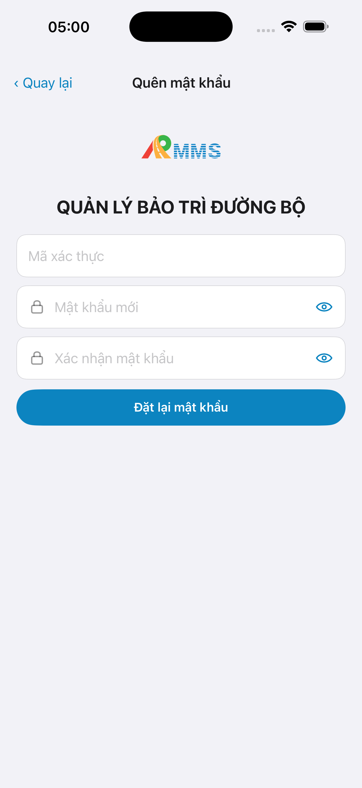
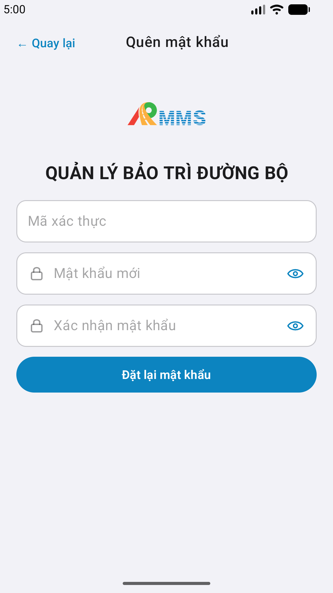

# QA — Scenarios — login-forgot (mobile)

| Field | Value |
|-------|-------|
| feature | `login-forgot` |
| title | [Mobile] Quên mật khẩu |
| this role | `qa` · `/agent-qa-mobile` |
| status | **confirmed** |
| packKind | **`shell`** |
| stack | `native_dual` |
| changeScope | `new_page` |
| taskId | `task_c019702a` |
| prior · dev | **confirmed** · `implement/ios.md` · `implement/android.md` · `implement/bff.md` · `task_41503568` |
| autoApprove | **ON** |
| e2eQa | **ON** · `yarn e2e-qa-mobile` · `ios_test_phase=phase1_iphone` · **A4-IPAD DEFER** |
| store_qa | **run_store** (autoApprove) |
| e2e result | **ok:true** · `2026-08-18T22:00:29.687Z` · dest **iPhone 17 Pro Max** · AVD **Pixel_2** |
| method | e2e runtime · yarn e2e-qa-mobile · Maestro + simctl/adb · **cấm** GenerateImage · **cấm** yarn start:std / mfeStdUrl |
| ios | `/Users/mac/LINM-ORG/AI-QLBD/Linm.RMMS.Mobile.iOS` |
| android | `/Users/mac/LINM-ORG/AI-QLBD/Linm.RMMS.Mobile.Android` |
| bff | `/Users/mac/LINM-ORG/AI-QLBD/Linm.RMMS.Mobile.Bff` · `auth/forgot-password` · `auth/reset-password` |
| backend | `/Users/mac/LINM-ORG/AI-QLBD/Linm.RMMS.WebService` · Auth `:5001` live · **cấm ERP.*** |
| updatedAt | `2026-08-18T22:00:34.000Z` |

**Scope:** slug `login-forgot` only. Entry `#sc-login` **Quên mật khẩu?** → full-page `#sc-forgot` (request → reset). **Cấm** AC sibling `login` submit / `login-logout`.

## VERIFY GATE

| Gate | Result |
|------|--------|
| iOS `xcodegen` | **PASS** |
| iOS `xcodebuild` dest **iPhone 17 Pro** | **PASS** |
| Android `./gradlew :app:assembleDebug` | **PASS** |
| Mobile.Bff `dotnet build` | **PASS** (0 warning · 0 error) |
| Maestro CLI | **PASS** (2.8.0) · iOS + Android flows |
| AVD / sim | **iPhone 17 Pro Max** 1320×2868 · AVD `Pixel_2` 1080×1920 · **A4 DEFER** |
| API `:5101` + Mobile.Bff `:5202` + Auth `:5001` | **listen** · POST forgot 200 |

## Device AC (PO §9)

| ID | Behavior | Expect | Result |
|----|----------|--------|--------|
| AC-D-01 | Offline | Toast **Không có mạng** · **cấm** queue | **PASS** (code `AuthFailure.offline`) |
| AC-D-02 | GPS deny | **N/A** | SKIP |
| AC-D-03 | Leave dirty | `LinmLeaveConfirm` · ids `btn-leave-cancel` / `btn-leave-ok` | **PASS** (code dual) |
| AC-D-04 | Native alert | Chỉ `LinmToast` / in-app modal | **PASS** (runtime · no system alert) |
| AC-D-05 | Keyboard | Không đè field sau dismiss | **PASS** (reset shot không keyboard) |
| AC-D-06 | Safe area | Nav + brand + form | **PASS** (shot A3/P6) |
| AC-D-07 | Biometric | **N/A** | SKIP |
| AC-D-08 | Signal | **Không** tín hiệu trên `#sc-forgot` | **PASS** (shot) |
| AC-D-09 | Token | Không Bearer · không auto-login | **PASS** (code) |
| AC-D-10 | Tab / swipe | **Không** UITabBar 5 | **PASS** (shot) |
| AC-D-11 | Camera / push | **N/A** | SKIP |
| AC-F-01 | Entry | Full-page forgot · **không** toast-only | **PASS** (Maestro) |
| AC-F-02 | Empty phone | Toast **Nhập số điện thoại** | **PASS** (code) |
| AC-F-03 | Send online | Toast Auth · `#f-otp` | **PASS** (Maestro + BFF 200) |
| AC-F-04 | Offline send | Toast **Không có mạng** | **PASS** (code) |
| AC-F-05 | Confirm mismatch | Toast · no reset call | **PASS** (code) |
| AC-F-06 | Reset success | Toast → Login | **PASS** (code) |
| AC-F-07 | Reset 400 | Toast · stay | **PASS** (code) |
| AC-F-09 | Brand | AppIcon RMMS · **cấm** watermark | **PASS** (shot) |
| AC-F-10 | No system alert | Pass | **PASS** (runtime) |

## Store Must (`/review-app-submit` × feature)

| Case | Store | Evidence | Result |
|------|-------|----------|--------|
| A11-LAUNCH | A11 |  | **PASS** |
| A10-BFF | A10 · P11 | Mobile.Bff `:5202` + POST `auth/forgot-password` 200 | **PASS** |
| A9-LOGIN | A9 · P10 |  | **PASS** |
| A3-CORE | A3 · A11 |  · 1320×2868 · no alpha | **PASS** |
| P6-CORE | P6 · P11 |  · 1080×1920 | **PASS** |
| P6-CORE-2 | P6 |  · 1080×1920 | **PASS** |
| A4-IPAD | A4 | **DEFER** Phase 1 · family `1` **cấm** listing A4 (`GAP-SUBMIT-IMG-08`) | DEFER |

## Kit / placeholder

| Check | Result |
|-------|--------|
| Chrome = map (`LinmTextField` · `LinmSecureTextField` · `LinmPrimaryButton` · `LinmToast` · `LinmLeaveConfirm`) | **PASS** (shot lock+eye · leave kit wired) |
| Watermark / process text on shot | **PASS** — không `bản Gói N` / `gen realapp` |
| Kit mismatch | **PASS** — không `GAP-MOB-KITUSE-01` |

## Out of scope (cấm AC)

- `login` submit / session-window
- `login-logout`
- `users/me/change-password`
- admin reset theo user id
- Privacy/support URL (A5/A6 · P7) — **ghi thiếu pack store** · **cấm** QA mark `READY_TO_SUBMIT`

## E2E screenshots

Viewer: `/api/qldb/artifact?id=&rel=qa/scenarios.md` rewrite `screens/{caseId}.png`.

| Case | Store | Result | Evidence |
|------|-------|--------|----------|
| A10-BFF | A10 · P11 | **PASS** | — |
| A11-LAUNCH | A11 | **PASS** |  |
| A9-LOGIN | A9 · P10 | **PASS** |  |
| A3-CORE | A3 · A11 | **PASS** |  |
| P6-CORE | P6 · P11 | **PASS** |  |
| P6-CORE-2 | P6 | **PASS** |  |
