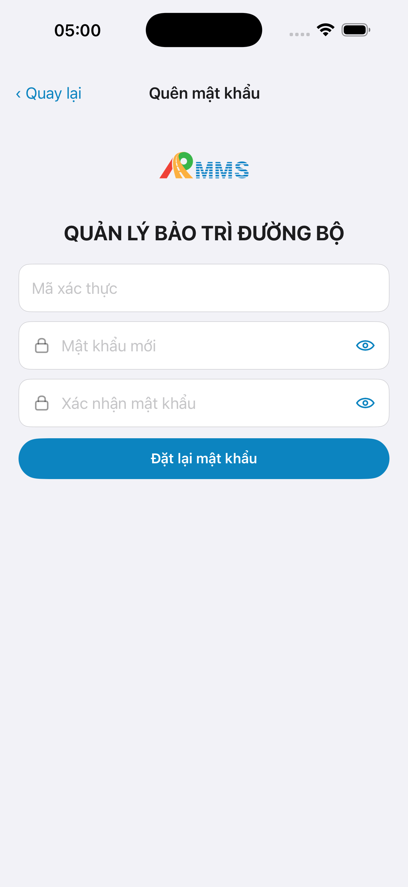

# Capture — login-forgot

| Case | Store | Result | Evidence |
|------|-------|--------|----------|
| A10-BFF | A10 · P11 | **PASS** | — |
| A11-LAUNCH | A11 | **PASS** |  |
| A9-LOGIN | A9 · P10 | **PASS** |  |
| A3-CORE | A3 · A11 | **PASS** |  |
| P6-CORE | P6 · P11 | **PASS** |  |
| P6-CORE-2 | P6 | **PASS** |  |

| Slot | Device | Px | Notes |
|------|--------|-----|-------|
| A3-CORE | iPhone 17 Pro Max | 1320×2868 · no alpha | `#sc-forgot` reset · live simctl |
| A11 / A9 | iPhone 17 Pro Max | 1320×2868 | same session · Maestro + simctl |
| P6-CORE / P6-CORE-2 | Pixel_2 | 1080×1920 | live adb screencap |

iOS device: iPhone 17 Pro Max
iPad device: DEFER Phase 1
method: e2e runtime · yarn e2e-qa-mobile · Maestro ON
capturedAt: `2026-08-18T22:00:29.687Z`

Listing official → `/store-image-capture` confirm file live (cấm AI vẽ).
**Cấm** QA mark `READY_TO_SUBMIT`.
