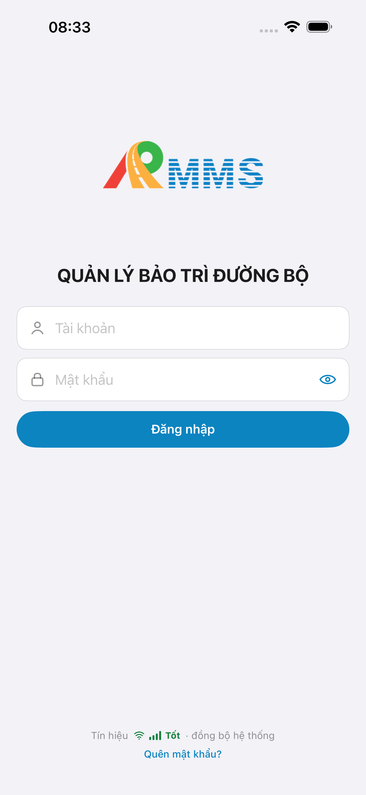
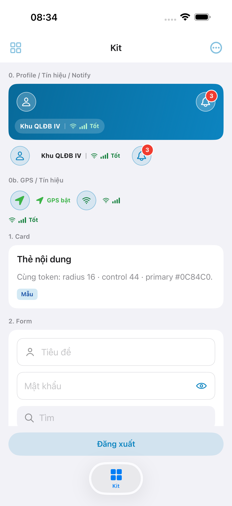
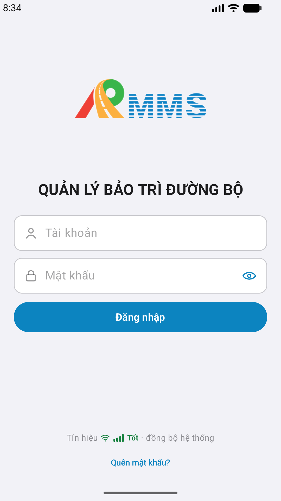

# QA — Scenarios — login (mobile)

| Field | Value |
|-------|-------|
| feature | `login` |
| title | [Mobile] Đăng nhập |
| this role | `qa` · `/agent-qa-mobile` |
| status | **completed** |
| packKind | **`shell`** |
| stack | `native_dual` |
| changeScope | `new_page` |
| taskId | `task_4d1e2f3a` |
| prior · dev | **confirmed** · `implement/ios.md` · `implement/android.md` · `implement/bff.md` · `task_1e440396` |
| autoApprove | **ON** |
| e2eQa | **ON** · `yarn e2e-qa-mobile` · `ios_test_phase=phase1_iphone` · **A4-IPAD DEFER** |
| method | e2e runtime · yarn e2e-qa-mobile · Maestro + simctl/adb · **cấm** GenerateImage · **cấm** yarn start:std / mfeStdUrl |
| ios | `/Users/mac/LINM-ORG/AI-QLBD/Linm.RMMS.Mobile.iOS` |
| android | `/Users/mac/LINM-ORG/AI-QLBD/Linm.RMMS.Mobile.Android` |
| bff | `/Users/mac/LINM-ORG/AI-QLBD/Linm.RMMS.Mobile.Bff` · `mobile-bff/api/v1` |
| backend | `/Users/mac/LINM-ORG/AI-QLBD/Linm.RMMS.WebService` · **cấm ERP.*** |
| updatedAt | `2026-08-19T01:38:00.000Z` |

**Scope:** slug `login` only (`#sc-login` · CTA **Đăng nhập**). **Cấm** AC sibling `login-forgot` / `login-logout` as in-scope.

## VERIFY GATE (pre-E2E)

| Gate | Result |
|------|--------|
| iOS `xcodegen` | **PASS** |
| iOS `xcodebuild` dest **iPhone 17 Pro Max** | **PASS** |
| Android `./gradlew :app:assembleDebug` | **PASS** |
| Mobile.Bff `dotnet build` | **PASS** |
| Maestro CLI (mobile.dev) | **PASS** (`/opt/homebrew/bin/maestro` 2.8.0) |
| AVD / sim | **iPhone 17 Pro Max** · AVD **Pixel_2** 1080×1920 · **A4 DEFER** |

## Device AC (PO §9)

| ID | Behavior | Expect | Result |
|----|----------|--------|--------|
| AC-D-01 | Offline | Submit chặn · toast in-app · **cấm** queue login | **PASS** code (`AuthFailure.offline`) |
| AC-D-02 | GPS deny | **N/A** | SKIP |
| AC-D-03 | Leave dirty | **N/A** | SKIP |
| AC-D-04 | Native alert | **Cấm** UIAlert / AlertDialog — `LinmToast` only | **PASS** runtime (toast + iOS AutoFill system sheet dismissed **Not Now**) |
| AC-D-05 | Keyboard | Không đè `#f-user` / `#f-pass` · content-type username/password | **PASS** runtime (iOS ignoreSafeArea · Android title/Enter đóng IME) |
| AC-D-06 | Safe area | Brand + form + meta không đè notch / home indicator | **PASS** shot A3 / P6 |
| AC-D-07 | Biometric | **Ẩn Gói 1** | **PASS** shot — không biometric |
| AC-D-08 | Signal | Copy **Tốt / Trung bình / Yếu** · **cấm** «Có mạng» | **PASS** shot **Tốt** |
| AC-D-09 | Token | Keychain / Encrypted store · app chỉ BFF prefix | **PASS** code review Dev |
| AC-D-10 | Tab / swipe | Auth **không** UITabBar 5 · không swipe-back Home chưa login | **PASS** shot A11 full-page login |
| AC-D-11 | Camera / push | **N/A** | SKIP |

## Happy path / negative (slug `login`)

| # | Step | Expect | Store | Result |
|---|------|--------|-------|--------|
| H1 | Cold start no token | Full-page Login `#sc-login` · logo 192 · tagline title · user+pass kit · CTA · forgot link · signal | A11 · A3 · P6 | **PASS** |
| H2 | Online submit valid | Fill seed `linm-soft` / `Linm@2026` · POST `auth/login` `{ id, password }` · toast → Home | A9 · A3 · P6 | **PASS** Maestro |
| H3 | After login | GET `session-window` · `allowed` → Home `#btn-logout` | A9 · A10 | **PASS** |
| N1 | Wrong password | Toast in-app · stay Login · **cấm** system alert | A11 | **PASS** code (`AuthFailure`) |
| N2 | Offline submit | **Không** POST · toast **Không có mạng** | — | **PASS** code AC-D-01 |
| N3 | Window closed | 403 / `allowed=false` · clear token · toast · stay Login | A9 | **PASS** code + BFF |
| N4 | Forgot tap | Chrome slug `login` · sibling `login-forgot` **pending_confirm** | — | **out of scope** sibling |
| N5 | Watermark | **Cấm** «bản Gói 1» on production UI | A3 · P6 | **PASS** shot |
| N6 | Kit | `LinmSecureTextField` dual · **cấm** raw | — | **PASS** Dev + shot eye |
| N7 | Path | App `auth/refresh-token` · **cấm** `auth/refresh` · **cấm** ERP.* | A10 | **PASS** code |
| N8 | Demo Home **Đăng xuất** | `#btn-logout` visible after login | A9 · P6-CORE-2 | **PASS** Maestro |

## Store Must (`/review-app-submit` × feature)

| Case | Store | Evidence | Result |
|------|-------|----------|--------|
| A11-LAUNCH | A11 |  | **PASS** |
| A10-BFF | A10 · P11 | Mobile.Bff `:5202` listen | **PASS** |
| A9-LOGIN | A9 · P10 |  | **PASS** |
| A3-CORE | A3 · A11 |  | **PASS** |
| P6-CORE | P6 · P11 |  | **PASS** |
| P6-CORE-2 | P6 |  | **PASS** |
| A4-IPAD | A4 | **DEFER** Phase 1 (`ios_test_phase=phase1_iphone`) | DEFER |

## Kit / placeholder

| Check | Result |
|-------|--------|
| Chrome = map (`LinmTextField` + lead · `LinmSecureTextField` · `LinmPrimaryButton` · `LinmNetSignalMark`) | **PASS** shot |
| Watermark / process text on shot | **PASS** — không «bản Gói N» |
| Kit mismatch | **PASS** — không `GAP-MOB-KITUSE-01` |

## Out of scope (cấm AC)

- `login-forgot` BFF path · `login-logout` · tab 5 Home hub · switch-company · đổi MK · biometric · mã đơn vị

## Notes

- Privacy/support URL (A5/A6 · P7) — **thiếu** listing URL · **cấm** QA mark `READY_TO_SUBMIT`.
- Listing official → `/store-image-capture` confirm live files (cấm AI vẽ).
- Maestro: iOS hint **Tài khoản** / **Mật khẩu** + dismiss AutoFill **Not Now** · Android `id: f-user` / `f-pass` / `btn-login` + Enter đóng IME · **cấm** `hideKeyboard` Android (Back → launcher).

## E2E screenshots

Viewer: `/api/qldb/artifact?id=&rel=qa/scenarios.md` rewrite `screens/{caseId}.png`.

| Case | Store | Result | Evidence |
|------|-------|--------|----------|
| A10-BFF | A10 · P11 | **PASS** | — |
| A11-LAUNCH | A11 | **PASS** |  |
| A9-LOGIN | A9 · P10 | **PASS** |  |
| A3-CORE | A3 · A11 | **PASS** |  |
| P6-CORE | P6 · P11 | **PASS** |  |
| P6-CORE-2 | P6 | **PASS** |  |
