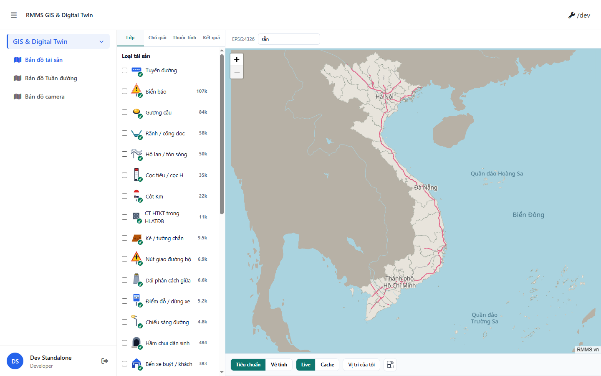
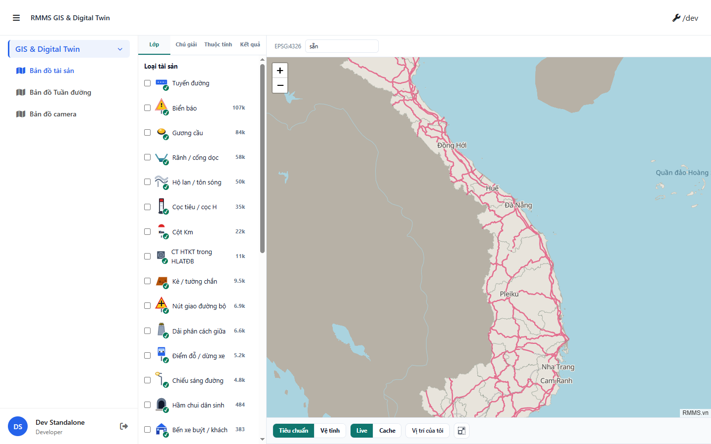

# QA — Scenarios — map-service

| | |
|--|--|
| Feature | `map-service` |
| Title | MapService — OSRM self-host + GIS clip map |
| Role | `qa` |
| Version | `2026-09-17T02:07:00+07:00` |
| changeScope | `edit_page` · gap `osrm_self_host` |
| method | `e2e runtime · docker compose MapService + yarn start:std Gis + Playwright PNG` |
| mfeStdUrl (STATUS) | `http://localhost:9301/map-service` (board slug) |
| mfeStdUrl (runtime) | `http://localhost:9302/` → click **Bản đồ tài sản** → `/gis/tai-san` |
| mfe | `Linm.Web.RMMS.Gis` · `start:std` `:9302` |
| verdict | **PASS** · handoff Review · **cấm** `phase=done` |

## Preconditions

| Check | Result |
|-------|--------|
| `map-service-control-hint.md` / `real-data.md` under `specs/_data-analy/features/` | missing paths (prior marked confirmed) · QA scoped to `edit_page` / `osrm_self_host` via STATUS + `dev-compact` |
| Docker `D:/API-CORE/Linm.Platform.MapService` `compose up -d` | **PASS** · `linm-maps-api` healthy `:5021` · PostGIS `:5461` |
| `GET /api/v1/gis/health` | **PASS** · `boundaryCount=34` · `clipMaskReady=true` · `streetTilesReady=true` |
| BFF `:5201` | **PASS** (listen) |
| `docker compose --profile osrm config` | **PASS** |
| OSRM `:5000` runtime | **DEFER** Linux extract (`setup_osrm.sh`) — not listening on agent Windows · **không** FAIL config ship |
| Public OSRM default | **PASS** · `osrmCenterline.ts` / `.env.template` → `http://127.0.0.1:5000` · **0** `router.project-osrm.org` |
| CLI note | `yarn e2e-qa --docker-dir` defaults wait API `:5101` (RMMS) ≠ MapService `:5021` → compose up thủ công + capture Playwright (AutoCode cwd) |

## Cases

| Id | Steps | Expect | Result | Evidence |
|----|-------|--------|--------|----------|
| S0 | `start:std` Gis · open `/` · click **Bản đồ tài sản** | Map shell: Lớp / Chú giải / Thuộc tính · path `/gis/tai-san` · canvas/leaflet | **PASS** |  |
| S1 | On map · chip **Tiêu chuẩn** (if present) | Clip basemap UI · **0** OSM.org string on body · R2 MFE clip | **PASS** |  |
| QA-20 | Pan/wheel map · watch network | **0** request `project-osrm.org` · OSRM base loopback (config) · page stays live | **PASS** |  |

## T-QA-* (map pack · R1–R11 gate)

| Id | Check | Result |
|----|-------|--------|
| T-QA-MAP-R1 | Live map (Leaflet/MapLibre canvas) — không screenshot-placeholder only | **PASS** (S0 canvas) |
| T-QA-MAP-R2 | MFE chips clip — cấm OSM.org/Esri CDN | **PASS** (S1) |
| T-QA-MAP-R8 | OSRM self-host default loopback · cấm public default | **PASS** (code + QA-20) |
| T-QA-MAP-R11 | Fit VN clip surface present (Lớp/Chú giải) | **PASS** (S0 body) |
| T-QA-E2E-01 | PNG `specs/map-service/qa/screens/{caseId}.png` | **PASS** · manifest `ok=true` |

## Gaps

| Id | Status | Note |
|----|--------|------|
| OSRM extract/smoke HTTPS | **DEFER** | Dev debt · Linux `setup_osrm.sh` · cấm fake PASS |
| `historyApiFallback` deep-link `/gis/tai-san` HTTP 404 from cold GET | note | Standalone MemoryRouter: open `/` rồi click route · không block QA |
| Board `mfeStdUrl` `:9301/map-service` vs Gis `:9302` | note | STATUS mfe=`Gis` · packet Master/`9301` lệch port |

## Handoff → Review

| Field | Value |
|-------|-------|
| verdict | PASS |
| phase_to | `review` |
| PNG | `specs/map-service/qa/screens/S0.png` · `S1.png` · `QA-20.png` |
| Open | OSRM Linux extract DEFER · `/review-map-release` sau HTTPS live |