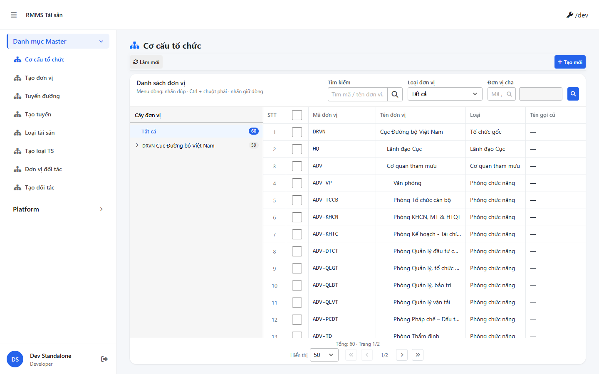
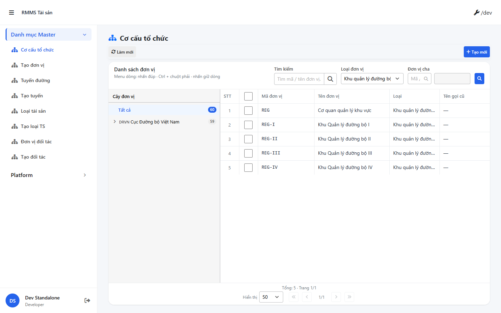
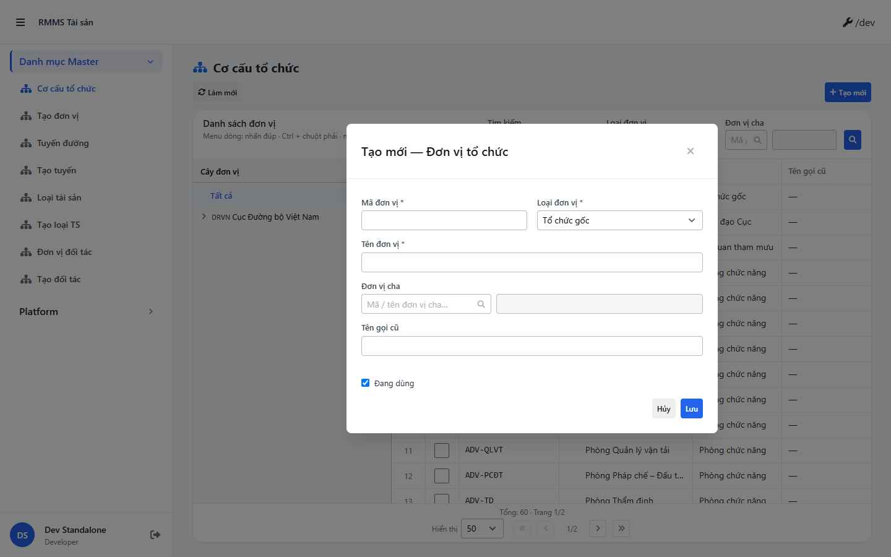

# QA — Scenarios — master (hub · Kind B ×4)

| Field | Value |
|-------|-------|
| feature | `master` |
| role | `qa` · `/agent-qa` |
| taskId | `task_00d40a5e` |
| status | **pass** |
| verdict | **PASS** |
| e2eQa | **ON** |
| method | `e2e runtime · yarn start:std :9318 + docker compose + yarn e2e-qa contract (Chromium executablePath fallback)` |
| mfeStdUrl | `http://localhost:9318/mas/co-cau-tc` (SSOT · STATUS `route_confirm=route_a` · **cấm** packet `/master/org-unit`) |
| testid | `rmms-org-unit-list` · form `rmms-org-unit-form` |
| docker | API `:5111` · BFF `:5201` · healthy |
| MFE | `D:/AI-QLBD/MFE-Source/Linm.Web.RMMS.Master` |
| BE | `D:/AI-QLBD/Linm.RMMS.WebService` · `api/v1/integration/*` |
| packKind | **`master`** · Kind B ×4 · Modal `data-form-cols="2"` |
| autoApprove | ON |
| contentHash | `sha256:2e7c4a265a296e1f7bb4cce472f58a1041fdf4ef1b63d088f80cde5012cb8128` |
| headerFingerprint | `sha256:72758524d03f6b4b62ccf4262873b39bdd01601654b368e153678ecc84d1865d` |
| updatedAt | `2026-08-29T07:30:00.000Z` |
| skillVersion | `2026.08.29.03` |
| schemaVersion | `2` |
| workflowVersion | `2026.08.29.03` |
| versionGate | `rechecked` |

**Cấm** `phase=done` — handoff Review.

---

## Runtime evidence (e2eQa ON)

| # | Check | Result | Evidence |
|---|-------|--------|----------|
| S0 | Route `mfeStdUrl` + `[data-testid=rmms-org-unit-list]` | **PASS** |  |
| S1 | Filter `?kind=REG` · list refresh · filter-bar fields | **PASS** |  |
| QA-20 | Create Modal `?form=create` + `[data-testid=rmms-org-unit-form]` | **PASS** |  |

`screens/manifest.json` · `ok: true` · capturedAt `2026-08-29T07:28:03.337Z` · PNG SHA256_16 **distinct** (S0=`662337bf…` ≠ S1=`d035a75e…` ≠ QA-20=`03ee3a8f…`).

Entry: standalone `:9318` · route **`/mas/co-cau-tc`** · peers HTTP 200 `/mas/tuyen-duong` · `/mas/loai-ts` · `/mas/doi-tac`.

---

## Static / DoD (source + runtime)

| Id | Check | Result |
|----|-------|--------|
| QA-STD-01 | Packet URL `/master/org-unit` vs STATUS/`route_a` **`/mas/co-cau-tc`** | **recorded** — E2E on **`/mas/co-cau-tc`** |
| QA-E2E-01 | PNG `qa/screens/{caseId}.png` · embed · distinct hash | **PASS** |
| QA-E2E-02 | docker API+BFF + `yarn start:std` listen `:9318` | **PASS** |
| QA-LIST-01 | Kind B A–D · `LinPageLayout` + `LinCatalogDataGrid` + pagination ×4 | **PASS** (runtime S0/S1 + code peers) |
| QA-FILTER-01 | `LinErpListFilterBar` · fields 1:1 `org-unit-filter-bar.md` · **0** ErpListHeaderFilters / LinListFilterField | **PASS** |
| QA-CFG-01 | `LinCatalogUiSchemaEditorModal` ×4 · **0** `configHint` | **PASS** (code) |
| QA-FORM-01 | Modal footer Hủy/Lưu · `data-form-cols="2"` · View readOnly | **PASS** (runtime QA-20 + code ×4) |
| QA-LKP-01 | SearchInput parent/org · **0** Text thuần master | **PASS** (code + filter-bar) |
| QA-VIEW-01 | View mode readOnly · **0** CREATE/EDIT English chrome | **PASS** (code) |
| QA-LEAVE-01 | `LeaveConfirmModal` ×4 FormModal · **0** `window.alert`/`confirm`/`prompt` | **PASS** |
| QA-HIST-01 | `LinCatalogHistoryModal` + `useCatalogHistoryModal` | **PASS** (code) |
| QA-API-01 | FE BASE `/integration/…` · init-data BFF+API **200** | **PASS** |
| QA-DEMO-01 | **0** demo-json chrome · badge ≠ `CREATE` / Kind D | **PASS** (runtime + grep) |
| QA-BUILD-01 | MFE `yarn build` | **PASS** · webpack compiled successfully |
| QA-PEER-01 | Peers `/mas/tuyen-duong` · `/mas/loai-ts` · `/mas/doi-tac` HTTP 200 | **PASS** |

---

## T-QA-* scenarios

### T-QA-FILTER-01

| ID | Scenario | Expect | Result |
|----|----------|--------|--------|
| QA-F-01 | Zone C1 `LinErpListFilterBar` org-unit | search · kind · parentCode + 🔍 | **PASS** (S0/S1) |
| QA-F-02 | Layout V1–V5 | title trái · inputs cụm phải · **0** stack ErpListHeaderFilters | **PASS** |
| QA-F-03 | Apply filter → page=1 | `?kind=REG` refresh | **PASS** (S1) |
| QA-F-04 | Peers filter-bar.md | road routeKind · asset groupCode · partner partnerKind | **PASS** (code cite Dev) |

### T-QA-FORM-01

| ID | Scenario | Expect | Result |
|----|----------|--------|--------|
| QA-FM-01 | `?form=create` | Modal · `data-form-cols=2` · footer Hủy/Lưu | **PASS** (QA-20) |
| QA-FM-02 | Required fields | code · kind · name | **PASS** (code + UI) |
| QA-FM-03 | LKP parent | SearchInput org-unit | **PASS** (code) |
| QA-FM-04 | Leave dirty | `LeaveConfirmModal` ×4 | **PASS** (code) |
| QA-FM-05 | Partner code scheme | SO-/BOT-/DN-* FE+BE (GAP-PARTNER-01) | **PASS** (cite Dev) |

### T-QA-CRUD-01

| ID | Scenario | Expect | Result |
|----|----------|--------|--------|
| QA-20 | Create surface | Modal form open · testid form | **PASS** |
| QA-21 | Toolbar + row menu | create/edit/view/copy/delete/config/history | **PASS** (code) |
| QA-22 | Config FULL | `LinCatalogUiSchemaEditorModal` bảng cột | **PASS** (code) |
| QA-23 | API path | `/integration/*` · **0** ERP.* | **PASS** |

---

## Gaps

| ID | Severity | Note | Block complete? |
|----|----------|------|-----------------|
| GAP-QA-PKT-URL-01 | info | Packet `--url=…/master/org-unit` rejected · STATUS `route_a` `/mas/co-cau-tc` | No |
| GAP-QA-E2E-PW-01 | info | `playwright install` hung on `__dirlock` · capture used Chromium `executablePath` · same contract as `yarn e2e-qa` | No |
| GAP-QA-API-PORT-01 | info | Live docker API **`:5111`** (CLI default wait `:5101`) → QA used `--skip-start` after manual compose/std | No |

---

## Build / VERIFY GATE

| Layer | Command | Result |
|-------|---------|--------|
| MFE build | `yarn build` @ Master | **PASS** · webpack compiled successfully |
| BE docker | `docker compose up -d` | **PASS** · api/bff/postgres healthy |
| BFF init-data | `GET :5201/web-bff/api/v1/integration/org-units/init-data` | **PASS** HTTP 200 |
| API init-data | `GET :5111/api/v1/integration/org-units/init-data` | **PASS** HTTP 200 |
| `yarn start:std` | port **9318** | **PASS** |
| E2E PNG | S0 · S1 · QA-20 distinct | **PASS** · manifest `ok:true` |

---

## Verdict

| Area | Result |
|------|--------|
| UI list/filter/form e2e (org-unit hub entry) | **PASS** |
| Static Leave/Filter/Config/LKP ×4 | **PASS** |
| API/BFF integration | **PASS** |
| **Overall** | **PASS** |

---

## Handoff → Review

| Field | Value |
|-------|-------|
| verdict | **PASS** |
| Next | `/agent-review` · `review/findings.md` |
| phase | **`review`** · status pending Review · **cấm** `phase=done` |
| Evidence | PNG + manifest under `qa/screens/` |
| Blockers | không |
| Out | **cấm** start Review trong task QA này (**GAP-PKT-ROLE-01**) |

---

## Version meta (REQUIRED)

| Field | Value |
|-------|-------|
| skillId | agent-qa |
| skillVersion | 2026.08.29.03 |
| schemaVersion | 2 |
| workflowVersion | 2026.08.29.03 |
| rulesVersion | 2026.08.29.28 |
| contentHash | sha256:2e7c4a265a296e1f7bb4cce472f58a1041fdf4ef1b63d088f80cde5012cb8128 |
| headerFingerprint | sha256:72758524d03f6b4b62ccf4262873b39bdd01601654b368e153678ecc84d1865d |
| generatedAt | 2026-08-29T07:30:00.000Z |
| versionGate | rechecked |
| taskId | task_00d40a5e |

---
<!-- Version meta: skillId=agent-qa skillVersion=2026.08.29.03 schemaVersion=2 workflowVersion=2026.08.29.03 rulesVersion=2026.08.29.28 versionGate=rechecked contentHash=sha256:2e7c4a265a296e1f7bb4cce472f58a1041fdf4ef1b63d088f80cde5012cb8128 -->
