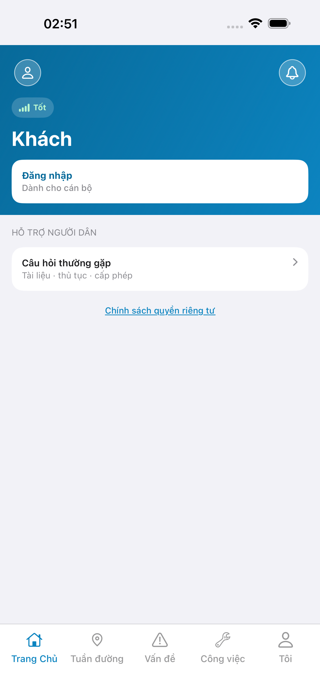
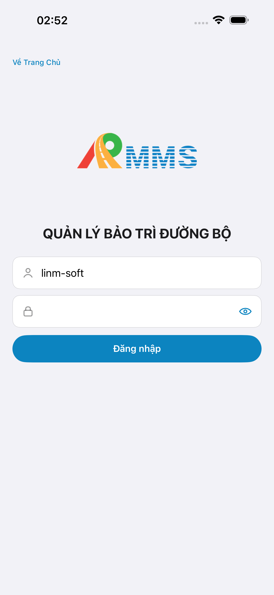
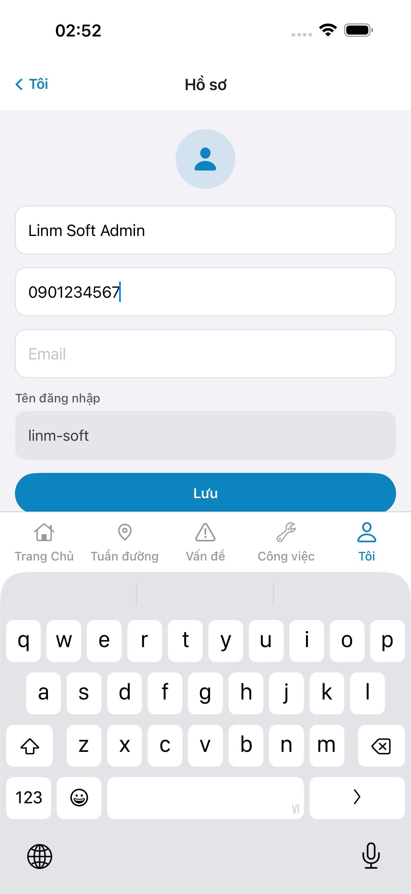
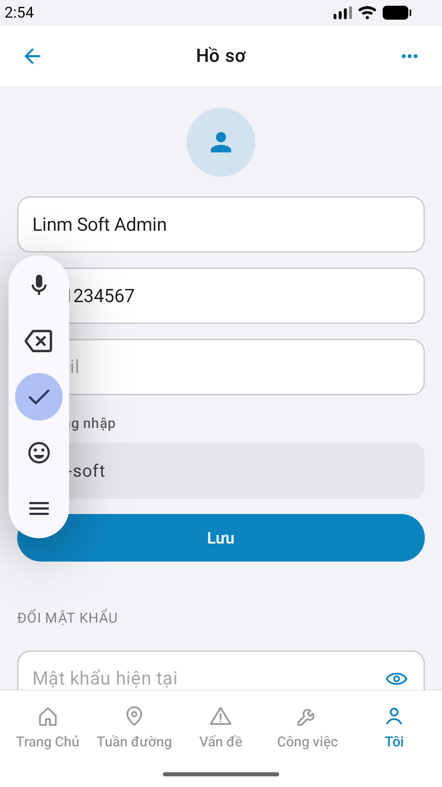
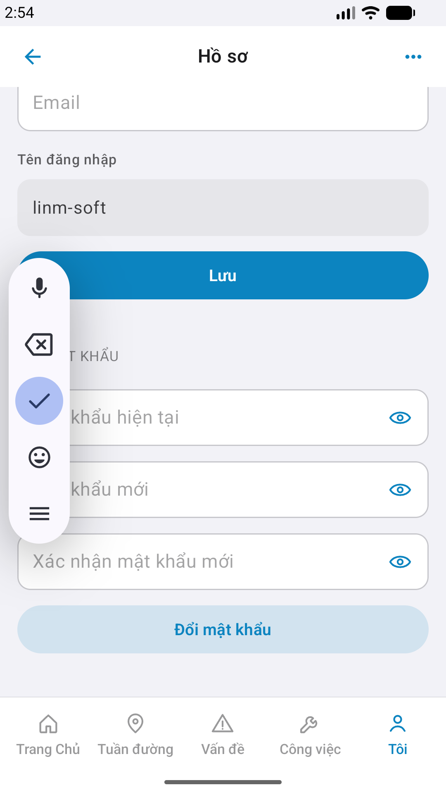

# QA — Scenarios — me-profile (mobile)

| Field | Value |
|-------|-------|
| feature | `me-profile` |
| title | [Mobile] [Tôi] -> Hồ sơ |
| this role | `qa` · `/agent-qa-mobile` |
| status | **confirmed** |
| changeScope | `new_page` |
| packKind | **`sheet`** (surface full screen `#sc-me-profile`) |
| taskId | `task_b53c3814` |
| autoApprove | ON |
| e2eQa | ON · `yarn e2e-qa-mobile` · Maestro ON |
| ios_test_phase | `phase1_iphone` · dest **iPhone 17 Pro Max** · **A4-IPAD DEFER** |
| store_qa | **run_store** |
| method | e2e runtime · yarn e2e-qa-mobile · **cấm** GenerateImage · **cấm** yarn start:std / mfeStdUrl |
| visual | `/review-align-ux-ios-android` · **Aligned** · Must **0** |
| e2e result | **ok:true** · `2026-08-30T19:54:19.942Z` · dest **iPhone 17 Pro Max** · AVD **Pixel_2** |
| updatedAt | `2026-08-30T19:56:00.000Z` |

**Scope:** slug `me-profile` only · Me `#row-profile` → `#sc-me-profile` · GET/PUT `auth/profile` · POST `auth/change-password` (UI assert · **cấm** đổi MK seed). **Cấm** sibling `me-settings` / logout / admin users.

## VERIFY GATE

| Gate | Result |
|------|--------|
| iOS `xcodegen` + `xcodebuild` dest **iPhone 17 Pro** | **PASS** (prior Dev · `--skip-build` QA rerun) |
| Android `./gradlew :app:assembleDebug` | **PASS** (prior Dev · `--skip-build` QA rerun) |
| Mobile.Bff `dotnet build` | **PASS** (0 warning · 0 error) |
| API docker + Mobile.Bff `:5202` | **PASS** (host API `:5111` · BFF healthy · `--skip-start`) |
| Maestro iOS + Android | **PASS** · `#sc-me-profile` |

## Device AC

| # | Scenario | Expected | Result | Evidence |
|---|----------|----------|--------|----------|
| 1 | Cold start guest home | `#sc-home` · CTA Đăng nhập | **PASS** | A11-LAUNCH |
| 2 | Login Auth seed | `linm-soft` / `Linm@2026` → `#sc-home` | **PASS** | A9-LOGIN |
| 3 | BFF reachable | Mobile.Bff `:5202` healthy | **PASS** | A10-BFF |
| 4 | Entry Me → profile | `#row-profile` → `#sc-me-profile` | **PASS** | Maestro · A3 / P6 |
| 5 | TopBar | title **Hồ sơ** · iOS back **Tôi** · Android icon-only | **PASS** | A3 / P6 |
| 6 | Avatar | `#i-person` circle display · **cấm** upload | **PASS** | A3 / P6 |
| 7 | Form fields | fullName · phone · email · userName readonly | **PASS** | A3 / P6 |
| 8 | Primary Lưu | fill phone → tap **Lưu** · no UIAlert | **PASS** | A3 / P6 |
| 9 | Section Đổi MK | 3 SecureField + secondary CTA visible (scroll) | **PASS** | P6-CORE-2 |
| 10 | Dual OS px | iOS 1320×2868 · Android 1080×1920 | **PASS** | file |
| 11 | Watermark | none «Gói N» / «gen realapp» | **PASS** | CORE Read |
| 12 | Sibling AC | only `me-profile` · CORE ≠ Me hub | **PASS** | A3 / P6 = `#sc-me-profile` |

## Store × feature

| AC | Apple | Play | Result | Evidence |
|----|-------|------|--------|----------|
| Core UX | A3 · A11 | P6 · P11 | **PASS** | A3-CORE · P6-CORE |
| Login + BFF | A9 · A10 | P10 · P11 | **PASS** | A9-LOGIN · A10-BFF |
| ≥2 phone core | — | P6 | **PASS** | P6-CORE · P6-CORE-2 |
| Privacy URL | A5 | P8 | ghi thiếu OK · **không** fake | — |
| A4 iPad | A4 | — | **DEFER** Phase 1 | — |
| READY_TO_SUBMIT | — | — | **không** (Review) | — |

## E2E screenshots

Viewer: `/api/qldb/artifact?id=&rel=qa/scenarios.md` rewrite `screens/{caseId}.png`.

CLI **PASS** = Maestro + PNG + store px only — **not** visual vs demo. QA **Read** A3-CORE + P6-CORE vs prototype (`/review-align-ux-ios-android`). Demo `.row-icon`/`#i-*` missing on live → Must **GAP-MOB-UX-COMP-03** · log `qa/bugs/`. Skip vision → **GAP-MOB-E2E-VIS-01**.

| Case | Store | Result | Evidence |
|------|-------|--------|----------|
| A10-BFF | A10 · P11 | **PASS** | — |
| A11-LAUNCH | A11 | **PASS** |  |
| A9-LOGIN | A9 · P10 | **PASS** |  |
| A3-CORE | A3 · A11 | **PASS** |  |
| P6-CORE | P6 · P11 | **PASS** |  |
| P6-CORE-2 | P6 | **PASS** |  |

## Version meta

| Field | Value |
|-------|-------|
| skillId | agent-qa-mobile |
| skillVersion | 2026.08.29.1 |
| schemaVersion | 1 |
| workflowVersion | 2026.08.29.1 |
| rulesVersion | 2026.08.29.5 |
| generatedAt | `2026-08-30T19:56:00.000Z` |
| versionGate | rechecked |
| contentHash | sha256:me-profile-qa-scenarios-20260831 |

---
<!-- Version meta: skillId=agent-qa-mobile skillVersion=2026.08.29.1 schemaVersion=1 workflowVersion=2026.08.29.1 rulesVersion=2026.08.29.5 versionGate=rechecked -->
