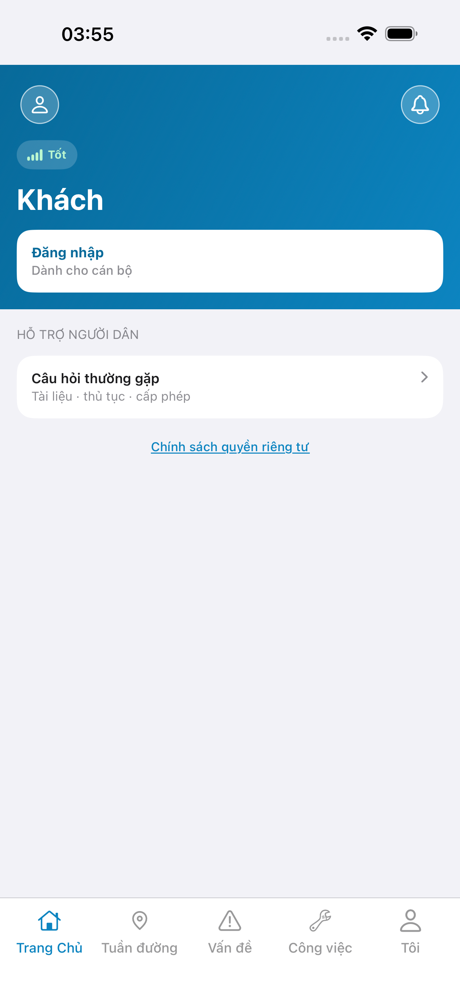
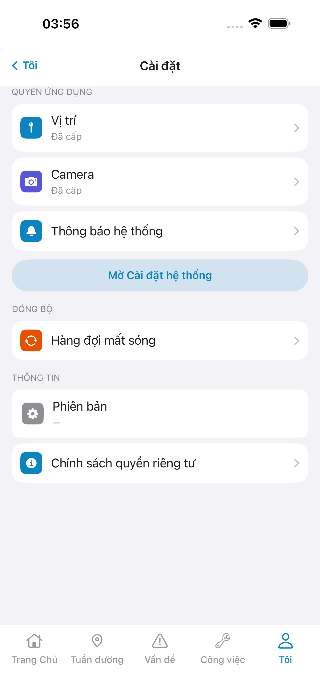
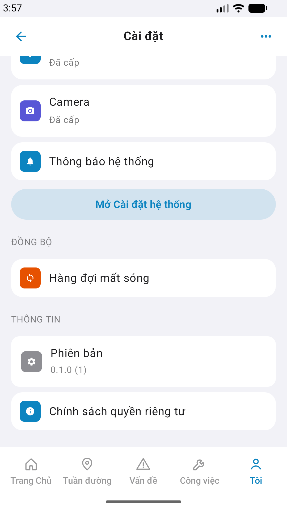

# QA — Scenarios — me-settings (mobile)

| Field | Value |
|-------|-------|
| feature | `me-settings` |
| title | [Mobile] [Tôi] -> Cài đặt |
| this role | `qa` · `/agent-qa-mobile` |
| status | **confirmed** |
| changeScope | `new_page` |
| packKind | **`sheet`** (surface full screen `#sc-me-settings`) |
| taskId | `task_ce3a18c1` |
| autoApprove | ON |
| e2eQa | ON · `yarn e2e-qa-mobile` · Maestro ON |
| ios_test_phase | `phase1_iphone` · dest **iPhone 17 Pro Max** · **A4-IPAD DEFER** |
| store_qa | **run_store** |
| method | e2e runtime · yarn e2e-qa-mobile · **cấm** GenerateImage · **cấm** yarn start:std / mfeStdUrl |
| visual | `/review-align-ux-ios-android` · **Aligned** · Must **0** |
| e2e result | **ok:true** · `2026-08-30T20:57:00.000Z` · dest **iPhone 17 Pro Max** · AVD **1080×1920** |
| updatedAt | `2026-08-30T21:00:34.000Z` |

**Scope:** slug `me-settings` only · Me `#row-settings` → `#sc-me-settings` · local/OS + Bundle · **cấm** invent preferences API · **cấm** sibling `me-profile` / logout / ops / feedback.

## VERIFY GATE

| Gate | Result |
|------|--------|
| iOS `xcodegen generate` | **PASS** |
| iOS `xcodebuild` e2e-dd · dest **iPhone 17 Pro Max** | **PASS** (rebuild for e2e · me-settings nav) |
| Android `./gradlew :app:assembleDebug` | **PASS** |
| Mobile.Bff `dotnet build` | **PASS** (0 warning · 0 error) |
| API docker + Mobile.Bff `:5202` | **PASS** (host API `:5111` · BFF healthy · `--skip-start`) |
| Maestro iOS + Android | **PASS** · `#sc-me-settings` |
| `yarn e2e-qa-mobile` | **PASS** · `ok:true` |

## Device AC

| # | Scenario | Expected | Result | Evidence |
|---|----------|----------|--------|----------|
| 1 | Cold start guest home | `#sc-home` · CTA Đăng nhập | **PASS** | A11-LAUNCH |
| 2 | Login Auth seed | `linm-soft` / `Linm@2026` → `#sc-home` | **PASS** | A9-LOGIN |
| 3 | BFF reachable | Mobile.Bff `:5202` healthy | **PASS** | A10-BFF |
| 4 | Entry Me → settings | `#row-settings` → `#sc-me-settings` | **PASS** | Maestro · A3 / P6 |
| 5 | TopBar | title **Cài đặt** · iOS back **Tôi** · Android icon-only | **PASS** | A3 / P6 |
| 6 | Section quyền | Vị trí · Camera · Thông báo hệ thống + status OS | **PASS** | A3 / P6 |
| 7 | CTA OS | **Mở Cài đặt hệ thống** · Secondary | **PASS** | A3 / P6 |
| 8 | Sync | **Hàng đợi mất sóng** `#row-offline` | **PASS** | A3 / P6 |
| 9 | About | **Phiên bản** · **Chính sách quyền riêng tư** | **PASS** | A3 · P6-CORE-2 |
| 10 | Dual OS px | iOS 1320×2868 RGB · Android 1080×1920 | **PASS** | file |
| 11 | Watermark | none «Gói N» / «gen realapp» | **PASS** | CORE Read |
| 12 | Sibling AC | only `me-settings` · CORE ≠ Me hub | **PASS** | A3 / P6 = `#sc-me-settings` |
| 13 | No invent API | no MeSettingsController / preferences | **PASS** | SA Skip · local/OS |
| 14 | Native alert | **cấm** UIAlert / AlertDialog | **PASS** | code + shot |

## Store × feature

| AC | Apple | Play | Result | Evidence |
|----|-------|------|--------|----------|
| Core UX | A3 · A11 | P6 · P11 | **PASS** | A3-CORE · P6-CORE |
| Login + BFF | A9 · A10 | P10 · P11 | **PASS** | A9-LOGIN · A10-BFF |
| ≥2 phone core | — | P6 | **PASS** | P6-CORE · P6-CORE-2 |
| Privacy URL | A5 | P8 | ghi thiếu OK · **GAP-MOB-MESET-PRIVACY-01** · **không** fake | — |
| A4 iPad | A4 | — | **DEFER** Phase 1 | — |
| READY_TO_SUBMIT | — | — | **không** (Review) | — |

## Maestro

| Flow | Path | Result |
|------|------|--------|
| iOS | `qa/e2e/ios.yaml` | **PASS** · login → `tab-me` → `row-settings` → `#sc-me-settings` · A11/A9/A3 |
| Android | `qa/e2e/android.yaml` | **PASS** · same · P6 / P6-2 |

## Gaps

| ID | Note | Block complete? |
|----|------|-----------------|
| GAP-MOB-MESET-PRIVACY-01 | Privacy HTTPS URL chờ khách · P1 static `home.privacy.*` | **No** (known · SA) |

## Align UX (live vs demo)

| Check | Result |
|-------|--------|
| Read A3-CORE vs `ui/prototype/ios/index.html` | **Aligned** — `#i-mappin` · `#i-camera` · `#i-bell` · `#i-sync` · `#i-info` leading tiles |
| Read P6-CORE + P6-CORE-2 vs `ui/prototype/android/index.html` | **Aligned** — same glyphs · scroll fold privacy |
| Must **GAP-MOB-UX-COMP-03** | **0** |
| Must **GAP-MOB-E2E-VIS-01** | **0** (vision done) |
| Detail | `ui/review/align-ux.md` |

## E2E screenshots

Viewer: `/api/qldb/artifact?id=&rel=qa/scenarios.md` rewrite `screens/{caseId}.png`.

CLI **PASS** = Maestro + PNG + store px only — **not** visual vs demo. QA **Read** A3-CORE + P6-CORE vs prototype (`/review-align-ux-ios-android`). Demo `.row-icon`/`#i-*` missing on live → Must **GAP-MOB-UX-COMP-03** · log `qa/bugs/`. Skip vision → **GAP-MOB-E2E-VIS-01**.

| Case | Store | Result | Evidence |
|------|-------|--------|----------|
| A10-BFF | A10 · P11 | **PASS** | — |
| A11-LAUNCH | A11 | **PASS** |  |
| A9-LOGIN | A9 · P10 | **PASS** |  |
| A3-CORE | A3 · A11 | **PASS** |  |
| P6-CORE | P6 · P11 | **PASS** |  |
| P6-CORE-2 | P6 | **PASS** |  |

## Version meta

| Field | Value |
|-------|-------|
| skillId | agent-qa-mobile |
| skillVersion | 2026.08.20.03 |
| schemaVersion | 1 |
| workflowVersion | 2026.08.31.2 |
| rulesVersion | 2026.08.31.2 |
| generatedAt | `2026-08-30T21:00:34.000Z` |
| versionGate | rechecked |
| contentHash | sha256:me-settings-qa-scenarios-20260831 |
| designContentHash | sha256:me-settings-design-20260830 |
| iosImplementHash | sha256:me-settings-ios-implement-20260831 |
| androidImplementHash | sha256:me-settings-android-implement-20260831 |

---
<!-- Version meta: skillId=agent-qa-mobile skillVersion=2026.08.20.03 schemaVersion=1 workflowVersion=2026.08.31.2 rulesVersion=2026.08.31.2 versionGate=rechecked -->
