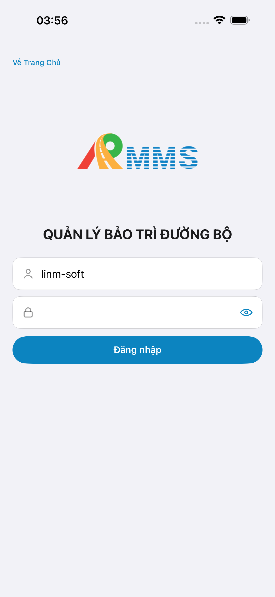
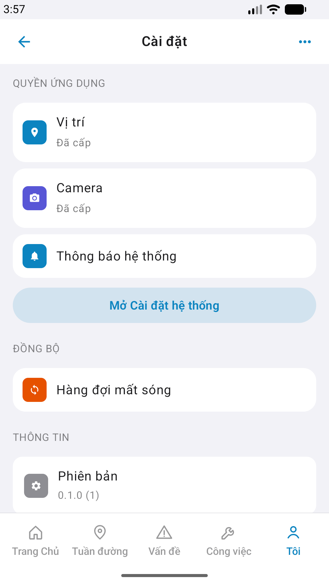

# Capture — me-settings

| Case | Store | Result | Evidence |
|------|-------|--------|----------|
| A10-BFF | A10 · P11 | **PASS** | — |
| A11-LAUNCH | A11 | **PASS** |  |
| A9-LOGIN | A9 · P10 | **PASS** |  |
| A3-CORE | A3 · A11 | **PASS** |  |
| P6-CORE | P6 · P11 | **PASS** |  |
| P6-CORE-2 | P6 | **PASS** |  |

| Slot | Device | px | file |
|------|--------|-----|------|
| A3 / A11 | iPhone 17 Pro Max 6.9" | 1320×2868 RGB | A3-CORE.png · A11-LAUNCH.png · A9-LOGIN.png |
| P6 | Pixel 2 / wm 1080×1920 | 1080×1920 | P6-CORE.png · P6-CORE-2.png |
| A4 | iPad | — | **DEFER** Phase 1 |

iOS device: iPhone 17 Pro Max  
iPad device: DEFER Phase 1  
method: e2e runtime · yarn e2e-qa-mobile · Maestro ON · **cấm** GenerateImage

CLI PASS = capture+px only. Visual = `/review-align-ux-ios-android` Read CORE vs demo HTML → **Aligned** Must 0.

Listing official → `/store-image-capture` confirm file live (cấm AI vẽ).

---
<!-- Version meta: skillId=agent-qa-mobile skillVersion=2026.08.20.03 schemaVersion=1 workflowVersion=2026.08.31.2 rulesVersion=2026.08.31.2 versionGate=rechecked -->
