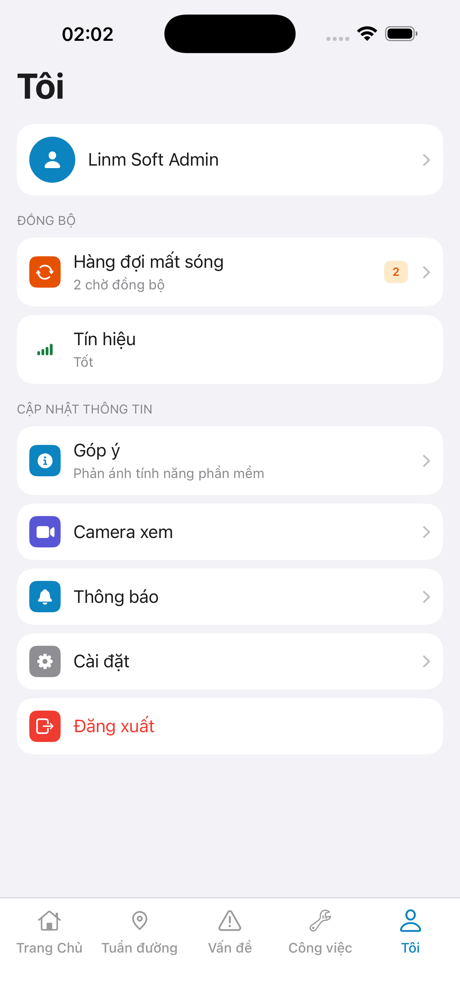
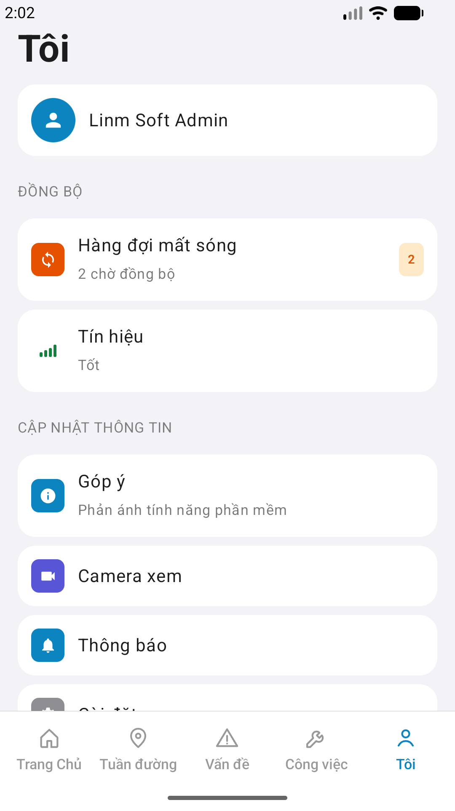

# QA — Scenarios — me (mobile hub)

| Field | Value |
|-------|-------|
| feature | `me` |
| this role | `qa` · `/agent-qa-mobile` |
| status | **confirmed** |
| packKind | **`hub`** |
| taskId | `task_84e8e0e2` |
| e2eQa | **ON** · `yarn e2e-qa-mobile` · `ios_test_phase=phase1_iphone` · **A4-IPAD DEFER** |
| store_qa | **run_store** |
| e2e result | **ok:true** · `2026-08-19T02:11:13.035Z` · dest **iPhone 17 Pro Max** · AVD **Pixel_2** |
| method | e2e runtime · yarn e2e-qa-mobile · Maestro + simctl/adb · **cấm** GenerateImage · **cấm** yarn start:std / mfeStdUrl |
| updatedAt | `2026-08-19T02:11:13.000Z` |

**Scope:** slug `me` hub only. **Cấm** AC sibling screens.

## VERIFY GATE

| Gate | Result |
|------|--------|
| iOS `xcodegen` | **PASS** |
| iOS `xcodebuild` dest **iPhone 17 Pro** | **PASS** |
| Android `./gradlew :app:assembleDebug` | **PASS** |
| Mobile.Bff `dotnet build` | **PASS** (0 warning · 0 error) |
| Maestro iOS + Android | **PASS** · hub `#sc-me` |

## Device AC

| ID | Expect | Result |
|----|--------|--------|
| AC-D-01 | Offline hub mở · fallback name | **PASS** (code) |
| AC-D-04 | Không system alert | **PASS** |
| AC-D-06 | Safe area + tab | **PASS** (shot A3/P6) |
| AC-D-08 | Tín hiệu hạng Tốt · không «Có mạng» | **PASS** (shot) |
| AC-F-01 | Tab Tôi → hub | **PASS** (Maestro) |
| AC-F-02 | Logout local · Home `btn-logout` | **PASS** |
| AC-F-03 | Sibling toast only | **PASS** (code) |

## Store Must

| Case | Store | Evidence | Result |
|------|-------|----------|--------|
| A11-LAUNCH | A11 |  | **PASS** |
| A9-LOGIN | A9 · P10 |  | **PASS** |
| A3-CORE | A3 · A11 |  | **PASS** |
| P6-CORE | P6 · P11 |  | **PASS** |
| P6-CORE-2 | P6 |  | **PASS** |
| A4-IPAD | A4 | **DEFER** Phase 1 · family `1` | DEFER |

## E2E screenshots

Viewer: `/api/qldb/artifact?id=&rel=qa/scenarios.md` rewrite `screens/{caseId}.png`.

CLI **PASS** = Maestro + PNG + store px only — **not** visual vs demo. QA **Read** A3-CORE + P6-CORE vs prototype (`/review-align-ux-ios-android`). Demo `.row-icon`/`#i-*` missing on live → Must **GAP-MOB-UX-COMP-03** · log `qa/bugs/`. Skip vision → **GAP-MOB-E2E-VIS-01**.

| Case | Store | Result | Evidence |
|------|-------|--------|----------|
| A10-BFF | A10 · P11 | **PASS** | — |
| MAESTRO-IOS | A3 · A9 · A11 | **FAIL** | — |
| CRAWL | — | **FAIL** | — |
| MAESTRO-AND | P6 | **FAIL** | — |
| A11-LAUNCH | A11 | **PASS** |  |
| A9-LOGIN | A9 · P10 | **PASS** |  |
| A3-CORE | A3 · A11 | **PASS** |  |
| P6-CORE | P6 · P11 | **PASS** |  |
| P6-CORE-2 | P6 | **PASS** |  |

Viewer: `/api/qldb/artifact?id=&rel=qa/scenarios.md` rewrite `screens/{caseId}.png`.

CLI **PASS** = Maestro + PNG + store px only — **not** visual vs demo. QA **Read** A3-CORE + P6-CORE vs prototype (`/review-align-ux-ios-android`). Demo `.row-icon`/`#i-*` missing on live → Must **GAP-MOB-UX-COMP-03** · log `qa/bugs/`. Skip vision → **GAP-MOB-E2E-VIS-01**.

| Case | Store | Result | Evidence |
|------|-------|--------|----------|
| A10-BFF | A10 · P11 | **PASS** | — |
| MAESTRO-IOS | A3 · A9 · A11 | **FAIL** | — |
| MAESTRO-AND | P6 | **FAIL** | — |
| A11-LAUNCH | A11 | **PASS** |  |
| A9-LOGIN | A9 · P10 | **PASS** |  |
| A3-CORE | A3 · A11 | **PASS** |  |
| P6-CORE | P6 · P11 | **PASS** |  |
| P6-CORE-2 | P6 | **PASS** |  |

| Case | Store | Result | Evidence |
|------|-------|--------|----------|
| A10-BFF | A10 · P11 | **PASS** | — |
| A11-LAUNCH | A11 | **PASS** |  |
| A9-LOGIN | A9 · P10 | **PASS** |  |
| A3-CORE | A3 · A11 | **PASS** |  |
| P6-CORE | P6 · P11 | **PASS** |  |
| P6-CORE-2 | P6 | **PASS** |  |

## Version meta

skillId=agent-qa-mobile · skillVersion=2026.08.19.19 · workflowVersion=2026.08.19.19 · generatedAt=2026-08-19T02:11:13.000Z
