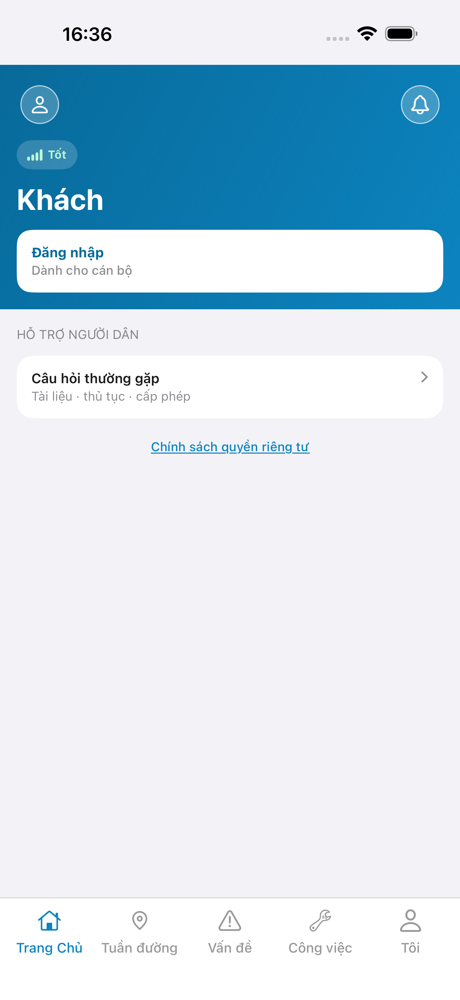
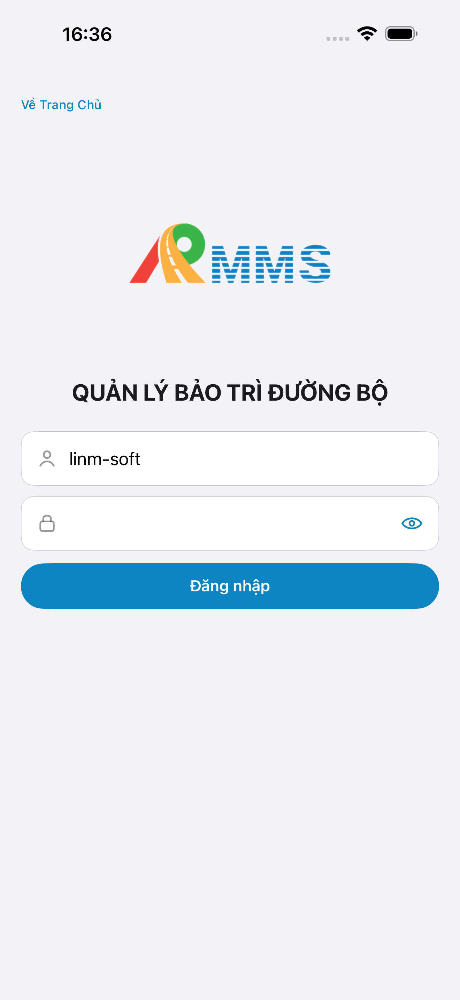
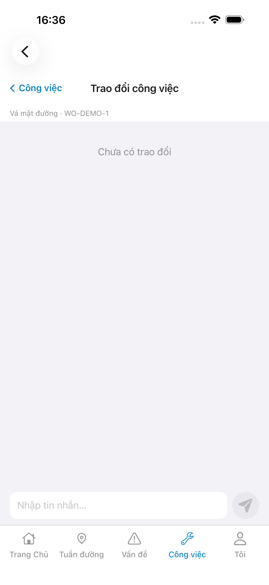
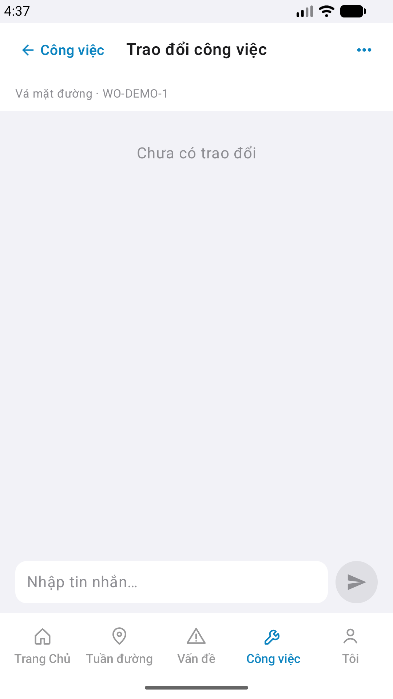
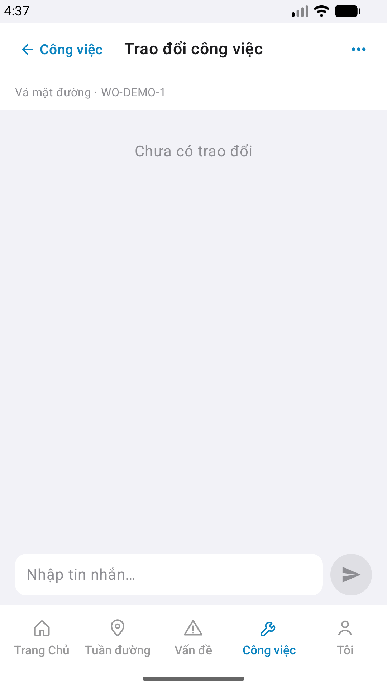

# Capture — mnt-chat

| Field | Value |
|-------|-------|
| feature | `mnt-chat` |
| method | e2e runtime · yarn e2e-qa-mobile · Maestro ON |
| iosDevice | iPhone 17 Pro Max (6.9") · phase1 |
| androidDevice | Pixel · 1080×1920 |
| iPad | **DEFER** Phase 1 |
| capturedAt | `2026-09-01T09:37:54.913Z` |
| verdict | **PASS** · visual **Aligned** (Must 0) |

| Case | Store | Result | Evidence |
|------|-------|--------|----------|
| A10-BFF | A10 · P11 | **PASS** | `:5202` health |
| A11-LAUNCH | A11 | **PASS** |  |
| A9-LOGIN | A9 · P10 | **PASS** |  |
| A3-CORE | A3 · A11 | **PASS** |  · `#sc-mnt-chat` empty live |
| P6-CORE | P6 · P11 | **PASS** |  |
| P6-CORE-2 | P6 | **PASS** |  |

CLI PASS = capture+px only. Visual = `/review-align-ux-ios-android` Read CORE vs demo HTML → **Aligned** · empty thread Accept (live) · demo bubbles = seed only.

Listing official → live Maestro harvest (cấm AI vẽ).
