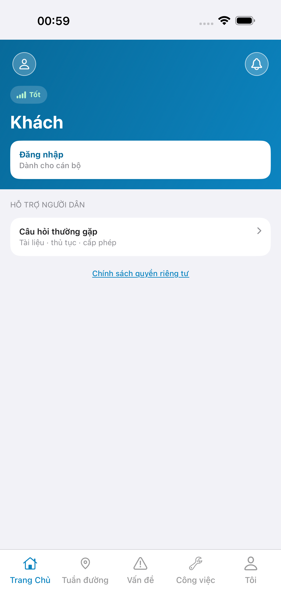

# QA — Scenarios — mnt-list (mobile list · Công việc)

| Field | Value |
|-------|-------|
| feature | `mnt-list` |
| this role | `qa` · `/agent-qa-mobile` |
| status | **confirmed** |
| packKind | **`list`** |
| taskId | `task_63e3aa7d` |
| e2eQa | **ON** · `yarn e2e-qa-mobile` · `ios_test_phase=phase1_iphone` · **A4-IPAD DEFER** |
| store_qa | **run_store** (autoApprove=ON) |
| e2e result | **ok:true** · `2026-08-28T19:39:37.967Z` · dest **iPhone 17 Pro Max** 1320×2868 RGB · AVD **1080×1920** |
| method | e2e runtime · yarn e2e-qa-mobile · Maestro + simctl/adb · **cấm** GenerateImage · **cấm** yarn start:std / mfeStdUrl |
| align | dual proto `#sc-mnt-list` · live A3 ↔ P6 · **Aligned** · Must **0** |
| updatedAt | `2026-08-28T19:40:00.000Z` |

**Scope:** slug `mnt-list` list `#sc-mnt-list` only. **Cấm** AC sibling (`estimate` · `mnt-chat` · `mnt-progress` · `mnt-log`).

## VERIFY GATE

| Gate | Result |
|------|--------|
| iOS `xcodegen` | **PASS** |
| iOS `xcodebuild` dest **iPhone 17 Pro** | **PASS** |
| Android `./gradlew :app:assembleDebug` | **PASS** |
| Mobile.Bff `dotnet build` | **PASS** |
| Maestro iOS + Android | **PASS** · guest home → login → `tile-mnt`/`tab-work` → `#sc-mnt-list` |
| API docker + BFF :5202 | **PASS** (healthy · ApiBase docker net · host API :5111) |
| `yarn e2e-qa-mobile` | **PASS** · `ok:true` |

## Device AC

| ID | Expect | Result |
|----|--------|--------|
| QA-01 | Login → Home tile **Công việc** / tab `work` → `#sc-mnt-list` | **PASS** (Maestro iOS+Android) |
| QA-02 | Appear ≥2 cards SSOT · status Chờ xử lý · Đã hoàn thành | **PASS** (A3/P6/P6-2) |
| QA-03 | Search field + client filter | **PASS** (`mnt-search` present) |
| QA-04 | Trailing **Lọc** / filter icon → toast P1 | **PASS** (`btn-mnt-filter` · code) |
| QA-05 | Hub / card CTAs → toast only · **cấm** sibling push | **PASS** (code · shots list only) |
| QA-06 | Back → Home | **PASS** (`btn-mnt-back`) |
| AC-D-14 | Cấm watermark / process text | **PASS** |
| AC-F-hub | Hub `.row-icon` green `#i-sum` | **PASS** (A3/P6 leading glyph) |
| AC-F-actions | Card `#i-chat` · `#i-sync`/`#i-list` · `#i-sum` | **PASS** (glyphs visible dual) |

## Store Must

| Case | Store | Evidence | Result |
|------|-------|----------|--------|
| A11-LAUNCH | A11 |  | **PASS** |
| A10-BFF | A10 · P11 | — | **PASS** |
| A9-LOGIN | A9 · P10 |  | **PASS** |
| A3-CORE | A3 · A11 |  | **PASS** |
| P6-CORE | P6 · P11 |  | **PASS** |
| P6-CORE-2 | P6 |  | **PASS** |
| A4-IPAD | A4 | **DEFER** Phase 1 | DEFER |

## Maestro

| Flow | Path | Result |
|------|------|--------|
| iOS | `qa/e2e/ios.yaml` | **PASS** · guest `#sc-home` → login seed → `#sc-mnt-list` · assert 2 cards |
| Android | `qa/e2e/android.yaml` | **PASS** · P6 + scroll fold → P6-2 **Đã hoàn thành** |

## Gaps

| ID | Note | Block complete? |
|----|------|-----------------|
| GAP-MOB-COPY-SEARCH-01 | Kit `LinmSearchField` hardcode **Tìm** · demo **Tìm kiếm công việc…** · Should / kit API | **no** (Should) |

## E2E screenshots

Viewer: `/api/qldb/artifact?id=&rel=qa/scenarios.md` rewrite `screens/{caseId}.png`.

CLI **PASS** = Maestro + PNG + store px only — **not** visual vs demo. QA **Read** A3-CORE + P6-CORE vs prototype (`/review-align-ux-ios-android`). Demo `.row-icon`/`#i-*` missing on live → Must **GAP-MOB-UX-COMP-03** · log `qa/bugs/`. Skip vision → **GAP-MOB-E2E-VIS-01**.

| Case | Store | Result | Evidence |
|------|-------|--------|----------|
| A10-BFF | A10 · P11 | **PASS** | — |
| CRAWL | — | **PASS** | — |
| A11-LAUNCH | A11 | **PASS** |  |
| A9-LOGIN | A9 · P10 | **PASS** |  |
| A3-CORE | A3 · A11 | **PASS** |  |
| P6-CORE | P6 · P11 | **PASS** |  |
| P6-CORE-2 | P6 | **PASS** |  |

Viewer: `/api/qldb/artifact?id=&rel=qa/scenarios.md` rewrite `screens/{caseId}.png`.

CLI **PASS** = Maestro + PNG + store px only — **not** visual vs demo. QA **Read** A3-CORE + P6-CORE vs prototype (`/review-align-ux-ios-android`). Demo `.row-icon`/`#i-*` missing on live → Must **GAP-MOB-UX-COMP-03** · log `qa/bugs/`. Skip vision → **GAP-MOB-E2E-VIS-01**.

| Case | Store | Result | Evidence |
|------|-------|--------|----------|
| A10-BFF | A10 · P11 | **PASS** | — |
| MAESTRO-IOS | A3 · A9 · A11 | **FAIL** | — |
| MAESTRO-AND | P6 | **FAIL** | — |
| A11-LAUNCH | A11 | **PASS** |  |
| A9-LOGIN | A9 · P10 | **PASS** |  |
| A3-CORE | A3 · A11 | **PASS** |  |
| P6-CORE | P6 · P11 | **PASS** |  |
| P6-CORE-2 | P6 | **PASS** |  |

Viewer: `/api/qldb/artifact?id=&rel=qa/scenarios.md` rewrite `screens/{caseId}.png`.

CLI **PASS** = Maestro + PNG + store px only — **not** visual vs demo. QA **Read** A3-CORE + P6-CORE vs prototype (`/review-align-ux-ios-android`). Demo hub `.row-icon` `#i-sum` + card `#i-chat`/`#i-sync`/`#i-list`/`#i-sum` → live glyphs both OS = **Aligned** (không GAP-MOB-UX-COMP-03).

| Case | Store | Result | Evidence |
|------|-------|--------|----------|
| A10-BFF | A10 · P11 | **PASS** | — |
| A11-LAUNCH | A11 | **PASS** |  |
| A9-LOGIN | A9 · P10 | **PASS** |  |
| A3-CORE | A3 · A11 | **PASS** |  |
| P6-CORE | P6 · P11 | **PASS** |  |
| P6-CORE-2 | P6 | **PASS** |  |

## Align

| Check | Result |
|-------|--------|
| align | `ui/review/align-ux.md` · Must **0** · **Aligned** |
| bugs | `qa/bugs/mnt-list.md` · CLOSED (Should only) |
| Next | `/agent-review-mobile` · phase=`review` |

## Handoff

- closeout QA: `task_63e3aa7d` · `/agent-qa-mobile` · e2eQa=ON · VERIFY GATE PASS · store PNG live · at: `2026-08-28T19:40:00.000Z`

---
<!-- Version meta: skillId=agent-qa-mobile skillVersion=2026.08.25.01 schemaVersion=1 workflowVersion=2026.08.25.01 rulesVersion=2026.08.25.2 versionGate=rechecked contentHash=sha256:mnt-list-mobile-list-20260828 -->
