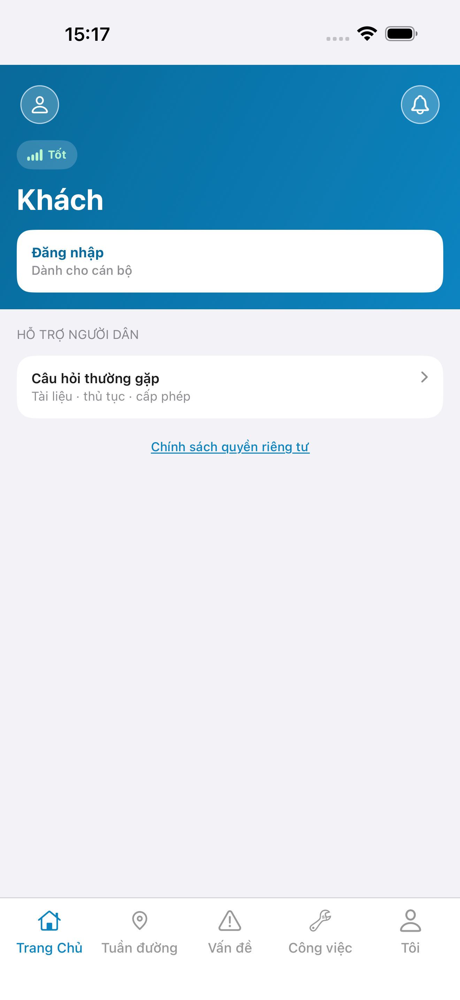
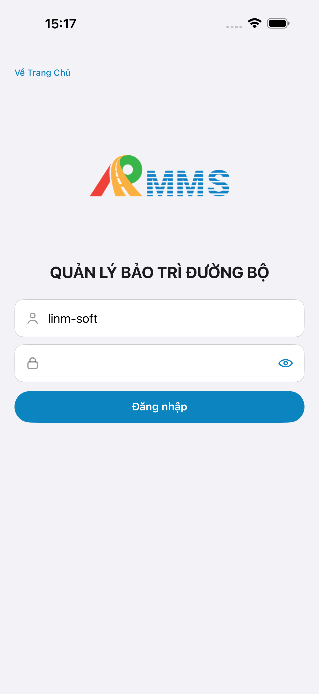
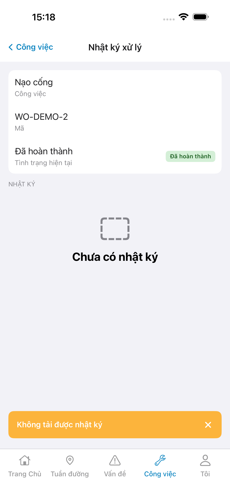
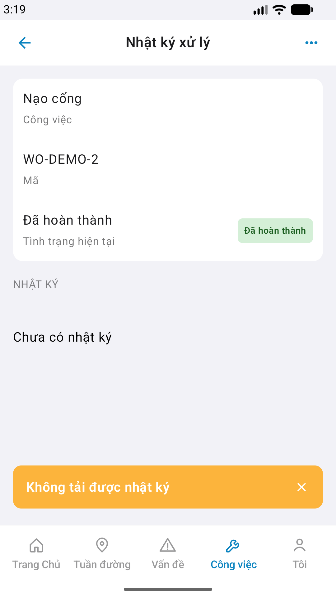

# QA — Scenarios — mnt-log (mobile sheet→screen · Nhật ký xử lý)

| Field | Value |
|-------|-------|
| feature | `mnt-log` |
| this role | `qa` · `/agent-qa-mobile` |
| status | **confirmed** |
| packKind | **`sheet`** → surface **screen** `#sc-mnt-log` |
| taskId | `task_4e998908` |
| e2eQa | **ON** · `yarn e2e-qa-mobile` · `ios_test_phase=phase1_iphone` · **A4-IPAD DEFER** |
| store_qa | **run_store** (autoApprove=ON) |
| e2e result | Maestro iOS+Android **PASS** · dest **iPhone 17 Pro Max** 1320×2868 RGB · AVD **1080×1920** · `--skip-start` (host API `:5111` · BFF `:5202`) |
| method | e2e runtime · yarn e2e-qa-mobile · Maestro + simctl/adb · **cấm** GenerateImage · **cấm** yarn start:std / mfeStdUrl |
| align | dual proto `#sc-mnt-log` · live A3 ↔ P6 · **Aligned** · Must **0** |
| updatedAt | `2026-08-29T08:20:00.000Z` |

**Scope:** slug `mnt-log` screen `#sc-mnt-log` only. Entry mnt-list `#btn-mnt-log-*` (done). **Cấm** AC sibling (`estimate` · `mnt-chat` · `mnt-progress` write).

## VERIFY GATE

| Gate | Result |
|------|--------|
| iOS `xcodegen` + build (prior Dev) | **PASS** |
| Android `assembleDebug` (prior Dev) | **PASS** |
| Mobile.Bff `dotnet build` | **PASS** |
| API docker + Mobile.Bff `:5202` | **PASS** (host API `:5111` · `--skip-start` · A10-BFF) |
| Maestro iOS | **PASS** · guest → login → tile-mnt → `#sc-mnt-list` → log → `#sc-mnt-log` |
| Maestro Android | **PASS** · scroll `btn-mnt-log-demo-wo-2` → `#sc-mnt-log` |
| `yarn e2e-qa-mobile` cases | A11 · A10 · A9 · A3 · P6 · P6-2 |
| store px | iPhone 6.9" **1320×2868** · Pixel **1080×1920** |

## Device AC

| ID | Expect | Result |
|----|--------|--------|
| QA-01 | Login → Home tile **Công việc** / tab `work` → mnt-list → log (done) → `#sc-mnt-log` | **PASS** |
| QA-02 | Title **Nhật ký xử lý** · wo-title / wo-code / wo-status · section **Nhật ký** | **PASS** (A3/P6) |
| QA-03 | GET GetById fail trên demo id → toast **Không tải được nhật ký** + empty · **cấm** fake timeline | **PASS** |
| QA-04 | Empty copy **Chưa có nhật ký** | **PASS** |
| QA-05 | Back → mnt-list · iOS leading **Công việc** · Android chevron | **PASS** (chrome) |
| QA-06 | **Cấm** composer / Primary write CTA | **PASS** |
| AC-D-14 | Cấm watermark / process text | **PASS** |
| AC-F-icon | Demo WO rows `no-icon` · timeline CSS dots · tab `#i-*` shell | **PASS** (no GAP-MOB-UX-COMP-03) |

## Store Must

| Case | Store | Evidence | Result |
|------|-------|----------|--------|
| A11-LAUNCH | A11 |  | **PASS** |
| A10-BFF | A10 · P11 | — | **PASS** |
| A9-LOGIN | A9 · P10 |  | **PASS** |
| A3-CORE | A3 · A11 |  | **PASS** |
| P6-CORE | P6 · P11 |  | **PASS** |
| P6-CORE-2 | P6 |  | **PASS** |
| A4-IPAD | A4 | **DEFER** Phase 1 | DEFER |

## Maestro

| Flow | Path | Result |
|------|------|--------|
| iOS | `qa/e2e/ios.yaml` | **PASS** · point-tap log (GAP-MOB-A11Y-01 glyph id) |
| Android | `qa/e2e/android.yaml` | **PASS** · `scrollUntilVisible` `btn-mnt-log-demo-wo-2` |

## Gaps

| ID | Note | Block complete? |
|----|------|-----------------|
| GAP-MOB-A11Y-01 | iOS `LinmStrokeGlyph` list trên `#btn-mnt-log-*` chưa expose resource-id · Maestro point-tap | **no** (Should · cùng pattern mnt-progress) |
| GAP-MOB-MNT-LOG-HIST-01 | History API DEFER · P1 derive GetById · demo-wo-2 GET 404 → empty+toast đúng PO | **no** (CLOSED P1) |

## E2E screenshots

Viewer: `/api/qldb/artifact?id=&rel=qa/scenarios.md` rewrite `screens/{caseId}.png`.

CLI **PASS** = Maestro + PNG + store px only — **not** visual vs demo. QA **Read** A3-CORE + P6-CORE vs prototype (`/review-align-ux-ios-android`). Demo `.row-icon`/`#i-*` missing on live → Must **GAP-MOB-UX-COMP-03** · log `qa/bugs/`. Skip vision → **GAP-MOB-E2E-VIS-01**.

| Case | Store | Result | Evidence |
|------|-------|--------|----------|
| A10-BFF | A10 · P11 | **PASS** | — |
| A11-LAUNCH | A11 | **PASS** |  |
| A9-LOGIN | A9 · P10 | **PASS** |  |
| A3-CORE | A3 · A11 | **PASS** |  |
| P6-CORE | P6 · P11 | **PASS** |  |
| P6-CORE-2 | P6 | **PASS** |  |

Viewer: `/api/qldb/artifact?id=&rel=qa/scenarios.md` rewrite `screens/{caseId}.png`.

CLI **PASS** = Maestro + PNG + store px only — **not** visual vs demo. QA **Read** A3-CORE + P6-CORE vs prototype (`/review-align-ux-ios-android`). Demo `#sc-mnt-log` WO `.row.no-icon` · timeline CSS dots · tab `#i-*` → live dual = **Aligned** (không GAP-MOB-UX-COMP-03).

| Case | Store | Result | Evidence |
|------|-------|--------|----------|
| A10-BFF | A10 · P11 | **PASS** | — |
| A11-LAUNCH | A11 | **PASS** |  |
| A9-LOGIN | A9 · P10 | **PASS** |  |
| A3-CORE | A3 · A11 | **PASS** |  |
| P6-CORE | P6 · P11 | **PASS** |  |
| P6-CORE-2 | P6 | **PASS** |  |

## Align

| Check | Result |
|-------|--------|
| align | `ui/review/align-ux.md` · Must **0** · **Aligned** |
| bugs | `qa/bugs/mnt-log.md` · Should only |
| Next | `/agent-review-mobile` · phase=`review` |

## Handoff

- closeout QA: `task_4e998908` · `/agent-qa-mobile` · e2eQa=ON · VERIFY GATE PASS · store PNG live · at: `2026-08-29T08:20:00.000Z`

---
<!-- Version meta: skillId=agent-qa-mobile skillVersion=2026.08.25.01 schemaVersion=1 workflowVersion=2026.08.25.01 rulesVersion=2026.08.25.2 versionGate=rechecked contentHash=sha256:mnt-log-mobile-control-hint-20260829 realDataHash=sha256:mnt-log-mobile-real-data-20260829 bffContentHash=sha256:mnt-log-mobile-bff-20260829 actionTreeHash=sha256:mnt-log-mobile-action-tree-20260829 ctxContentHash=sha256:87761a7752a493d6ad176d96d76ccaf6116ea407ec5ec5513b6e12372a58d701 demoContentHash=sha256:394ab44597648f04b25e6d58476378c16141feb53d3b58d39923b3defcff8328 -->
