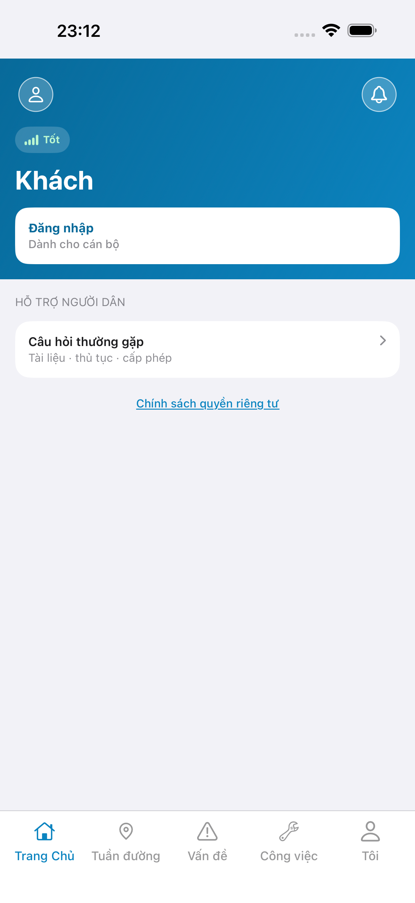
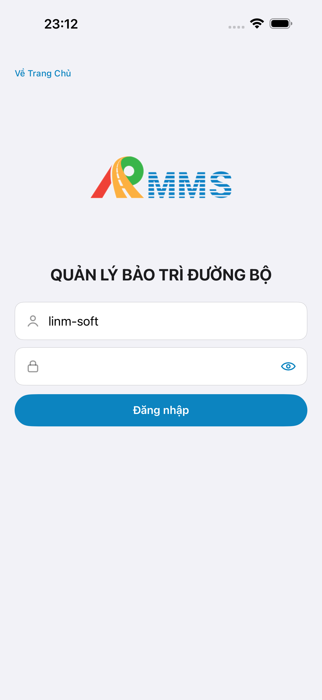
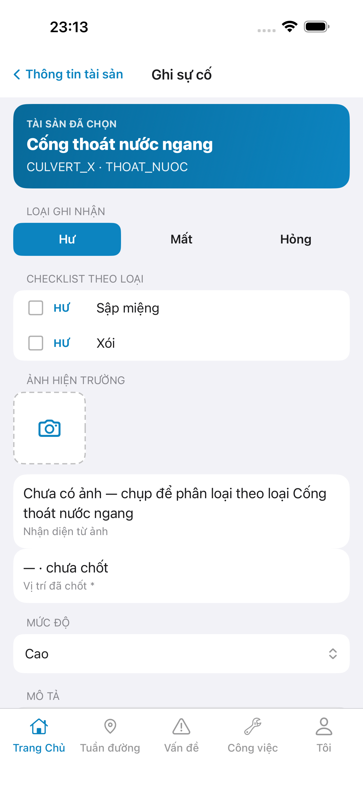
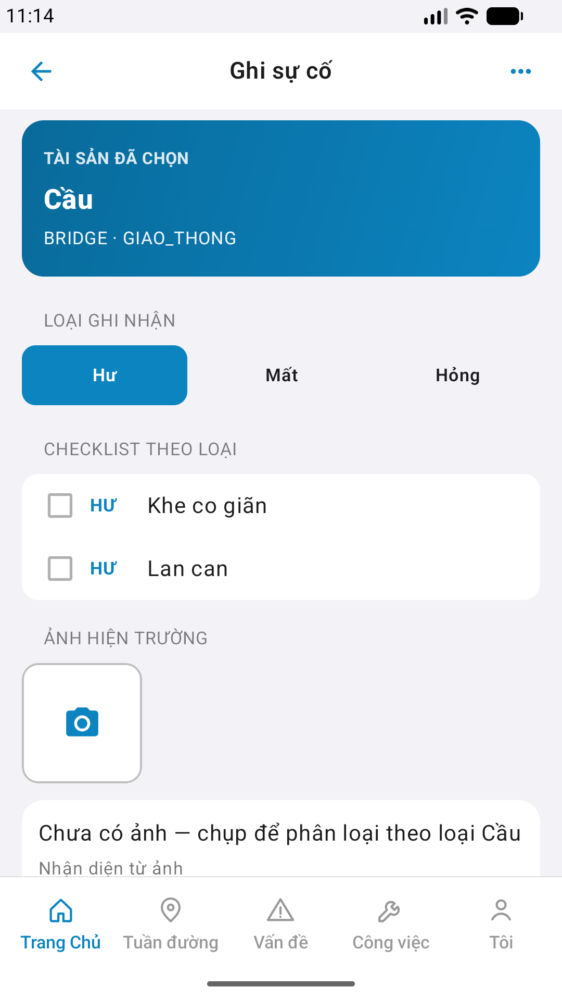
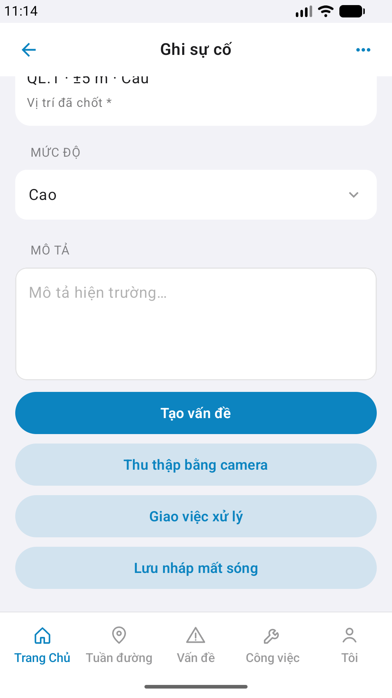

# QA — Scenarios — mobile-bff-file (mobile · Mobile.Bff FileService)

| Field | Value |
|-------|-------|
| feature | `mobile-bff-file` |
| this role | `qa` · `/agent-qa-mobile` |
| status | **confirmed** |
| packKind | **`sheet`** |
| taskId | `task_14e574ba` |
| e2eQa | **ON** · `yarn e2e-qa-mobile` · `ios_test_phase=phase1_iphone` (autoApprove) · **A4-IPAD DEFER** |
| store_qa | **run_store** (autoApprove=ON · e2eQa=ON) |
| e2e result | **ok:true** · dest **iPhone 17 Pro Max** 1320×2868 · AVD **Pixel 2** 1080×1920 · visual **Aligned** |
| method | e2e runtime · yarn e2e-qa-mobile · Maestro · **cấm** GenerateImage · **cấm** yarn e2e-qa / start:std / mfeStdUrl |
| align | `/review-align-ux-ios-android` · Read A3-CORE + P6-CORE(+2) vs `#sc-inc-form` · `#inc-photos` · `#kit-linm-image-upload` · **Must 0** |
| post-dev | LinmImageUpload dual · purpose `incident` · P1 `incident-create` `{ attachmentId }` |
| API / BFF | API docker host **:5101** · Mobile.Bff **:5202** · `--skip-start` · FileService **:5018** **DOWN** · live files curl **DEBT** |
| updatedAt | `2026-09-12T16:14:59.000Z` |

**Scope:** slug `mobile-bff-file` · kit file on P1 `#sc-inc-form` · **cấm** invent ERP.* / `#sc-*` mới · **cấm** field-reflect.

## Verdict

pass

## VERIFY GATE

| Gate | Result |
|------|--------|
| iOS xcodegen + install (e2e `--skip-build`) | **PASS** |
| Android assembleDebug (e2e `--skip-build`) | **PASS** |
| Mobile.Bff `:5202` healthy | **PASS** (A10-BFF) |
| API docker `:5101` | **PASS** (`--skip-start`) |
| Maestro iOS → `#sc-inc-form` + kit zones | **PASS** |
| Maestro Android → `#sc-inc-form` + kit zones | **PASS** |
| `yarn e2e-qa-mobile` CLI | **PASS** · `ok: true` |
| Visual Aligned (Read CORE) | **PASS** · Must 0 · dual chrome platform-OK |
| curl live `files/*` | **DEBT** · FileService `:5018` down · BFF files HTTP 404 on running image |

## Device AC (slug `mobile-bff-file`)

| ID | Expect | Result | Evidence |
|----|--------|--------|----------|
| QA-01 | Launch → guest home | **PASS** |  |
| QA-02 | Login Auth seed | **PASS** |  |
| QA-03 | Home → Ghi sự cố → pick → `#sc-inc-form` | **PASS** | Maestro dual |
| QA-04 | `#inc-photos` · `#kit-linm-image-upload` · `#photo-slot` · `#btn-add` | **PASS** | A3 / P6 |
| QA-05 | `#attachment-bind` zone present (empty until commit) | **PASS** | Maestro assert optional |
| QA-06 | Tab shell 5 giữ · **cấm** invent tab | **PASS** | A3 / P6 |
| QA-07 | Keep check-in PhotoRow · `ai-vision/uploads*` | **PASS** | out-of-flow · Dev keep |

## Store Must × feature

| Case | Store | Result | Evidence |
|------|-------|--------|----------|
| A10-BFF | A10 · P11 | **PASS** | — |
| A11-LAUNCH | A11 | **PASS** |  |
| A9-LOGIN | A9 · P10 | **PASS** |  |
| A3-CORE | A3 · A11 | **PASS** CLI · **visual Aligned** |  |
| P6-CORE | P6 · P11 | **PASS** CLI · chrome Aligned |  |
| P6-CORE-2 | P6 | **PASS** CLI · scroll actions |  |
| A4-IPAD | A4 | **DEFER** Phase 1 | — |

## E2E screenshots

Viewer: `/api/qldb/artifact?id=&rel=qa/scenarios.md` rewrite `screens/{caseId}.png`.

CLI **PASS** = Maestro + PNG + store px only — **not** visual vs demo. QA **Read** A3-CORE + P6-CORE vs prototype (`/review-align-ux-ios-android`).

| Case | Store | Result | Evidence |
|------|-------|--------|----------|
| A10-BFF | A10 · P11 | **PASS** | — |
| A11-LAUNCH | A11 | **PASS** |  |
| A9-LOGIN | A9 · P10 | **PASS** |  |
| A3-CORE | A3 · A11 | **PASS** |  |
| P6-CORE | P6 · P11 | **PASS** |  |
| P6-CORE-2 | P6 | **PASS** |  |

## Align UX (Read CORE)

| Check | Result |
|-------|--------|
| Proto host `#sc-inc-form` · `#inc-photos` · kit zones · **none** new `#sc-*` | **OK** |
| iOS A3 title Ghi sự cố · camera slot empty · kind pills · attachment area | **Aligned** |
| Android P6 title · `#kit-linm-image-upload` empty · Bridge host · tabs 5 | **Aligned** |
| Android P6-2 scroll · btn-create / draft / cam | **Aligned** |
| Platform chrome dual OK | **OK** |
| Must (store visual) | **0** |
| Debt | FileService `:5018` · BFF `files/*` live 404 · multi-photo first `attachmentId` only |

## Notes

- Hand-written `e2e/ios.yaml` · `e2e/android.yaml` · P1 `incident-create` path · Android `scrollUntilVisible` **Cầu**.
- **Cấm** kill worker / taskkill rộng (`GAP-QA-E2E-KILL-01`).
- Auto-gen default login-from-cold failed (empty fields) → guest home → `btn-home-login` seed flow.
